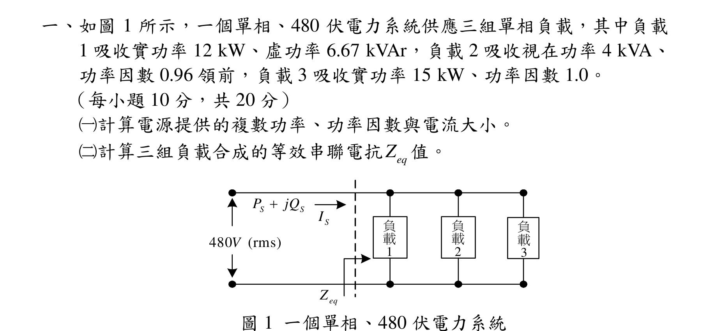
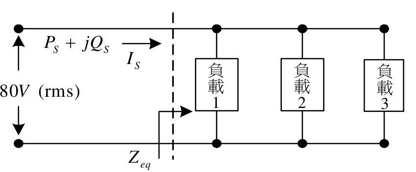
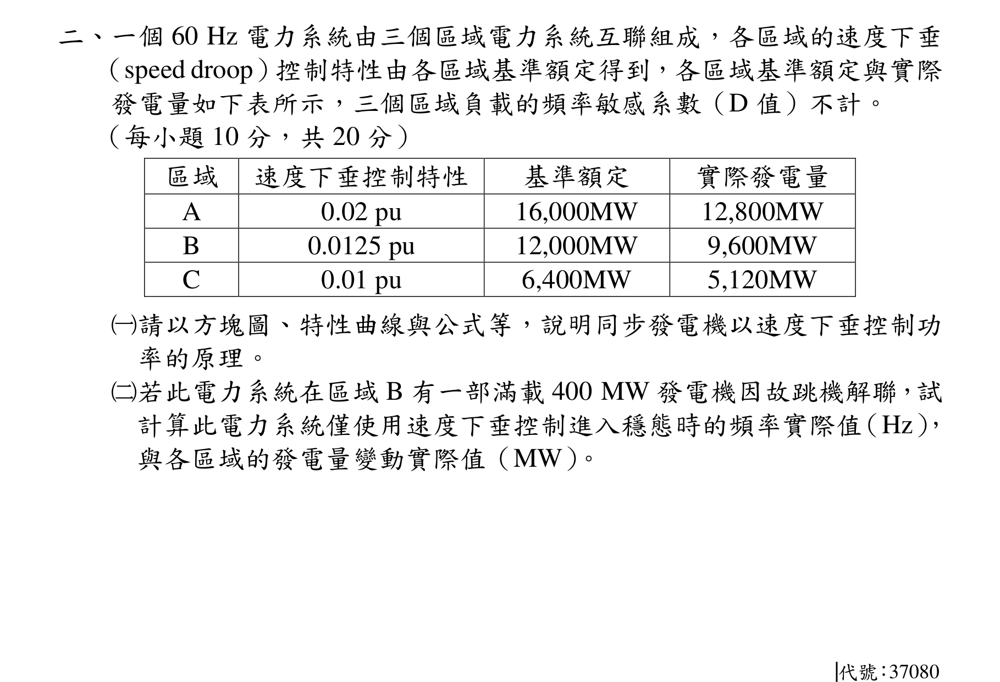
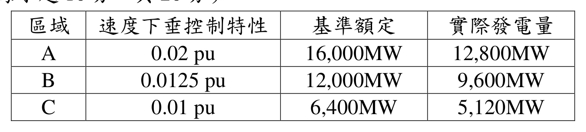
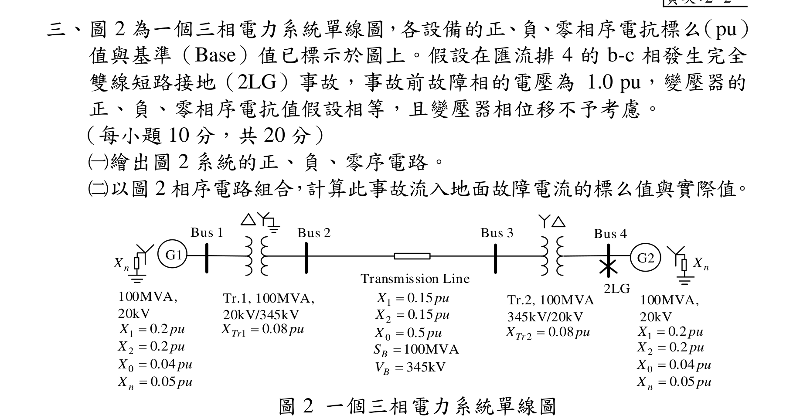
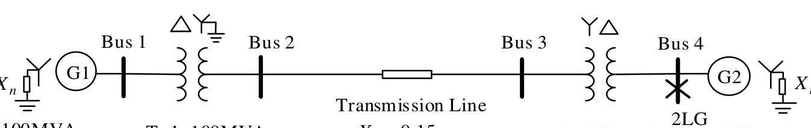
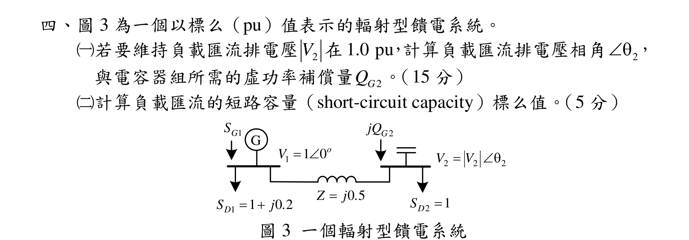
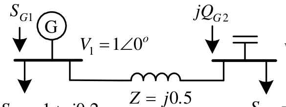
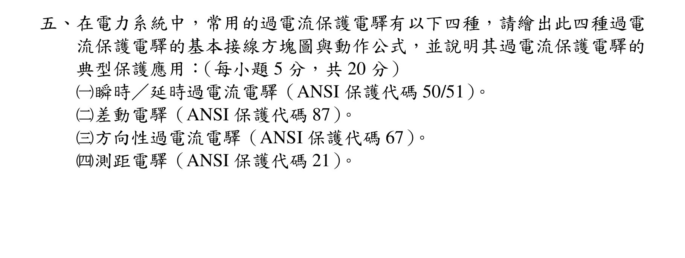

# 公務人員高等考試三級（111年）電力系統 原始試題

> 本檔只保存考選部原始試題的轉錄與裁切圖，不含解答。數學符號、電路接線與圖中文字以原始題目裁切圖為準。

#### 一、如圖1 所示，一個單相、480 伏電力系統供應三組單相負載，其中負載
1 吸收實功率12 kW、虛功率6.67 kVAr，負載2 吸收視在功率4 kVA、
功率因數0.96 領前，負載3 吸收實功率15 kW、功率因數1.0。
（每小題10 分，共20 分）
（一）計算電源提供的複數功率、功率因數與電流大小。
（二）計算三組負載合成的等效串聯電抗
eq
Z 值。
480
(rms)
V
1
2
3
SI
eq
Z
S
S
P
jQ

圖1 一個單相、480 伏電力系統
負
載
1
負
載
2
負
載
3

<!-- question_kind: essay; question_number: 1; app_question_number: 1 -->

### 原始題目裁切

### 原始圖形裁切

#### 二、一個60 Hz 電力系統由三個區域電力系統互聯組成，各區域的速度下垂
（speed droop）控制特性由各區域基準額定得到，各區域基準額定與實際
發電量如下表所示，三個區域負載的頻率敏感系數（D 值）不計。
（每小題10 分，共20 分）
區域
速度下垂控制特性
基準額定
實際發電量
A
0.02 pu
16,000MW
12,800MW
B
0.0125 pu
12,000MW
9,600MW
C
0.01 pu
6,400MW
5,120MW
（一）請以方塊圖、特性曲線與公式等，說明同步發電機以速度下垂控制功
率的原理。
（二）若此電力系統在區域B 有一部滿載400 MW 發電機因故跳機解聯，試
計算此電力系統僅使用速度下垂控制進入穩態時的頻率實際值（Hz），
與各區域的發電量變動實際值（MW）。
代號：37080

<!-- question_kind: essay; question_number: 2; app_question_number: 2 -->

### 原始題目裁切

### 原始圖形裁切

#### 三、頁次：2 2
三、圖2 為一個三相電力系統單線圖，各設備的正、負、零相序電抗標么（pu）
值與基準（Base）值已標示於圖上。假設在匯流排4 的b-c 相發生完全
雙線短路接地（2LG）事故，事故前故障相的電壓為1.0 pu，變壓器的
正、負、零相序電抗值假設相等，且變壓器相位移不予考慮。
（每小題10 分，共20 分）
（一）繪出圖2 系統的正、負、零序電路。
（二）以圖2 相序電路組合，計算此事故流入地面故障電流的標么值與實際值。
G1
G2
Bus 1
Bus 2
100MVA,
20kV
0
0 5
X
. pu

1
0 15
X
.
pu

2
0 15
X
.
pu

Transmission Line
Tr.1, 100MVA,
20kV/345kV
1
0 08
Tr
X
.
pu

Tr.2, 100MVA
345kV/20kV
2
0 08
Tr
X
.
pu

100MVA,
20kV
0
0 04
X
.
pu

1
0 2
X
. pu

2
0 2
X
. pu

100MVA
B
S

345kV
B
V

2LG
Bus 3
Bus 4
n
X
n
X
1
0 2
X
. pu

2
0 2
X
. pu

0
0 04
X
.
pu

0 05
n
X
.
pu

0 05
n
X
.
pu

圖2 一個三相電力系統單線圖

<!-- question_kind: essay; question_number: 3; app_question_number: 3 -->

### 原始題目裁切

### 原始圖形裁切

#### 四、圖3 為一個以標么（pu）值表示的輻射型饋電系統。
（一）若要維持負載匯流排電壓
2
V 在1.0 pu，計算負載匯流排電壓相角
2
，
與電容器組所需的虛功率補償量
2
G
Q
。（15 分）
（二）計算負載匯流的短路容量（short-circuit capacity）標么值。（5 分）
1
1 0
o
V
1
1
0 2

D
S
j .
2
1

D
S
2
2
2


V
V
G
1
G
S
2
G
jQ
0 5

Z
j .
圖3 一個輻射型饋電系統

<!-- question_kind: essay; question_number: 4; app_question_number: 4 -->

### 原始題目裁切

### 原始圖形裁切

#### 五、在電力系統中，常用的過電流保護電驛有以下四種，請繪出此四種過電
流保護電驛的基本接線方塊圖與動作公式，並說明其過電流保護電驛的
典型保護應用：（每小題5 分，共20 分）
（一）瞬時／延時過電流電驛（ANSI 保護代碼50/51）。
（二）差動電驛（ANSI 保護代碼87）。
（三）方向性過電流電驛（ANSI 保護代碼67）。
（四）測距電驛（ANSI 保護代碼21）。

<!-- question_kind: essay; question_number: 5; app_question_number: 5 -->

### 原始題目裁切

### 原始圖形裁切

本題原始 PDF 未含獨立嵌入圖形。
