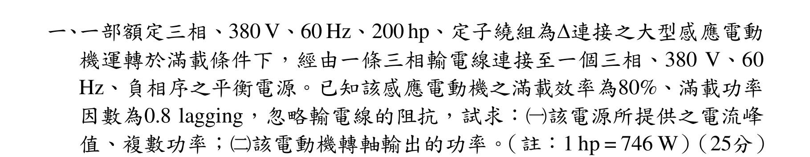
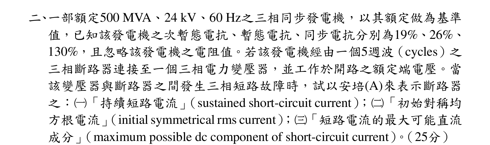
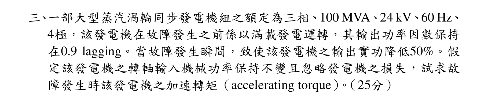
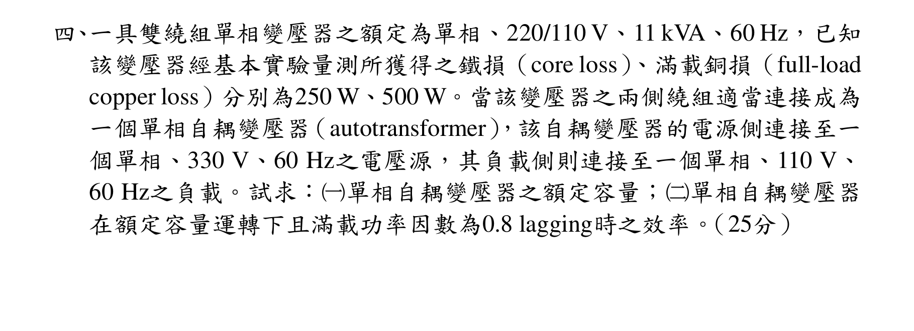

# 公務人員高等考試三級（112年）電力系統 原始試題

> 本檔只保存考選部原始試題的轉錄與裁切圖，不含解答。數學符號、電路接線與圖中文字以原始題目裁切圖為準。

#### 一、一部額定三相、380 V、60 Hz、200 hp、定子繞組為連接之大型感應電動
機運轉於滿載條件下，經由一條三相輸電線連接至一個三相、380 V、60
Hz、負相序之平衡電源。已知該感應電動機之滿載效率為80%、滿載功率
因數為0.8 lagging，忽略輸電線的阻抗，試求：（一）該電源所提供之電流峰
值、複數功率；（二）該電動機轉軸輸出的功率。（註：1 hp = 746 W）（25分）

<!-- question_kind: essay; question_number: 1; app_question_number: 1 -->

### 原始題目裁切

### 原始圖形裁切

本題原始 PDF 未含獨立嵌入圖形。

#### 二、一部額定500 MVA、24 kV、60 Hz之三相同步發電機，以其額定做為基準
值，已知該發電機之次暫態電抗、暫態電抗、同步電抗分別為19%、26%、
130%，且忽略該發電機之電阻值。若該發電機經由一個5週波（cycles）之
三相斷路器連接至一個三相電力變壓器，並工作於開路之額定端電壓。當
該變壓器與斷路器之間發生三相短路故障時，試以安培(A)來表示斷路器
之：（一）「持續短路電流」（sustained short-circuit current）；（二）「初始對稱均
方根電流」（initial symmetrical rms current）；（三）「短路電流的最大可能直流
成分」（maximum possible dc component of short-circuit current）。（25分）

<!-- question_kind: essay; question_number: 2; app_question_number: 2 -->

### 原始題目裁切

### 原始圖形裁切

本題原始 PDF 未含獨立嵌入圖形。

#### 三、一部大型蒸汽渦輪同步發電機組之額定為三相、100 MVA、24 kV、60 Hz、
4極，該發電機在故障發生之前係以滿載發電運轉，其輸出功率因數保持
在0.9 lagging。當故障發生瞬間，致使該發電機之輸出實功降低50%。假
定該發電機之轉軸輸入機械功率保持不變且忽略發電機之損失，試求故
障發生時該發電機之加速轉矩（accelerating torque）。（25分）

<!-- question_kind: essay; question_number: 3; app_question_number: 3 -->

### 原始題目裁切

### 原始圖形裁切

本題原始 PDF 未含獨立嵌入圖形。

#### 四、一具雙繞組單相變壓器之額定為單相、220/110 V、11 kVA、60 Hz，已知
該變壓器經基本實驗量測所獲得之鐵損（core loss）、滿載銅損（full-load
copper loss）分別為250 W、500 W。當該變壓器之兩側繞組適當連接成為
一個單相自耦變壓器（autotransformer），該自耦變壓器的電源側連接至一
個單相、330 V、60 Hz之電壓源，其負載側則連接至一個單相、110 V、
60 Hz之負載。試求：（一）單相自耦變壓器之額定容量；（二）單相自耦變壓器
在額定容量運轉下且滿載功率因數為0.8 lagging時之效率。（25分）

<!-- question_kind: essay; question_number: 4; app_question_number: 4 -->

### 原始題目裁切

### 原始圖形裁切

本題原始 PDF 未含獨立嵌入圖形。
