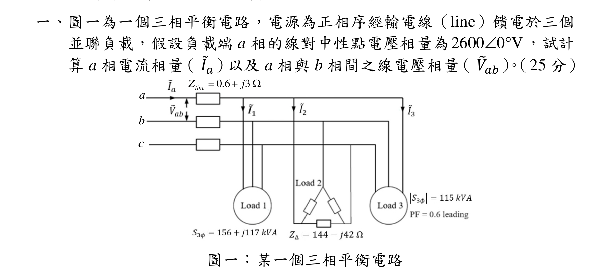
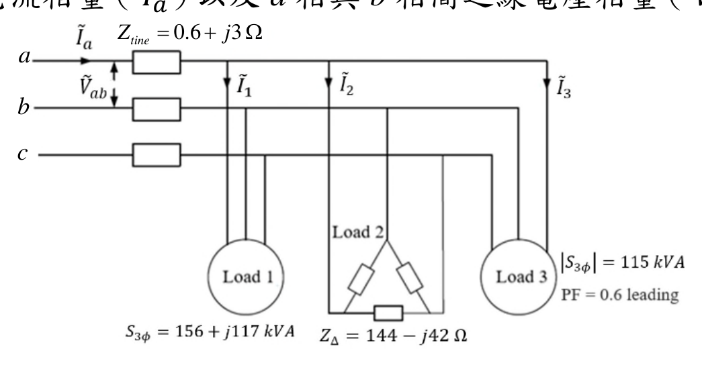
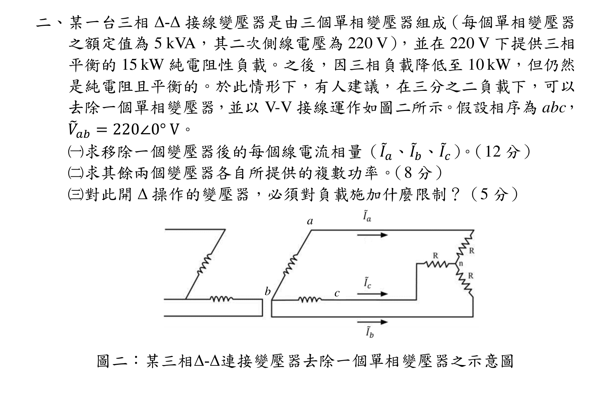
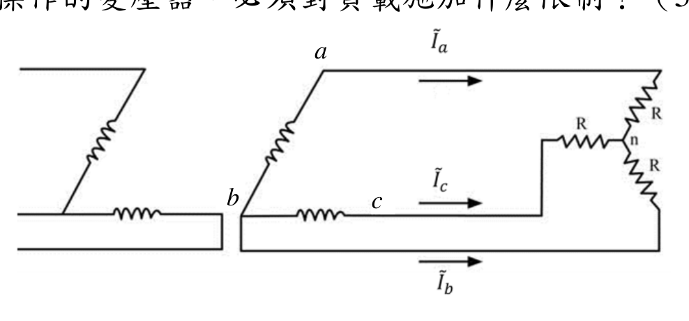
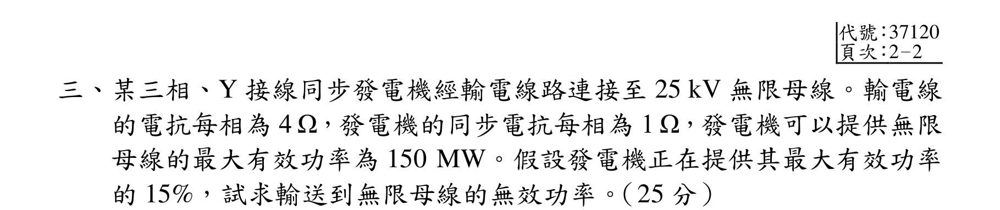
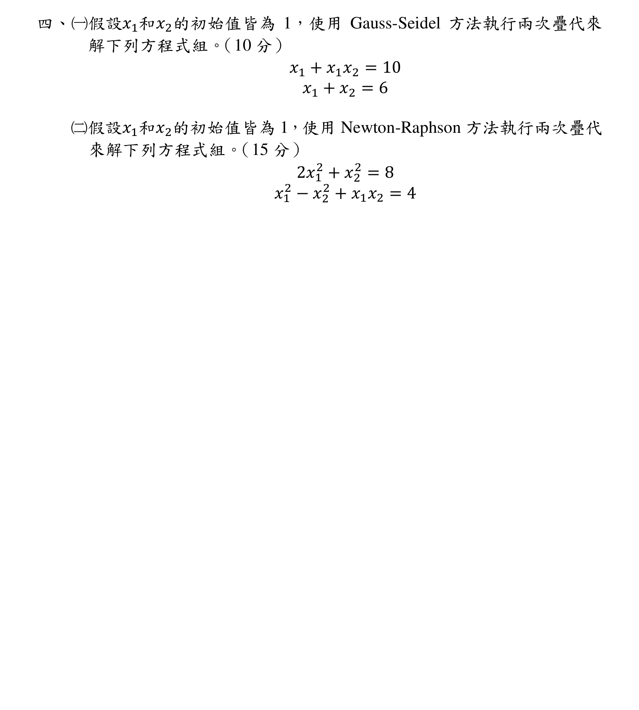

# 公務人員高等考試三級（113年）電力系統 原始試題

> 本檔只保存考選部原始試題的轉錄與裁切圖，不含解答。數學符號、電路接線與圖中文字以原始題目裁切圖為準。

#### 一、（三）本科
除專門名詞或數
式外
應使
本國
字作答
一、圖一為一個三相平衡電路，電源為正相序經輸電線（line）饋電於三個
並聯負載，假設負載端a 相的線對中性點電壓相量為2600 0 V

，試計
算a 相電流相量（ ܫሚ௔）以及a 相與b 相間之線電壓相量（ ܸ෨௔௕）。（25 分）
圖一：某一個三相平衡電路
0.6
3
tine
Z
j



a
b
c

<!-- question_kind: essay; question_number: 1; app_question_number: 1 -->

### 原始題目裁切

### 原始圖形裁切

#### 二、某一台三相Δ-Δ 接線變壓器是由三個單相變壓器組成（每個單相變壓器
之額定值為5 kVA，其二次側線電壓為220 V），並在220 V 下提供三相
平衡的15 kW 純電阻性負載。之後，因三相負載降低至10 kW，但仍然
是純電阻且平衡的。於此情形下，有人建議，在三分之二負載下，可以
去除一個單相變壓器，並以V-V 接線運作如圖二所示。假設相序為abc，
ܸ෨௔௕= 220∠0° V。
（一）求移除一個變壓器後的每個線電流相量（ܫሚ௔、ܫሚ௕、ܫሚ௖）。（12 分）
（二）求其餘兩個變壓器各自所提供的複數功率。（8 分）
（三）對此開Δ 操作的變壓器，必須對負載施加什麼限制？（5 分）
圖二：某三相Δ-Δ連接變壓器去除一個單相變壓器之示意圖
a
b
c

<!-- question_kind: essay; question_number: 2; app_question_number: 2 -->

### 原始題目裁切

### 原始圖形裁切

#### 三、某三相、Y 接線同步發電機經輸電線路連接至25 kV 無限母線。輸電線
的電抗每相為4 Ω，發電機的同步電抗每相為1 Ω，發電機可以提供無限
母線的最大有效功率為150 MW。假設發電機正在提供其最大有效功率
的15%，試求輸送到無限母線的無效功率。（25 分）

<!-- question_kind: essay; question_number: 3; app_question_number: 3 -->

### 原始題目裁切

### 原始圖形裁切

本題原始 PDF 未含獨立嵌入圖形。

#### 四、（一）假設ݔଵ和ݔଶ的初始值皆為1，使用Gauss-Seidel 方法執行兩次疊代來
解下列方程式組。（10 分）
ݔଵ+ ݔଵݔଶ= 10
ݔଵ+ ݔଶ= 6
（二）假設ݔଵ和ݔଶ的初始值皆為1，使用Newton-Raphson 方法執行兩次疊代
來解下列方程式組。（15 分）
2ݔଵ
ଶ+ ݔଶ
ଶ= 8
ݔଵ
ଶ−ݔଶ
ଶ+ ݔଵݔଶ= 4

<!-- question_kind: essay; question_number: 4; app_question_number: 4 -->

### 原始題目裁切

### 原始圖形裁切

本題原始 PDF 未含獨立嵌入圖形。
