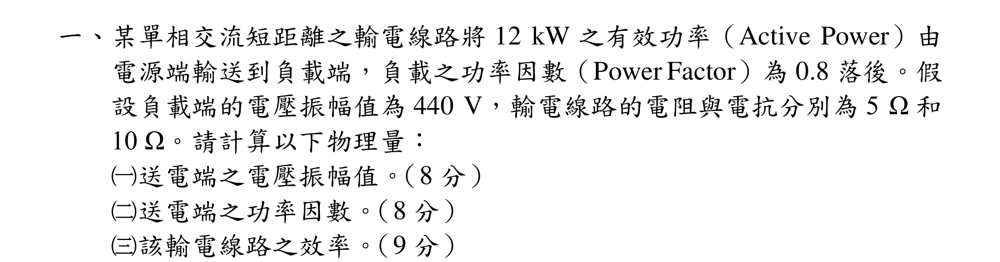
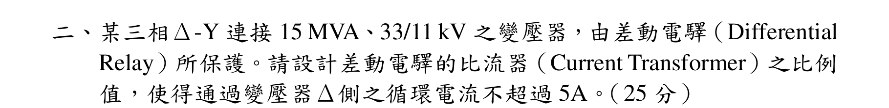
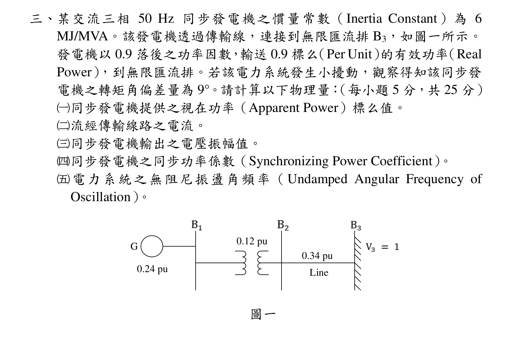
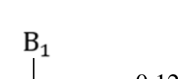
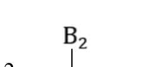
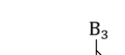
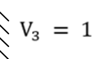
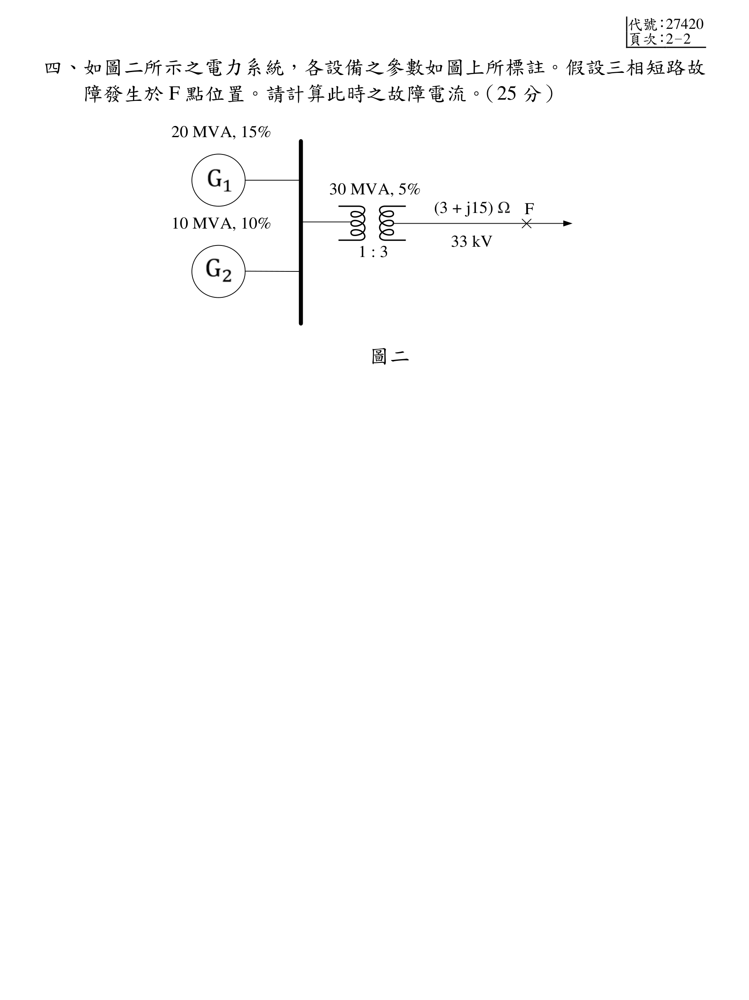
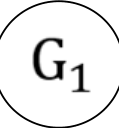
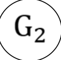

# 公務人員高等考試三級（114年）電力系統 原始試題

> 本檔只保存考選部原始試題的轉錄與裁切圖，不含解答。數學符號、電路接線與圖中文字以原始題目裁切圖為準。

#### 一、某單相交流短距離之輸電線路將12 kW 之有效功率（Active Power）由
電源端輸送到負載端，負載之功率因數（Power Factor）為0.8 落後。假
設負載端的電壓振幅值為440 V，輸電線路的電阻與電抗分別為5 Ω 和
10 Ω。請計算以下物理量：
（一）送電端之電壓振幅值。（8 分）
（二）送電端之功率因數。（8 分）
（三）該輸電線路之效率。（9 分）

<!-- question_kind: essay; question_number: 1; app_question_number: 1 -->

### 原始題目裁切

### 原始圖形裁切

本題原始 PDF 未含獨立嵌入圖形。

#### 二、某三相Δ-Y 連接15 MVA、33/11 kV 之變壓器，由差動電驛（Differential
Relay）所保護。請設計差動電驛的比流器（Current Transformer）之比例
值，使得通過變壓器Δ側之循環電流不超過5A。（25 分）

<!-- question_kind: essay; question_number: 2; app_question_number: 2 -->

### 原始題目裁切

### 原始圖形裁切

本題原始 PDF 未含獨立嵌入圖形。

#### 三、某交流三相50 Hz 同步發電機之慣量常數（Inertia Constant）為6
MJ/MVA。該發電機透過傳輸線，連接到無限匯流排B3，如圖一所示。
發電機以0.9 落後之功率因數，輸送0.9 標么（Per Unit）的有效功率（Real
Power），到無限匯流排。若該電力系統發生小擾動，觀察得知該同步發
電機之轉矩角偏差量為9°。請計算以下物理量：（每小題5 分，共25 分）
（一）同步發電機提供之視在功率（Apparent Power）標么值。
（二）流經傳輸線路之電流。
（三）同步發電機輸出之電壓振幅值。
（四）同步發電機之同步功率係數（Synchronizing Power Coefficient）。
電力系統之無阻尼振盪角頻率（Undamped Angular Frequency of
Oscillation）。
0.24 pu
G
0.12 pu
0.34 pu
Line
圖一

<!-- question_kind: essay; question_number: 3; app_question_number: 3 -->

### 原始題目裁切

### 原始圖形裁切

#### 四、如圖二所示之電力系統，各設備之參數如圖上所標註。假設三相短路故
障發生於F 點位置。請計算此時之故障電流。（25 分）
(3 + j15) Ω
F
33 kV
1 : 3
30 MVA, 5%
10 MVA, 10%
20 MVA, 15%
圖二

<!-- question_kind: essay; question_number: 4; app_question_number: 4 -->

### 原始題目裁切

### 原始圖形裁切

