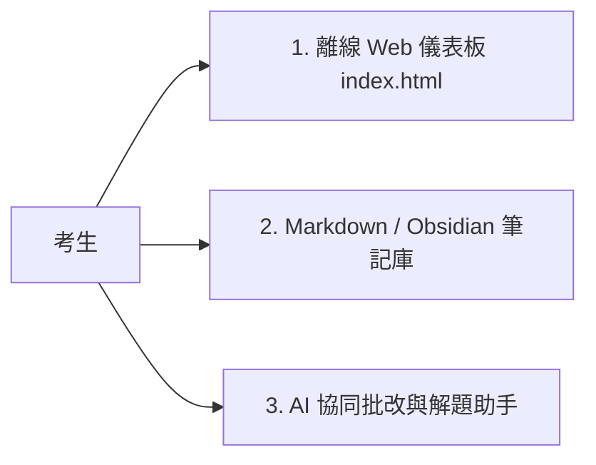

# 📖 電機工程技師 歷屆試題與詳解知識庫 — 使用說明書

歡迎使用**電機工程技師（104 ~ 114 年）歷屆試題與詳解知識庫**！本系統專為準備專門職業及技術人員高等考試（電機工程技師）之考生打造，提供離線互動儀表板、全真模考計時、錯題二刷與 AI 協同批改功能。

---

## 🌟 系統三大入口與使用模式

---

## 🖥️ 一、離線 Web 儀表板 (`index.html`) 操作指南

直接以任何瀏覽器（Chrome、Edge、Safari、Firefox）雙擊開啟專案根目錄下的 [`index.html`](./index.html)，無須連網或啟動伺服器即可使用全部功能：

### 1. 🌓 深色模式 / 莫蘭迪亮色模式切換
- 點擊右上角的 **「🌓 切換深色/亮色主題」** 按鈕，系統會自動在「溫潤米白紙感」與「極客午夜深藍」之間切換，並自動儲存您的偏好。

### 2. 🔍 多維度即時搜尋與交叉篩選
- **關鍵字即時搜尋**：輸入 `Buck`、`SVD`、`變壓器`、`戴維寧`、`留數`、`搖擺方程` 等關鍵字，毫秒級篩選符合題型。
- **考科篩選**：可選擇特定科目（如 `04. 電機機械`）。
- **年度篩選**：可鎖定特定年份（如 `114 年 (最新)` 至 `104 年`）。
- **掌握狀態篩選**：
  - 🟢 **已掌握**：已完全理解且可獨立推導。
  - 🔴 **需二刷**：曾算錯、卡題或觀念不熟之題目（錯題本）。
  - ⚪ **未開始**：尚未練習之題目。
- **快篩按鈕 Pills**：
  - **🔥 全科 Top 10 必考**：直擊投報率最高核心考點。
  - **🔴 我的錯題本**：一鍵只顯示所有需要二刷的弱點題目。
  - **⭐ 我的收藏**：快速瀏覽標記星星的重要題目。
  - **📝 完整題解**：只顯示已有詳細推導步驟之題目。

### 3. ⏱️ 全真 120 分鐘模考與計時器模式
- 點擊頂部 **「⏱️ 全真計時模考」** 分頁。
- 選擇「指定年度考卷」（如 114 年 電路學）或「🎲 隨機精選 4 題模考」。
- 點擊「▶️ 開始 120 分鐘計時」，白紙蓋牌獨立作答。
- 模考結束後於自評卡填寫得分與各題自評，自動累積至模考歷史紀錄。

### 4. 📝 題目詳細推導彈窗與鍵盤快捷鍵
- 點擊題目的 **「📝 開啟詳細步驟推導」** 按鈕開啟彈窗。
- 支援 KaTeX 數學公式完美排版與原卷電路圖對照。
- 點擊電路圖可開啟 **Lightbox 燈箱** 放大檢視原圖細節。
- **快捷鍵操作**：
  - `j` 或 `↓`：切換至下一題
  - `k` 或 `↑`：切換至上一題
  - `Esc`：關閉彈窗

### 5. 💾 刷題數據備份與還原 (Data Portability)
- 點擊右上角 **「💾 備份/匯出進度 (JSON)」** 下載刷題紀錄。
- 換電腦或手機時，點擊 **「📥 匯入進度」** 即可一秒同步進度。

---

## 📚 二、Obsidian / Markdown 離線刷題工作流

如果您習慣在 Obsidian 或 VS Code 中閱讀筆記：

1. **依考科刷題**：進入 [`依考科分類/`](./依考科分類/) 開啟對應科目總表（如 `04_電機機械.md`）。
2. **核心觀念補強**：點擊雙向連結 `[[01_變壓器等效電路與效率計算]]` 跳轉至 [`🧠 核心考點知識庫/`](./🧠%20核心考點知識庫/) 複習 SOP。
3. **查閱完整題解**：進入 [`📝 個人題解與錯題本/`](./📝%20個人題解與錯題本/) 查閱各年度全卷詳解。
4. **追蹤刷題進度**：在 [`📊 備考進度儀表板.md`](./📊%20備考進度儀表板.md) 勾選核取方塊。

---

## 🤖 三、AI 協同批改與手寫解答檢驗

在 IDE 內與 AI 助手互動：

1. 點擊題卡上的 **「📸 呼叫 AI 批改手寫解答」** 按鈕（系統會自動複製指令至剪貼簿）。
2. 在 IDE 對話框中貼上指令（Ctrl+V / Cmd+V）。
3. 將您在白紙上書寫的計算過程拍照並拖曳至對話框中送出。
4. AI 助手將依照國考 25 分評分向度為您批改、抓出計算錯誤與符號疏漏，並提供得分建議！
