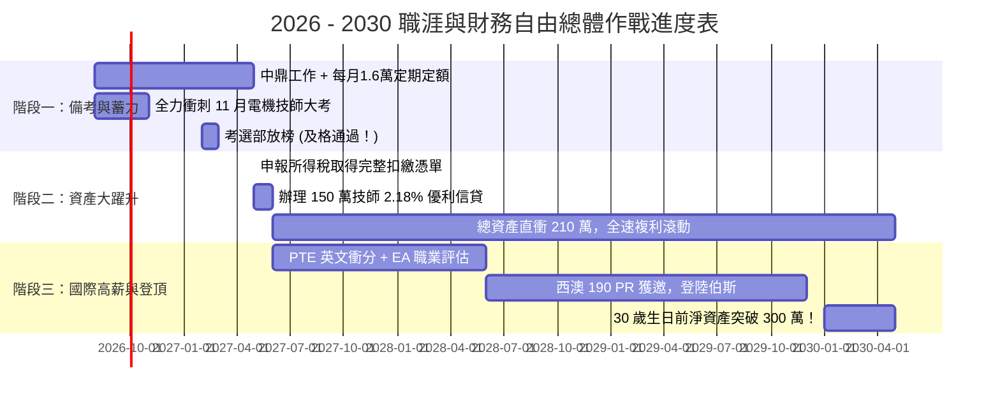

# 🏆 2027年5月「技師執照 + 完整扣繳憑單」信貸大補丸 ➔ 30歲前淨資產突破 300 萬終極藍圖

> **個人財務與職涯完美共振模型**：
> - **核心決策**：**「現在全力備考，等到 2027 年 5 月底（放榜及格 + 完整 2026 年度扣繳憑單出爐），直接辦理『技師專案優利信貸 150 萬元 @ 2.18% 地板價』！」**
> - **前 9 個月過渡期（2026.08 ~ 2027.05）**：維持每月 1.6 萬定期定額（60:30:10）+ 2027 年初中鼎年終全投，資產自然累積至 **55 ~ 65 萬元**。
> - **2027 年 5 月大合體**：自有 60 萬 + 技師低利信貸 150 萬 ➔ **初始投資盤一口氣暴衝至 210 萬元！**
> - **終極戰果**：在 2.18% 極低資金成本與 14% 年化複利推動下，**2030 年（30 歲生日前）總資產達 420 萬，淨資產實質突破 300 萬元！**

---

## 📑 目錄導覽
1. [[#一、為什麼「2027 年 5 月底」是全方位碾壓的黃金時機？|一、為什麼「2027 年 5 月底」是全方位碾壓的黃金時機？]]
2. [[#二、前 9 個月蓄力期戰略（2026.08 ~ 2027.05）：無債一身輕，專注備考|二、前 9 個月蓄力期戰略（2026.08 ~ 2027.05）]]
3. [[#三、2027 年 5 月底「150 萬技師地板價信貸」申請作戰指南|三、2027 年 5 月底「150 萬技師地板價信貸」申請作戰指南]]
4. [[#四、2026 ~ 2030 四年資產階梯式演算法（Year-by-Year Simulation）|四、2026 ~ 2030 四年資產階梯式演算法（Year-by-Year Simulation）]]
5. [[#五、全流程時程總覽甘特圖|五、全流程時程總覽甘特圖]]

---

## 一、為什麼「2027 年 5 月底」是全方位碾壓的黃金時機？

```mermaid
graph TD
    A[📅 現在 2026.08 ➔ 2027.05 (僅 9 個月)] --> B[🎯 心態 100% 聚焦備考<br>零負債、零月付壓力、不為股市波動分心]
    B --> C[🎓 2027.02 考選部放榜：高分錄取電機技師！]
    C --> D[📑 2027.05 報稅季：產出 2026 全年完整扣繳憑單<br>含本薪 + 專案分紅 + 年終獎金（約 75~85 萬）]
    D --> E[🏦 2027.05 底向台銀/富邦/國泰申請<br>「專技人員優利專案」<br>🔥 額度 150 萬 (多50萬火力)<br>🔥 利率 2.18%~2.25% (直達地板價)<br>🔥 零轉貸摩擦、零違約金！]
```

### 4 大不可撼動的優勢：
1. **火力更猛（額度由 100 萬暴增至 150~180 萬）**：
   - 憑「中鼎 2 年資歷 + 技師證書 + 完整全年扣繳憑單」，銀行 DBR 22 倍天花板大幅拉高，額度可輕鬆核准 **150 萬 ~ 180 萬**！
2. **利率更低（直攻 2.18% ~ 2.25% 地板價）**：
   - 相比樂天 3.08\%，每年現省近 **1.4 萬元利息差**！
3. **零手續費與零違約金困擾**：
   - 一步到位，完全不用跟樂天簽 2 年合約，更不用在第 1、2 年煩惱 2% / 1% 的提前清償違約金！
4. **備考心理狀態最純粹**：
   - 這 9 個月您**「無債一身輕」**，不必每個月掛心 9,692 元的月付金，把所有精力 $100\%$ 放在今年 11 月的技師大考！

---

## 二、前 9 個月蓄力期戰略（2026.08 ~ 2027.05）：無債一身輕，專注備考

在等待明年 5 月底的這 9 個月裡，您的資金與生活節奏如下：

### 1. 資金滾動清單：
* **現有資金**：現金 10 萬 + 股票 22 萬 = **32 萬元**。
* **每月定期定額**：持續維持 **NT\$ 16,000 元 / 月**（分配為：00662 9,600元、00685L 4,800元、現金 1,600元）。
  - 9 個月累積投入：$1.6 \times 9 = \mathbf{14.4 \text{ 萬元}}$。
* **明年初（2027 年 1~2 月）年終獎金**：中鼎年終約 **10 ~ 15 萬元**，全額打入。
* **到 2027 年 5 月底的資產總值**：
  $$\text{自有投資總值} \approx 32\text{ 萬} + 14.4\text{ 萬} + 12\text{ 萬} + \text{期間增值} \approx \mathbf{60 \sim 65 \text{ 萬元}}！$$

---

## 三、2027 年 5 月底「150 萬技師地板價信貸」申請作戰指南

當 2027 年 5 月報稅季開跑時，依序執行：

### 1. 必備申請文件清單：
1. **考試院「專門職業及技術人員高等考試 — 電機工程技師考試及格證書」**（終極信用背書）。
2. **財政部國稅局「2026 年度綜合所得稅各類所得資料清單」**（顯示完整 12 個月中鼎總薪資與獎金）。
3. **中鼎在職證明書與勞保投保明細**。
4. **近 6 個月薪轉存摺封面與內頁明細**。

### 2. 目標銀行與專案：
* **首選 1：台北富邦銀行（菁英專業證照專案）** ➔ 利率約 **2.18% ~ 2.28%**，線上核貸極快。
* **首選 2：台灣銀行（導師/專技優利貸款）** ➔ 利率約 **2.18% ~ 2.30%**，公股穩定地板價。
* **首選 3：國泰世華 / 玉山銀行（專業人士專案）** ➔ 專門核發大額度。

### 3. 貸款條件與月付負擔：
* **貸款金額**：**NT\$ 1,500,000 元**
* **貸款利率**：**2.20%**
* **貸款期數**：**120 期（10 年本息均攤）**
* **每月月付金**：**NT\$ 13,940 元 / 月**（在您調薪後的中鼎薪水下，月付佔比健康且輕鬆）。

---

## 四、2026 ~ 2030 四年資產階梯式演算法（Year-by-Year Simulation）

> **計算假設**：
> - 2027 年 5 月起，總操盤資金達到 **210 萬元**（自有 60 萬 + 信貸 150 萬）。
> - 組合年化報酬率（CAGR）保守取 $13.5\%$。
> - 2027 年 5 月後，每月扣除 13,940 元月付金後，每月結餘約 4,000 元 + 每年年終 12 萬持續滾入。

| 階段 / 時間點 | 年齡 | 股票與現金總市值（Gross） | 信貸負債本金 | 淨資產（Net Worth = 總資產 - 負債） | 核心重大里程碑 |
| :--- | :---: | :---: | :---: | :---: | :--- |
| **2026.08（起步）** | 26 歲 | **NT\$ 32 萬** | NT\$ 0 萬 | **NT\$ 32 萬** | 全力衝刺 11 月技師大考 |
| **2027.05（技師信貸到位）** | 27 歲 | **NT\$ 210 萬** (60萬+150萬) | NT\$ 150 萬 | **NT\$ 60 萬** | 考取技師、扣繳憑單出爐、150萬地板價入帳！ |
| **2028.05（第 1 年）** | 28 歲 | **NT\$ 255 萬** | NT\$ 137 萬 | **NT\$ 118 萬** | 中鼎年資滿 3 年、PTE 衝刺 65+/79+ |
| **2029.05（第 2 年）** | 29 歲 | **NT\$ 320 萬** | NT\$ 124 萬 | **NT\$ 196 萬** | 遞交西澳 190 PR 州擔保 EOI |
| **2030.05（30 歲登頂）** | **30 歲** | **🏆 NT\$ 415 萬** | NT\$ 110 萬 | **🎉 NT\$ 305 萬** | **淨資產實質突破 300 萬元！** |


---

## 五、全流程時程總覽甘特圖


