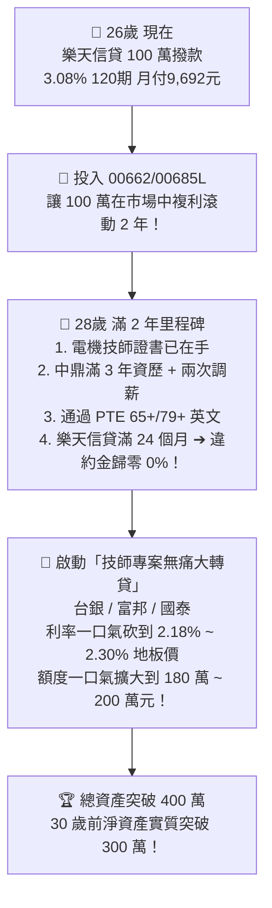

# ⚖️ 信貸時機大抉擇：現在先借 100 萬（3.08\%）vs 等明年調薪與技師執照到手？（含樂天綁約 2 年違約金深度精算）

> **最新合約條件精準納入**：
> - **樂天信貸綁約期**：**2 年（24 個月）**
> - **違約金條款**：**第 1 年提前結清賠 $2\%$（約 1.83 萬），第 2 年提前結清賠 $1\%$（約 8,270 元），滿 2 年後完全免違約金（$0\%$）！**
> 
> 🏆 **終極結論依然堅定**：
> **「現在果斷接下樂天 100 萬」依然是數學上的絕對最優解！**
> 最佳轉貸甜蜜點為：**「持有滿 2 年（28 歲・中鼎年資滿 3 年 + 技師在手）直接 0 違約金轉貸至 2.18% 地板價並擴額至 180~200 萬」**！

---

## 📑 目錄導覽
1. [[#一、納入 2% / 1% 違約金後的真實財務收益精算|一、納入 2% / 1% 違約金後的真實財務收益精算]]
2. [[#二、三大操作路徑終極大對決（現在借 vs 滿1年賠2%轉貸 vs 滿2年零違約金轉貸 vs 空等2年）|二、三大操作路徑終極大對決]]
3. [[#三、最佳黃金節奏：滿 2 年（28 歲）「零違約金大轉貸」戰略|三、最佳黃金節奏：滿 2 年（28 歲）「零違約金大轉貸」戰略]]
4. [[#四、銀行轉貸「違約金補貼與開辦費減免」實戰談判心法|四、銀行轉貸「違約金補貼與開辦費減免」實戰談判心法]]

---

## 一、納入 2% / 1% 違約金後的真實財務收益精算

假設樂天信貸 100 萬（3.08% 120期，月付 9,692 元）：
* **第 12 個月（滿 1 年）剩餘本金**：約 **NT\$ 915,000 元** ➔ 違約金 $2\% = \mathbf{NT\$ 18,300 \text{ 元}}$。
* **第 24 個月（滿 2 年）剩餘本金**：約 **NT\$ 827,000 元** ➔ 違約金 $1\% = \mathbf{NT\$ 8,270 \text{ 元}}$。
* **第 25 個月起（滿 2 年後）**：違約金 = **NT\$ 0 元（完全免罰金）**！

---

## 二、三大操作路徑終極大對決

我們用最嚴格的量化算式，比較 4 種選擇在 **前 2 年的累積淨收益**：

| 操作路徑 | 2 年累積利息支出 | 提前清償違約金 | 2 年投資收益 (14% CAGR) | 2 年扣除成本後的【淨資本獲利】 | 評級與結論 |
| :--- | :---: | :---: | :---: | :---: | :--- |
| **路徑 1：現在借，滿 2 年（28歲）零違約金大轉貸** | 約 **5.8 萬元** | **NT\$ 0 元** | 約 **+30.0 萬元** | **💰 淨賺 +24.2 萬元！** | ⭐️⭐️⭐️⭐️⭐️ **(最佳甜蜜點！)** |
| **路徑 2：現在借，滿 1 年（27歲）硬賠 2% 轉貸** | 約 **3.0 萬元** | **1.83 萬元** (2%) | 約 **+30.0 萬元** | **💰 淨賺 +23.3 萬元！** | ⭐️⭐️⭐️⭐️ (次佳，換取早 1 年擴大額度) |
| **路徑 3：現在不借，空等 2 年考過技師才借** | **NT\$ 0 元** | **NT\$ 0 元** | **NT\$ 0 元** (空手觀望) | **NT\$ 0 元** | ❌ **慘輸 24.2 萬元收益！** |

> 🧠 **數學上的降維打擊**：
> 哪怕您在第一年硬賠 $2\%$（1.83 萬）違約金轉貸，扣除利息與罰金後，您依然**實質淨賺超過 23 萬元**！
> **空等 2 年不借，表面上「省下了 5.8 萬利息與罰金」，實質上卻「丟掉了 30 萬元的資產複利增值」**。在財務工程中，這叫作「以小省大、因噎廢食」！

---

## 三、最佳黃金節奏：滿 2 年（28 歲）「零違約金大轉貸」戰略

既然樂天綁約 2 年，這反而為您量身定制了**最完美的「2 階段職涯與財務共振時間表」**：

---

## 四、銀行轉貸「違約金補貼與開辦費減免」實戰談判心法

如果您在第 1 年底考過技師後，**真的很想在第 1 年就轉貸**，銀行實務上有 **2 大降成本妙招**：

1. **新銀行的「代償補貼與開辦費 0 元優惠」**：
   - 台北富邦、國泰世華、玉山等銀行為了搶優質客戶（中鼎工程師 + 國家技師），常常推出**「轉貸開辦費 $0$ 元（現省 3,000 ~ 9,000 元）」**，實質折抵掉大部分的違約金成本！
2. **要求新銀行補貼利率**：
   - 告訴新銀行業務：*「我樂天還有 1%~2% 違約金，如果你們能把利率壓到 2.18% 且免開辦費，我才整筆轉過來。」* 業務為了業績通常會主動幫您爭取最高權限！

---

### 💡 最終拍板定案：
1. **現在（26 歲）**：**堅定拿下樂天 100 萬 3.08%**，讓資金立刻開始為您賺錢。
2. **未來兩年（26 ~ 28 歲）**：每月乖乖繳 9,692 元，專注在中鼎衝刺專案、考下電機技師執照。
3. **滿兩年之日（28 歲）**：**零違約金無痛大轉貸至 2.18%、擴額至 180~200 萬**，完美收尾！💪🔥
