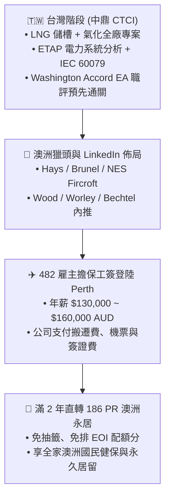

# 🇦🇺 澳洲 482 雇主擔保（TSS）與跨國 EPC 海外直聘極速登陸全戰略

> **目標設定**：在台灣中鼎（CTCI）累積 LNG 專案（儲槽 ➔ 氣化全廠）實績，打造 LinkedIn 獵頭吸磁器，直攻澳洲西澳（Perth）重工業 EPC 巨頭海外直聘與 482 雇主擔保工作簽證，2 年內無縫銜接 186 PR 永居！

---

## 🧭 一、為什麼「482 雇主擔保」是 LNG 電機工程師的最強路徑？



### 🌟 482 簽證 4 大不可替代的優勢：
1. **完全不需要等技術移民（189/190）被動抽籤**：
   只要澳洲雇主面試錄取並發出擔保，簽證審批通常僅需 **4 ~ 8 週**，速度冠絕所有簽證！
2. **門檻極為友善**：
   - 英語要求：僅需 **IELTS 5.0**（或 PTE 36+），遠低於技術移民的 79+ 壓力！
   - 年齡限制：45 歲以下皆可申請。
3. **搬遷與登陸成本全包**：
   澳洲頂級 EPC 通常會提供 **Relocation Package**（包含國際機票、抵達伯斯前 2~4 週的免費公寓住宿、行李海運補助與簽證規費）。
4. **2 年保送 186 永居（PR）**：
   依據澳洲移民局最新法規，所有 482 短期與中長期清單職業，只要為同一雇主工作滿 **2 年**，雇主即可直接提名轉為 **Subclass 186 永久居民簽證（PR）**！

---

## 🛠️ 二、在台灣中鼎期間的 4 大「護城河」優化動作

### 1. 專業技術堆疊（Technical Moat）
* **必須奪下的專案交付成果（Deliverables）**：
  - **Single Line Diagrams (SLD)**：161kV/22.8kV/4.16kV 中高壓單線圖與連鎖邏輯。
  - **ETAP 電力系統分析**：短路故障計算（IEC 60909）、大馬達啟動壓降分析（Motor Starting Dynamic Simulation）、負載流（Load Flow）。
  - **防爆安全（Hazardous Area IEC 60079）**：Zone 0/1/2 分級表與防爆設備（Ex-d, Ex-i, Ex-e）送審。
  - **電纜計算（Cable Sizing）**：依 IEC 60287 / AS/NZS 3008 進行載流量與壓降校核。

---

### 2. 澳洲華盛頓協定（Washington Accord）EA 職評預載
雖然 482 簽證本身不一定強制要求 EA 評估，但**一旦履歷附上 EA 官方認證信，錄取率暴增 300%**：
* 台灣 IEET 認證大學/碩士畢業生可走 **Washington Accord 直通通道**。
* 免寫 3 篇繁瑣的 CDR 報告，直接在線上系統（Engineers Australia Portal）上傳英文畢業證書與成績單，1~3 週即可拿下 `Professional Electrical Engineer (Skill Level 1)` 認證！

---

### 3. LinkedIn 獵頭磁鐵化（Perth Recruiter Optimization）
澳洲 70% 以上的高薪重工業職缺是由 **LinkedIn 與專業工程獵頭公司** 撮合，請直接將 LinkedIn 檔案調整為：

* **職稱 Headline**：
  > `Electrical Design Engineer | LNG, Cryogenic & Heavy Petrochemical Power Systems | ETAP, IEC 60079, MV/LV Substation | Open to Perth / Western Australia Relocation`
* **專案經歷關鍵字（Key Deliverables）**：
  - *"Engineered electrical distribution for multi-billion dollar LNG storage & re-gasification terminals."*
  - *"Conducted comprehensive ETAP studies (Short-circuit, Motor acceleration, Load flow) for multi-MW VFD BOG compressors."*
  - *"Designed hazardous area equipment packages compliant with IEC 60079 and AS/NZS standards."*
* **重點連接的澳洲西澳（Perth）獵頭巨頭**：
  - **Hays Energy & Resources (Perth)**
  - **Brunel Australasia**
  - **NES Fircroft (Perth Oil & Gas Team)**
  - **Airswift (Global Workforce Solutions)**

---

### 4. 鎖定的澳洲西澳（Perth）重工業 EPC 目標企業清單

| 企業名稱 | 業務板塊與代表專案 | 招聘特質 |
| :--- | :--- | :--- |
| **Wood (John Wood Group)** | Woodside Pluto Train 2, Scarborough LNG | 極度偏好具備 LNG/低溫儲槽設計經驗之電機工程師 |
| **Worley** | Chevron Gorgon / Wheatstone, Perdaman Urea | 全球頂級 EPC，定期針對海外資深設計工程師發出 482 擔保 |
| **Bechtel Australia** | 澳洲西澳巨型資源開發與 LNG 接收站 | 專案制超大規模招聘，給薪極為優渥 |
| **KBR Australia** | 國防、能源與大型天然氣基礎設施 | 著重電力系統分析與變電站設計能力 |
| **Monadelphous / Clough** | 西澳工程維護、改建與 EPC 統包 | 現場與工程辦公室雙向職缺豐富 |

---

## 📅 三、未來 12 ~ 18 個月行動時間軸規劃

```text
【第 1 ~ 4 個月：中鼎專案攻堅 ＋ 資格鎖定】
├── 爭取在中鼎 LNG 氣化案中主導 ETAP 電力系統模擬與單線圖編製
├── 線上向 Engineers Australia 申請華盛頓協定職業評估 (1~3 週下件)
└── 備考 PTE Academic，一舉考出 65+ (四項穩過) 備用

【第 5 ~ 8 個月：全英文戰略履歷 ＋ LinkedIn 獵頭精準投放】
├── 產出 2 頁標準澳洲 EPC 格式 Resume (強調 LNG / IEC 60079 / ETAP 實績)
├── 連接 50+ 位 Perth 當地的 Oil & Gas 電機獵頭顧問與 HR
└── 投遞 Wood / Worley / Bechtel 之 "Electrical Engineer" 職缺

【第 9 ~ 12 個月：跨國視訊面試 ＋ 482 簽證下件登陸】
├── 通過 2~3 輪技術面試 (針對 LNG 壓縮機 VFD、接地與防爆規範答辯)
├── 簽署 Employment Contract ($130k ~ $150k AUD + Superannuation)
└── 雇主遞交 482 Nomination，順利取得工簽，飛往西澳伯斯 (Perth) 展開新生活！
```
