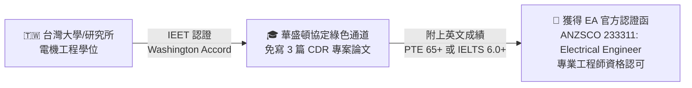
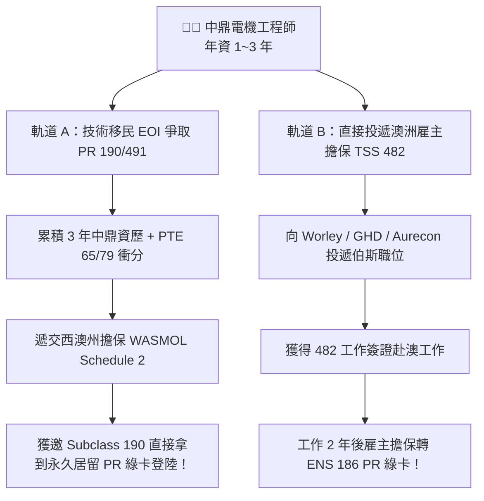
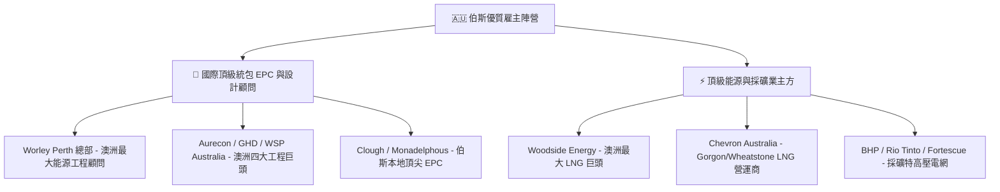
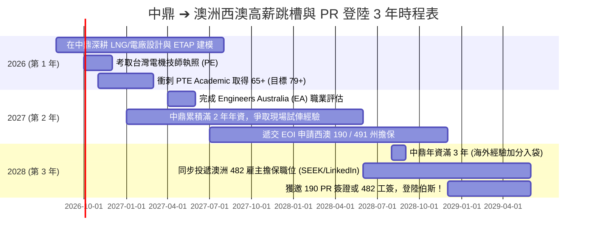

# 🦘 中鼎電機設計工程師 ➔ 澳洲（西澳伯斯）高薪跳槽與 PR 永久居留全攻略藍圖

> **個人檔案與戰略定位**：
> - **現職**：中鼎工程（CTCI） 電機設計工程師（年資 1 ~ 3 年）
> - **專業領域**：LNG 液化天然氣接收站、超低溫儲槽（Cryogenic Tanks）、燃氣複循環電廠（CCGT）
> - **目標城市**：西澳首府 **伯斯（Perth, Western Australia）** —— 澳洲能源與資源採礦之都
> - **移民職業代碼**：**ANZSCO 233311: Electrical Engineer**（中長期緊缺職業清單 MLTSSL，高優先級）
> - **最高學歷**：台灣 IEET 認證之電機工程學士/碩士（符合華盛頓協定 Washington Accord，享 EA 免 CDR 快速認證）
> - **核心戰略**：**「雙軌並進」** —— 在台累積滿 3 年資歷 + 考取台灣技師與 PTE 高分，同步遞交西澳 190 PR 州擔保 EOI 與直投澳洲雇主擔保（482/186）。

---

## 📑 目錄導覽
1. [[#一、為什麼選擇西澳伯斯（Perth）？澳洲能源與電機薪資矩陣|一、為什麼選擇西澳伯斯（Perth）？澳洲能源與電機薪資矩陣]]
2. [[#二、第一步：澳洲工程師職業評估（EA Skills Assessment）華盛頓協定通關指南|二、第一步：澳洲工程師職業評估（EA Skills Assessment）華盛頓協定通關指南]]
3. [[#三、第二步：雙軌 PR 移民簽證全解析與 EOI 打分表試算|三、第二步：雙軌 PR 移民簽證全解析與 EOI 打分表試算]]
4. [[#四、澳洲電氣法規與技術無縫對接（AS/NZS 3000 / AS 60079）|四、澳洲電氣法規與技術無縫對接（AS/NZS 3000 / AS 60079）]]
5. [[#五、澳洲（伯斯）頂級目標雇主地圖與求職管道|五、澳洲（伯斯）頂級目標雇主地圖與求職管道]]
6. [[#六、3 年階梯式落地時間表（2026 ~ 2029 Action Timeline）|六、3 年階梯式落地時間表（2026 ~ 2029 Action Timeline）]]
7. [[#七、澳洲標準 CV 改寫範例與面試重點|七、澳洲標準 CV 改寫範例與面試重點]]

---

## 一、為什麼選擇西澳伯斯（Perth）？澳洲能源與電機薪資矩陣

### 1. 西澳（WA）是全球 LNG 與資源採礦之都
- **全球最大 LNG 產地之一**：西北大陸架（North West Shelf）、Gorgon LNG、Wheatstone LNG、Pluto LNG、Scarborough 巨型專案總部皆在伯斯。
- **重工業與綠能轉型**：Pilbara 礦區特高壓微電網、Kwinana 氫能與電池儲能、大型海水淡化廠電氣系統。
- **對電機工程師的極度渴求**：澳洲嚴重缺乏具備「**大型高壓變電所 + 防爆區域劃分（Hazardous Area）+ ETAP 系統模擬**」實戰力的設計工程師。

### 2. 伯斯電機設計工程師薪資行情（全澳最高，超越雪梨/墨爾本）：

| 職級階段 | 澳洲年資 | 澳洲年薪區間（AUD 澳幣） | 折合新台幣年薪（匯率 1:21.5） | 備註福利 |
| :--- | :---: | :---: | :---: | :--- |
| **Graduate / Junior** | 1 ~ 3 年 | **$80,000 ~ $105,000 AUD** | **172 萬 ~ 225 萬 NTD** | +11.5% Superannuation（退休金） |
| **Electrical Design Engineer** | 3 ~ 5 年 | **$110,000 ~ $145,000 AUD** | **236 萬 ~ 310 萬 NTD** | 彈性工作制、每年 4 週全薪年假 |
| **Senior Electrical Engineer** | 5 ~ 8 年 | **$150,000 ~ $190,000 AUD** | **322 萬 ~ 408 萬 NTD** | 擔任 Package Lead、享專案績效獎金 |
| **Principal / Lead Engineer** | 8+ 年 | **$200,000 ~ $250,000+ AUD** | **430 萬 ~ 537 萬+ NTD** | 簽署主辦、帶領跨國設計團隊 |

---

## 二、第一步：澳洲工程師職業評估（EA Skills Assessment）華盛頓協定通關指南

想要移民澳洲或合法從事專業工程，第一步必須通過 **Engineers Australia (EA)** 的職業評估。



### 1. 華盛頓協定（Washington Accord）快速通道優勢
- 台灣多數公私立大學電機系均受 **中華工程教育學會（IEET）** 認證。
- 在 EA 申請時選擇 **"Washington Accord"** 途徑，**完全無需撰寫繁瑣的 3 篇專案報告（CDR）**！審查時間約 4~6 週即可出具官方認可信。

### 2. 申請必備文件清單：
1. 英文版學士/碩士畢業證書與完整歷年成績單。
2. 護照個人資料頁與證件照。
3. 英文檢定成績單：IELTS（各科 $\ge 6.0$）或 PTE Academic（各科 $\ge 50$）。
4. 英文版簡歷（CV）。
5. 海外工作年資加分評估（Relevant Skilled Employment Assessment，可選，需附中鼎英文在職與離職證明）。

---

## 三、第二步：雙軌 PR 移民簽證全解析與 EOI 打分表試算



### 1. 您的 EOI 移民打分（Points Test）試算表（目標：西澳 190 / 491）：

| 評分項目 | 條件狀態 | 預估得分（保守 PTE 65） | 預估得分（衝刺 PTE 79） |
| :--- | :--- | :---: | :---: |
| **年齡（Age）** | 25 ~ 32 歲（黃金滿分期） | **30 分** | **30 分** |
| **英語能力（English）** | PTE 65+（Proficient） / PTE 79+（Superior） | **10 分** | **20 分** |
| **最高學歷（Education）** | 電機工程學士或碩士 | **15 分** | **15 分** |
| **海外工作年資（Overseas Exp）** | 中鼎累積滿 3 年海外相關經驗 | **5 分** | **5 分** |
| **婚姻狀態（Partner Status）** | 單身（或配偶通過職業評估與英文） | **10 分** | **10 分** |
| **基礎自評總分（Base Score）** | — | **70 分** | **80 分** |
| **西澳 190 州擔保加分（Subclass 190 PR）** | 獲得 WA 州政府擔保（+5 分） | **75 分** | **85 分 (秒獲邀！)** |
| **偏遠地區 491 州擔保加分（Subclass 491）** | 獲得 491 擔保（+15 分） | **85 分** | **95 分 (光速獲邀！)** |

> 💡 **西澳政策紅利**：西澳州擔保（WASMOL Schedule 2）將整個伯斯大都會區劃為偏遠地區（Category 2），對境外工程師極度友善，通常 75~85 分即可穩穩獲邀 190 永久居留簽證！

---

## 四、澳洲電氣法規與技術無縫對接（AS/NZS 3000 / AS 60079）

面試澳洲雇主時，只要你能精準說出以下 **澳洲標準（Australian Standards）**，面試官會對你驚為天人，因為這代表你**無需重新培訓、即可直接上手**：

1. **配線與低壓安全規範**：**AS/NZS 3000（Wiring Rules）** —— 澳洲電氣界的聖經（等同台灣用戶用電設備裝置規則，但更嚴格重視 RCD 漏電斷路器與接地系統 MEN System）。
2. **防爆區域劃分與設備選型**：**AS/NZS 60079 系列** —— **這與您在 LNG 儲槽使用的 IEC 60079 幾乎 100% 相同！** 只要強調你精通 Ex d, Ex e, Ex i, Ex p 與 Zone 0/1/2 劃分即可無縫對接。
3. **高壓變電所與電氣安全**：**AS 2067**（Substations and High Voltage Installations exceeding 1kV a.c.）。
4. **接地網設計與人身安全**：**AS/NZS 3008.1.1**（電纜載流量選定）、**IEEE 80 / AS 2067**（跨步電壓與接觸電壓分析）。
5. **澳洲國家電力市場電網規範**：**AEMO National Electricity Rules (NER)**。

---

## 五、澳洲（伯斯）頂級目標雇主地圖與求職管道



### 🌐 澳洲核心求職與獵頭對接管道：
1. **澳洲本土第一大求職網**：**SEEK Australia (seek.com.$\tau$)**（每天必刷，搜尋關鍵字：`Electrical Design Engineer Perth`, `Substation Engineer`, `ETAP Hazardous Area`）。
2. **LinkedIn 澳洲獵頭**：將居住地或意向改為 *Perth, Western Australia*，主動連結以下頂級能源獵頭：
   - **NES Fircroft Australia**（全球最大油氣與能源工程獵頭，伯斯辦公室實力最強）
   - **Hays Engineering Perth**
   - **Michael Page / Robert Walters Australia**
   - **Techforce Personnel / Brunel Australasia**

---

## 六、3 年階梯式落地時間表（2026 ~ 2029 Action Timeline）



---

## 七、澳洲標準 CV 改寫範例與面試重點

澳洲履歷非常忌諱台灣傳統的「附大頭照、寫年齡性別、家庭背景」。澳洲履歷必須是 **2~3 頁精簡、高度量化、完全契合 AS/NZS 標準與實戰成果**：

### 📄 澳洲式 Resume 核心範例：

```markdown
# [Your Name]
**Electrical Design Engineer | Power Systems & Hazardous Area Specialist**
Perth, WA (Open to Relocation) | +886-9XX-XXX-XXX | your.email@example.com | LinkedIn: /in/yourprofile
*Eligible for ANZSCO 233311 (Electrical Engineer) via Washington Accord*

---

### PROFESSIONAL SUMMARY
Results-driven Electrical Design Engineer with 3+ years of EPC experience at CTCI Corporation, specializing in LNG Receiving Terminals, Combined Cycle Power Plants (CCGT), and High-Voltage Substations. Proven expertise in ETAP power system modeling, AS/NZS 60079 & IECEx hazardous area classification, and protection relay coordination. 

### CORE COMPETENCIES & STANDARDS
- **Design Standards**: AS/NZS 3000, AS/NZS 60079, AS 2067, NFPA 59A, API 620, Shell DEP, IEC 60909
- **Software**: ETAP (Load Flow, Short Circuit, Dynamic Motor Starting, Arc Flash), AutoCAD, Dialux, Paladin
- **Equipment & Systems**: 161kV/22.8kV GIS/AIS Substations, 4,000kW BOG Compressors, VFDs, Emergency Diesel Generators (EDG), UPS & DC Battery Systems

### SELECTED PROJECT EXPERIENCE
**LNG Receiving Terminal & Cryogenic Storage Tanks Project** | *CTCI Corporation*
*Electrical Design Engineer* | 2026 – Present
- Delivered end-to-end electrical design package for 160,000 m³ LNG cryogenic tanks and BOG compression systems, compliant with AS/NZS 60079 and NFPA 59A.
- Developed full-scale 161kV/22.8kV ETAP network model, optimizing voltage dip to <15% during direct-on-line starting of 4.2MW high-pressure seawater pumps.
- Designed Zone 1 / Zone 2 hazardous area electrical layouts and intrinsically safe (Ex i) control circuits, achieving zero non-conformances during third-party audit.
- Performed protection relay coordination (TCC curves) across 80+ digital protection relays (SEL, Schneider, Siemens), ensuring 100% selective fault clearance.
```
