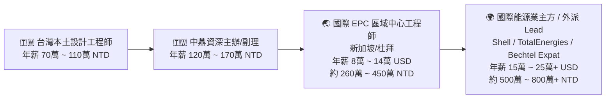
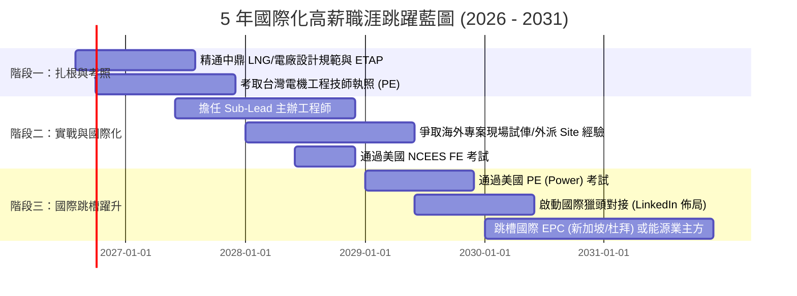

# 🌍 中鼎工程（CTCI）電機設計工程師 ➔ 國際大型能源專案（International Mega-Projects）高薪躍升戰略藍圖

> **個人檔案摘要**：
> - **現任職位**：中鼎工程（CTCI） 電機設計工程師（年資 1 ~ 3 年）
> - **核心專案領域**：LNG 液化天然氣接收站、超低溫儲槽（Cryogenic Storage Tanks）、煤轉氣複循環電廠（CCGT）
> - **終極職涯目標**：突破台灣本土設計低薪天花板，轉向國際一線 EPC 巨頭與全球能源業主方（Supermajors），獲取國際級薪資架構（USD / SGD 計薪、外派津貼、免稅額度），並建立全球通用工程執照背書（台灣 PE + APEC Engineer + 美國 NCEES PE）。

---

## 📑 目錄導覽
1. [[#一、打破薪資天花板：台灣設計低薪真相與國際 EPC 薪酬矩陣|一、打破薪資天花板：台灣設計低薪真相與國際 EPC 薪酬矩陣]]
2. [[#二、中鼎工程（CTCI）作為「國際跳板」的 4 大超強槓桿|二、中鼎工程（CTCI）作為「國際跳板」的 4 大超強槓桿]]
3. [[#三、全球頂級目標雇主與區域樞紐地圖（Employer Landscape）|三、全球頂級目標雇主與區域樞紐地圖（Employer Landscape）]]
4. [[#四、執照全球化槓桿：台灣 PE ➔ APEC Engineer ➔ 美國 NCEES PE 三部曲|四、執照全球化槓桿：台灣 PE ➔ APEC Engineer ➔ 美國 NCEES PE 三部曲]]
5. [[#五、5 年階梯式躍升行動藍圖（2026 ~ 2031 Roadmap）|五、5 年階梯式躍升行動藍圖（2026 ~ 2031 Roadmap）]]
6. [[#六、國際化履歷重塑（STAR 商業價值法）與獵頭佈局|六、國際化履歷重塑（STAR 商業價值法）與獵頭佈局]]

---

## 一、打破薪資天花板：台灣設計低薪真相與國際 EPC 薪酬矩陣

### 1. 為什麼台灣工程顧問/設計薪水有明顯天花板？
- **商業模式本質限制**：台灣本土公共工程與傳統設計顧問多採用「人月成本加成（Cost-Plus）」或「總工程費固定趴數（約 $1.5\% \sim 3\%$）」，設計被業主視為「勞力密集文書作業」，而非「高風險技術承擔者」。
- **代工思維壓縮利潤**：在本土案件中，利潤被土建、設備採購與營造分食，留給電機設計團隊的毛利極其有限。

### 2. 國際大型專案（International Mega-Projects）的薪酬幾何倍增邏輯
國際頂級統包 EPC（如 Bechtel、Fluor、Technip Energies）承攬之專案動輒 **10 億 ～ 100 億美元（USD 1B ~ 10B+）**，其計薪模式與台灣完全不同：
$$\text{總報酬 (Total Comp)} = \text{Base Salary (USD/SGD)} + \text{Expat Uplift (30\% \sim 70\%)} + \text{Site Allowance} + \text{Performance Bonus}$$



---

## 二、中鼎工程（CTCI）作為「國際跳板」的 4 大超強槓桿

中鼎是台灣**極少數真正具備國際大型統包（EPC Turnkey）資歷的跨國工程集團**。身在中鼎，您擁有全台灣工程師最羨慕的 4 大資產，務必在 2~3 年內徹底榨取其價值：

### 1. 國際一線標準規範（Design Codes & Standards）實戰經驗
國際獵頭與外商最看重的是你是否熟悉**超級業主規範（Supermajor Engineering Standards）**：
- **LNG 與防爆特規**：NFPA 59A（LNG 生產儲存規範）、API 620 / 625（低溫儲槽電氣）、IEC 60079 系列（Hazardous Area 防爆區域劃分 Ex d, Ex e, Ex i）。
- **業主標準（Client Specs）**：Shell DEP（Design and Engineering Practice）、Saudi Aramco SAMSS、TotalEnergies GS、ExxonMobil GP。
- **電力系統標準**：IEEE 141 (Red Book), IEEE 399 (Brown Book), IEEE 242 (Buff Book), IEC 60909 (短路電流計算)。

### 2. 重大電力分析軟體全模態建模能力（ETAP / Paladin）
- 在中鼎參與 LNG 儲槽與燃氣電廠，務必爭取親手主導 **ETAP 完整全廠模型建立**：
  - 負載潮流（Load Flow）與變壓器分接頭最佳化
  - 三相與不對稱短路故障分析（Short Circuit IEC 60909 / ANSI）
  - 大型電動機啟動動態模擬（Motor Starting - BOG 壓縮機、高壓海水泵海水啟動）
  - 電驛保護協調（Relay Coordination & Protection TCC 階梯圖）
  - 弧閃危害分析（Arc Flash Assessment IEEE 1584）
  - 諧波失真分析（Harmonic Analysis IEEE 519）

### 3. 跨專業介面整合（Discipline Interface Management）
- 電機與儀控（P&ID、DCS / ESD / SIS 聯鎖邏輯、F&G 氣體與火焰偵測）。
- 電機與製程/機械（BOG 壓縮機變頻驅動 VFD、燃氣渦輪機 GTG 發電機配套、緊急柴油發電機 EDG）。
- 電機與管線/土建（電纜架 Cable Tray 配管佈置、地下接地網 Earthing Grid、陰極防蝕 Cathodic Protection）。

### 4. 爭取海外專案現場輪調（Site Engineering & Commissioning）
- 國際 EPC 最看重的不是「只會坐在辦公室畫 CAD 的繪圖員」，而是**「懂設計 + 懂現場安裝 + 懂通電試俥（Commissioning / SAT / FAT）」的複合型工程師**。
- 主動爭取參與中鼎海外專案（中東卡達/沙烏地、東南亞泰國/越南/馬來西亞、美洲專案）的現場駐點，這將是履歷上最耀眼的黃金跳板！

---

## 三、全球頂級目標雇主與區域樞紐地圖（Employer Landscape）

| 類別 | 代表性頂級企業 | 核心職位名稱 | 薪酬水平與優勢 | 必備門檻 |
| :--- | :--- | :--- | :--- | :--- |
| **頂級全球 EPC 巨頭** | **Bechtel** (美)<br>**Fluor** (美)<br>**Technip Energies** (法)<br>**JGC / Chiyoda** (日)<br>**Worley** (澳)<br>**Saipem** (義) | Senior Electrical Engineer<br>Electrical Package Lead<br>Lead Electrical Systems Specialist | **$90k ~ $160k USD**<br>(外派享 50~100% 津貼 + 免稅)<br>專案規模龐大，全球流動性高 | 3~5 年大型 EPC 經驗、全英文工作能力、熟悉 IEC/IEEE/API |
| **國際能源超級巨頭 (業主方)** | **Shell**<br>**TotalEnergies**<br>**BP**<br>**ExxonMobil**<br>**Saudi Aramco**<br>**Cheniere Energy** (美最大 LNG) | Owner's Electrical Representative<br>Project Electrical Lead<br>Power Systems Specialist | **$120k ~ $220k+ USD**<br>薪酬極高、工作生活平衡佳、掌控專案預算與重大決策 | 5+ 年電廠/LNG 統包設計審查經驗、跨國專案管理力 |
| **全球頂尖專業能源顧問** | **Black & Veatch** (美)<br>**Mott MacDonald** (英)<br>**Arup** (英)<br>**WSP / Golder**<br>**DNV Energy** | Principal Power Consultant<br>Senior Energy Infrastructure Lead | **$80k ~ $140k USD**<br>技術專精、權威諮詢、可遠端/區域中心辦公 | 具備 PE 執照、深厚 ETAP 計算與電網併網分析能力 |

### 🌏 核心跳槽區域樞紐：
1. **新加坡（Singapore）**：亞太能源與 EPC 總部中心（Technip Energies, Worley, Shell, ExxonMobil APAC 總部），離台灣近、低稅率（最高僅 22\%）、全英語環境。
2. **中東（UAE 杜拜/阿布達比、沙烏地阿拉伯）**：全球最大的 LNG 與石化電廠建設重鎮（Aramco, ADNOC），提供極高免稅薪資與完整外派 Package（包住房、機票、家庭醫療、子女教育津貼）。
3. **休士頓（Houston, USA）**：全球能源之都，LNG 出口專案核心（Cheniere, Bechtel, Fluor 總部所在地）。

---

## 四、執照全球化槓桿：台灣 PE ➔ APEC Engineer ➔ 美國 NCEES PE 三部曲

```mermaid
graph TD
    Step1[🥇 第一步：考取「台灣電機工程技師 PE」<br>確立國內最高簽署資格與國家級專業背書] --> Step2[🥈 第二步：註冊「APEC 國際工程師 / IntPE」<br>免試審查換證，獲得亞太經合組織 21 國官方執業互認]
    Step2 --> Step3[🏆 第三步：通過「美國 NCEES PE (Power)」<br>全英文機考，通行全球美商、中東與國際 EPC 的全球黃金金字招牌]
```

### 1. 第一步：取得「台灣電機工程技師執照（PE）」
- **關鍵價值**：中鼎內部升遷加分、外商在台大型專案本地合規負責人必備門檻。
- **備考核心**：6 大考科（電力系統、工業配電、電機機械、電路學、電子學、工程數學），善用本知識庫的 11 年詳解題解進行針對性刷題。

### 2. 第二步：換發「APEC 國際工程師（APEC Engineer）與國際專業工程師（IntPE）」
- **機制**：取得台灣技師執照 + 滿 7 年工程經驗（含 2 年主持重大專案），即可透過**中華民國工程師學會（CIE）**申請，免筆試直接審查認證！
- **價值**：在澳洲、新加坡、日本、馬來西亞、加拿大等 APEC 成員國享有官方認可的工程執業資格。

### 3. 第三步：挑戰「美國 NCEES PE 執照（Electrical: Power）」
- **為什麼國際外商超看重美國 PE？**
  - 在 Bechtel、Fluor、Worley、Aramco 等美系與中東專案中，**美國 PE 是唯一全球公認的高階設計審查授權標誌**。
- **考試流程（台灣考生友善路徑）**：
  1. **FE 考試（Fundamentals of Engineering - Electrical & Computer）**：全英文機考（CBT），多為工數與電學選擇題，通過率高。
  2. **PE 考試（PE Electrical and Computer: Power）**：機考 8 小時，內容完全聚焦於電力系統、保護協調、工業配電與 NEC 規範（與技師考試考科高度重疊！）。
  3. **報名州別推薦**：選擇對外國學歷免 SSN 且允許提前應考之州（如 Texas、Illinois、California）。

---

## 五、5 年階梯式躍升行動藍圖（2026 ~ 2031 Roadmap）



### 📅 詳細執行清單：

#### 🔹 階段一：實力沉澱與執照攻頂（現在 ~ 2 年資，2026 ~ 2027）
1. **中鼎內部**：
   - 深入掌握 $161\text{ kV}/345\text{ kV}$ 變電所單線圖、保護協調（Relay Coordination）、BOG 防爆電氣設計。
   - 建立獨立產出全套 Calculations（短路、壓降、電纜選定、接地電阻、照明、避雷）的能力。
2. **考照任務**：
   - 全力攻克「台灣電機工程技師考試」，拿到國內執照。

#### 🔹 階段二：專案主辦與海外實戰（3 ~ 4 年資，2028 ~ 2029）
1. **中鼎內部**：
   - 爭取升任 **Lead / Sub-Lead Engineer**，負責一個完整 Area/Package 的電氣整合。
   - 積極爭取 3~6 個月以上的**海外現場駐點（Site Construction / Pre-Commissioning）**，掌握現場實務解決能力。
2. **國際認證**：
   - 報名並通過美國 NCEES FE 考試，準備 PE Power 考試。
   - 將英文能力提升至能流利主持海外業主跨國會議（Technical Clarification Meeting）。

#### 🔹 階段三：全面跳槽國際舞台（5 ~ 6 年資，2030 ~ 2031）
1. **求職跳槽目標**：
   - **路徑 A**：透過獵頭直接應聘 **Technip Energies / Worley / Bechtel / JGC** 新加坡或杜拜 Engineering Hub，職級鎖定 Senior Electrical Engineer（年薪 $100k \sim $150k USD）。
   - **路徑 B**：應聘 **Shell / TotalEnergies / Cheniere** 等 LNG 業主方 Electrical Project Lead。
2. **薪資談判戰略**：
   - 善用中鼎的完整 EPC 專案資歷 + 台灣/美國雙 PE 執照，要求國際市場頂標薪酬 Package。

---

## 六、國際化履歷重塑（STAR 商業價值法）與獵頭佈局

在國際獵頭（如 Michael Page, Robert Walters, Hays, NES Fircroft）眼中，平庸工程師與高薪 Lead 的履歷寫法差異巨大：

### 📝 履歷描述升級對照範例：

#### ❌ 平庸工程師寫法（流水帳、無商業價值）：
> "Worked at CTCI as Electrical Design Engineer. Responsible for single-line diagram drawing, cable sizing calculations, and motor starting study for LNG tank project."

#### ⭕ 國際頂級 Lead 寫法（量化成果、標準明確、強調風險控制與高價值）：
> - **Led the complete electrical power distribution & hazardous area design** for a multi-billion NTD LNG Receiving Terminal & CCGT Power Plant project under **NFPA 59A, API 620, and Shell DEP standards**.
> - **Developed high-fidelity 161kV/22.8kV ETAP power system models**, conducting comprehensive short-circuit (IEC 60909), dynamic motor acceleration for critical 4,000kW BOG compressors, and protection coordination across 120+ relay nodes.
> - **Engineered IECEx / ATEX certified explosion-proof electrical systems (Zone 1 / Zone 2)** for cryogenic storage tanks, eliminating design non-conformities and securing 100% first-pass approval from international classification societies.
> - **Collaborated with global EPC vendors (GE, Siemens, Yokogawa)** on electrical-instrumentation package interfaces, mitigating over \$2M USD in potential clash risks during engineering design phases.

---

### 🌐 LinkedIn 關鍵字優化（讓國際獵頭主動敲你）：
在您的 LinkedIn 標題（Headline）與技能（Skills）中，務必精準置入以下**高價值搜尋關鍵字**：
`Electrical Lead Engineer` | `Power Systems Design` | `LNG Receiving Terminal` | `Combined Cycle Power Plant (CCGT)` | `ETAP Simulation` | `Hazardous Area Classification (IECEx/NEC 500)` | `Substation Engineering (161kV/345kV)` | `Protection Coordination` | `EPC Turnkey Projects` | `NFPA 59A / Shell DEP / IEEE Standards` | `Professional Engineer (PE)`
