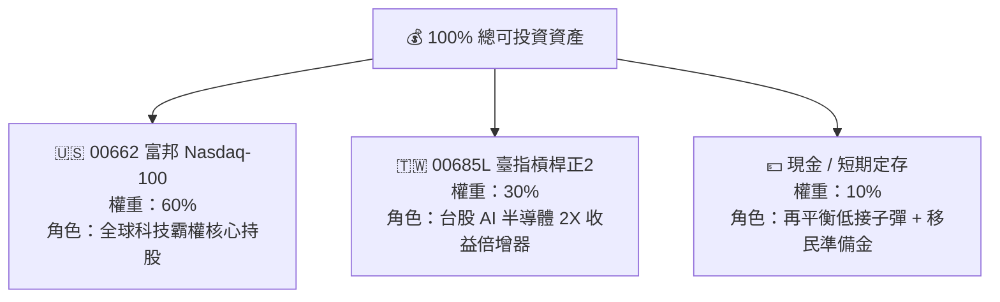
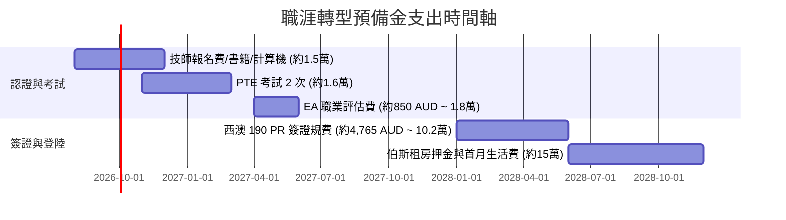

# 📈 電機工程師高階資產配置與動態再平衡戰略藍圖（00662 + 00685L + 現金）

> **投資人現況與投資哲學**：
> - **年齡階段**：25 ~ 32 歲黃金資產積累期（在中鼎工程穩定獲取高現金流，並佈局澳洲高薪轉型）
> - **投資組合架構**：
>   - 🇺🇸 **00662（富邦 NASDAQ-100）**：**60%**（全球 AI 與科技霸權核心引擎）
>   - 🇹🇼 **00685L（群益臺灣加權正 2）**：**30%**（台股半導體供應鏈 2 倍高 Beta 槓桿加速器）
>   - 💵 **現金 / 活存 / 貨幣市場基金**：**10%**（再平衡安全氣囊 + 澳洲認證登陸專屬戰略儲備）
> - **實質股票總曝險（Effective Equity Exposure）**：
>   \text{總曝險} = 60\% \times 1.0 + 30\% \times 2.0 = \mathbf{120\%} \quad (\text{經典輕度槓桿生命週期投資模型}$)$

---

## 📑 目錄導覽
1. [[#一、投資組合底層邏輯與優勢剖析（Why this Portfolio?）|一、投資組合底層邏輯與優勢剖析（Why this Portfolio?）]]
2. [[#二、120% 輕度槓桿生命週期模型（Lifecycle Investing）|二、120% 輕度槓桿生命週期模型（Lifecycle Investing）]]
3. [[#三、3 大「動態再平衡（Rebalancing）」實施指南與 SOP|三、3 大「動態再平衡（Rebalancing）」實施指南與 SOP]]
4. [[#四、正 2 槓桿 ETF 波動耗損（Volatility Drag）的數學化解機制|四、正 2 槓桿 ETF 波動耗損（Volatility Drag）的數學化解機制]]
5. [[#五、職涯里程碑與移民登陸資金鏈對接（Cash Flow Sizing）|五、職涯里程碑與移民登陸資金鏈對接（Cash Flow Sizing）]]
6. [[#六、資產配置試算與月度檢核儀表板|六、資產配置試算與月度檢核儀表板]]

---

## 一、投資組合底層邏輯與優勢剖析（Why this Portfolio?）

### 1. 00662（60\%）：美國科技與 AI 基礎設施巨頭
- **涵蓋成分**：Apple, Microsoft, Nvidia, Alphabet, Amazon, Meta, Broadcom, Tesla 等全球最強科技龍頭。
- **優勢**：擁有全球定價權、極高自由現金流（FCF）與長期 $15\% \sim 20\%$ 年化複合成長潛力，是資產長成參天大樹的「定海神針」。

### 2. 00685L（30\%）：台灣半導體 AI 算力供應鏈槓桿倍增
- **涵蓋核心**：台積電（TSMC）、聯發科、廣達、鴻海、台達電等台股加權指數 2 倍期貨槓桿。
- **優勢**：在多頭趨勢中，正 2 ETF 具備「複利放大效應（Compounding Effect）」。30% 配置即可提供 **60% 的台股實質曝險**，資金利用率極致放大！

### 3. 現金（10\%）：逆向操作的「乾火藥（Dry Powder）」
- 在股市極端回檔時，提供隨時「撈底再平衡」的心理安全感與實質彈藥，避免恐慌殺跌。

---

## 二、120% 輕度槓桿生命週期模型（Lifecycle Investing）

根據耶魯大學教授 Ian Ayres 與 Barry Nalebuff 的經典《生命週期投資法（Lifecycle Investing）》：
* **年輕工程師最大的資產是「人力資本（Human Capital）」**：您未來 30 年在中鼎與澳洲產生的數千萬薪資現金流，本質上就是一張「超穩定的巨額債券」。
* **傳統 100% 現股配置在年輕時往往「曝險不足」**：在資產規模較小（50萬 ~ 500萬）的階段，適度採用 $110\% \sim 130\%$ 的輕度槓桿，能在 10~15 年內將資產幾何級數放大，提早 10 年達成財務自由（FIRE）！

---

## 三、3 大「動態再平衡（Rebalancing）」實施指南與 SOP

動態再平衡是本配置「**低買高賣、紀律化鎖定獲利、消除槓桿下行風險**」的靈魂所在！

### 🛠️ 方案 1：工資現金流智能平準法（最推薦上班族・零交易摩擦）
* **操作方法**：
  - 每個月中鼎發薪時，計算當前三個部位的實際市值。
  - **新投入的資金「只買進當前比例落後於目標」的標的**（例如：本月台股回檔使 00685L 掉到 26\%，則當月薪水全部買 00685L）。
* **優點**：完全不需要賣出獲利部位，**零手續費、零證交稅摩擦成本**，自然達成動態平衡！

---

### 🛠️ 方案 2：動態偏離度再平衡（5/25 容忍區間法則）
每當任一部位的權重偏離目標達 **設定容忍區間** 時，立即手動調整：

| 配置標的 | 目標權重 | 下限觸發點（加碼） | 上限觸發點（停利） | 再平衡操作動作 |
| :--- | :---: | :---: | :---: | :--- |
| **00662 (美股)** | **60%** | **$< 54\%$** | **$> 66\%$** | 若 $>66\%$，賣出超額部分補至 00685L 或現金 |
| **00685L (台股正2)** | **30%** | **$< 24\%$** | **$> 36\%$** | 若 $>36\%$（牛市暴賺），**強制賣出停利至現金**；若 $<24\%$，動用現金低接 |
| **現金 (Cash)** | **10%** | **$< 5\%$** | **$> 15\%$** | 若 $<5\%$，賣出部分獲利股票補足現金；若 $>15\%$，加碼落後股票 |

---

### 🛠️ 方案 3：固定時間週期再平衡（每年兩次）
* **時間點**：每年 **6 月底**（除權息前）與 **12 月底**（年終結算）。
* **做法**：不管市場行情如何，直接打開帳戶計算總資產，無情地將比例精確回調至 **$60 : 30 : 10$**。

---

## 四、正 2 槓桿 ETF 波動耗損（Volatility Drag）的數學化解機制

很多人害怕槓桿 ETF 的「盤整耗損（Beta Decay）」，但在您的配置中，**該風險被 3 重防護完全化解**：

1. **台股加權指數具備「高殖利率與期貨長期正價差（Contango）」優勢**：
   - 00685L 透過台指期貨轉倉，每年享受約 $3\% \sim 4\%$ 的除息點數蒸發紅利（隱形收益），實質抵消大部分管理費與耗損。
2. **00662 的低相關性保護**：
   - 美股科技巨頭（00662）與台股（00685L）雖然同屬科技鏈，但在匯率（美金走強時台幣計價 00662 享匯兌增值）與產業鏈位置上具備互補性。
3. **動態再平衡產生的「波動吸血效應（Shannon's Demon）」**：
   - 透過「大漲賣出正 2、大跌買進正 2」，您實際上在利用市場的劇烈波動賺取額外超額報酬（Alpha）！

---

## 五、職涯里程碑與移民登陸資金鏈對接（Cash Flow Sizing）

您保留的 **10% 現金部位**，正好完美對接未來 2~3 年的「**職涯躍升與西澳 PR 移民落地支出**」，完全不需要在股市低點被迫賤賣資產：

### 💰 總預算需求盤點：
* **第一階段（考照與職業評估）**：約 **NT\$ 50,000 ~ 70,000**（日常薪資即可輕鬆覆蓋）。
* **第二階段（PR 簽證與伯斯登陸初期）**：約 **NT\$ 250,000 ~ 300,000**（由 10% 現金部位隨時撥付）。
* 👉 **股票部位（00662 + 00685L）完全不用動，讓複利在海外工作期間持續滾動！**

---

## 六、資產配置試算與月度檢核儀表板

### 📊 範例資產試算表（以 100 萬總流動資產為例）：

| 投資標的 | 代號 | 目標比例 | 目標金額 | 偏離加碼觸發下限 | 偏離停利觸發上限 |
| :--- | :---: | :---: | :---: | :---: | :---: |
| **富邦 NASDAQ-100** | `00662` | **60%** | **NT\$ 600,000** | NT\$ 540,000 (54%) | NT\$ 660,000 (66%) |
| **群益臺灣加權正 2** | `00685L` | **30%** | **NT\$ 300,000** | NT\$ 240,000 (24%) | NT\$ 360,000 (36%) |
| **流動現金 / 高利活存** | `CASH` | **10%** | **NT\$ 100,000** | NT\$ 50,000 (5%) | NT\$ 150,000 (15%) |
| **總計** | — | **100%** | **NT\$ 1,000,000** | — | — |

---

### 📝 每月 5 分鐘執行 Check-list：
- [ ] 記錄當前 00662、00685L 與現金的市值。
- [ ] 計算當前百分比：`00662 % = 市值 / 總額`, `00685L % = 市值 / 總額`。
- [ ] 本月薪水優先買進百分比最低的標的。
- [ ] 檢查是否有任何標的突破 5/25 偏離上限（若有，執行 15 分鐘無情再平衡！）。
