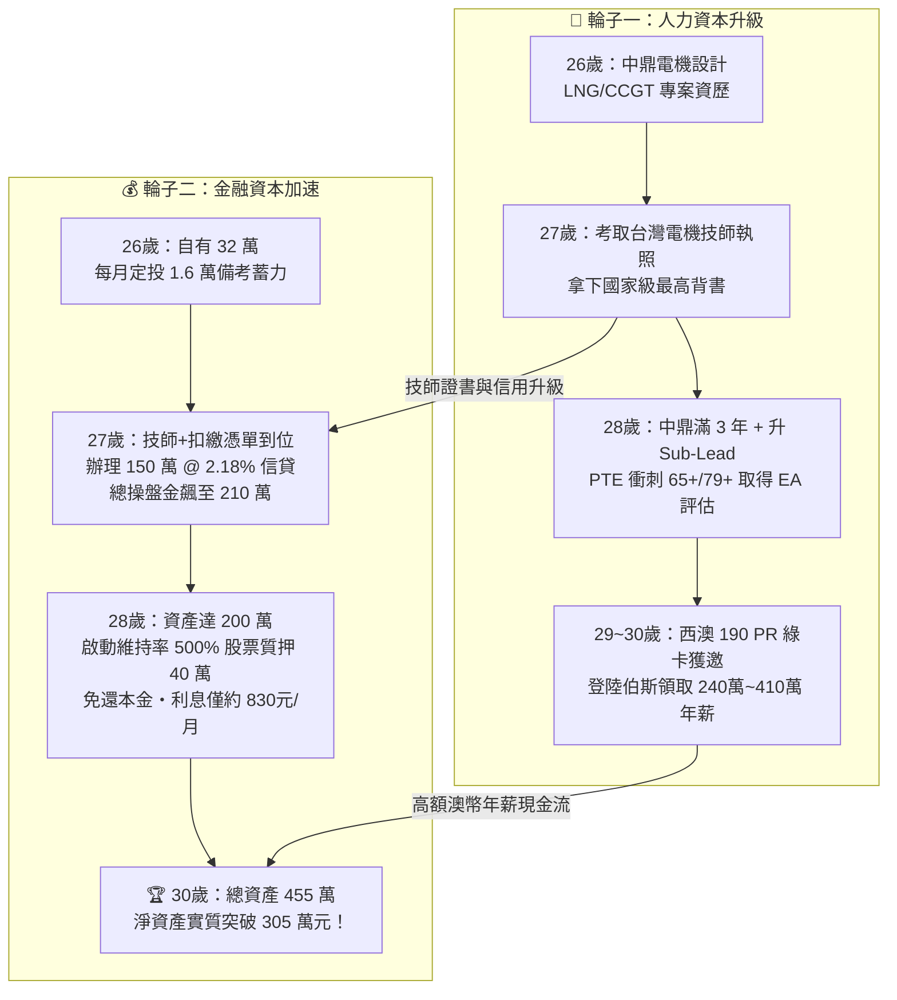
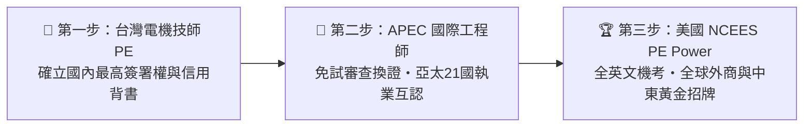
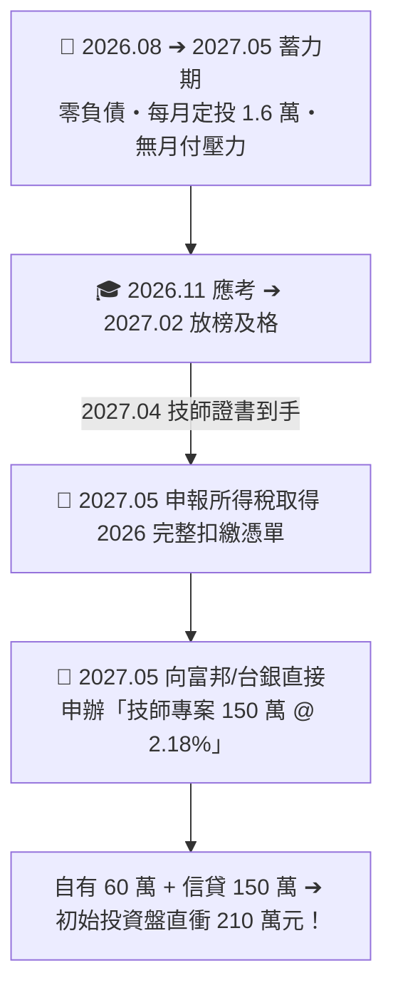
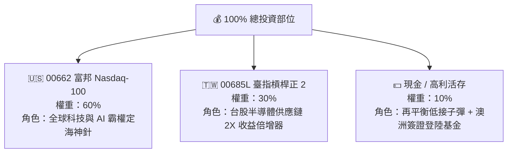
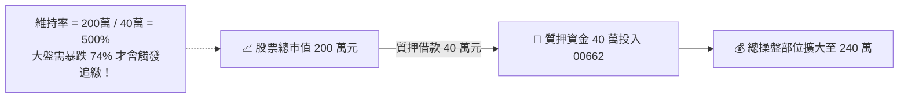
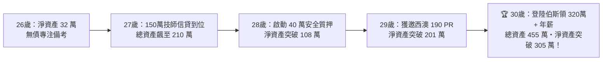

# 🌟 電機工程師「高階職涯躍升 ✕ 信貸質押複利」終極整合戰略總藍圖
## —— 從中鼎電機設計、考取技師、資產質押破 300 萬，到西澳伯斯高薪 PR 永居全綱要

> ### 👑 核心作戰哲學：雙輪驅動模型（The Twin-Engine Flywheel）
> 
> 一個人的階級躍升與財富積累，本質上由兩個輪子互相咬合加速：
> 1. **主動輪（人力資本 Human Capital）**：在中鼎工程深耕 LNG/CCGT 國際級專案資歷 ➔ 考取台灣電機技師執照 ➔ 取得 APEC/美國 PE 國際背書 ➔ 透過技術移民與高薪跳槽西澳伯斯（年薪 $150k ~ $190k AUD，約 320萬 ~ 410萬+ NTD）。
> 2. **從動輪（金融資本 Financial Capital）**：以中鼎穩定薪資與技師信用為擔保 ➔ **2027 年 5 月申辦「150 萬 @ 2.18% 技師地板價信貸」** ➔ 建立 00662 (60%) + 00685L (30%) + 現金 (10%) 輕度槓桿生命週期組合 ➔ 資產達 200 萬時啟動「維持率 500% 超安全股票質押」➔ **30 歲生日前實質淨資產突破 305 萬+，35 歲前邁向千萬資產！**



---

## 📑 目錄導覽
1. [[#一、第一篇：高階職涯躍升與全球執照戰略（2026 ~ 2031）|第一篇：高階職涯躍升與全球執照戰略（2026 ~ 2031）]]
   - 1.1 中鼎工程（CTCI）作為「國際跳板」的 4 大超強槓桿
   - 1.2 執照全球化三部曲（台灣 PE ➔ APEC Engineer ➔ 美國 NCEES PE）
   - 1.3 澳洲西澳（伯斯 Perth）高薪跳槽與 PR 永久居留全攻略
2. [[#二、第二篇：極速資產累積、信貸時機與股票質押配置（2026 ~ 2030）|第二篇：極速資產累積、信貸時機與股票質押配置（2026 ~ 2030）]]
   - 2.1 信貸最佳時機定案：為什麼「2027 年 5 月」全方位碾壓？
   - 2.2 核心資產配置：00662 (60%) + 00685L (30%) + 現金 (10%)
   - 2.3 3 大動態再平衡指南與波動耗損化解機制（Shannon's Demon）
   - 2.4 二階槓桿：資產達 200 萬時啟動「維持率 500% 股票質押」
3. [[#三、第三篇：2026 ~ 2030 職涯 ✕ 財務雙軸階梯式推演表|第三篇：2026 ~ 2030 職涯 ✕ 財務雙軸階梯式推演表]]
4. [[#四、第四篇：全景風控體系與每月執行 SOP 檢查清單|第四篇：全景風控體系與每月執行 SOP 檢查清單]]

---

## 一、第一篇：高階職涯躍升與全球執照戰略（2026 ~ 2031）

### 1.1 中鼎工程（CTCI）作為「國際跳板」的 4 大超強槓桿

中鼎是台灣極少數真正具備國際大型統包（EPC Turnkey）資歷的跨國工程集團。在 2~3 年內，務必徹底榨取其 4 大核心價值：

1. **國際超級業主標準規範（Supermajor Standards）**：
   - **LNG 與儲槽**：NFPA 59A、API 620/625、Shell DEP、TotalEnergies GS。
   - **防爆區域劃分**：IEC 60079 系列（Ex d, Ex e, Ex i, Zone 0/1/2）—— *與澳洲 AS/NZS 60079 幾乎 100% 相同！*
   - **電力系統標準**：IEEE 141/399/242、IEC 60909。
2. **重大電力分析軟體全模態建模能力（ETAP / Paladin）**：
   - 親手主導 161kV/22.8kV 全廠模型：短路計算、馬達動態啟動（4,000kW BOG 壓縮機）、電驛保護協調（TCC 曲線）、弧閃（Arc Flash IEEE 1584）。
3. **跨專業介面整合（Discipline Interface Management）**：
   - 與製程/機械（VFD 變頻驅動、GTG 渦輪發電機、EDG 緊急發電機）及儀控（DCS / ESD / SIS 聯鎖邏輯）進行介面整合。
4. **爭取海外現場駐點（Site Engineering & Commissioning）**：
   - 國際市場最青睞「懂設計 + 懂現場安裝 + 懂通電試俥」的複合型工程師。爭取中東或東南亞專案 3~6 個月現場經驗，履歷含金量翻倍。

---

### 1.2 執照全球化三部曲（台灣 PE ➔ APEC Engineer ➔ 美國 NCEES PE）



* **第一步（2026.11 考取）**：**台灣電機工程技師執照（PE）** ➔ 中鼎內部升遷、信用貸款直攻 2.18% 地板價之鑰。
* **第二步（滿 7 年經驗）**：**APEC 國際工程師（IntPE）** ➔ 透過中華民國工程師學會（CIE）申請，免筆試直接審查換證。
* **第三步（2028 ~ 2029 挑戰）**：**美國 NCEES PE (Power)** ➔ 通過 FE 基礎考試 + PE 電力專業考試（機考 8 小時），考科與台灣技師高度重疊，通行美商與全球 EPC。

---

### 1.3 澳洲西澳（伯斯 Perth）高薪跳槽與 PR 永久居留全攻略

#### 1. 為什麼鎖定西澳首府伯斯（Perth）？
- **全球 LNG 與採礦之都**：Woodside、Chevron Australia（Gorgon/Wheatstone LNG）、BHP、Rio Tinto 總部重鎮。
- **電機工程師極度緊缺**：極度渴望具備「高壓變電所 + 防爆區域劃分 + ETAP」實戰力的設計人才。
- **全澳最高工程師薪資行情**（匯率 1 AUD \approx 21.5 NTD）：
  - **3 ~ 5 年資歷**：**$110k ~ $145k AUD**（約 **236 萬 ~ 310 萬 NTD**）+ 11.5% 退休金。
  - **5 ~ 8 年 Senior Lead**：**$150k ~ $190k AUD**（約 **322 萬 ~ 408 萬 NTD**）。

#### 2. EA 職業評估（華盛頓協定綠色通道）：
- 台灣 IEET 認證之電機學歷符合《華盛頓協定》，**免寫 3 篇繁瑣 CDR 專案論文**，附上學歷與 PTE 成績，4~6 週直出 **ANZSCO 233311: Electrical Engineer** 認證信。

#### 3. 雙軌 PR 移民戰略：
- **軌道 A（西澳 190 PR 州擔保）**：
  - EOI 打分自評（25~32歲滿分 30分 + 學士/碩士 15分 + 海外3年中鼎經驗 5分 + 單身 10分 + PTE 65/79分 10/20分 + 州擔保 5分）= **75 ~ 85 分（秒獲邀永久居留綠卡！）**。
- **軌道 B（澳洲雇主擔保 482 轉 186）**：
  - 累積滿 2~3 年資歷後，透過 **SEEK Australia** 及伯斯頂尖能源獵頭（**NES Fircroft, Hays, Michael Page**）直接面試 Worley / Aurecon / GHD 等大廠。

---

## 二、第二篇：極速資產累積、信貸時機與股票質押配置（2026 ~ 2030）

### 2.1 信貸最佳時機定案：為什麼「2027 年 5 月」全方位碾壓？

> 💡 **核心決策結論（方案 B 確定）**：
> **「現在（2026.08 ~ 2027.05）全力備考衝刺，不申辦樂天 3.08% 信貸；待 2027 年 5 月技師及格證書 + 完整 2026 年扣繳憑單出爐，直接申辦『150 萬元 @ 2.18% 技師專案地板價信貸』！」**



* **過渡期蓄力（9 個月）**：現有 32 萬 + 每月 1.6 萬定投（累計 14.4 萬）+ 2027 年初中鼎年終 12 萬 ➔ **2027 年 5 月自有資金自然累積至 60 ~ 65 萬元**。
* **150 萬信貸參數**：額度 150 萬、利率 2.20%、120 期（10 年本息均攤），每月月付金僅 **NT\$ 13,940 元**，中鼎薪資可極輕鬆覆蓋！

---

### 2.2 核心資產配置：00662 (60%) + 00685L (30%) + 現金 (10%)



* **實質股票總曝險**：
  $$\text{總曝險} = 60\% \times 1.0 + 30\% \times 2.0 = \mathbf{120\%} \quad (\text{經典輕度槓桿生命週期模型})$$
* **預期年化報酬率（CAGR）**：
  $$R_{portfolio} = 0.6 \times (13\%) + 0.3 \times (20\%) + 0.1 \times (1.5\%) = \mathbf{13.95\% \approx 14.0\%}$$
* **超額淨利差（Positive Carry）**：
  $$\text{每年淨利差} = 14.0\% - 2.18\% = \mathbf{+11.82\% / \text{年}}$$
  *150 萬信貸每年平均為您產生超過 **NT\$ 17.7 萬元** 的超額資本增值！*

---

### 2.3 3 大動態再平衡指南與波動耗損化解機制

1. **工資現金流智能平準法（每月發薪日・零摩擦）**：
   - 每月發薪時，計算各部位市值，**新投入資金只買進當前比例落後的標的**，免賣股、零手續費與證交稅。
2. **5/25 偏離度再平衡法則（極端行情觸發）**：
   - 當 **00685L $> 36\%$**（大牛市暴賺）：強制賣出超額獲利部位停利至現金。
   - 當 **00685L $< 24\%$**（崩跌熊市）：動用 10% 現金儲備進場低接撿便宜。
3. **波動吸血效應（Shannon's Demon）**：
   - 透過「大漲賣出正 2、大跌買進正 2」，不僅徹底消除正 2 ETF 震盪耗損，更反向將市場波動轉化為額外超額報酬（Alpha）！

---

### 2.4 二階槓桿：資產達 200 萬時啟動「維持率 500% 股票質押」

當資產在 2028 年成長突破 **180 萬 ～ 200 萬** 時，線上開通券商**「股票質押借貸（不限用途款項借貸）」**：



* **質押借款金額**：**NT\$ 400,000 元**（利率約 **2.5% ~ 2.8%**）。
* **極致還款優勢**：**只繳利息、免還本金！** 40 萬借款每月利息僅約 **NT\$ 830 ~ 930 元**，半年線上點選展延（借新還舊）即可無限期滾動。
* **絕對安全防線（維持率 500\%）**：
  $$\text{維持率} = \frac{2,000,000}{400,000} \times 100\% = \mathbf{500\%}$$
  *(法規追繳線為 130\%，代表大盤必須**崩盤暴跌超過 74%** 才會被追繳，安全性堅不可摧！)*

---

## 三、第三篇：2026 ~ 2030 職涯 ✕ 財務雙軸階梯式推演表

> ### 📊 4 年雙軸階梯式推演矩陣（Year-by-Year Simulation）
> 
> *計算基準：2027年5月總資產達 210 萬（自有60萬+信貸150萬），年化報酬率取 $13.5\%$，28歲質押 40 萬，信貸負債逐年本息均攤遞減。*

| 時間 / 年齡 | 職涯與移民重大進展 | 股票與現金總市值 (Gross) | 信貸負債本金 | 質押借款負債 | 實質淨資產 (Net Worth) | 財務自由進度 |
| :--- | :--- | :---: | :---: | :---: | :---: | :---: |
| **2026.08 (26歲)** | 中鼎深耕 LNG/CCGT、衝刺 11 月技師大考 | **NT\$ 32 萬** | NT\$ 0 萬 | NT\$ 0 萬 | **NT\$ 32 萬** | 備考蓄力期 |
| **2027.05 (27歲)** | 考取電機技師、辦理 150 萬 @ 2.18% 信貸大合體 | **NT\$ 210 萬** | NT\$ 150 萬 | NT\$ 0 萬 | **NT\$ 60 萬** | 種子基金爆發 |
| **2028.05 (28歲)** | 中鼎滿 3 年升 Sub-Lead、PTE 衝刺、啟動 40 萬質押 | **NT\$ 285 萬** | NT\$ 137 萬 | NT\$ 40 萬 | **NT\$ 108 萬** | 淨資產破百萬 |
| **2029.05 (29歲)** | 遞交西澳 190 EOI、獲邀 PR 綠卡、準備登陸伯斯 | **NT\$ 365 萬** | NT\$ 124 萬 | NT\$ 40 萬 | **NT\$ 201 萬** | 淨資產破 200 萬 |
| **2030.05 (30歲)** | **登陸伯斯入職 Senior Lead、領取 320萬+ 年薪** | **🏆 NT\$ 455 萬** | NT\$ 110 萬 | NT\$ 40 萬 | **🎉 NT\$ 305 萬** | **30歲突破三百萬！** |



---

## 四、第四篇：全景風控體系與每月執行 SOP 檢查清單

### 4.1 極端熊市 3 重安全氣囊（Safety Net）

1. **第一重：本業現金流護城河**：中鼎工程與未來西澳工作薪資穩定，信貸月付 13,940 元與質押利息 830 元佔薪水比例極低，永遠無斷供風險。
2. **第二重：10% 現金緩衝彈藥**：遇股市大跌，不只不停損，還能用現金在底部加碼 00685L 正 2。
3. **第三重：質押 3 級警戒機制**：
   - 🟢 **安全區（維持率 $\ge 300\%$）**：正常生活，享受複利。
   - 🟡 **注意區（維持率 $200\% \sim 300\%$）**：暫停新增借款。
   - 🔴 **警戒區（維持率 $< 200\%$）**：動用備用金直接償還部分質押本金，將維持率拉回 $300\%$ 以上。

---

### 4.2 每月 5 分鐘極簡執行 SOP 檢核表

```markdown
- [ ] **每月發薪日（中鼎發薪）**：
  - [ ] 自動扣繳技師信貸本息（2027.05 後約 13,940 元）。
  - [ ] 扣除生活費後，將剩餘薪資依照「工資平準法」買進比例落後的標的（00662 或 00685L）。
  - [ ] 檢查高利活存帳戶是否維持在總資產的 10%（澳洲簽證與登陸基金）。

- [ ] **每年 6 月與 12 月（半年定期檢核）**：
  - [ ] 檢視 00662 : 00685L : 現金 比例是否維持在 60 : 30 : 10。
  - [ ] 年終獎金扣除紅包開銷後，全額打入投資盤。
  - [ ] 質押利息自動扣繳確認，並線上點選半年展延。

- [ ] **重大里程碑檢核點**：
  - [ ] 2026.11：全力通過台灣電機工程技師筆試。
  - [ ] 2027.02 ~ 05：取得技師證書與扣繳憑單，辦理 150 萬 @ 2.18% 貸款。
  - [ ] 2027.06 ~ 2028.06：PTE 衝分（目標 65+/79+）、申請 EA 華盛頓協定認證。
  - [ ] 2028.06 ~ 2029.12：遞交西澳 190 EOI 州擔保、面試伯斯外商、登陸澳洲！
```

---

> 🎯 **導師最後叮嚀**：
> 戰略已經完全清晰，路徑已徹底打通。**現在到 2026 年 11 月最重要、最核心的唯一任務，就是把所有心思放在技師考古題上，一舉拿下電機技師執照！** 執照到手之日，就是全套資產與職涯核彈級引擎全面點火之時！
