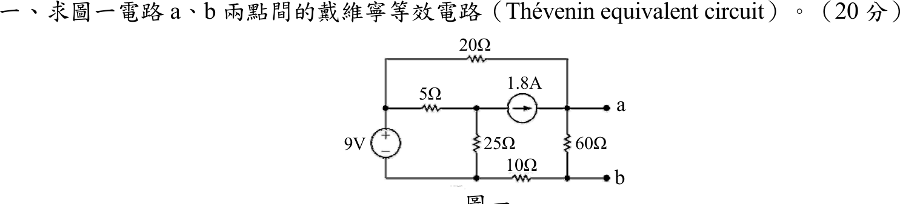
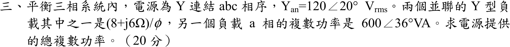
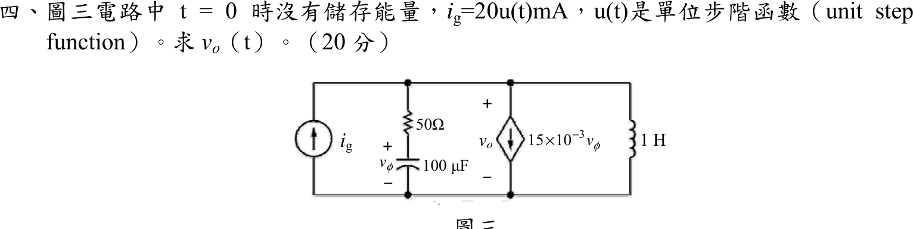

# 📝 104 年電機工程技師｜電路學逐題詳解

> 本頁由題級 canonical 筆記組合；每題保留官方裁切圖、校驗狀態與可追溯的推導。

## 題目導覽
- [[#一、104 年電路學第 1 題｜橋接電路戴維寧等效|第 1 題：橋接電路戴維寧等效]]
- [[#二、104 年電路學第 2 題｜互感耦合電路與純電阻輸入阻抗|第 2 題：互感耦合電路與純電阻輸入阻抗]]
- [[#三、104 年電路學第 3 題｜三相 Y 接並聯負載複數功率|第 3 題：三相 Y 接並聯負載複數功率]]
- [[#四、104 年電路學第 4 題｜相依源 RLC 二階暫態|第 4 題：相依源 RLC 二階暫態]]
- [[#五、104 年電路學第 5 題｜雙埠網路逆混合 g 參數|第 5 題：雙埠網路逆混合 g 參數]]

---

## 一、104 年電路學第 1 題｜橋接電路戴維寧等效

> 題級識別：EE-104-01-1
> canonical 來源：[[canonical/EE-104-01-1.md]]
> 題級校驗狀態：verified

### 已知與所求

$9\ \mathrm V$ 源（上正下負）左側；上方 $20\ \Omega$ 接 $9\ \mathrm V$ 正端至 $a$ 端節點；$5\ \Omega$ 接 $9\ \mathrm V$ 正端至中節點，中節點經 $25\ \Omega$ 接 $9\ \mathrm V$ 負端、並經 $1.8\ \mathrm A$ 電流源（向右）接 $a$ 節點；$60\ \Omega$ 接 $a$ 與 $b$ 節點；$10\ \Omega$ 接 $9\ \mathrm V$ 負端與 $b$ 節點。求 $a$–$b$ 的戴維寧等效電路（20 分）。

### 考場標準作答

#### 開路電壓 $V_{th}$

以 $9\ \mathrm V$ 負端為地。中節點 $V_c$ 的 KCL：

$$
\frac{9-V_c}{5}=\frac{V_c}{25}+1.8\ \Rightarrow\ 1.8-0.2V_c=0.04V_c+1.8\ \Rightarrow\ V_c=0
$$

$a$ 節點（$60\ \Omega$ 與 $10\ \Omega$ 串聯入地，故 $V_b=V_a/7$）：

$$
1.8 + \frac{9-V_a}{20}=\frac{V_a-V_b}{60}=\frac{V_a}{70}\ \Rightarrow\ 2.25=\frac{9V_a}{140}\ \Rightarrow\ V_a=35\ \mathrm V,\ V_b=5\ \mathrm V
$$

$$
\boxed{V_{th}=V_a-V_b=30\ \mathrm V}\quad(a\text{ 為正})
$$

#### 等效電阻 $R_{th}$

$9\ \mathrm V$ 短路、$1.8\ \mathrm A$ 開路，$5\ \Omega$、$25\ \Omega$ 與外部無通路；$a$ 到 $b$ 為 $60\ \Omega$ 並聯 $(20+10)\ \Omega$：

$$
\boxed{R_{th}=60\parallel30=20\ \Omega}
$$

戴維寧等效：$30\ \mathrm V$ 串聯 $20\ \Omega$，$a$ 端為正。

### 驗算

重疊定理。僅 $9\ \mathrm V$ 作用（電流源開路）：外迴路 $20+60+10=90\ \Omega$，電流 $0.1\ \mathrm A$，$60\ \Omega$ 端電壓 $6\ \mathrm V$。僅 $1.8\ \mathrm A$ 作用（$9\ \mathrm V$ 短路）：電流由 $a$ 出發，經 $20\ \Omega$ 直接回地，或經 $60+10=70\ \Omega$ 回地，流過 $60\ \Omega$ 的分流 $1.8\times\dfrac{20}{20+70}=0.4\ \mathrm A$，端電壓 $24\ \mathrm V$。相加 $6+24=30\ \mathrm V$。

### 失分點

- 電流源單獨作用時，$5\ \Omega$ 與 $25\ \Omega$ 並聯為電流源的返回路徑，電流必經 $20\ \Omega$ 或 $60+10\ \Omega$ 回到地，不是只流經 $60+30$。
- $10\ \Omega$ 在 $b$ 端下方的主線上，$V_{th}$ 取 $V_a-V_b$（$35-5$），不是 $V_a$。
- 求 $R_{th}$ 時電流源開路、電壓源短路；漏掉 $10\ \Omega$ 會得 $60\parallel20=15\ \Omega$。

---

## 二、104 年電路學第 2 題｜互感耦合電路與純電阻輸入阻抗

> 題級識別：EE-104-01-2
> canonical 來源：[[canonical/EE-104-01-2.md]]
> 題級校驗狀態：verified

### 已知與所求

$\omega=4000\ \mathrm{rad/s}$。一次側：$a$ 端串 $20\ \Omega$ 接 $L_1=12.5\ \mathrm{mH}$（點在上端）；二次側：$L_2=8\ \mathrm{mH}$ 串 $5\ \Omega$ 與 $C=12.5\ \mu\mathrm F$；耦合係數 $k$。求使 $Z_{ab}$ 為實數的 $k$（20 分）。

### 考場標準作答

$$
\omega L_1=50\ \Omega,\quad \omega L_2=32\ \Omega,\quad \frac{1}{\omega C}=20\ \Omega
$$

二次側迴路阻抗 $Z_{22}=5+j32-j20=5+j12\ \Omega$。一次側看入（反射阻抗與互感極性無關，因 $(j\omega M)^2$ 項）：

$$
Z_{ab}=20+j50+\frac{(\omega M)^2}{5+j12}
=20+\frac{5(\omega M)^2}{169}+j\left[50-\frac{12(\omega M)^2}{169}\right]
$$

令虛部為零：$(\omega M)^2=\dfrac{50\cdot169}{12}=704.17\ \Omega^2$，$\omega M=26.54\ \Omega$，$M=6.634\ \mathrm{mH}$。

$$
\boxed{k=\frac{M}{\sqrt{L_1L_2}}=\frac{6.634}{\sqrt{12.5\times8}}=\frac{13}{8\sqrt6}\approx0.6634}
$$

$0<k\le1$，合理。

### 驗算

代回 $k^2=169/384$：$(\omega M)^2=k^2(\omega L_1)(\omega L_2)=\tfrac{169}{384}(50)(32)=704.17$，$\mathrm{Im}\,Z_{ab}=50-\tfrac{12(704.17)}{169}=0$，$Z_{ab}=20+5(704.17)/169=40.83\ \Omega$（純電阻）。

### 失分點

- 二次側含電容，$Z_{22}=5+j(32-20)$，不是 $5+j32$；漏掉 $-j20$ 會得 $(\omega M)^2\approx1639$，$k>1$ 不合理。
- 反射阻抗為 $(\omega M)^2/Z_{22}$，要有理化後才能分出實、虛部，且 $M=k\sqrt{L_1L_2}$ 要換算回 $k$。

---

## 三、104 年電路學第 3 題｜三相 Y 接並聯負載複數功率

> 題級識別：EE-104-01-3
> canonical 來源：[[canonical/EE-104-01-3.md]]
> 題級校驗狀態：verified

### 已知與所求

平衡三相，Y 接電源，$abc$ 相序，$V_{an}=120\angle20^\circ\ \mathrm{V_{rms}}$（裁切圖印作 $Y_{an}$，依文意為相電壓 $V_{an}$）。兩個並聯 Y 型負載：負載 1 每相 $(8+j6)\ \Omega$；負載 2 的 $a$ 相複數功率為 $600\angle36^\circ\ \mathrm{VA}$。求電源提供的總複數功率（20 分）。

### 考場標準作答

負載 1 每相：

$$
S_{1\phi}=\frac{|V_{an}|^2}{Z_1^*}=\frac{120^2}{8-j6}=\frac{14400(8+j6)}{100}=1152+j864\ \mathrm{VA}
$$

負載 2 每相 $S_{2\phi}=600\angle36^\circ=485.41+j352.67\ \mathrm{VA}$。平衡系統三相功率為單相的 3 倍：

$$
S_T=3(S_{1\phi}+S_{2\phi})=3(1637.41+j1216.67)
$$

$$
\boxed{S_T=4912.23+j3650.01\ \mathrm{VA}=6.12\angle36.61^\circ\ \mathrm{kVA}}
$$

即 $P_T=4.912\ \mathrm{kW}$、$Q_T=3.650\ \mathrm{kvar}$（感性）。

### 驗算

改用電流：負載 1 電流 $\dfrac{120\angle20^\circ}{10\angle36.87^\circ}=12\angle-16.87^\circ\ \mathrm A$；負載 2 電流大小 $600/120=5\ \mathrm A$，角度 $20^\circ-36^\circ=-16^\circ$。$I_a=12\angle-16.87^\circ+5\angle-16^\circ=17.00\angle-16.61^\circ\ \mathrm A$，$S_T=3V_{an}I_a^*=3(120)(17.00)\angle36.61^\circ=6.12\angle36.61^\circ\ \mathrm{kVA}$，與上式相同。

### 失分點

- 題目所給是「$a$ 相」複數功率，電源總功率必須乘 3，不能只加單相。
- 複數功率用 $S=V^2/Z^*$（共軛），不是 $V^2/Z$；後者會使 $Q$ 變負。

---

## 四、104 年電路學第 4 題｜相依源 RLC 二階暫態

> 題級識別：EE-104-01-4
> canonical 來源：[[canonical/EE-104-01-4.md]]
> 題級校驗狀態：verified

### 已知與所求

$t=0$ 無儲能，$i_g=20u(t)\ \mathrm{mA}$（向上注入頂節點）。頂節點對地並聯四支路：$i_g$；$50\ \Omega$ 串 $100\ \mu\mathrm F$（電容電壓 $v_\phi$，上正）；相依電流源 $15\times10^{-3}v_\phi$（向下）；$1\ \mathrm H$ 電感。$v_o$ 為頂節點對地電壓（上正）。求 $v_o(t)$（20 分）。

### 考場標準作答

在 $s$ 域，$I_g=\dfrac{0.02}{s}$。$RC$ 支路導納 $Y_{RC}=\dfrac{1}{50+\frac{1}{sC}}=\dfrac{sC}{1+50sC}$，且 $V_\phi=\dfrac{V_o}{1+50sC}$（分壓），$C=10^{-4}\ \mathrm F$，$50C=0.005$：

$$
Y_{RC}=\frac{0.02s}{s+200},\qquad
\text{相依源電流}=0.015V_\phi=\frac{3}{s+200}V_o,\qquad
Y_L=\frac{1}{s}
$$

頂節點 KCL：

$$
\frac{0.02}{s}=V_o\left[\frac{0.02s+3}{s+200}+\frac1s\right]
=V_o\,\frac{0.02(s+100)^2}{s(s+200)}
$$

$$
V_o(s)=\frac{s+200}{(s+100)^2}=\frac{1}{s+100}+\frac{100}{(s+100)^2}
$$

$$
\boxed{v_o(t)=(1+100t)e^{-100t}\,u(t)\ \mathrm V}
$$

特徵式 $(s+100)^2$ 為重根，屬臨界阻尼。

### 驗算

初值：$t=0^+$ 電容短路，$v_\phi=0$，相依源為 $0$，電感電流為 $0$，$20\ \mathrm{mA}$ 全經 $50\ \Omega$，$v_o(0^+)=1\ \mathrm V$，與 $(1+0)e^0=1$ 一致。終值：$t\to\infty$ 電感短路，$v_o\to0$，與 $e^{-100t}$ 衰減一致。

### 失分點

- 相依源電流 $0.015v_\phi$ 受電容電壓 $v_\phi$ 控制，而非 $v_o$；須先以分壓關係 $V_\phi=V_o/(1+0.005s)$ 換成 $V_o$。
- 分母展開後為 $0.02(s+100)^2$（$s^2+200s+10000$），重根；若誤得兩相異根會寫成雙指數。

---

## 五、104 年電路學第 5 題｜雙埠網路逆混合 g 參數

> 題級識別：EE-104-01-5
> canonical 來源：[[canonical/EE-104-01-5.md]]
> 題級校驗狀態：verified

### 已知與所求

埠 1：$V_1$、$I_1$（向右流入），串聯 $20\ \Omega$ 與 $j10\ \Omega$ 到中間節點 $P$；$P$ 對地為相依電壓源 $100I_2$（上正）；$P$ 與輸出節點 $Q$ 間 $500\ \Omega$；$Q$ 對地並聯 $-j50\ \Omega$；埠 2：$V_2$ 在 $Q$、$I_2$ 向左流入 $Q$。求 $I_1=g_{11}V_1+g_{12}I_2$、$V_2=g_{21}V_1+g_{22}I_2$ 的 $g$ 參數（20 分）。

### 考場標準作答

相依源固定 $V_P=100I_2$。

輸入迴路：$V_1=(20+j10)I_1+100I_2$，即

$$
I_1=\frac{1}{20+j10}V_1-\frac{100}{20+j10}I_2
$$

$$
\boxed{g_{11}=\frac{1}{20+j10}=0.04 - j0.02\ \mathrm S},\qquad
\boxed{g_{12}=\frac{-100}{20+j10}=-4+j2}
$$

輸出節點 $Q$ KCL（$I_2$ 流入）：

$$
I_2=\frac{V_2}{-j50}+\frac{V_2-100I_2}{500}\ \Rightarrow\ 1.2I_2=(0.002+j0.02)V_2
$$

$V_2$ 與 $V_1$ 無關，故

$$
\boxed{g_{21}=0},\qquad
\boxed{g_{22}=\frac{1.2}{0.002+j0.02}=\frac{600}{1+j10}=\frac{600}{101}-j\frac{6000}{101}\approx5.94-j59.41\ \Omega}
$$

### 驗算

依定義測試：$I_2=0$（埠 2 開路）時 $V_P=0$，$I_1=V_1/(20+j10)$，$g_{11}$ 成立，且輸出端無激勵故 $V_2=0$，$g_{21}=0$；$V_1=0$、注入 $I_2=1\ \mathrm A$ 時 $V_P=100$，$I_1=-100/(20+j10)$ 即 $g_{12}$，並由 $V_2=g_{22}$ 得 $5.94-j59.41\ \Omega$。單位：$g_{11}$ 為 S、$g_{22}$ 為 $\Omega$、$g_{12}$、$g_{21}$ 無單位。

### 失分點

- $g$ 參數的混合單位：$g_{12}$、$g_{21}$ 無單位，$g_{11}$ 單位 S，$g_{22}$ 單位 $\Omega$。
- 相依源 $100I_2$ 使 $V_P$ 與 $I_1$ 無關，$g_{21}$ 為 $0$；不要以為 $V_1$ 會影響埠 2。
- $g_{22}$ 的輸出節點 KCL 要包含相依源造成的 $-0.2I_2$ 項，漏掉會得 $1/(0.002+j0.02)$ 而非乘 $1.2$。

---
