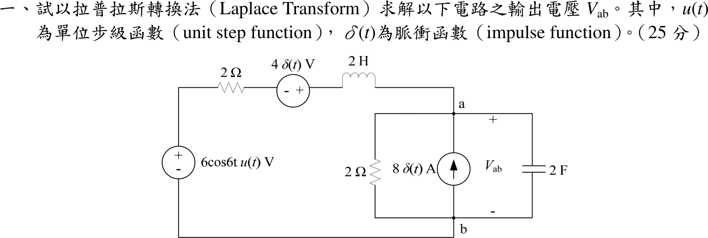
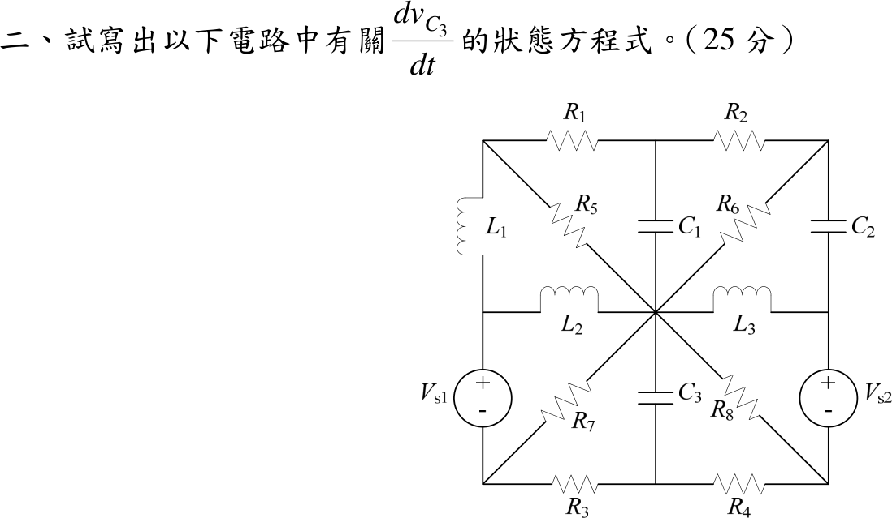
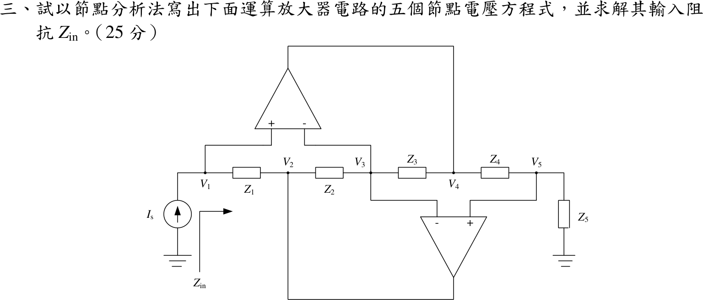

# 📝 106 年電機工程技師｜電路學逐題詳解

> 本頁由題級 canonical 筆記組合；每題保留官方裁切圖、校驗狀態與可追溯的推導。

## 題目導覽
- [[#一、106 年電路學第 1 題|第 1 題：106 年電路學第 1 題]]
- [[#二、106 年電路學第 2 題｜\(dv_{C3}/dt\) 完整狀態方程式|第 2 題：\(dv_{C3}/dt\) 完整狀態方程式]]
- [[#三、106 年電路學第 3 題|第 3 題：106 年電路學第 3 題]]
- [[#四、106 年電路學第 4 題｜對稱與反對稱分析|第 4 題：對稱與反對稱分析]]

---

## 一、106 年電路學第 1 題

> 題級識別：EE-106-01-1
> canonical 來源：[[canonical/EE-106-01-1.md]]
> 題級校驗狀態：verified

### 已知與所求

由 \(b\) 沿左側串聯支路到 \(a\)：電壓源 \(6\cos6t\,u(t)\ \mathrm V\)（上正）、\(2\ \Omega\)、\(4\delta(t)\ \mathrm V\) 源（左負右正）、\(L=2\ \mathrm H\)；\(a\)–\(b\) 間並聯 \(2\ \Omega\)、向上注入 \(a\) 的 \(8\delta(t)\ \mathrm A\) 源與 \(C=2\ \mathrm F\)，\(V_{ab}\) 以 \(a\) 為正。以拉氏轉換求 \(V_{ab}\)（25 分）。

### 考場標準作答

取零初始狀態。串聯支路的等效電動勢與阻抗：
\[
V_s(s)=\frac{6s}{s^2+36}+4,\qquad Z_s=2+2s
\]
節點 \(a\) 的 KCL（\(2\ \mathrm F\Rightarrow 2s\) 導納）：
\[
\frac{V_s-V_{ab}}{2(1+s)}+8=\frac{V_{ab}}{2}+2sV_{ab}
\]
同乘 \(2(1+s)\)：\(V_{ab}\bigl[1+(1+s)+4s(1+s)\bigr]=V_s+16(1+s)\)，
\[
\boxed{V_{ab}(s)=\frac{16s+20+\dfrac{6s}{s^2+36}}{4s^2+5s+2}
=\frac{16s^3+20s^2+582s+720}{(4s^2+5s+2)(s^2+36)}}
\]
部分分式（\(4s^2+5s+2=4[(s+\tfrac58)^2+\tfrac7{64}]\)，極點 \(-\tfrac58\pm j\tfrac{\sqrt7}{8}\)）：
\[
V_{ab}(s)=\frac{-213s+270}{5266(s^2+36)}+\frac{85108s+105305}{5266(4s^2+5s+2)}
\]
反轉換：
\[
\boxed{v_{ab}(t)=\Bigl\{e^{-5t/8}\Bigl[4.0404\cos\tfrac{\sqrt7}{8}t+7.4807\sin\tfrac{\sqrt7}{8}t\Bigr]-0.04045\cos6t+0.00855\sin6t\Bigr\}u(t)\ \mathrm V}
\]
（暫態係數精確值 \(\tfrac{148939}{36862}\)、\(\tfrac{104225\sqrt7}{36862}\)；強迫響應 \(\tfrac{45\sin6t-213\cos6t}{5266}\)。）

### 驗算

- 初值定理：\(v_{ab}(0^+)=\lim_{s\to\infty}sV_{ab}(s)=\dfrac{16}{4}=4\ \mathrm V\)；直接看電容：\(8\delta\) 注入 \(C=2\ \mathrm F\)，\(v_C(0^+)=8/2=4\ \mathrm V\)；時域式 \(4.0404-0.0404=4.000\) 吻合。
- 強迫響應用相量：\(\omega=6\)，\(\mathbf V=\dfrac{6/(2+j12)}{1/(2+j12)+0.5+j12}=-0.04045-j0.00855\)，即 \(-0.04045\cos6t+0.00855\sin6t\)，與反轉換的穩態項相同。

### 失分點

- \(4\delta(t)\) 源的極性（左負右正）與 \(6\cos6t\,u(t)\) 同向相加，\(V_s\) 的 \(+4\) 不可寫成 \(-4\)。
- 兩個脈衝源在零初始狀態下只造成初值跳變（\(i_L(0^+)=2\ \mathrm A\)、\(v_C(0^+)=4\ \mathrm V\)），分子的 \(16s+16\) 來自 \(8\delta\)（乘以 \(2(1+s)\)），\(+4\) 來自 \(4\delta\)，不可漏掉 \(16s\) 這一項。
- 結果要乘 \(u(t)\)，\(t<0\) 時 \(v_{ab}=0\)。

### 條件與疑義

題幹未給初始條件，取 \(i_L(0^-)=0\)、\(v_C(0^-)=0\)（拉氏轉換題的慣例）。若另有初值，需在 \(s\) 域加上 \(Li_L(0^-)\) 串聯電壓源與 \(Cv_C(0^-)\) 並聯電流源。

---

## 二、106 年電路學第 2 題｜\(dv_{C3}/dt\) 完整狀態方程式

> 題級識別：EE-106-01-2
> canonical 來源：[[canonical/EE-106-01-2.md]]
> 題級校驗狀態：verified

### 已知與所求

中央節點 \(O\) 是 \(R_5,R_6,R_7,R_8,L_2,L_3\) 與 \(C_1,C_3\) 的共同端。外圈：\(TL\)–\(R_1\)–\(TM\)–\(R_2\)–\(TR\)；\(TL\)–\(L_1\)–\(ML\)；\(TR\)–\(C_2\)–\(MR\)；\(ML\)–\(V_{s1}\)（上正）–\(BL\)；\(MR\)–\(V_{s2}\)（上正）–\(BR\)；\(BL\)–\(R_3\)–\(BM\)–\(R_4\)–\(BR\)。其餘：\(R_5\)：\(TL\)–\(O\)；\(C_1\)：\(TM\)–\(O\)；\(R_6\)：\(TR\)–\(O\)；\(L_2\)：\(ML\)–\(O\)；\(L_3\)：\(O\)–\(MR\)；\(R_7\)：\(BL\)–\(O\)；\(C_3\)：\(O\)–\(BM\)；\(R_8\)：\(O\)–\(BR\)。求 \(dv_{C3}/dt\) 的狀態方程式（25 分）。

### 考場標準作答

**狀態量方向**（題圖未標示，自行定義；改變方向只改變各項正負號）：\(O\) 為參考地，\(v_{C1}=V_{TM}\)、\(v_{C2}=V_{TR}-V_{MR}\)、\(v_{C3}=V_O-V_{BM}=-V_{BM}\)；\(i_{L1}\) 由 \(TL\to ML\)，\(i_{L2}\) 由 \(ML\to O\)，\(i_{L3}\) 由 \(O\to MR\)。

**1. 左側（\(BL\) 節點）**：\(V_{s1}\) 支路向下電流為 \(i_{L1}-i_{L2}\)：
\[
i_{L1}-i_{L2}=\frac{V_{BL}}{R_7}+\frac{V_{BL}+v_{C3}}{R_3}
\ \Rightarrow\
V_{BL}=\frac{R_3R_7(i_{L1}-i_{L2})-R_7v_{C3}}{R_3+R_7}
\]

**2. 右側（\(TR\)、\(BR\) 節點）**：\(V_{TR}=v_{C2}+V_{s2}+V_{BR}\)，\(C_2\) 電流 \(i_{C2}=\dfrac{v_{C1}-V_{TR}}{R_2}-\dfrac{V_{TR}}{R_6}\)，\(V_{s2}\) 支路向下電流為 \(i_{C2}+i_{L3}\)，在 \(BR\)：
\[
i_{C2}+i_{L3}=\frac{V_{BR}}{R_8}+\frac{V_{BR}+v_{C3}}{R_4}
\]
令 \(D=R_2R_4R_6+R_2R_4R_8+R_2R_6R_8+R_4R_6R_8\)，解得
\[
V_{BR}=\frac{R_8\bigl[R_4R_6v_{C1}-R_4(R_2+R_6)(v_{C2}+V_{s2})-R_2R_6v_{C3}+R_2R_4R_6i_{L3}\bigr]}{D}
\]

**3. \(C_3\) 電流**（\(BM\) 節點，\(i_{C3}\) 由 \(O\) 向下）：
\[
C_3\frac{dv_{C3}}{dt}=\frac{-v_{C3}-V_{BL}}{R_3}+\frac{-v_{C3}-V_{BR}}{R_4}
\]
代入 \(V_{BL},V_{BR}\)，令 \(E=R_2R_6+R_2R_8+R_6R_8\)：
\[
\boxed{\frac{dv_{C3}}{dt}=\frac{1}{C_3}\left[-\Bigl(\frac{1}{R_3+R_7}+\frac{E}{D}\Bigr)v_{C3}-\frac{R_7}{R_3+R_7}(i_{L1}-i_{L2})-\frac{R_6R_8}{D}v_{C1}+\frac{R_8(R_2+R_6)}{D}(v_{C2}+V_{s2})-\frac{R_2R_6R_8}{D}i_{L3}\right]}
\]
\(R_1\)、\(R_5\) 與 \(V_{s1}\) 不出現：\(TL\) 只接 \(R_1,R_5,L_1\)，\(L_1\) 電流已取為狀態量；\(V_{s1}\) 所在支路電流固定為 \(i_{L1}-i_{L2}\)，其電壓只決定 \(V_{ML}\)，不影響 \(BL\) 以下的電流分配。

### 驗算

以不同方法逐項檢查各係數（令其餘狀態與電源為零；\(C_1,C_2,V_s\) 視為短路，電感視為開路）：

- 只留 \(v_{C3}\)：\(C_3\) 看到 \((R_3+R_7)\parallel\bigl(R_4+R_2\parallel R_6\parallel R_8\bigr)\)，其導納 \(\dfrac1{R_3+R_7}+\dfrac{E}{D}\)（因 \(R_4+R_2\parallel R_6\parallel R_8=D/E\)），與 \(v_{C3}\) 係數一致。
- 只留 \(i_{L3}\)：電流經 \(MR\) 流入 \(R_2,R_4,R_6,R_8\) 四條並聯路徑，\(R_4\) 分得 \(\dfrac{R_2R_6R_8}{D}\)，由 \(BM\) 向上穿過 \(C_3\)，故為負號。
- 只留 \(i_{L1}-i_{L2}\)：注入 \(BL\)，分給 \(R_3\)（到 \(BM\)）的比例 \(\dfrac{R_7}{R_3+R_7}\)。

另以隨機 \(R_1\sim R_8,C_3\) 與隨機狀態，把電容換成電壓源、電感換成電流源，對整個 8 節點電路做節點法，所得 \(C_3\) 電流與上式相對誤差小於 \(10^{-9}\)。

### 失分點

- 狀態變數只有 \(v_C\) 與 \(i_L\)：\(V_{BL},V_{BR}\) 等代數節點電壓必須消去，答案中不可殘留。
- \(C_2\) 電流 \(i_{C2}\) 不是狀態量，須由 \(TR\) 節點 KCL 用 \(v_{C1}\) 與 \(V_{TR}\) 換掉。
- \(v_{C3}\) 的極性是自訂的；若改為 \(V_{BM}-V_O\)，\(v_{C3}\) 自身項不變，其餘各項（\(v_{C1},v_{C2}\)、電感電流、\(V_{s2}\)）全部變號，不可只改一半。

---

## 三、106 年電路學第 3 題

> 題級識別：EE-106-01-3
> canonical 來源：[[canonical/EE-106-01-3.md]]
> 題級校驗狀態：verified

### 已知與所求

電流源 \(I_s\)（箭頭向上）注入節點 1；\(Z_1\) 接 \(V_1\)–\(V_2\)，\(Z_2\) 接 \(V_2\)–\(V_3\)，\(Z_3\) 接 \(V_3\)–\(V_4\)，\(Z_4\) 接 \(V_4\)–\(V_5\)，\(Z_5\) 接 \(V_5\) 與地。上方運放：\(+\) 端接 \(V_1\)、\(-\) 端接 \(V_3\)、輸出接 \(V_4\)；下方運放：\(-\) 端接 \(V_3\)、\(+\) 端接 \(V_5\)、輸出接 \(V_2\)。理想運放。以節點法寫出五個節點電壓方程式，並求 \(Z_{in}=V_1/I_s\)（25 分）。

### 考場標準作答

理想運放：輸入端不吸電流，且 \(V_+=V_-\)。節點 2、4 是運放輸出端，其 KCL 含未知的輸出電流（\(I_{o2},I_{o1}\)），不構成約束，改由兩個虛短補足，五個方程式為：
\[
\begin{aligned}
&\text{節點 1：}\ I_s=\frac{V_1-V_2}{Z_1}\\
&\text{節點 3：}\ \frac{V_3-V_2}{Z_2}+\frac{V_3-V_4}{Z_3}=0\\
&\text{節點 5：}\ \frac{V_5-V_4}{Z_4}+\frac{V_5}{Z_5}=0\\
&\text{上方運放：}\ V_1=V_3\\
&\text{下方運放：}\ V_3=V_5
\end{aligned}
\]
令 \(V_1=V_3=V_5=V\)：

- 節點 5：\(V_4=V\left(1+\dfrac{Z_4}{Z_5}\right)\)。
- 節點 3：\(\dfrac{V-V_2}{Z_2}=\dfrac{V_4-V}{Z_3}=\dfrac{VZ_4}{Z_3Z_5}\Rightarrow V_2=V\left(1-\dfrac{Z_2Z_4}{Z_3Z_5}\right)\)。
- 節點 1：\(I_s=\dfrac{V-V_2}{Z_1}=\dfrac{VZ_2Z_4}{Z_1Z_3Z_5}\)。

\[
\boxed{Z_{in}=\frac{V_1}{I_s}=\frac{Z_1Z_3Z_5}{Z_2Z_4}}
\]

### 驗算

代入數值檢查：取 \(Z_1=2,\ Z_2=4,\ Z_3=3,\ Z_4=6,\ Z_5=4\ \Omega\)，公式給 \(Z_{in}=\dfrac{2\cdot3\cdot4}{4\cdot6}=1\ \Omega\)。令 \(I_s=1\ \mathrm A\)，則 \(V_1=V_3=V_5=1\ \mathrm V\)，\(V_4=1(1+\tfrac64)=2.5\ \mathrm V\)，\(V_2=1-\tfrac{4\cdot6}{3\cdot4}=-1\ \mathrm V\)。回代五式：

- 節點 1：\((1-(-1))/2=1=I_s\)。
- 節點 3：\((1+1)/4+(1-2.5)/3=0.5-0.5=0\)。
- 節點 5：\((1-2.5)/6+1/4=-0.25+0.25=0\)。
- 兩個虛短自動成立。

### 失分點

- 運放輸出節點（2、4）的 KCL 含未知輸出電流，不能當作含 \(Z\) 的獨立約束；少寫虛短就湊不出五個方程式。
- 上方運放的 \(-\) 端接 \(V_3\)（不是 \(V_2\)）、下方運放的 \(+\) 端接 \(V_5\)；極性看錯會得到 \(V_1\neq V_3\) 的錯誤約束。
- \(Z_{in}\) 的分子是奇數編號 \(Z_1Z_3Z_5\)，分母是偶數編號 \(Z_2Z_4\)；顛倒會變成導納型式。

---

## 四、106 年電路學第 4 題｜對稱與反對稱分析

> 題級識別：EE-106-01-4
> canonical 來源：[[canonical/EE-106-01-4.md]]
> 題級校驗狀態：verified

### 已知與所求

左源 30 V、右源 60 V（皆上正）。上軌：\(1\ \Omega\)、節點 \(T_1\)、\(2\ \Omega\)、節點 \(T_2\)、\(1\ \Omega\)；下軌相同（節點 \(B_1,B_2\)）；交叉 \(3\ \Omega\) 接 \(T_1\)–\(B_2\) 與 \(T_2\)–\(B_1\)。\(I_o\) 為上軌由右源「+」端向左流出的電流。要求用對稱與反對稱激勵求 \(I_o\) 並寫出完整過程（25 分）。

### 考場標準作答

**分解**：\(30=45-15\)，\(60=45+15\)。對稱激勵：左右兩源皆 45 V（同方向）；反對稱激勵：左源 \(-15\) V、右源 \(+15\) V。電路左右鏡像對稱，疊加後 \(I_o=I_{o,s}+I_{o,a}\)。

**對稱激勵**：鏡像節點電位相同（\(V_{T1}=V_{T2}\)、\(V_{B1}=V_{B2}\)），兩條 \(2\ \Omega\) 無電流。電流只走交叉 \(3\ \Omega\)：右源 \(\to T_2\to B_1\to\) 左下 \(1\ \Omega\to\) 左源 \(\to\) 左上 \(1\ \Omega\to T_1\to B_2\to\) 右下 \(1\ \Omega\to\) 右源，為單一串聯迴路（等於半電路 \(45/(1+3+1)\)）：
\[
I_{o,s}=\frac{45+45}{1+3+1+1+3+1}=9\ \mathrm A
\]

**反對稱激勵**：對稱軸上的點（兩條 \(2\ \Omega\) 的中點）電位為 0，且 \(V_{T1}=-V_{T2}\)、\(V_{B1}=-V_{B2}\)。令 \(V_{T2}=x\)、\(V_{B2}=y\)，則 \(V_{B1}=-y\)，交叉 \(3\ \Omega\)（\(T_2\)–\(B_1\)）電流為 \((x+y)/3\)；\(T_2\)、\(B_2\) 的 KCL 與右源迴路：
\[
\begin{aligned}
T_2:&\ I_{o,a}=x+\frac{x+y}{3}\\
B_2:&\ I_{o,a}=-y-\frac{x+y}{3}\\
\text{右源迴路：}&\ x-y+2I_{o,a}=15
\end{aligned}
\]
前兩式相加得 \(\tfrac53(x+y)=0\Rightarrow y=-x\)，交叉 \(3\ \Omega\) 無電流。此時 \(I_{o,a}=x\)，迴路為 \(1+1+1+1=4\ \Omega\)（兩個 \(2\ \Omega\) 各取一半）：
\[
I_{o,a}=\frac{15}{4}=3.75\ \mathrm A
\]

**疊加**：
\[
\boxed{I_o=9+3.75=12.75\ \mathrm A=\frac{51}{4}\ \mathrm A}
\]

### 驗算

不分解，直接對原電路解節點電壓（以左源「−」端為 0 V）：\(T_1=24.75,\ T_2=32.25,\ B_1=5.25,\ B_2=-2.25\ \mathrm V\)，右源「−」端為 \(-15\ \mathrm V\)、「+」端為 \(45\ \mathrm V\)。故 \(I_o=(45-32.25)/1=12.75\ \mathrm A\)；左源電流 \(30-24.75=5.25\ \mathrm A\)（與 \(9-3.75\) 一致）。功率守恆：電源 \(60(12.75)+30(5.25)=922.5\ \mathrm W\)；4 個 \(1\ \Omega\) 吸收 \(2(5.25^2+12.75^2)=380.25\ \mathrm W\)、兩個 \(2\ \Omega\) 共 \(56.25\ \mathrm W\)、兩個 \(3\ \Omega\) 共 \(2(27^2/3)=486\ \mathrm W\)，合計 \(922.5\ \mathrm W\)。

### 失分點

- 對稱激勵時兩個交叉 \(3\ \Omega\) 屬於同一個串聯迴路（\(T_2\to B_1\)、\(T_1\to B_2\)），總電阻 10 Ω、總電動勢 90 V；不要當成兩個獨立並聯支路。
- 反對稱時對稱軸電位為 0，但交叉 \(3\ \Omega\) 跨越對稱軸，不能直接視為斷路或短路；須證明 \(V_{T2}+V_{B2}=0\) 後才知無電流。
- 反對稱左源是 \(-15\) V（極性反向），不是 \(+15\) V；否則 \(I_o\) 的疊加方向會錯。

---
