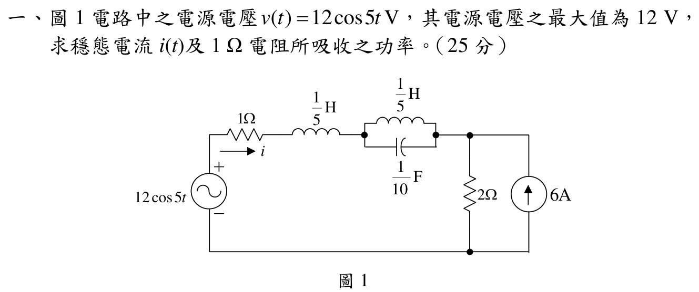
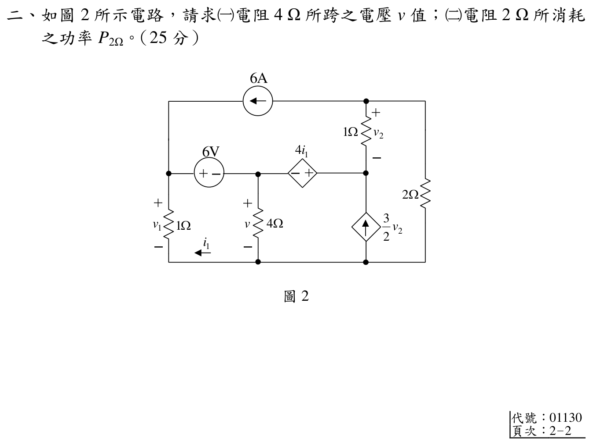
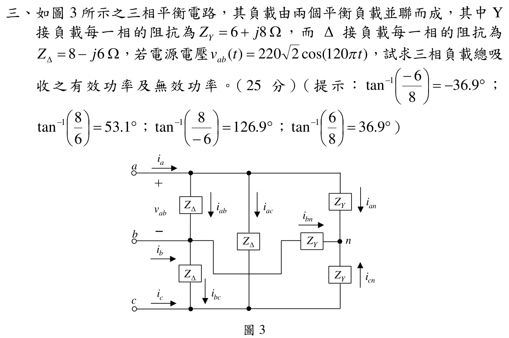

# 📝 108 年電機工程技師｜電路學逐題詳解

> 本頁由題級 canonical 筆記組合；每題保留 QID、官方裁切、校驗狀態與完整得分型解答。

## 題目導覽
- [[#一、108 年電路學第 1 題｜正弦穩態電流與 1 Ω 電阻功率|第 1 題：正弦穩態電流與 1 Ω 電阻功率]]
- [[#二、108 年電路學第 2 題｜含相依源直流電路|第 2 題：含相依源直流電路]]
- [[#三、108 年電路學第 3 題｜三相平衡 Y／Δ 負載功率|第 3 題：三相平衡 Y／Δ 負載功率]]
- [[#四、108 年電路學第 4 題｜互感耦合電路|第 4 題：互感耦合電路]]

---

## 一、108 年電路學第 1 題｜正弦穩態電流與 1 Ω 電阻功率

> 題級識別：`EE-108-01-1`
> canonical 來源：`canonical/EE-108-01-1.md`
> 題級校驗狀態：`verified`

![[依考科分類/01_電路學/images/questions/PE_108年_電路學_Q01.png]]

> 官方裁切來源：`依考科分類/01_電路學/images/questions/PE_108年_電路學_Q01.png`

### 考場標準作答

使用疊加定理。直流 6 A 分量下，電感短路、電容開路，故右節點由 1 Ω 與 2 Ω 分流：
\[
\frac{V_{B,0}}1+\frac{V_{B,0}}2=6
\Longrightarrow V_{B,0}=4\ \mathrm V,
\qquad i_0=-4\ \mathrm A.
\]
在 \(\omega=5\) rad/s 的交流分量中，6 A 電流源開路，
\[
Z_s=1+j5\left(\frac15\right)=1+j,
\quad
Z_p=\left[\frac1j+\frac1{-j2}\right]^{-1}=j2.
\]
\[
\widetilde I_{ac}=\frac{12}{(1+j)+j2+2}=2-j2=2\sqrt2\angle(-45^\circ)\ \mathrm A.
\]
因此
\[
\boxed{i(t)=-4+2\sqrt2\cos(5t-45^\circ)\ \mathrm A}.
\]
1 Ω 電阻平均功率為
\[
\boxed{P_{1\Omega}=(-4)^2+\frac12(2\sqrt2)^2=20\ \mathrm W}.
\]
亦可寫成
\[
\boxed{P_{1\Omega}=P_\mathrm{dc}+P_\mathrm{ac}=20\ \mathrm W}.
\]

### 得分點拆解

- 將 6 A 固定電流源視為直流分量，不與 5 rad/s 相量直接相加。
- 直流等效時正確使用電感短路、電容開路。
- 交流等效時正確計算中間並聯 LC 的阻抗 \(j2\ \Omega\)。
- 題給 12 V 是峰值；交流電阻功率必須用 \(\tfrac12|I_{pk}|^2R\)。
- 最後同時寫出合成電流與 1 Ω 電阻吸收功率。

### 完整教學推導

直流分量：電壓源 \(12\cos5t\) 的平均值為 0，故該電壓源在直流疊加電路中短路。兩個電感為短路，電容為開路，6 A 在右節點分到 1 Ω 與 2 Ω：
\[
V_{B,0}\left(1+\frac12\right)=6,\qquad V_{B,0}=4\ \mathrm V.
\]
題圖的 (i) 箭頭由左向右，而 1 Ω 支路電流實際由右向左，
\[
i_0=-\frac{4}{1}=-4\ \mathrm A.
\]

交流分量：對 \(v_s=12\cos5t\) 採峰值相量。左側串聯支路
\[
Z_s=1+j\omega\frac15=1+j.
\]
中間並聯支路
\[
Z_L=j,\qquad Z_C=\frac1{j5(1/10)}=-j2,
\]
\[
Y_p=\frac1j+\frac1{-j2}=-\frac j2,\qquad Z_p=j2.
\]
6 A 直流源對交流小訊號開路，右側留下 2 Ω，故總阻抗
\[
Z_{ac}=1+j+j2+2=3+j3.
\]
\[
\widetilde I_{ac}=\frac{12}{3+j3}=2-j2.
\]
其時域交流電流為 \(2\sqrt2\cos(5t-45^\circ)\) A。不同頻率／不同分量的交叉項平均為零，故
\[
P=Ri_0^2+R\frac{|\widetilde I_{ac}|^2}{2}=16+4=20\ \mathrm W.
\]

### 獨立驗算

交流阻抗 \(3+j3\) 的大小為 \(3\sqrt2\)，因此電流峰值為 \(12/(3\sqrt2)=2\sqrt2\) A，相角為 \(-45^\circ\)，與相量除法一致。直流時右節點 4 V，1 Ω 電流由右向左 4 A，符合箭頭定義。功率以均方值計算：
\[
I_{1\Omega,rms}^2=i_0^2+\frac{|\widetilde I_{ac}|^2}{2}=16+4=20,
\]
所以 \(P=1\times20=20\) W。

### 常見失分

- 把 6 A 當成 5 rad/s 的交流相量而忽略直流分量。
- 直流時把電容當短路，或交流時漏掉中間並聯電感與電容。
- 交流峰值相量直接套 \(P=|I|^2R\)，使功率多一倍。
- 忽略題圖電流箭頭方向，將直流分量誤寫成 \(+4\) A。

---

## 二、108 年電路學第 2 題｜含相依源直流電路

> 題級識別：`EE-108-01-2`
> canonical 來源：`canonical/EE-108-01-2.md`
> 題級校驗狀態：`verified`

![[依考科分類/01_電路學/images/questions/PE_108年_電路學_Q02.png]]

> 官方裁切來源：`依考科分類/01_電路學/images/questions/PE_108年_電路學_Q02.png`

### 考場標準作答

以底線為參考地，令 4 Ω 電阻上端電壓為 (v)，左節點為 (V_1)，相依源右端為 (V_3)，最上節點為 (V_4)。由左側 6 V 源與圖示 (i_1) 方向：
\[
V_1=v+6,\qquad i_1=-V_1=-(v+6).
\]
相依電壓源極性給出
\[
V_3-v=4i_1=-4(v+6),\qquad V_3=-3v-24.
\]
令上方 1 Ω 電阻電壓 (v_2=V_4-V_3)。頂端節點 KCL：
\[
6+v_2+\frac{V_4}{2}=0,\qquad V_4=-2v-20,\qquad v_2=v+4.
\]
對含 (V_1,v,V_3) 的超節點列 KCL：
\[
V_1+\frac v4=6+v_2+\frac32v_2.
\]
代入 (V_1=v+6, v_2=v+4) 得
\[
v=-8\ \mathrm V,\qquad V_4=-4\ \mathrm V.
\]
故 2 Ω 電阻功率
\[
\boxed{P_{2\Omega}=\frac{V_4^2}{2}=8\ \mathrm W}.
\]

### 得分點拆解

- 依官方極性寫出 (V_1=v+6) 與 (V_3-v=4i_1)。
- 注意 (i_1) 箭頭與 (V_1) 被動符號相反，故 (i_1=-V_1)。
- 先以頂端節點 KCL 求 (V_4) 與 (v_2) 的關係。
- 三個由理想電壓源相連的節點要用超節點，且相依電流源方向不可改。
- 功率使用 (V^2/R)，電壓正負不影響消耗功率。

### 完整教學推導

由官方圖，左側 1 Ω 電阻的電流 (i_1) 箭頭沿下方導線向左，與由 (V_1) 流向地的被動電流方向相反，因此
\[
V_1=v+6,\qquad i_1=-V_1.
\]
相依電壓源左負右正，
\[
V_3-v=4i_1=-4(v+6),\qquad V_3=-3v-24.
\]

最上節點的 6 A 電流源由右向左，故離開最上節點的 KCL 為
\[
6+(V_4-V_3)+\frac{V_4}{2}=0.
\]
令 (v_2=V_4-V_3)，整理得
\[
V_4=\frac{V_3-6}{1.5}=-2v-20.
\]
再由 (v_2=V_4-V_3)，
\[
v_2=(-2v-20)-(-3v-24)=v+4.
\]

含 (V_1,v,V_3) 的超節點，外部流入包括 6 A、上方 1 Ω 支路電流 (v_2)，以及相依電流源 \(\tfrac32v_2\)；流向地的支路為 (V_1) 與 (v/4)：
\[
V_1+\frac v4=6+v_2+\frac32v_2.
\]
代入 (V_1=v+6)、(v_2=v+4)：
\[
v+6+\frac v4=6+\frac52(v+4),
\]
\[
1.25v+6=2.5v+16,\qquad v=-8\ \mathrm V.
\]
\[
V_3=0\ \mathrm V,\qquad V_4=-4\ \mathrm V,\qquad
P_{2\Omega}=\frac{(-4)^2}{2}=8\ \mathrm W.
\]

### 獨立驗算

回代得到
\[
V_1=-2\ \mathrm V,\quad i_1=2\ \mathrm A,\quad V_3=0,\quad V_4=-4\ \mathrm V,\quad v_2=-4\ \mathrm V.
\]
頂端 KCL：
\[
6+(-4)+\frac{-4}{2}=0.
\]
超節點以「流出為正」計算：
\[
V_1+\frac v4+(V_3-V_4)-\frac32v_2-6
=-2-2+4+6-6=0.
\]
兩個 KCL 殘差皆為零，且功率為 (16/2=8) W。

### 常見失分

- 把 (i_1) 寫成 (+V_1)，忽略圖示箭頭沿底線向左。
- 將相依電壓源極性寫反，造成 (V_3) 關係錯誤。
- 把相依電流源當成流出節點，而圖示實際為向上注入。
- 只求出 (v=-8) V，卻未由 (V_4) 求 2 Ω 電阻功率。

---

## 三、108 年電路學第 3 題｜三相平衡 Y／Δ 負載功率

> 題級識別：`EE-108-01-3`
> canonical 來源：`canonical/EE-108-01-3.md`
> 題級校驗狀態：`verified`

![[依考科分類/01_電路學/images/questions/PE_108年_電路學_Q03.png]]

> 官方裁切來源：`依考科分類/01_電路學/images/questions/PE_108年_電路學_Q03.png`

### 考場標準作答

由 \(v_{ab}(t)=220\sqrt2\cos(120\pi t)\) V，線電壓有效值為 \(V_L=220\) V。Y 負載每相電壓為 \(V_L/\sqrt3\)，Δ 負載每相電壓為 \(V_L\)。
\[
S_Y=3\frac{(V_L/\sqrt3)^2}{(6+j8)^*}
=\frac{220^2}{6-j8}=2904+j3872\ \mathrm{VA},
\]
\[
S_\Delta=3\frac{220^2}{(8-j6)^*}
=3\frac{220^2}{8+j6}=11616-j8712\ \mathrm{VA}.
\]
所以
\[
\boxed{S_T=14520-j4840\ \mathrm{VA}},
\quad
\boxed{P_T=14.520\ \mathrm{kW}},
\quad
\boxed{Q_T=-4.840\ \mathrm{kvar}}.
\]

### 得分點拆解

- 由時間函數辨認 220 V 是線電壓 RMS 值。
- Y 負載用相電壓 (V_L/\sqrt3)，Δ 負載直接用線電壓 (V_L)。
- 複數功率用阻抗共軛 (S=3|V_\phi|^2/Z^*)。
- 感性 (Q>0)、容性 (Q<0)，最後將兩負載的複數功率相加。
- 同時回報有效功率與無效功率的單位與正負號。

### 完整教學推導

Y 負載：
\[
V_{\phi,Y}=\frac{220}{\sqrt3}\ \mathrm V,
\qquad Z_Y=6+j8\ \Omega.
\]
\[
S_Y=3V_{\phi,Y}I_Y^*
=3\frac{|V_{\phi,Y}|^2}{Z_Y^*}
=\frac{48400}{6-j8}.
\]
因 (1/(6-j8)=(6+j8)/100)，
\[
S_Y=2904+j3872\ \mathrm{VA}.
\]
所以 Y 負載吸收 \(2.904\) kW 與 \(3.872\) kvar 感性無效功率。

Δ 負載：每一支路直接跨接線電壓，
\[
V_{\phi,\Delta}=220\ \mathrm V,
\qquad Z_\Delta=8-j6\ \Omega.
\]
\[
S_\Delta=3\frac{220^2}{8+j6}
=\frac{145200(8-j6)}{100}
=11616-j8712\ \mathrm{VA}.
\]
所以 Δ 負載吸收 (11.616) kW，並提供 (8.712) kvar 容性無效功率。

總複數功率直接相加：
\[
S_T=(2904+11616)+j(3872-8712)
=14520-j4840\ \mathrm{VA}.
\]

### 獨立驗算

將平衡 Δ 負載折算成 Y：
\[
Z_{\Delta\to Y}=\frac{8-j6}{3}=\frac83-j2\ \Omega.
\]
與 (Z_Y=6+j8) 並聯：
\[
Z_{eq}=(6+j8)\parallel\left(\frac83-j2\right)=3-j1\ \Omega.
\]
用等效 Y 負載計算：
\[
S_T=3\frac{(220/\sqrt3)^2}{(3+j1)}=14520-j4840\ \mathrm{VA},
\]
與分支功率相加完全一致；負號 (Q_T) 也確認總負載呈容性。

### 常見失分

- 把 Y 與 Δ 的相電壓都當成 220 V。
- 忘記 (Z^*)，使感性／容性 (Q) 的符號顛倒。
- 把題目給的峰值 220√2 誤當 RMS 220√2。
- 將兩個負載的無效功率取絕對值後再相加，失去容性感性的抵消。

---

## 四、108 年電路學第 4 題｜互感耦合電路

> 題級識別：`EE-108-01-4`
> canonical 來源：`canonical/EE-108-01-4.md`
> 題級校驗狀態：`verified`

![[依考科分類/01_電路學/images/questions/PE_108年_電路學_Q04.png]]

> 官方裁切來源：`依考科分類/01_電路學/images/questions/PE_108年_電路學_Q04.png`

### 考場標準作答

由官方圖讀得 \(M=0.5\) H、\(L_1=L_2=1\) H、\(R_1=R_2=1\) Ω、\(C=1\) F，
\[
v_s(t)=10\sqrt2\cos(2t)\ \mathrm V,\qquad \omega=2\ \mathrm{rad/s}.
\]
兩網目電流均由非同名端進入線圈，互感項同號。採 RMS 相量 (widetilde V_s=10) V。右側並聯負載
\[
Y_L=1+j2,\qquad Z_L=\frac1{1+j2}=0.2-j0.4\ \Omega.
\]
網目方程為
\[
\begin{bmatrix}1+j2&j\\j&0.2+j1.6\end{bmatrix}
\begin{bmatrix}\widetilde I_1\\\widetilde I_2\end{bmatrix}
=\begin{bmatrix}10\\0\end{bmatrix}.
\]
解得
\[
\widetilde I_2=-2.5+j2.5=3.5355\angle135^\circ\ \mathrm A_{rms}.
\]
還原為峰值：
\[
\boxed{i_2(t)=5\cos(2t+135^\circ)\ \mathrm A}.
\]

### 得分點拆解

- 正確讀取兩線圈的點標記與兩個網目方向，判斷互感項同號。
- 右側 1 Ω 電阻與 1 F 電容是並聯負載，先求其等效阻抗。
- 題目電壓是峰值 (10\sqrt2)，但相量若採 RMS 必須使用 10 V。
- 正確列出兩個含互感的 KVL 方程。
- 求得 RMS 相量後乘 (sqrt2) 還原成題目要求的時域峰值。

### 完整教學推導

右側負載導納為
\[
Y_L=\frac1{1\ \Omega}+j\omega C=1+j2\ \mathrm S,
\qquad Z_L=0.2-j0.4\ \Omega.
\]
自感與互感阻抗為
\[
j\omega L_1=j2,\qquad j\omega L_2=j2,\qquad j\omega M=j.
\]
依同名端與所選電流方向，兩網目式為
\[
(1+j2)\widetilde I_1+j\widetilde I_2=10,
\]
\[
j\widetilde I_1+(0.2-j0.4+j2)\widetilde I_2=0.
\]
亦即
\[
j\widetilde I_1+(0.2+j1.6)\widetilde I_2=0.
\]
由第二式
\[
\widetilde I_1=(-1.6+j0.2)\widetilde I_2.
\]
代回第一式：
\[
\bigl[(1+j2)(-1.6+j0.2)+j\bigr]\widetilde I_2=10,
\]
\[
(-2-j2.9)\widetilde I_2=10,
\qquad
\widetilde I_2=-2.5+j2.5\ \mathrm A.
\]
其 RMS 大小為 \(3.5355\) A；乘以 \(\sqrt2\) 得時域峰值 5 A。

### 獨立驗算

回代
\[
\widetilde I_1=3.5-j4.5\ \mathrm A,
\]
可得
\[
(1+j2)\widetilde I_1+j\widetilde I_2=10,
\]
\[
j\widetilde I_1+(0.2+j1.6)\widetilde I_2=0.
\]
兩個 KVL 殘差皆為零。另以負載端電壓 (V_L=Z_L\widetilde I_2) 回算右網目，也得到同一互感平衡式；RMS／峰值換算後的時域振幅為 (\sqrt2(3.5355)=5) A。

### 常見失分

- 只看電流箭頭、不看同名端，造成互感項正負號錯誤。
- 把右側 1 Ω 與電容誤當串聯而非並聯。
- 將峰值源 (10\sqrt2) 直接當成 RMS 相量 10√2。
- 得到 RMS 相量後忘記乘 (sqrt2)，或把相角 (135^\circ) 改錯成 (-45^\circ) 而未說明等價性。
