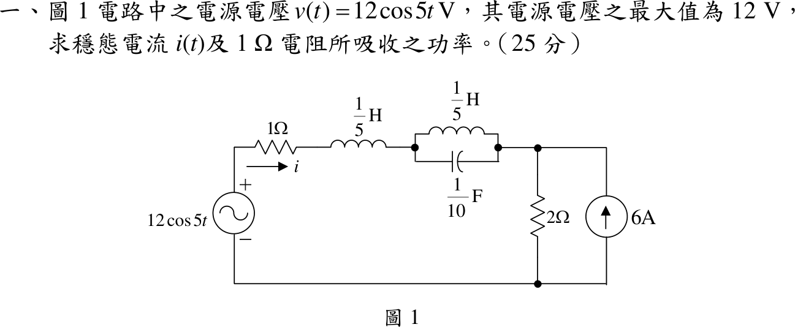
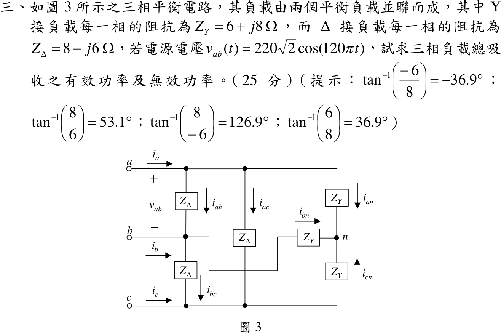

# 📝 108 年電機工程技師｜電路學逐題詳解

> 本頁由題級 canonical 筆記組合；每題保留 QID、官方裁切、校驗狀態與完整得分型解答。

## 題目導覽
- [[#一、108 年電路學第 1 題｜正弦穩態電流與 1 Ω 電阻功率|第 1 題：正弦穩態電流與 1 Ω 電阻功率]]
- [[#二、108 年電路學第 2 題｜含相依源直流電路|第 2 題：含相依源直流電路]]
- [[#三、108 年電路學第 3 題｜三相平衡 Y／Δ 負載功率|第 3 題：三相平衡 Y／Δ 負載功率]]
- [[#四、108 年電路學第 4 題｜互感耦合電路|第 4 題：互感耦合電路]]

---

## 一、108 年電路學第 1 題｜正弦穩態電流與 1 Ω 電阻功率

> 題級識別：`EE-108-01-1`
> canonical 來源：`canonical/EE-108-01-1.md`
> 題級校驗狀態：`verified`

![[依考科分類/01_電路學/images/questions/PE_108年_電路學_Q01.png]]

> 官方裁切來源：`依考科分類/01_電路學/images/questions/PE_108年_電路學_Q01.png`

### 已知與所求

\(v(t)=12\cos5t\ \mathrm V\)（峰值 12 V）串 \(1\ \Omega\)、\(\tfrac15\ \mathrm H\)，再接 \(\tfrac15\ \mathrm H\) 並聯 \(\tfrac1{10}\ \mathrm F\)；右節點 \(a\) 對地接 \(2\ \Omega\) 與向上（注入 \(a\)）的 \(6\ \mathrm A\) 電流源。\(i\) 為 \(1\ \Omega\) 上由左向右的電流。求穩態 \(i(t)\) 與 \(1\ \Omega\) 吸收功率（25 分）。

### 考場標準作答

6 A 為直流、電壓源為 \(\omega=5\ \mathrm{rad/s}\)，用疊加。

**直流分量**：\(12\cos5t\) 平均值為 0（短路），電感短路、電容開路，6 A 在節點 \(a\) 分流給 \(2\ \Omega\) 與左側 \(1\ \Omega\)：
\[
V_a\left(\tfrac12+1\right)=6\Rightarrow V_a=4\ \mathrm V,\qquad i_0=-\frac{V_a}{1}=-4\ \mathrm A
\]
（\(1\ \Omega\) 上實際電流由右向左，與 \(i\) 箭頭相反。）

**交流分量**：6 A 源開路，\(Z_L=j\omega L=j1\)，\(Z_C=\dfrac{1}{j5(1/10)}=-j2\)。
\[
Z_p=j1\parallel(-j2)=j2,\qquad
\mathbf I_{ac}=\frac{12}{1+j1+j2+2}=\frac{12}{3+j3}=2\sqrt2\angle-45^\circ\ \mathrm A
\]
\[
\boxed{i(t)=-4+2\sqrt2\cos(5t-45^\circ)\ \mathrm A}
\]
直流與 5 rad/s 分量的交叉項平均為 0，功率可分別相加（交流峰值需乘 \(\tfrac12\)）：
\[
P_\mathrm{dc}=(-4)^2(1)=16\ \mathrm W,\qquad P_\mathrm{ac}=\tfrac12(2\sqrt2)^2(1)=4\ \mathrm W
\]
\[
\boxed{P_{1\Omega}=P_\mathrm{dc}+P_\mathrm{ac}=20\ \mathrm W}
\]

### 驗算

全電路平均功率守恆：\(a\) 點電壓 \(v_a=4+4\sqrt2\cos(5t-45^\circ)\ \mathrm V\)（交流 \(=\mathbf I_{ac}\cdot2\)）。

- 供給：電壓源 \(\tfrac12(12)(2\sqrt2)\cos45^\circ=12\ \mathrm W\)；6 A 源 \(6\times\overline{v_a}=24\ \mathrm W\)，合計 36 W。
- 吸收：\(1\ \Omega\) 為 20 W；\(2\ \Omega\) 為 \(\dfrac{4^2}{2}+\dfrac{(4\sqrt2)^2}{2\cdot2}=8+8=16\ \mathrm W\)；LC 並聯為純電抗，合計 36 W。

### 失分點

- 把 6 A 當成 5 rad/s 的相量一起相加；漏掉直流分量會得 \(i=2\sqrt2\cos(5t-45^\circ)\)、\(P=4\ \mathrm W\)。
- 直流 \(i\) 的方向：\(i\) 箭頭向右而 \(1\ \Omega\) 實際電流向左，應為 \(-4\ \mathrm A\)，不是 \(+4\ \mathrm A\)。
- 交流部分以峰值相量直接用 \(|I|^2R\)，會使 \(P_\mathrm{ac}\) 多一倍成 8 W。

---

## 二、108 年電路學第 2 題｜含相依源直流電路

> 題級識別：`EE-108-01-2`
> canonical 來源：`canonical/EE-108-01-2.md`
> 題級校驗狀態：`verified`

![[依考科分類/01_電路學/images/questions/PE_108年_電路學_Q02.png]]

> 官方裁切來源：`依考科分類/01_電路學/images/questions/PE_108年_電路學_Q02.png`

### 已知與所求

左上節點接 6 A 電流源（箭頭向左，電流由最上節點流入左節點）、6 V 電壓源「+」端與 \(1\ \Omega\)（\(v_1\) 上正）；6 V 源「−」端為 4 Ω（\(v\) 上正）頂端；相依電壓源 \(4i_1\)（左負右正）接 4 Ω 頂端與相依電流源 \(\tfrac32v_2\)（向上注入）頂端；最上節點接 \(1\ \Omega\)（\(v_2\) 上正，下端即相依源右端）與 \(2\ \Omega\)。\(i_1\) 箭頭沿底線向左，故電流由地向上穿過左側 \(1\ \Omega\)。求（一）\(4\ \Omega\) 電壓 \(v\)；（二）\(2\ \Omega\) 功率 \(P_{2\Omega}\)（共 25 分）。

### 考場標準作答

底線為參考地；\(V_1\) 為左節點，\(V_3\) 為相依源右端，\(V_4\) 為最上節點，\(v_2=V_4-V_3\)。

**電壓約束**：6 V 源 \(V_1=v+6\)；\(i_1\) 與 \(V_1\) 的被動方向相反，\(i_1=-V_1\)；相依源 \(V_3-v=4i_1\)：
\[
V_3=v-4(v+6)=-3v-24
\]

**最上節點 KCL**（6 A 源把電流帶離此節點）：
\[
6+v_2+\frac{V_4}{2}=0\Rightarrow V_4=-2v-20,\quad v_2=V_4-V_3=v+4
\]

**超節點 \(\{V_1,v,V_3\}\) KCL**（流入：6 A、\(v_2\)、\(\tfrac32v_2\)；流出：\(V_1\)、\(v/4\)）：
\[
(v+6)+\frac v4=6+\frac52(v+4)\Rightarrow 1.25v+6=2.5v+16
\]
\[
\boxed{v=-8\ \mathrm V}
\]
\(V_4=-2(-8)-20=-4\ \mathrm V\)，故
\[
\boxed{P_{2\Omega}=\frac{V_4^2}{2}=\frac{(-4)^2}{2}=8\ \mathrm W}
\]

### 驗算

節點電壓：\(V_1=-2,\ v=-8,\ V_3=0,\ V_4=-4,\ v_2=-4\ \mathrm V,\quad i_1=2\ \mathrm A\)；以功率守恆檢查（與 KCL 解法不同）：

- 電阻吸收：\(1\ \Omega(V_1)\) 4 W、\(4\ \Omega\) 16 W、\(1\ \Omega(v_2)\) 16 W、\(2\ \Omega\) 8 W，共 44 W。
- 電源供給：6 A 源兩端升壓 \(V_1-V_4=2\ \mathrm V\)，供 12 W；6 V 源通過 8 A 由「+」端流入，吸 48 W；\(4i_1=8\ \mathrm V\) 源通過 10 A 由「+」端流出，供 80 W；相依電流源端電壓 \(V_3=0\)，0 W。\(12-48+80=44\ \mathrm W\)。

### 失分點

- \(i_1\) 箭頭向左（由地向上）：誤寫 \(i_1=+V_1\)（或把 \(4i_1\) 的極性看反）會得 \(v=-72/13\ \mathrm V\)、\(P_{2\Omega}\approx20.9\ \mathrm W\)。
- 相依電流源 \(\tfrac32v_2\) 向上注入相依源右端，超節點 KCL 要放在「流入」側。
- 題目要求兩個量，求出 \(v\) 後還需用 \(V_4\)（非 \(v\)）算 \(2\ \Omega\) 功率。

---

## 三、108 年電路學第 3 題｜三相平衡 Y／Δ 負載功率

> 題級識別：`EE-108-01-3`
> canonical 來源：`canonical/EE-108-01-3.md`
> 題級校驗狀態：`verified`

![[依考科分類/01_電路學/images/questions/PE_108年_電路學_Q03.png]]

> 官方裁切來源：`依考科分類/01_電路學/images/questions/PE_108年_電路學_Q03.png`

### 已知與所求

平衡三相電路，Y 接負載每相 \(Z_Y=6+j8\ \Omega\)，Δ 接負載每相 \(Z_\Delta=8-j6\ \Omega\)，兩負載並聯；\(v_{ab}(t)=220\sqrt2\cos(120\pi t)\)（題幹未標單位，視為伏特）。求三相負載總吸收的有效功率與無效功率（25 分）。

### 考場標準作答

\(v_{ab}\) 峰值 \(220\sqrt2\)，線電壓有效值 \(V_L=220\ \mathrm V\)；Y 每相電壓 \(V_L/\sqrt3\)，Δ 每相電壓 \(V_L\)。阻抗極式：\(Z_Y=10\angle53.1^\circ\ \Omega\)，\(Z_\Delta=10\angle-36.9^\circ\ \Omega\)。三相複數功率 \(S=3V_\phi^2/Z^*\)：
\[
S_Y=3\cdot\frac{(220/\sqrt3)^2}{10\angle-53.1^\circ}=4840\angle53.1^\circ=2904+j3872\ \mathrm{VA}
\]
\[
S_\Delta=3\cdot\frac{220^2}{10\angle36.9^\circ}=14520\angle-36.9^\circ=11616-j8712\ \mathrm{VA}
\]
\[
S_T=S_Y+S_\Delta=14520-j4840\ \mathrm{VA}
\]
\[
\boxed{P=14.52\ \mathrm{kW}},\qquad \boxed{Q=-4.84\ \mathrm{kvar}}
\]
\(Q<0\) 表示整體呈容性（Δ 負載的容性無效功率大於 Y 負載的感性無效功率）。

### 驗算

Δ 折成 Y：\(Z_\Delta/3=\tfrac83-j2\ \Omega\)，與 \(6+j8\) 並聯：
\[
Z_{eq}=\frac{(6+j8)(\tfrac83-j2)}{(6+j8)+(\tfrac83-j2)}=3-j1\ \Omega
\]
\[
S_T=3\cdot\frac{(220/\sqrt3)^2}{Z_{eq}^*}=\frac{48400}{3+j1}=14520-j4840\ \mathrm{VA}
\]
與兩負載功率相加一致。

### 失分點

- Y 負載相電壓是 \(220/\sqrt3\) V，Δ 負載相電壓是 220 V，不可都用 220 V。
- \(220\sqrt2\) 是峰值；把 \(220\sqrt2\) 當有效值會使 \(P,Q\) 變 2 倍。
- 複數功率要用 \(Z^*\)（或 \(V I^*\)）；漏掉共軛會使 \(Q\) 符號顛倒，得 \(Q=+4.84\ \mathrm{kvar}\)。

---

## 四、108 年電路學第 4 題｜互感耦合電路

> 題級識別：`EE-108-01-4`
> canonical 來源：`canonical/EE-108-01-4.md`
> 題級校驗狀態：`verified`

![[依考科分類/01_電路學/images/questions/PE_108年_電路學_Q04.png]]

> 官方裁切來源：`依考科分類/01_電路學/images/questions/PE_108年_電路學_Q04.png`

### 已知與所求

\(v_s(t)=10\sqrt2\cos2t\ \mathrm V\) 串 \(1\ \Omega\) 接一次側 \(L_1=1\ \mathrm H\)；二次側 \(L_2=1\ \mathrm H\) 接 \(1\ \Omega\) 並聯 \(1\ \mathrm F\)；互感 \(M=0.5\ \mathrm H\)。一次側點在下端、二次側點在上端；\(i_1\) 由上端（非點端）流入一次側，\(i_2\) 由二次側上端（點端）流出，等於由下端（非點端）流入。求穩態 \(i_2(t)\)（25 分）。

### 考場標準作答

\(\omega=2\ \mathrm{rad/s}\)，用峰值相量 \(\mathbf V_s=10\sqrt2\angle0^\circ\)。兩個參考電流都由非點端流入，互感項同號（\(+j\omega M\)）。

\[
j\omega L_1=j\omega L_2=j2,\quad j\omega M=j1,\quad
Z_L=\frac{1}{1+j2}=0.2-j0.4\ \Omega
\]
\[
\begin{cases}
(1+j2)\mathbf I_1+j\,\mathbf I_2=10\sqrt2\\
j\,\mathbf I_1+(0.2+j1.6)\mathbf I_2=0
\end{cases}
\]
行列式 \(\Delta=(1+j2)(0.2+j1.6)-(j)^2=-2+j2\)，
\[
\mathbf I_2=\frac{-j\,(10\sqrt2)}{-2+j2}=\frac{10\sqrt2(-1+j)}{4}=5\angle135^\circ\ \mathrm A
\]
\[
\boxed{i_2(t)=5\cos(2t+135^\circ)\ \mathrm A}
\]

### 驗算

以有效值相量（\(\mathbf V_s=10\)）做功率守恆：\(\mathbf I_2=-2.5+j2.5\)，\(\mathbf I_1=j(0.2+j1.6)\mathbf I_2=3.5-j4.5\ \mathrm A\)。

- 電源送出 \(\mathrm{Re}(\mathbf V_s\mathbf I_1^*)=10(3.5)=35\ \mathrm W\)。
- 吸收：串聯 \(1\ \Omega\) 為 \(|\mathbf I_1|^2=32.5\ \mathrm W\)；負載 \(1\ \Omega\) 電壓 \(|Z_L\mathbf I_2|=\sqrt{0.2\times12.5}\)，功率 \(0.2\times12.5=2.5\ \mathrm W\)；合計 35 W。

### 失分點

- 同名端：兩電流皆由非點端流入故 \(+j\omega M\)；誤用 \(-j\omega M\) 會得 \(5\cos(2t-45^\circ)\ \mathrm A\)，整個反相。
- 右側 \(1\ \Omega\) 與 \(1\ \mathrm F\) 為並聯，\(Z_L=0.2-j0.4\ \Omega\)，不是 \(1-j0.5\ \Omega\) 的串聯。
- 峰值相量源取 \(10\sqrt2\)；若取 10 當峰值，最後振幅只剩 \(5/\sqrt2\) 倍。
