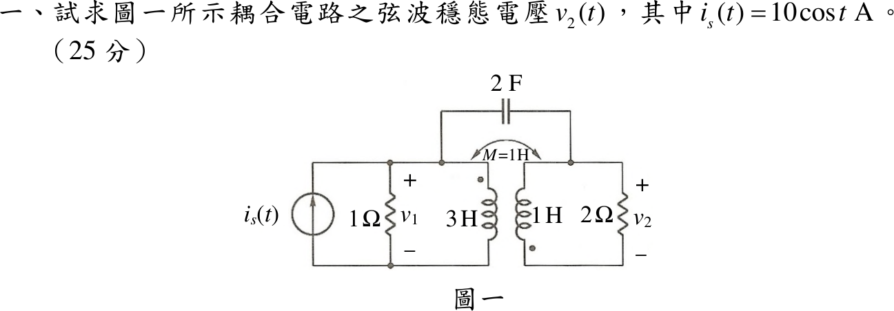
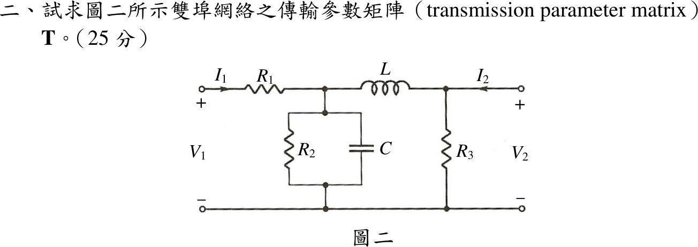

# 📝 110 年電機工程技師｜電路學逐題詳解

> 本頁由題級 canonical 筆記組合；每題保留官方裁切圖、校驗狀態與可追溯的推導。

## 題目導覽
- [[#一、110 年第 1 題｜耦合電路弦波穩態|第 1 題：耦合電路弦波穩態]]
- [[#二、110 年電路學第 2 題：雙埠網路傳輸參數矩陣|第 2 題：110 年電路學第 2 題：雙埠網路傳輸參數矩陣]]
- [[#三、110 年電路學第 3 題：串聯 RLC 諧振與元件端電壓極值|第 3 題：110 年電路學第 3 題：串聯 RLC 諧振與元件端電壓極值]]
- [[#四、110 年電路學第 4 題：Y–Y 不平衡三相四線制總功率|第 4 題：110 年電路學第 4 題：Y–Y 不平衡三相四線制總功率]]

---

## 一、110 年第 1 題｜耦合電路弦波穩態

> 題級識別：EE-110-01-1
> canonical 來源：[[canonical/EE-110-01-1.md]]
> 題級校驗狀態：needs_manual_review
> [!WARNING] 本題仍有官方資料缺口或事件定義歧義；請以 canonical 條件式解答為準。

### 已知與所求

\(i_s=10\cos t\ \mathrm A\)（向上）注入左上節點；左側 \(1\ \Omega\)（電壓 \(v_1\)）與 \(L_1=3\ \mathrm H\)（同名端在上）並接於左上節點與左下導線之間。右側 \(L_2=1\ \mathrm H\)（同名端在下）與 \(2\ \Omega\)（電壓 \(v_2\)，上正）並接於右上節點與右下導線之間；\(M=1\ \mathrm H\)；\(2\ \mathrm F\) 跨接左右兩個上節點。圖中左下與右下導線分開，未相連。求 \(v_2(t)\)（25 分）。

### 考場標準作答

**電容電流為零。** 右半電路（\(L_2\)、\(2\ \Omega\)）與左半電路之間只有電容一條導線相連，對右半電路整體取 KCL，流入的淨電流只能經電容，故 \(I_C=0\)；兩側只靠互感耦合。

\(\omega=1\)，餘弦基準峰值相量 \(I_s=10\angle0^\circ\)。令 \(I_a\) 由上而下流入 \(L_1\) 同名端；右側迴路電流 \(I_b\) 由上而下流過 \(2\ \Omega\)、再由下而上進入 \(L_2\) 同名端，故 \(V_2=2I_b\)。

右側迴路 KVL（沿 \(L_2\) 由下而上的壓降為點端減非點端電壓）：
\[
2I_b+(jI_b+jI_a)=0\Rightarrow I_b=\frac{-jI_a}{2+j}
\]
左線圈電壓（反射阻抗 \(\frac{(\omega M)^2}{2+j}\)）：
\[
V_1=j3I_a+jI_b=\left(j3+\frac{1}{2+j}\right)I_a=(0.4+j2.8)I_a
\]
左上節點 KCL：
\[
10=\frac{V_1}{1}+I_a\Rightarrow I_a=\frac{10}{1.4+j2.8}=1.4286-j2.8571\ \mathrm A
\]
\[
V_2=2I_b=\frac{-j20}{(1.4+j2.8)(2+j)}=\frac{-j20}{j7}=-\frac{20}{7}\ \mathrm V
\]
\[
\boxed{v_2(t)=-\frac{20}{7}\cos t=2.857\cos(t+180^\circ)\ \mathrm V}
\]

### 驗算

功率守恆（理想耦合線圈不耗能）：左側送入線圈的平均功率
\[
\frac12\mathrm{Re}\{V_1I_a^*\}=\frac12(0.4)|I_a|^2=\frac12(0.4)(10.204)=2.041\ \mathrm W
\]
右側 \(2\ \Omega\) 吸收 \(\frac{|V_2|^2}{2\cdot2}=\frac{(20/7)^2}{4}=2.041\ \mathrm W\)，兩者相等。

### 失分點

- 未檢查兩側接地是否相連，直接把 \(2\ \mathrm F\) 當成兩節點間的有效支路列 KCL。
- \(L_2\) 同名端在下方，互感電壓極性看錯會使 \(V_2\) 變號。
- \(V_2=-20/7\) 的負號表示與 \(i_s\) 反相，寫成 \(2.857\cos t\) 即漏掉 \(180^\circ\)。

### 條件與疑義

官方裁切圖的左下、右下導線在兩線圈之間斷開，上解依圖作答，電容不起作用。若出題意圖是兩側下導線共地（電容才構成迴路），則以共地為參考、兩上節點 \(V_1,V_2\) 列 KCL，線圈電流 \(i_1=-\frac j2V_1-\frac j2V_2\)（流入 \(L_1\) 點端）、\(i_2=\frac j2V_1+\frac{3j}{2}V_2\)（由下流入 \(L_2\) 點端）：
\[
\begin{bmatrix}1+j1.5&-j2.5\\-j2.5&0.5+j0.5\end{bmatrix}\begin{bmatrix}V_1\\V_2\end{bmatrix}=\begin{bmatrix}10\\0\end{bmatrix}
\Rightarrow V_2=\frac{500+j2400}{601}=4.079\angle78.23^\circ\ \mathrm V
\]
即 \(v_2(t)=4.079\cos(t+78.23^\circ)\ \mathrm V\)。兩種讀圖答案不同，作答時應先寫明採用哪一種接法。

---

## 二、110 年電路學第 2 題：雙埠網路傳輸參數矩陣

> 題級識別：EE-110-01-2
> canonical 來源：[[canonical/EE-110-01-2.md]]
> 題級校驗狀態：verified

### 已知與所求

由左至右：串聯 \(R_1\)、並聯支路 \(R_2\parallel C\)、串聯 \(L\)、並聯 \(R_3\)（跨在埠 2）。\(I_1\)、\(I_2\) 皆流入網路。求傳輸參數矩陣 \(\mathbf T\)（25 分），定義
\[
\begin{bmatrix}V_1\\I_1\end{bmatrix}=\begin{bmatrix}A&B\\C&D\end{bmatrix}\begin{bmatrix}V_2\\-I_2\end{bmatrix}
\]

### 考場標準作答

令 \(Y_2=\frac1{R_2}+sC\)。串聯阻抗 \(Z\) 與並聯導納 \(Y\) 的 ABCD 矩陣分別為 \(\begin{bmatrix}1&Z\\0&1\end{bmatrix}\)、\(\begin{bmatrix}1&0\\Y&1\end{bmatrix}\)，四級串接：
\[
\mathbf T=\begin{bmatrix}1&R_1\\0&1\end{bmatrix}\begin{bmatrix}1&0\\Y_2&1\end{bmatrix}\begin{bmatrix}1&sL\\0&1\end{bmatrix}\begin{bmatrix}1&0\\\frac1{R_3}&1\end{bmatrix}
\]
前兩級 \(\begin{bmatrix}1+R_1Y_2&R_1\\Y_2&1\end{bmatrix}\)，後兩級 \(\begin{bmatrix}1+\frac{sL}{R_3}&sL\\\frac1{R_3}&1\end{bmatrix}\)，相乘得
\[
\boxed{\mathbf T=\begin{bmatrix}
(1+R_1Y_2)\left(1+\dfrac{sL}{R_3}\right)+\dfrac{R_1}{R_3} & R_1+sL(1+R_1Y_2)\\[8pt]
Y_2+\dfrac{1+sLY_2}{R_3} & 1+sLY_2
\end{bmatrix},\qquad Y_2=\frac1{R_2}+sC}
\]
展開成有理式：
\[
A=\frac{CLR_1R_2s^2+(CR_1R_2R_3+LR_1+LR_2)s+R_1R_2+R_1R_3+R_2R_3}{R_2R_3},\qquad
B=\frac{CLR_1R_2s^2+(LR_1+LR_2)s+R_1R_2}{R_2}
\]
\[
C=\frac{CLR_2s^2+(CR_2R_3+L)s+R_2+R_3}{R_2R_3},\qquad
D=\frac{CLR_2s^2+Ls+R_2}{R_2}
\]

### 驗算

- 不用串接，直接列節點方程（中間節點電壓 \(V_a\)）：\(I_1=\frac{V_1-V_a}{R_1}\)、\(I_1=Y_2V_a+\frac{V_a-V_2}{sL}\)、\(I_2+\frac{V_a-V_2}{sL}=\frac{V_2}{R_3}\)；消去 \(V_a\) 後 \(V_1\)、\(I_1\) 對 \(V_2\)、\(-I_2\) 的係數與上列 \(A,B,C,D\) 完全相同。
- 開路特例 \(I_2=0\)、\(s\to0\)：\(A=\frac{R_1R_2+R_1R_3+R_2R_3}{R_2R_3}\)，即 \(V_1/V_2\) 等於 \(R_1\) 與 \(R_2\parallel R_3\) 分壓的倒數 \(1+\frac{R_1(R_2+R_3)}{R_2R_3}\)，相符。
- 被動互易網路：\(AD-BC=1\)（每級行列式為 1）。

### 失分點

- 圖示 \(I_2\) 流入網路，傳輸參數第二個自變數是 \(-I_2\)；若把 \(I_2\) 直接放進右向量，\(B\)、\(D\) 必須整欄變號。
- \(C\) 元素寫成 \(Y_2+\frac1{R_3}+\frac{sL}{R_3}\)，漏了 \(sL\) 項中的 \(Y_2\)；應為 \(Y_2+\frac{1+sLY_2}{R_3}\)。
- 串接矩陣相乘次序必須由埠 1 到埠 2，不能交換。

---

## 三、110 年電路學第 3 題：串聯 RLC 諧振與元件端電壓極值

> 題級識別：EE-110-01-3
> canonical 來源：[[canonical/EE-110-01-3.md]]
> 題級校驗狀態：verified

### 已知與所求

串聯 RLC，\(v_s=100\cos(2\pi ft)\ \mathrm V\)；\(f=5\ \mathrm{kHz}\) 時 \(R=10\ \Omega\)、\(X_L=25\ \Omega\)、\(X_C=64\ \Omega\)。求諧振頻率 \(f_0\)、品質因數 \(Q_0\)、諧振時各元件端電壓峰值；再求使 \(v_C\)、\(v_L\) 端電壓最大的電源頻率 \(f^*\) 與對應最大值（25 分）。

### 考場標準作答

\(X_L\propto f\)、\(X_C\propto 1/f\)，令 \(f_0\) 時兩者相等：
\[
25\frac{f_0}{5}=64\frac{5}{f_0}\Rightarrow \boxed{f_0=5\sqrt{\frac{64}{25}}=8\ \mathrm{kHz}}
\]
\(f_0\) 時 \(X_{L0}=X_{C0}=25\times\frac85=40\ \Omega\)：
\[
\boxed{Q_0=\frac{X_{L0}}{R}=\frac{40}{10}=4}
\]
諧振時 \(Z=R\)，\(I_m=100/10=10\ \mathrm A\)：
\[
\boxed{V_{R,m}=100\ \mathrm V},\qquad \boxed{V_{L,m}=V_{C,m}=I_mX_{L0}=400\ \mathrm V}
\]

元件電壓
\[
|V_C|=\frac{V_m/(\omega C)}{\sqrt{R^2+(\omega L-\frac1{\omega C})^2}},\qquad
|V_L|=\frac{V_m\,\omega L}{\sqrt{R^2+(\omega L-\frac1{\omega C})^2}}
\]
平方後對 \(\omega\) 微分令為零（\(Q_0>1/\sqrt2\) 時有極值）：
\[
\omega_C^*=\omega_0\sqrt{1-\frac1{2Q_0^2}},\qquad \omega_L^*=\frac{\omega_0}{\sqrt{1-\frac1{2Q_0^2}}}
\]
\[
\boxed{f_C^*=8\sqrt{\tfrac{31}{32}}=7.874\ \mathrm{kHz}},\qquad
\boxed{f_L^*=8\sqrt{\tfrac{32}{31}}=8.128\ \mathrm{kHz}}
\]
兩者極值相同：
\[
\boxed{V_{C,\max}=V_{L,\max}=\frac{V_mQ_0}{\sqrt{1-\frac1{4Q_0^2}}}=\frac{400}{\sqrt{63/64}}=403.16\ \mathrm V}
\]

### 驗算

- 元件值：\(L=\frac{25}{2\pi(5000)}=0.7958\ \mathrm{mH}\)、\(C=\frac{1}{2\pi(5000)(64)}=0.4974\ \mu\mathrm F\)，\(f_0=\frac{1}{2\pi\sqrt{LC}}=8000\ \mathrm{Hz}\)。
- 直接代 \(f_C^*=7874\ \mathrm{Hz}\)：\(X_L=39.37\ \Omega\)、\(X_C=40.64\ \Omega\)，\(|Z|=\sqrt{10^2+1.27^2}=10.08\ \Omega\)，\(|V_C|=\frac{100}{10.08}(40.64)=403.2\ \mathrm V\)，大於諧振時的 400 V；以 7–9 kHz 細格數值掃描 \(|V_C|\)、\(|V_L|\) 的峰值亦落在 7.874 kHz、8.128 kHz。
- 兩極值頻率滿足 \(f_C^*f_L^*=f_0^2\)。

### 失分點

- 以為 \(v_C\)、\(v_L\) 在 \(f_0\) 達最大；有限 \(Q\) 時 \(v_C\) 峰值低於 \(f_0\)、\(v_L\) 峰值高於 \(f_0\)。
- 題給 \(X_L,X_C\) 是 5 kHz 的值，直接拿 \(25\)、\(64\) 算 \(Q_0=25/10\) 或 \(64/10\)。
- 電源 100 V 為峰值，題目問峰值即不需再乘 \(\sqrt2\)。

---

## 四、110 年電路學第 4 題：Y–Y 不平衡三相四線制總功率

> 題級識別：EE-110-01-4
> canonical 來源：[[canonical/EE-110-01-4.md]]
> 題級校驗狀態：verified

### 已知與所求

\(Z_{an}=8\angle30^\circ\)、\(Z_{bn}=4\angle-50^\circ\)、\(Z_{cn}=6\angle20^\circ\ \Omega\)；平衡正相序線電壓 \(V_{ab}=208\angle0^\circ\ \mathrm V_{rms}\)；Y–Y 四線制。求總平均功率 \(P_T\)（25 分）。

### 考場標準作答

四線制中性線使負載中性點固定在電源中性點，負載雖不平衡，各相仍承受平衡相電壓：
\[
V_\phi=\frac{208}{\sqrt3}=120.09\ \mathrm V,\quad V_{an}=V_\phi\angle-30^\circ,\ V_{bn}=V_\phi\angle-150^\circ,\ V_{cn}=V_\phi\angle90^\circ
\]
每相 \(P=\frac{V_\phi^2}{|Z|}\cos\theta_Z\)，\(V_\phi^2=\frac{208^2}{3}=14421.33\)：
\[
P_a=\frac{14421.33}{8}\cos30^\circ=1561.16\ \mathrm W,\quad
P_b=\frac{14421.33}{4}\cos50^\circ=2317.46\ \mathrm W,\quad
P_c=\frac{14421.33}{6}\cos20^\circ=2258.60\ \mathrm W
\]
\[
\boxed{P_T=P_a+P_b+P_c=6137.2\ \mathrm W}
\]

### 驗算

改由電流與電阻分量計算：\(I_a=\frac{120.09\angle-30^\circ}{8\angle30^\circ}=15.011\angle-60^\circ\)、\(I_b=30.022\angle-100^\circ\)、\(I_c=20.015\angle70^\circ\ \mathrm A\)；
\[
\sum|I|^2R=15.011^2(6.928)+30.022^2(2.571)+20.015^2(5.638)=1561.2+2317.5+2258.6=6137.2\ \mathrm W
\]

### 失分點

- 把 208 V 線電壓直接當相電壓，功率放大 3 倍。
- \(Z_{bn}\) 的 \(-50^\circ\) 是電容性，\(\cos(-50^\circ)=\cos50^\circ>0\)，仍吸收實功率，不可取負。

---
