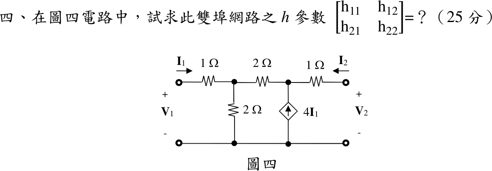

# 📝 111 年電機工程技師｜電路學逐題詳解

> 本頁由題級 canonical 筆記組合；每題保留官方裁切圖、校驗狀態與可追溯的推導。

## 題目導覽
- [[#一、111 年電路學第 1 題｜含運算放大器交流穩態|第 1 題：含運算放大器交流穩態]]
- [[#二、111 年第 2 題｜互感耦合電路|第 2 題：互感耦合電路]]
- [[#三、111 年第 3 題｜RLC 轉移函數與截止頻率|第 3 題：RLC 轉移函數與截止頻率]]
- [[#四、111 年第 4 題｜受控電流源雙埠網路的 h 參數|第 4 題：受控電流源雙埠網路的 h 參數]]

---

## 一、111 年電路學第 1 題｜含運算放大器交流穩態

> 題級識別：EE-111-01-1
> canonical 來源：[[canonical/EE-111-01-1.md]]
> 題級校驗狀態：verified

### 已知與所求

\(v_s=2\sin(400t)\ \mathrm V\) 經 \(10\ \mathrm{k\Omega}\) 接節點 \(a\)；節點 \(a\) 另接 \(0.25\ \mu\mathrm F\) 對地、\(20\ \mathrm{k\Omega}\) 至 \(v_o\)、\(0.5\ \mu\mathrm F\) 至節點 \(b\)；節點 \(b\) 接 \(10\ \mathrm{k\Omega}\) 對地並接運算放大器同相端；反相端由 \(40\ \mathrm{k\Omega}\)（回授）與 \(20\ \mathrm{k\Omega}\)（接地）分壓。求 \(v_o(t)\)（25 分）。

### 考場標準作答

理想運放虛短、虛斷，構成非反相放大器：
\[
v_o=\left(1+\frac{40}{20}\right)v_b=3v_b
\]
\(\omega=400\)：\(\frac{1}{j\omega(0.25\,\mu\mathrm F)}=-j10\ \mathrm{k\Omega}\)、\(\frac{1}{j\omega(0.5\,\mu\mathrm F)}=-j5\ \mathrm{k\Omega}\)。以 \(\mathrm{k\Omega}\) 計，正弦基準峰值相量 \(V_s=2\angle0^\circ\)。

節點 \(b\)：
\[
\frac{V_b-V_a}{-j5}+\frac{V_b}{10}=0\Rightarrow V_b=\frac{j4}{2+j4}V_a
\]
節點 \(a\)（代入 \(V_o=3V_b\)，全式乘 20）：
\[
\frac{V_a-V_s}{10}+\frac{V_a}{-j10}+\frac{V_a-V_b}{-j5}+\frac{V_a-3V_b}{20}=0
\Rightarrow (3+j6)V_a-(3+j4)V_b=2V_s
\]
聯立得
\[
\frac{V_o}{V_s}=\frac{72-j12}{37},\qquad
V_o=\frac{144-j24}{37}=\frac{24}{\sqrt{37}}\angle\left(-\tan^{-1}\frac16\right)\ \mathrm V
\]
\[
\boxed{v_o(t)=\frac{24}{\sqrt{37}}\sin\left(400t-\tan^{-1}\frac16\right)=3.946\sin(400t-9.46^\circ)\ \mathrm V}
\]

### 驗算

改求轉移函數再代頻率。以 \(s\) 表示兩個節點方程並消去 \(V_a\)，得
\[
H(s)=\frac{V_o}{V_s}=\frac{1200s}{s^2+600s+120000}
\]
\(s=j400\)：\(H=\frac{j480000}{-40000+j240000}=\frac{j12}{-1+j6}=\frac{72-j12}{37}\)，\(|H|=\frac{12}{\sqrt{37}}=1.973\)，乘以 2 V 得 \(3.946\ \mathrm V\)，與節點相量解一致。

### 失分點

- 忽略 \(20\ \mathrm{k\Omega}\) 由 \(v_o\) 回授至節點 \(a\) 的支路，把電路拆成兩級獨立放大器，會得 \(5.657\sin(400t+45^\circ)\) 之類的錯解。
- 非反相增益寫成 \(40/20=2\)，漏了「\(1+\)」。
- 題目以 \(\sin\) 為基準，回時域時誤寫成 \(\cos\)。

---

## 二、111 年第 2 題｜互感耦合電路

> 題級識別：EE-111-01-2
> canonical 來源：[[canonical/EE-111-01-2.md]]
> 題級校驗狀態：verified

### 已知與所求

\(v_s=36\cos(2t+30^\circ)\ \mathrm V\) 串 \(5\ \Omega\) 接 \(L_1=3\ \mathrm H\) 上端（同名端在上）；\(L_2=1.5\ \mathrm H\)（同名端在上）上端串 \(0.125\ \mathrm F\) 與 \(4\ \Omega\)；兩線圈下端共接，經 \(2\ \Omega\) 接地；\(M=0.5\ \mathrm H\)。\(I_1,I_2\) 為順時針網目電流。求 \(I_1\)、\(I_2\) 及 \(4\ \Omega\) 吸收功率（25 分）。

### 考場標準作答

\(\omega=2\)：\(j\omega L_1=j6\)、\(j\omega L_2=j3\)、\(j\omega M=j1\)、\(Z_C=\frac{1}{j(2)(0.125)}=-j4\ \Omega\)；餘弦基準峰值相量 \(V_s=36\angle30^\circ\)。

\(I_1\) 由上而下流入 \(L_1\) 同名端，\(I_2\) 由下而上流經 \(L_2\)、由同名端流出，故互感項取負號。

左網目：
\[
5I_1+(j6I_1-jI_2)+2(I_1-I_2)=36\angle30^\circ
\]
右網目（沿 \(L_2\) 由下而上的壓降為 \(j3I_2-jI_1\)）：
\[
2(I_2-I_1)+(j3I_2-jI_1)+(4-j4)I_2=0
\]
整理為
\[
\begin{bmatrix}7+j6&-2-j\\-2-j&6-j\end{bmatrix}
\begin{bmatrix}I_1\\I_2\end{bmatrix}=\begin{bmatrix}36\angle30^\circ\\0\end{bmatrix},
\qquad \Delta=(7+j6)(6-j)-(2+j)^2=45+j25
\]
\[
I_1=\frac{(6-j)\,36\angle30^\circ}{45+j25},\qquad I_2=\frac{(2+j)\,36\angle30^\circ}{45+j25}
\]
\[
\boxed{I_1=4.207-j0.630=4.254\angle-8.52^\circ\ \mathrm A}
\]
\[
\boxed{I_2=1.387+j0.722=1.564\angle27.51^\circ\ \mathrm A}
\]
\(4\ \Omega\) 流過 \(I_2\)，相量為峰值：
\[
\boxed{P_4=\frac12(4)|I_2|^2=4.891\ \mathrm W}
\]

### 驗算

改用節點法：令 \(L_1\) 上端電壓 \(V_x\)、線圈共接點 \(V_m\)、\(L_2\) 上端 \(V_y\)，以線圈電流為未知數：
\[
V_x-V_m=j6I_1-jI_2,\quad V_y-V_m=-j3I_2+jI_1,\quad \frac{V_m}{2}=I_1-I_2,\quad I_2=\frac{V_y}{4-j4}
\]
連同 \(I_1=(V_s-V_x)/5\) 聯立，解得同一組 \(I_1,I_2\)。另以 \(V_4=4I_2=5.548+j2.889\ \mathrm V\)，\(\frac12\mathrm{Re}\{V_4I_2^*\}=4.891\ \mathrm W\)。

### 失分點

- 互感項只看電流箭頭不對同名端，非對角項寫成 \(-2+j\) 而解錯。
- 共用 \(2\ \Omega\) 只放進其中一個網目，或兩網目都寫成同號的 \(2(I_1-I_2)\)。
- 峰值相量直接用 \(P=RI^2\)，功率多一倍成 \(9.78\ \mathrm W\)。

---

## 三、111 年第 3 題｜RLC 轉移函數與截止頻率

> 題級識別：EE-111-01-3
> canonical 來源：[[canonical/EE-111-01-3.md]]
> 題級校驗狀態：verified

### 已知與所求

\(v_i\) 串 \(R_o\) 後接一節點；該節點對地並聯兩支路：\(R\)，以及串聯的 \(L\)、\(C\)；\(v_o\) 取該節點對地電壓。求（一）\(H(s)=V_o/V_i\)（10 分）；（二）\(R_o=6\ \Omega\)、\(R=4\ \Omega\)、\(L=1\ \mathrm{mH}\)、\(C=4\ \mu\mathrm F\) 時的 \(\mathrm{BW}\) 與 \(\omega_1,\omega_2\)（15 分）。

### 考場標準作答

#### （一）轉移函數

\[
Z_{LC}=sL+\frac1{sC}=\frac{s^2LC+1}{sC},\qquad Z_p=R\parallel Z_{LC},\qquad H(s)=\frac{Z_p}{R_o+Z_p}
\]
\[
H(s)=\frac{R(s^2LC+1)}{(R_o+R)(s^2LC+1)+R_oRCs}
\]
\[
\boxed{H(s)=\frac{R}{R_o+R}\cdot\frac{s^2+\omega_0^2}{s^2+\alpha s+\omega_0^2},\quad \omega_0^2=\frac1{LC},\ \alpha=\frac{R_oR}{(R_o+R)L}}
\]
零點在 \(\pm j\omega_0\)，為帶拒（notch）響應，通帶增益 \(R/(R_o+R)\)。

#### （二）頻寬與截止頻率

\[
\omega_0^2=\frac{1}{(10^{-3})(4\times10^{-6})}=2.5\times10^8,\qquad
\alpha=\frac{(6)(4)}{(10)(10^{-3})}=2400\ \mathrm{rad/s}
\]
\[
H(s)=0.4\,\frac{s^2+2.5\times10^8}{s^2+2400s+2.5\times10^8}
\]
通帶增益 \(0.4\)，截止點 \(|H(j\omega)|=0.4/\sqrt2\)，即
\[
(\omega_0^2-\omega^2)^2=\alpha^2\omega^2\Rightarrow|\omega_0^2-\omega^2|=\alpha\omega
\]
\[
\omega_{1,2}=\frac{\sqrt{\alpha^2+4\omega_0^2}\mp\alpha}{2}=\frac{31713.72\mp2400}{2}
\]
\[
\boxed{\omega_1=14656.86\ \mathrm{rad/s}},\qquad \boxed{\omega_2=17056.86\ \mathrm{rad/s}}
\]
\[
\boxed{\mathrm{BW}=\omega_2-\omega_1=\alpha=2400\ \mathrm{rad/s}}
\]
兩根滿足 \(\omega_1\omega_2=\omega_0^2=2.5\times10^8\)，中心 \(\omega_0=15811.39\ \mathrm{rad/s}\) 為兩者幾何平均。

### 驗算

- 端點：\(\omega\to0\) 或 \(\infty\) 時 \(Z_{LC}\to\infty\)，\(H\to\frac{4}{10}=0.4\)；\(\omega=\omega_0\) 時 \(Z_{LC}=0\)，\(H=0\)，與帶拒形式一致。
- 直接代回：\(\omega_1=14656.86\) 時 \(\omega_0^2-\omega_1^2=2.5\times10^8-2.1482\times10^8=3.518\times10^7=\alpha\omega_1\)，故 \(|H(j\omega_1)|=0.4/\sqrt2=0.2828\)；以數值搜尋 \(|H(j\omega)|\) 的半功率點亦得同一組根。

### 失分點

- 把圖看成 \(R_o,R,L,C\) 全串聯並取 \(R\) 上電壓，寫成 \(H=\frac{R}{R_o+R+sL+1/(sC)}\)、\(\mathrm{BW}=(R_o+R)/L=10000\ \mathrm{rad/s}\)；官方圖中 \(R\) 與串聯 \(LC\) 並聯，應用上方的並聯負載分壓式。
- 以 \(|H|=1/\sqrt2\) 為截止條件；本題通帶增益是 \(0.4\)，應以 \(0.4/\sqrt2\) 為準。
- \(\alpha\) 誤用 \(R/L\) 或 \(R_o/L\)；有效電阻是 \(R_o\parallel R=2.4\ \Omega\)。

---

## 四、111 年第 4 題｜受控電流源雙埠網路的 h 參數

> 題級識別：EE-111-01-4
> canonical 來源：[[canonical/EE-111-01-4.md]]
> 題級校驗狀態：verified

### 已知與所求

埠 1（\(V_1\)，\(I_1\) 流入）串 \(1\ \Omega\) 至節點 \(a\)；\(a\) 經 \(2\ \Omega\) 接地、經 \(2\ \Omega\) 至節點 \(b\)；\(b\) 有由地指向 \(b\) 的受控電流源 \(4I_1\)，並串 \(1\ \Omega\) 至埠 2（\(V_2\)，\(I_2\) 流入）。求 \(h\) 參數（25 分）：
\[
\begin{bmatrix}V_1\\I_2\end{bmatrix}=\begin{bmatrix}h_{11}&h_{12}\\h_{21}&h_{22}\end{bmatrix}\begin{bmatrix}I_1\\V_2\end{bmatrix}
\]

### 考場標準作答

節點 \(a\)、\(b\) 的 KCL 與兩個串聯電阻：
\[
I_1=\frac{V_a}{2}+\frac{V_a-V_b}{2}\Rightarrow V_a=I_1+\frac{V_b}{2}
\]
\[
\frac{V_b-V_a}{2}-I_2=4I_1,\qquad V_2=V_b+I_2,\qquad V_1=V_a+I_1
\]

**\(V_2=0\)（求 \(h_{11},h_{21}\)）**：\(I_2=-V_b\)，代入 \(b\) 點：\(\frac{V_b}{4}-\frac{I_1}{2}+V_b=4I_1\Rightarrow V_b=3.6I_1\)，故 \(V_a=2.8I_1\)、\(V_1=3.8I_1\)、\(I_2=-3.6I_1\)。

**\(I_1=0\)（求 \(h_{12},h_{22}\)）**：\(V_a=V_b/2\)，\(b\) 點：\(\frac{V_b}{4}-I_2=0\)，又 \(V_2=V_b+I_2=\frac54V_b\Rightarrow V_b=0.8V_2\)，故 \(V_1=V_a=0.4V_2\)、\(I_2=0.2V_2\)。

\[
\boxed{\begin{bmatrix}h_{11}&h_{12}\\h_{21}&h_{22}\end{bmatrix}=\begin{bmatrix}3.8\ \Omega&0.4\\-3.6&0.2\ \mathrm S\end{bmatrix}}
\]

### 驗算

任取 \(I_1=1\ \mathrm A\)、\(V_2=5\ \mathrm V\)，由矩陣得 \(V_1=3.8+2=5.8\ \mathrm V\)、\(I_2=-3.6+1=-2.6\ \mathrm A\)。回代電路：\(V_b=V_2-I_2=7.6\)、\(V_a=V_1-I_1=4.8\)；\(a\) 點 \(\frac{4.8}{2}+\frac{4.8-7.6}{2}=2.4-1.4=1=I_1\)；\(b\) 點 \(\frac{7.6-4.8}{2}-(-2.6)=1.4+2.6=4=4I_1\)。兩點 KCL 同時成立。

### 失分點

- \(I_2\) 定義為流入埠 2，\(b\) 點流向右埠的電流是 \(-I_2\)；方向弄反會得 \(h_{21}=+3.6\)。
- 受控源方向為由地指向 \(b\)（注入 \(b\)），寫成流出會使 \(h_{11}\)、\(h_{21}\) 全錯。
- \(h_{11}\) 單位為 \(\Omega\)、\(h_{22}\) 為 S，\(h_{12},h_{21}\) 無因次，作答時單位不可混寫。

---
