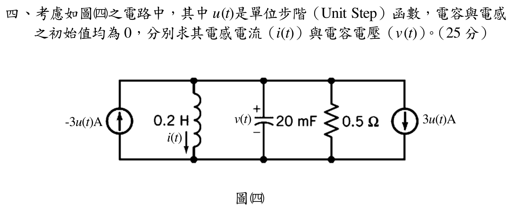

# 📝 112 年電機工程技師｜電路學逐題詳解

> 本頁由題級 canonical 筆記組合；每題保留官方裁切圖、校驗狀態與可追溯的推導。

## 題目導覽
- [[#一、112 年電路學第 1 題｜電阻等效與電源功率|第 1 題：電阻等效與電源功率]]
- [[#二、112 年電路學第 2 題｜互感電路與負載平均功率|第 2 題：互感電路與負載平均功率]]
- [[#三、112 年電路學第 3 題｜含 CCVS 的諾頓等效|第 3 題：含 CCVS 的諾頓等效]]
- [[#四、112 年電路學第 4 題｜並聯 RLC 步階響應|第 4 題：並聯 RLC 步階響應]]

---

## 一、112 年電路學第 1 題｜電阻等效與電源功率

> 題級識別：EE-112-01-1
> canonical 來源：[[canonical/EE-112-01-1.md]]
> 題級校驗狀態：verified

### 題意與拓樸

官方裁切圖中的 \(120\,\mathrm{V}\) 電壓源先經過 \(5\,\mathrm{k}\Omega\) 串聯電阻，再接到一個不平衡橋。橋的上端為節點 \(T\)，下端為節點 \(B\)；橋內的五個電阻為

\[

R_{TL}=6\,\mathrm{k}\Omega,\quad R_{TR}=18\,\mathrm{k}\Omega,\quad R_{LR}=12\,\mathrm{k}\Omega,
\]
\[

R_{LB}=4\,\mathrm{k}\Omega,\quad R_{RB}=6\,\mathrm{k}\Omega.
\]

要求的是理想電壓源端產生（輸出）的總功率。

### 1. 三角形轉 Y

將 \(T,L,R\) 三節點所形成的 Δ 網路轉為 Y。三角形電阻總和為

\[

R_\Delta=6+18+12=36\,\mathrm{k}\Omega.
\]

因此接在 \(T,L,R\) 的 Y 電阻分別為

\[

R_T=\frac{R_{TL}R_{TR}}{R_\Delta}
=\frac{6\times18}{36}=3\,\mathrm{k}\Omega,
\]
\[

R_L=\frac{R_{TL}R_{LR}}{R_\Delta}
=\frac{6\times12}{36}=2\,\mathrm{k}\Omega,
\qquad
R_R=\frac{R_{TR}R_{LR}}{R_\Delta}
=\frac{18\times12}{36}=6\,\mathrm{k}\Omega.
\]

轉換後，中心點到 \(B\) 有兩條支路：

\[

R_{L\text{-branch}}=R_L+R_{LB}=2+4=6\,\mathrm{k}\Omega,
\]
\[

R_{R\text{-branch}}=R_R+R_{RB}=6+6=12\,\mathrm{k}\Omega.
\]

兩支路並聯為

\[

R_p=6\parallel12
=\frac{6\times12}{6+12}
=4\,\mathrm{k}\Omega.
\]

故橋的等效電阻為

\[

R_{\mathrm{bridge}}=R_T+R_p=3+4=7\,\mathrm{k}\Omega.
\]

### 2. 電源電流與功率

包含外部 \(5\,\mathrm{k}\Omega\) 後，電源看到的總電阻為

\[

R_{\mathrm{eq}}=5+7=12\,\mathrm{k}\Omega=12000\,\Omega.
\]

因此電源電流為

\[

I_s=\frac{120\,\mathrm{V}}{12000\,\Omega}=0.010\,\mathrm{A}=10\,\mathrm{mA}.
\]

以被動符號約定，電壓源電流實際由正端流出，所以源的吸收功率為

\[

p_{\mathrm{abs}}=-V_sI_s=-120(0.010)=-1.20\,\mathrm{W}.
\]

題目所稱「電源端產生的功率」為其輸出功率，故

\[

\boxed{P_{\mathrm{source,delivered}}=1.20\,\mathrm{W}}.
\]

獨立回代檢查：\(R_{\mathrm{eq}}=12\,\mathrm{k}\Omega\)、\(I_s=10\,\mathrm{mA}\)，且 \(V_sI_s=1.20\,\mathrm{W}\)，單位與功率方向一致。

---

## 二、112 年電路學第 2 題｜互感電路與負載平均功率

> 題級識別：EE-112-01-2
> canonical 來源：[[canonical/EE-112-01-2.md]]
> 題級校驗狀態：verified

### 考場標準作答

採峰值相量，
\[
\omega=5000\,\mathrm{rad/s},\quad
X_{L1}=50\,\Omega,\quad X_{L2}=100\,\Omega,\quad X_M=40\,\Omega.
\]
令 (I_1) 流經 (L_1)、(I_2) 向下流經 (L_2)，並令 (I_R=I_1-I_2)。依同名端可得
\[
100(I_1-I_2)=-j40I_1+j100I_2,
\]
故
\[
I_2=(0.7-j0.3)I_1.
\]
左側 KVL 為
\[
660=(34+j10)I_1+j100I_2=(64+j80)I_1,
\]
所以
\[
I_1=4.02439-j5.03049\,\mathrm A,
\]
\[
I_R=I_1-I_2=2.71646-j0.30183
=2.73318\angle-6.340^\circ\,\mathrm A.
\]
因上述為峰值相量，(100\,\Omega) 電阻的平均功率為
\[
\boxed{P_R=\frac{|I_R|^2}{2}(100)=373.5\,\mathrm W}.
\]

### 得分點拆解

- 正確讀圖：(L_2) 與 (100\,\Omega) 跨接同一對節點，兩者為並聯。
- 由點標記與自訂電流方向寫出互感項的負號：(V=-j\omega MI_1+j\omega L_2I_2)。
- 右側節點使用 KCL：(I_R=I_1-I_2)，再與左側 KVL 聯立。
- 題給 (660\cos(5000t)) 是峰值，因此平均功率要除以 2；若改用 RMS 相量則不得再除一次。
- 最終答案需標示負載電流相量與平均功率單位。

### 完整教學推導

#### 題意與圖面讀取

\[
v_g(t)=660\cos(5000t)\,\mathrm{V},\qquad \omega=5000\,\mathrm{rad/s}.
\]

左側支路是 \(34\,\Omega\) 與 \(L_1=10\,\mathrm{mH}\) 串聯；右側 \(L_2=20\,\mathrm{mH}\) 與 \(100\,\Omega\) 是**並聯**，不是串聯。互感為 \(M=8\,\mathrm{mH}\)。圖中 \(L_1\) 的點在右端、\(L_2\) 的點在下端。

令 \(I_1\) 從左至右流過 \(L_1\)，令 \(I_2\) 從上至下流過 \(L_2\)，令 \(I_R\) 從上至下流過 \(100\,\Omega\)。依官方圖的點標記及所選端電壓方向，\(L_2\) 的互感電壓項為 \(-j\omega M I_1\)。

#### 1. 元件阻抗與耦合方程

\[
X_{L1}=\omega L_1=5000(0.010)=50\,\Omega,
\]
\[
X_{L2}=\omega L_2=5000(0.020)=100\,\Omega,
\qquad
X_M=\omega M=5000(0.008)=40\,\Omega.
\]

令右側上下節點電壓為 \(V\)（上正下負）。由點標記與電流方向，

\[
V=-jX_M I_1+jX_{L2}I_2
=-j40I_1+j100I_2.
\tag{1}
\]

右側節點 KCL 為

\[
I_1=I_2+I_R,
\qquad
V=100I_R=100(I_1-I_2).
\tag{2}
\]

把 (1)、(2) 相等化：

\[
(100+j40)I_1-(100+j100)I_2=0.
\tag{3}
\]

左側 KVL：

\[
660=(34+j50)I_1+V
=(34+j10)I_1+j100I_2.
\tag{4}
\]

由 (3)，

\[
I_2=\frac{100+j40}{100+j100}I_1
=(0.7-j0.3)I_1.
\tag{5}
\]

代回 (4)，輸入阻抗為

\[
Z_{\mathrm{in}}
=(34+j10)+j100(0.7-j0.3)
=64+j80\,\Omega.
\]

#### 2. 求負載電流

給定時間函數的振幅為 \(660\,\mathrm{V}\)，以下採峰值相量：

\[
I_1=\frac{660}{64+j80}
=4.024390-j5.030488\,\mathrm{A}
=6.442168\angle(-51.3402^\circ)\,\mathrm{A}.
\]

由 (5)：

\[
I_2=1.307927-j4.728659\,\mathrm{A},
\]

\[
I_R=I_1-I_2
=2.716463-j0.301829\,\mathrm{A}
=2.733180\angle(-6.34019^\circ)\,\mathrm{A}.
\]

#### 3. \(100\,\Omega\) 電阻平均功率

因相量採峰值，負載平均功率為

\[
P_{100\Omega}
=\frac{|I_R|^2}{2}(100\,\Omega)
=\frac{(2.733180)^2}{2}\times100
=\boxed{373.514\,\mathrm{W}}.
\]

本題容易誤判為 \(L_2\) 與電阻串聯；官方圖中兩者跨接相同上下節點，必須使用並聯 KCL。

### 獨立驗算

回代右側電壓：
\[
100I_R=271.6463-j30.1829\,\mathrm{V},
\]
\[
-j40I_1+j100I_2=271.6463-j30.1829\,\mathrm{V}.
\]
兩式相符，且 (I_1-I_2-I_R=0)，同時通過 KCL、KVL 與同名端符號檢查。

改用 RMS 相量時，
\[
|I_{R,\mathrm{rms}}|=\frac{2.733180}{\sqrt2}=1.93265\,\mathrm A,
\]
故
\[
P_R=|I_{R,\mathrm{rms}}|^2(100)=373.51\,\mathrm W,
\]
與峰值相量算法一致。

### 常見失分

- 把 (L_2) 與 (100\,\Omega) 看成串聯，因而完全省略右側節點 KCL。
- 未先自訂電流方向與線圈電壓方向，憑直覺填互感項正負號。
- 將 (M=8\,\mathrm{mH}) 直接當阻抗，漏乘角頻率 (omega)。
- 已採峰值相量卻用 (P=|I|^2R)，答案會多一倍。
- 只算輸入電流 (I_1)，未求真正流過 (100\,\Omega) 的支路電流 (I_R)。

---

## 三、112 年電路學第 3 題｜含 CCVS 的諾頓等效

> 題級識別：EE-112-01-3
> canonical 來源：[[canonical/EE-112-01-3.md]]
> 題級校驗狀態：verified

### 題意與符號

令 \(v_1\) 為 \(R_1\) 右端（亦為 \(R_2\) 上端）對下方參考節點的電壓，令 \(v_2\) 為負載端上端對下端的電壓。控制電流 \(i_x\) 由左向右流過 \(R_1\)。圖中的 CCVS 左正右負，故

\[

i_x=\frac{v_s-v_1}{R_1}=\frac{8-v_1}{10},
\qquad
v_1-v_2=r i_x=5i_x.
\tag{1}
\]

要求負載端看到的諾頓電流 \(I_N\) 與並聯電阻 \(R_N\)。

### 1. 開路電壓 \(V_{oc}\)

先將 \(R_L\) 開路。令 CCVS 由 \(v_1\) 流向 \(v_2\) 的電流為 \(i_c\)。輸出節點只有 \(R_3\) 與 CCVS，因此

\[

i_c=\frac{v_2}{R_3}=\frac{v_2}{10}.
\]

在 \(v_1\) 節點列 KCL：

\[

i_x=\frac{v_1}{R_2}+i_c
=\frac{v_1}{10}+\frac{v_2}{10}.
\]

代入 (1) 得

\[

\frac{8-v_1}{10}=\frac{v_1+v_2}{10}
\quad\Longrightarrow\quad 2v_1+v_2=8,
\tag{2}
\]
\[

v_2=v_1-5\frac{8-v_1}{10}=\frac32v_1-4.
\tag{3}
\]

解 (2)、(3)：

\[

v_1=\frac{24}{7}\,\mathrm{V}\approx3.428571\,\mathrm{V},
\qquad
V_{oc}=v_2=\frac87\,\mathrm{V}\approx1.142857\,\mathrm{V},
\qquad
i_x=\frac{16}{35}\,\mathrm{A}\approx0.457143\,\mathrm{A}.
\]

### 2. 短路電流 \(I_{sc}\)

將輸出端短路，故 \(v_2=0\)。由 (1)

\[

v_1=5\frac{8-v_1}{10}
\quad\Longrightarrow\quad v_1=\frac83\,\mathrm{V},
\]
\[

i_x=\frac{8-8/3}{10}=\frac{8}{15}\,\mathrm{A}.
\]

因 \(v_2=0\)，\(R_3\) 電流為零。\(v_1\) 節點 KCL 給出流過 CCVS、由 \(v_1\) 流向短路端的電流

\[

i_c=i_x-\frac{v_1}{R_2}
=\frac{8}{15}-\frac{8/3}{10}=\frac{4}{15}\,\mathrm{A}.
\]

所以短路電流（方向由等效網路流向負載端）為

\[

I_N=I_{sc}=\frac{4}{15}\,\mathrm{A}\approx0.266667\,\mathrm{A}.
\]

### 3. 諾頓電阻與獨立回代

由開路／短路關係

\[

R_N=\frac{V_{oc}}{I_{sc}}
=\frac{8/7}{4/15}
=\frac{30}{7}\,\Omega\approx4.285714\,\Omega.
\]

為排除相依源被錯誤關掉，另以獨立源短路及測試電壓 \(v_2\) 檢查：此時 \(i_x=-v_1/10\)，且由 CCVS 關係 \(v_1-v_2=5i_x=-v_1/2\)，所以 \(v_1=2v_2/3\)。測試源送入網路的電流為

\[

i_{test}=\frac{v_2}{10}+\frac{v_1}{5}
=\frac{v_2}{10}+\frac{2v_2}{15}
=\frac{7}{30}v_2,
\]

再次得到 \(R_N=v_2/i_{test}=30/7\,\Omega\)。因此負載端的諾頓等效為

\[

\boxed{I_N=\frac{4}{15}\,\mathrm{A}\approx0.266667\,\mathrm{A}},
\qquad
\boxed{R_N=\frac{30}{7}\,\Omega\approx4.285714\,\Omega}.
\]

---

## 四、112 年電路學第 4 題｜並聯 RLC 步階響應

> 題級識別：EE-112-01-4
> canonical 來源：[[canonical/EE-112-01-4.md]]
> 題級校驗狀態：verified

### 考場標準作答

以流入上節點為正，兩個電流源合成為 \(i_s=-6u(t)\,\mathrm A\)。對 \(t>0\) 列 KCL：

\[
i+C\frac{dv}{dt}+\frac{v}{R}=-6,
\qquad v=L\frac{di}{dt}.
\]

代入 \(L=0.2\,\mathrm H\)、\(C=0.02\,\mathrm F\)、\(R=0.5\,\Omega\)，得到

\[
\frac{d^2i}{dt^2}+100\frac{di}{dt}+250i=-1500,
\qquad
s_{1,2}=-50\pm15\sqrt{10}.
\]

其中根 \(s_{1,2}\) 是齊次部分的特徵根；右端非零，故電流通解還須加上常數特解 \(-6\,\mathrm A\)。

由 \(i(0^+)=0\)、\(v(0^+)=L\dot i(0^+)=0\) 與 \(i(\infty)=-6\)，

\[
\boxed{i(t)=\left[-6+(3+\sqrt{10})e^{(-50+15\sqrt{10})t}
+(3-\sqrt{10})e^{(-50-15\sqrt{10})t}\right]u(t)\ \mathrm A},
\]

\[
\boxed{v(t)=\sqrt{10}\left[e^{(-50-15\sqrt{10})t}
-e^{(-50+15\sqrt{10})t}\right]u(t)\ \mathrm V}.
\]

### 得分點拆解

- 先依電流源箭頭與負號判定總注入為 \(-6u(t)\,\mathrm A\)，不能只把兩個 3 A 相消。
- 寫出 KCL 與 \(v=L\dot i\)，並形成二階特徵方程。
- 使用電感電流、電容電壓連續性及直流終值，完整決定兩個係數。
- 最後同時給出 \(i(t)\)、\(v(t)\)、單位與適用時間。

### 完整教學推導

#### 題意與符號

圖中 \(L=0.2\,\mathrm{H}\)、\(C=20\,\mathrm{mF}=0.02\,\mathrm{F}\)、\(R=0.5\,\Omega\)，且 \(i(t)\) 向下、\(v(t)\) 上正下負。左側電流源箭頭向上但標為 \(-3u(t)\,\mathrm{A}\)，右側電流源箭頭向下且為 \(3u(t)\,\mathrm{A}\)。因此以「流入上節點」為正，總注入電流為

\[

i_s(t)=-3u(t)-3u(t)=-6u(t)\,\mathrm{A}.
\]

初始條件為 \(i(0^-)=0\) 與 \(v(0^-)=0\)；電感電流和電容電壓連續，所以 \(i(0^+)=0\)、\(v(0^+)=0\)。

#### 1. 狀態方程與特徵根

對上節點列 KCL（向下支路電流總和等於源注入電流）：

\[

i(t)+C\frac{dv(t)}{dt}+\frac{v(t)}{R}=-6,
\qquad
v(t)=L\frac{di(t)}{dt}.
\tag{1}
\]

將 \(v=L\,di/dt\) 代入 KCL，對 \(t>0\) 得

\[

LC\frac{d^2i}{dt^2}+\frac{L}{R}\frac{di}{dt}+i=-6.
\]

除以 \(LC\)：

\[

\frac{d^2i}{dt^2}+\frac{1}{RC}\frac{di}{dt}+\frac{1}{LC}i=-\frac{6}{LC}=-1500.
\]

先取定值特解 \(i_p=-6\,\mathrm A\)。只有在令 \(\tilde i=i-i_p=i+6\) 後，\(\tilde i\) 才滿足齊次方程；以下 \(s_{1,2}\) 是該齊次方程的根。

\[

\alpha=\frac{1}{2RC}=\frac{1}{2(0.5)(0.02)}=50\,\mathrm{s^{-1}},
\qquad
\omega_0=\frac{1}{\sqrt{LC}}=\sqrt{250}\,\mathrm{s^{-1}}.
\]

\[

s_{1,2}=-\alpha\pm\sqrt{\alpha^2-\omega_0^2}
=-50\pm\sqrt{2250}
=-50\pm15\sqrt{10}\,\mathrm{s^{-1}}.
\]

兩根皆為負，且為過阻尼：

\[

s_1=-50+15\sqrt{10}\approx-2.565835\,\mathrm{s^{-1}},
\qquad
s_2=-50-15\sqrt{10}\approx-97.434165\,\mathrm{s^{-1}}.
\]

直流穩態時電感短路，故 \(i(\infty)=-6\,\mathrm{A}\)、\(v(\infty)=0\,\mathrm{V}\)。令

\[

i(t)=-6+A_1e^{s_1t}+A_2e^{s_2t},\qquad t>0.
\]

由 \(i(0^+)=0\) 與 \(v(0^+)=L\,di/dt=0\)：

\[

A_1+A_2=6,
\qquad
s_1A_1+s_2A_2=0.
\]

解得

\[

A_1=3+\sqrt{10}=6.16227766,
\qquad
A_2=3-\sqrt{10}=-0.16227766.
\]

#### 2. 電感電流與電容電壓

因此

\[

\boxed{
i(t)=\left[-6+(3+\sqrt{10})e^{(-50+15\sqrt{10})t}
+(3-\sqrt{10})e^{(-50-15\sqrt{10})t}\right]u(t)\,\mathrm{A}
}.
\]

由 \(v=L\,di/dt\)，且

\[

LA_1s_1=-\sqrt{10},
\qquad
LA_2s_2=\sqrt{10},
\]

得到

\[

\boxed{
v(t)=\sqrt{10}\left[e^{(-50-15\sqrt{10})t}
-e^{(-50+15\sqrt{10})t}\right]u(t)\,\mathrm{V}
}.
\]

### 獨立驗算

在 \(t=0^+\)，\(i(0^+)=0\)、\(v(0^+)=0\)。當 \(t\to\infty\)，\(i\to-6\,\mathrm{A}\)、\(v\to0\,\mathrm{V}\)。此外，由 (1) 在 \(t>0\) 代入 \(i(t)\)、\(C\,dv/dt\) 與 \(v/R\) 後，左側恒等於 \(-6\,\mathrm{A}\)；若直接代入二階式，左側亦為 \(-1500\)，而不是零。初值、終值、微分方程及單位均一致。

### 常見失分

- 忽略左側電流源標示的負號，誤判總注入電流為 0 或 \(+6\,\mathrm A\)。
- 把 \(C=20\,\mathrm{mF}\) 寫成 \(20\,\mu\mathrm F\)，使特徵根完全錯誤。
- 只套自然響應而漏寫直流特解 \(-6\,\mathrm A\)。
- 由 \(v=L\dot i\) 求電壓時漏乘 \(L=0.2\)。

---
