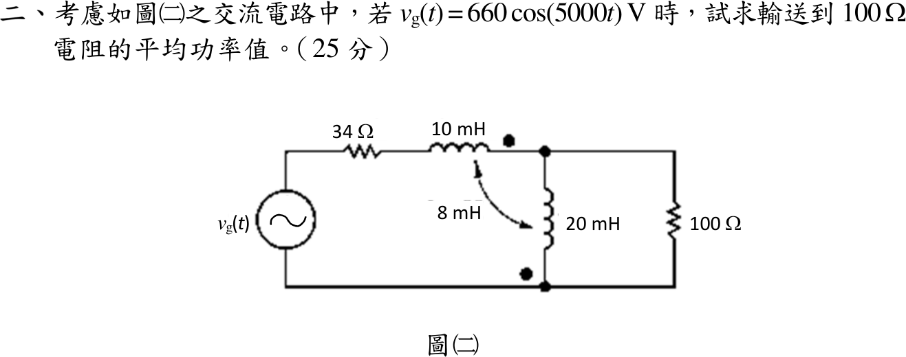
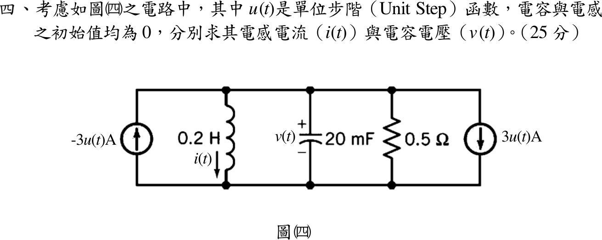

# 📝 112 年電機工程技師｜電路學逐題詳解

> 本頁由題級 canonical 筆記組合；每題保留官方裁切圖、校驗狀態與可追溯的推導。

## 題目導覽
- [[#一、112 年電路學第 1 題｜電阻等效與電源功率|第 1 題：電阻等效與電源功率]]
- [[#二、112 年電路學第 2 題｜互感電路與負載平均功率|第 2 題：互感電路與負載平均功率]]
- [[#三、112 年電路學第 3 題｜含 CCVS 的諾頓等效|第 3 題：含 CCVS 的諾頓等效]]
- [[#四、112 年電路學第 4 題｜並聯 RLC 步階響應|第 4 題：並聯 RLC 步階響應]]

---

## 一、112 年電路學第 1 題｜電阻等效與電源功率

> 題級識別：EE-112-01-1
> canonical 來源：[[canonical/EE-112-01-1.md]]
> 題級校驗狀態：verified

### 已知與所求

120 V 電源正端經 5 kΩ 接橋頂點 \(T\)，負端接橋底點 \(B\)。橋內：\(T\)–\(L\) 6 kΩ、\(T\)–\(R\) 18 kΩ、\(L\)–\(R\) 12 kΩ、\(L\)–\(B\) 4 kΩ、\(R\)–\(B\) 6 kΩ。求 120 V 電源產生的功率（25 分）。

### 考場標準作答

將 \(T,L,R\) 的 Δ（\(6+18+12=36\ \mathrm{k\Omega}\)）轉 Y：
\[
R_T=\frac{6\times18}{36}=3,\quad R_L=\frac{6\times12}{36}=2,\quad R_R=\frac{18\times12}{36}=6\ \mathrm{k\Omega}
\]
中心點到 \(B\)：\((2+4)\parallel(6+6)=6\parallel12=4\ \mathrm{k\Omega}\)，橋等效 \(3+4=7\ \mathrm{k\Omega}\)。
\[
I_s=\frac{120}{5+7}\ \mathrm{mA}=10\ \mathrm{mA},\qquad
\boxed{P_s=120\times0.01=1.2\ \mathrm W\ \text{（提供）}}
\]

### 驗算

以 \(B\) 為參考做節點檢查：橋兩端電壓 \(V_{TB}=10\ \mathrm{mA}\times7\ \mathrm{k\Omega}=70\ \mathrm V\)，節點方程解得 \(v_L=\frac{80}{3}\ \mathrm V\)、\(v_R=20\ \mathrm V\)。由 \(T\) 流出 \(\frac{70-80/3}{6}+\frac{70-20}{18}=7.222+2.778=10\ \mathrm{mA}\)；\(L\) 節點 \(\frac{80/3}{4}=6.667=7.222-\frac{80/3-20}{12}=7.222-0.556\ \mathrm{mA}\)，KCL 成立。

### 失分點

- 此橋 \(6/4\neq18/6\) 不平衡，12 kΩ 有電流，不能直接刪去（刪去會得 \(10\parallel24=7.06\ \mathrm{k\Omega}\)）。
- 漏掉外部 5 kΩ 而得 \(120^2/7\mathrm k=2.06\ \mathrm W\)。

---

## 二、112 年電路學第 2 題｜互感電路與負載平均功率

> 題級識別：EE-112-01-2
> canonical 來源：[[canonical/EE-112-01-2.md]]
> 題級校驗狀態：verified

### 已知與所求

\(v_g=660\cos(5000t)\ \mathrm V\) 串 34 Ω、\(L_1=10\ \mathrm{mH}\)（同名端在右端）至上方節點；\(L_2=20\ \mathrm{mH}\) 由上方節點接到底線（同名端在下端），\(M=8\ \mathrm{mH}\)；100 Ω 與 \(L_2\) 並聯。求 100 Ω 的平均功率（25 分）。

### 考場標準作答

\(\omega L_1=50\ \Omega\)、\(\omega L_2=100\ \Omega\)、\(\omega M=40\ \Omega\)，峰值相量。網目電流 \(\mathbf I_1\)（左網目順時針）、\(\mathbf I_2\)（右網目順時針），\(L_2\) 向下電流為 \(\mathbf I_1-\mathbf I_2\)。

\(\mathbf I_1\) 由 \(L_1\) 左端（非點端）流入，\(\mathbf I_1-\mathbf I_2\) 由 \(L_2\) 上端（非點端）流入，兩者同由非點端流入，互感項取正：
\[
\begin{aligned}
\text{左網目：}&\ 660=(34+j50)\mathbf I_1+j40(\mathbf I_1-\mathbf I_2)+j100(\mathbf I_1-\mathbf I_2)+j40\mathbf I_1\\
\text{右網目：}&\ 0=100\mathbf I_2-\left[j100(\mathbf I_1-\mathbf I_2)+j40\mathbf I_1\right]
\end{aligned}
\]
右網目得 \((100+j100)\mathbf I_2=j140\mathbf I_1\Rightarrow \mathbf I_2=(0.7+j0.7)\mathbf I_1\)。代入左網目：
\[
660=\left[34+j230-j140(0.7+j0.7)\right]\mathbf I_1=(132+j132)\mathbf I_1
\Rightarrow \mathbf I_1=\frac{5}{1+j}=2.5-j2.5\ \mathrm A
\]
\[
\mathbf I_2=(0.7+j0.7)(2.5-j2.5)=3.5\ \mathrm A,\qquad
\boxed{P_{100\Omega}=\frac{3.5^2}{2}\times100=612.5\ \mathrm W}
\]

### 驗算

T 型等效：兩線圈共接上方節點，該處為 \(L_1\) 點端、\(L_2\) 非點端（異名端相接），等效為 \(L_1+M=18\ \mathrm{mH}\)（\(j90\)）、\(L_2+M=28\ \mathrm{mH}\)（\(j140\)），共同支路 \(-M\)（\(-j40\)）接上方節點。由內部節點看出：
\[
j140\parallel(100-j40)=98+j42,\qquad Z_{\mathrm{in}}=34+j90+98+j42=132+j132\ \Omega
\]
100 Ω 分流 \(\mathbf I_1\dfrac{j140}{100+j100}=\mathbf I_1(0.7+j0.7)=3.5\ \mathrm A\)。功率守恆：電源 \(\frac12\mathrm{Re}(660\,\mathbf I_1^*)=825\ \mathrm W=\frac12(5^2/2)(34)+612.5=212.5+612.5\)。

### 失分點

- \(L_2\) 上的互感電壓寫成 \(-j40\mathbf I_1\)，且漏掉 \(L_1\) 上由 \(L_2\) 電流感應的 \(j40(\mathbf I_1-\mathbf I_2)\)，會得錯誤的 \(373.5\ \mathrm W\)。
- 峰值相量求平均功率須除以 2；若用 \(|\mathbf I|^2R\) 會得 1225 W。

---

## 三、112 年電路學第 3 題｜含 CCVS 的諾頓等效

> 題級識別：EE-112-01-3
> canonical 來源：[[canonical/EE-112-01-3.md]]
> 題級校驗狀態：verified

### 已知與所求

\(v_s=8\ \mathrm V\) 串 \(R_1\)（\(i_x\) 向右）至節點 \(v_1\)，\(R_2\) 由 \(v_1\) 接地；CCVS \(ri_x\)（\(r=5\ \Omega\)）左正右負接於 \(v_1\) 與輸出節點 \(v_2\) 之間；\(R_3\) 由 \(v_2\) 接地，\(R_L\) 接在 \(v_2\) 與地。\(R_1=R_2=R_3=10\ \Omega\)。求 \(R_L\) 端看入的諾頓等效（25 分）。

### 考場標準作答

\[
i_x=\frac{8-v_1}{10},\qquad v_1-v_2=5i_x
\]

**開路電壓**：CCVS 電流等於 \(R_3\) 電流 \(v_2/10\)，\(v_1\) 節點 KCL：\(i_x=\frac{v_1}{10}+\frac{v_2}{10}\Rightarrow 2v_1+v_2=8\)；又 \(v_2=v_1-\frac{8-v_1}{2}=\frac32v_1-4\)。解得 \(v_1=\frac{24}{7}\ \mathrm V\)，
\[
V_{oc}=\frac87\ \mathrm V
\]

**短路電流**：\(v_2=0\Rightarrow v_1=5\cdot\frac{8-v_1}{10}\Rightarrow v_1=\frac83\ \mathrm V\)，\(i_x=\frac8{15}\ \mathrm A\)，\(R_3\) 無電流：
\[
I_{sc}=i_x-\frac{v_1}{10}=\frac8{15}-\frac4{15}=\frac4{15}\ \mathrm A
\]

**諾頓等效**：
\[
\boxed{I_N=\frac4{15}=0.2667\ \mathrm A},\qquad
\boxed{R_N=\frac{V_{oc}}{I_{sc}}=\frac{30}{7}=4.286\ \Omega}
\]
\(I_N\) 與 \(R_N\) 並聯接於負載兩端，電流源箭頭指向上端（\(v_2\) 端）。

### 驗算

測試源法：\(v_s\) 短路、保留 CCVS，在輸出端加 \(v_2\)。\(i_x=-v_1/10\)，\(v_1-v_2=-v_1/2\Rightarrow v_1=\frac23v_2\)。測試電流 \(i_t=\frac{v_2}{10}+\frac{v_1}{10}+\frac{v_1}{10}=\frac{v_2}{10}+\frac{2v_2}{15}=\frac7{30}v_2\)，\(R_N=\frac{30}7\ \Omega\)，與 \(V_{oc}/I_{sc}\) 一致。

### 失分點

- 求 \(R_N\) 時把 CCVS 短路（相依源歸零），會得 \(10\parallel(10\parallel10)=3.33\ \Omega\)。
- 短路時 \(i_x\) 會改變（\(\frac{16}{35}\to\frac8{15}\ \mathrm A\)），不可沿用開路時的 \(i_x\)。

---

## 四、112 年電路學第 4 題｜並聯 RLC 步階響應

> 題級識別：EE-112-01-4
> canonical 來源：[[canonical/EE-112-01-4.md]]
> 題級校驗狀態：verified

### 已知與所求

上下兩節點間並接：\(-3u(t)\ \mathrm A\) 電流源（箭頭向上）、\(0.2\ \mathrm H\)（\(i\) 向下）、\(20\ \mathrm{mF}\)（\(v\) 上正）、\(0.5\ \Omega\)、\(3u(t)\ \mathrm A\) 電流源（箭頭向下）。初值皆為 0。求 \(i(t)\) 與 \(v(t)\)（25 分）。

### 考場標準作答

注入上節點的總電流 \(i_s=-3u(t)-3u(t)=-6u(t)\ \mathrm A\)。KCL 與 \(v=L\dot i\)：
\[
i+C\dot v+\frac vR=-6\;\Rightarrow\;\ddot i+\frac1{RC}\dot i+\frac1{LC}i=-\frac6{LC}
\;\Rightarrow\;\ddot i+100\dot i+250i=-1500
\]
\(s^2+100s+250=0\Rightarrow s_{1,2}=-50\pm15\sqrt{10}\approx-2.566,\,-97.434\ \mathrm{s^{-1}}\)（過阻尼）。特解 \(i_p=-6\,\mathrm A\)：
\[
i(t)=-6+A_1e^{s_1t}+A_2e^{s_2t},\qquad A_1+A_2=6,\quad s_1A_1+s_2A_2=0
\]
（後式來自 \(v(0^+)=L\dot i(0^+)=0\)），解得 \(A_1=3+\sqrt{10}\)、\(A_2=3-\sqrt{10}\)。
\[
\boxed{i(t)=\left[-6+(3+\sqrt{10})e^{(-50+15\sqrt{10})t}+(3-\sqrt{10})e^{(-50-15\sqrt{10})t}\right]u(t)\ \mathrm A}
\]
由 \(v=L\dot i\)，\(LA_1s_1=-\sqrt{10}\)、\(LA_2s_2=\sqrt{10}\)：
\[
\boxed{v(t)=\sqrt{10}\left[e^{(-50-15\sqrt{10})t}-e^{(-50+15\sqrt{10})t}\right]u(t)\ \mathrm V}
\]

### 驗算

拉氏轉換：\(V(s)=\dfrac{-6/s}{\frac{5}{s}+0.02s+2}=\dfrac{-300}{s^2+100s+250}\)，反轉換
\[
v(t)=\frac{-300}{s_1-s_2}\left(e^{s_1t}-e^{s_2t}\right)=\frac{-300}{30\sqrt{10}}\left(e^{s_1t}-e^{s_2t}\right)=-\sqrt{10}\left(e^{s_1t}-e^{s_2t}\right)
\]
與上式相同；終值定理 \(i(\infty)=\lim_{s\to0}s\frac{V(s)}{0.2s}=\frac{-300}{0.2(250)}=-6\ \mathrm A\)。

### 失分點

- 左源箭頭向上但數值為 \(-3u(t)\)，等同 3 A 流出；誤判兩源相消會得 \(i=v=0\)。
- \(C=20\ \mathrm{mF}=0.02\ \mathrm F\)；誤用 \(20\ \mu\mathrm F\) 會使特徵根全錯。
- 只寫自然響應，漏掉直流特解 \(-6\ \mathrm A\)。

---
