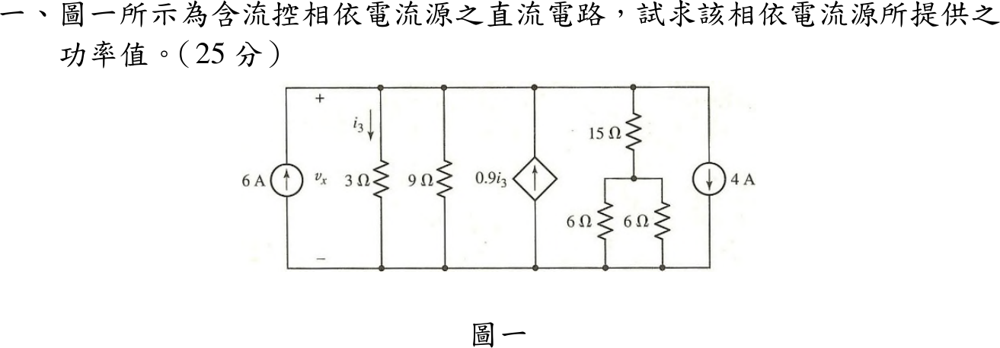
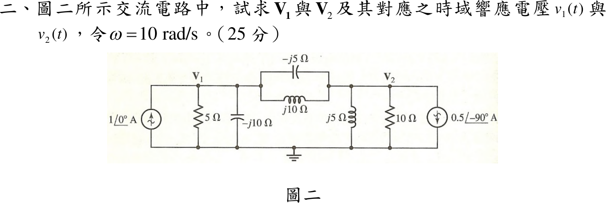
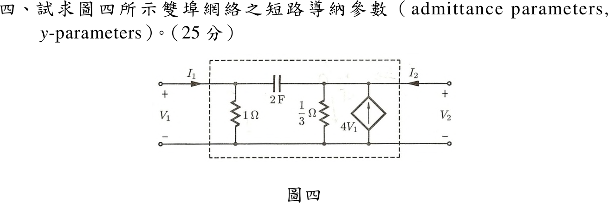

# 📝 113 年電機工程技師｜電路學逐題詳解

> 本頁由題級 canonical 筆記組合；每題保留官方裁切圖、校驗狀態與可追溯的推導。

## 題目導覽
- [[#一、113 年電路學第 1 題｜相依電流源提供功率|第 1 題：相依電流源提供功率]]
- [[#二、113 年電路學第 2 題｜交流節點相量與時域電壓|第 2 題：交流節點相量與時域電壓]]
- [[#三、113 年電路學第 3 題｜三相 \(\Delta\) 磁耦合線電流|第 3 題：三相 \(\Delta\) 磁耦合線電流]]
- [[#四、113 年電路學第 4 題｜雙埠網路 \(y\) 參數|第 4 題：雙埠網路 \(y\) 參數]]

---

## 一、113 年電路學第 1 題｜相依電流源提供功率

> 題級識別：EE-113-01-1
> canonical 來源：[[canonical/EE-113-01-1.md]]
> 題級校驗狀態：verified

### 已知與所求

所有元件並接於上、下兩條導線之間，上端電壓為 \(v_x\)（下端為參考）：6 A 向上、3 Ω（\(i_3\) 向下）、9 Ω、相依源 \(0.9i_3\) 向上、\(15\,\Omega+(6\parallel6)\)、4 A 向下。求相依電流源提供的功率（25 分）。

### 考場標準作答

右側支路 \(15+6\parallel6=18\ \Omega\)，\(i_3=v_x/3\)。上端節點 KCL（向上注入＝向下流出）：
\[
6+0.9\frac{v_x}{3}=\frac{v_x}{3}+\frac{v_x}{9}+\frac{v_x}{18}+4
\;\Rightarrow\;2=(0.5-0.3)v_x
\;\Rightarrow\;v_x=10\ \mathrm V
\]
相依源電流 \(0.9i_3=0.9\times\frac{10}{3}=3\ \mathrm A\)，由高電位端（上端）流出，故為提供功率：
\[
\boxed{P_{\mathrm{dep}}=v_x(0.9i_3)=10\times3=30\ \mathrm W\ \text{（提供）}}
\]

### 驗算

功率守恆：電源提供 \(6(10)+30=90\ \mathrm W\)；電阻吸收 \(\frac{100}{3}+\frac{100}{9}+\frac{100}{18}=50\ \mathrm W\)，4 A 源（電流由上端流入）吸收 \(40\ \mathrm W\)，合計 \(90\ \mathrm W\)。

### 失分點

- 4 A 向下是由節點流出；當成注入會得 \(10=0.2v_x\)、\(v_x=50\ \mathrm V\)。
- 右側 6 Ω 兩電阻為並聯（3 Ω）後再串 15 Ω，不是 \(15\parallel6\parallel6\)。

---

## 二、113 年電路學第 2 題｜交流節點相量與時域電壓

> 題級識別：EE-113-01-2
> canonical 來源：[[canonical/EE-113-01-2.md]]
> 題級校驗狀態：verified

### 已知與所求

\(\omega=10\ \mathrm{rad/s}\)。節點 \(\mathbf V_1\)：\(1\angle0^\circ\ \mathrm A\) 向上注入、5 Ω 與 \(-j10\ \Omega\) 接地；\(\mathbf V_1\)–\(\mathbf V_2\) 間為 \(-j5\ \Omega\) 與 \(j10\ \Omega\) 並聯；節點 \(\mathbf V_2\)：\(j5\ \Omega\)、10 Ω 接地，\(0.5\angle-90^\circ\ \mathrm A\) 電流源箭頭向下（流出 \(\mathbf V_2\)）。求 \(\mathbf V_1,\mathbf V_2\) 及 \(v_1(t),v_2(t)\)（25 分）。

### 考場標準作答

串接段 \(Z_{12}=\dfrac{(-j5)(j10)}{j5}=-j10\ \Omega\)，\(Y_{12}=j0.1\ \mathrm S\)。右側源流出 \(-j0.5\)，即注入 \(+j0.5\ \mathrm A\)。節點方程：
\[
\begin{aligned}
(0.2+j0.1+j0.1)\mathbf V_1-j0.1\mathbf V_2&=1\\
-j0.1\mathbf V_1+(0.1-j0.2+j0.1)\mathbf V_2&=j0.5
\end{aligned}
\]
克拉瑪法則：\(\Delta=(0.2+j0.2)(0.1-j0.1)+0.01=0.05\)，
\[
\mathbf V_1=\frac{(0.1-j0.1)+j0.1(j0.5)}{0.05}=1-j2,\qquad
\mathbf V_2=\frac{(0.2+j0.2)(j0.5)+j0.1}{0.05}=-2+j4
\]
\[
\boxed{\mathbf V_1=1-j2=\sqrt5\angle-63.43^\circ\ \mathrm V},\qquad
\boxed{\mathbf V_2=-2+j4=\sqrt{20}\angle116.57^\circ\ \mathrm V}
\]
題目只給相量，依慣例以餘弦、峰值相量還原：
\[
\boxed{v_1(t)=2.236\cos(10t-63.43^\circ)\ \mathrm V},\qquad
\boxed{v_2(t)=4.472\cos(10t+116.57^\circ)\ \mathrm V}
\]

### 驗算

逐元件 KCL。\(\mathbf V_2\) 節點流出：\(\frac{\mathbf V_2}{j5}=0.8+j0.4\)、\(\frac{\mathbf V_2}{10}=-0.2+j0.4\)、電流源 \(-j0.5\)，合計 \(0.6+j0.3\)；由 \(\mathbf V_1\) 流來 \(j0.1(\mathbf V_1-\mathbf V_2)=j0.1(3-j6)=0.6+j0.3\)，相等。
\(\mathbf V_1\) 節點流出：\(\frac{\mathbf V_1}{5}+\frac{\mathbf V_1}{-j10}+0.6+j0.3=(0.2-j0.4)+(0.2+j0.1)+(0.6+j0.3)=1\ \mathrm A\)，等於注入。

### 失分點

- 右側源箭頭向下（流出節點），若當成注入 \(-j0.5\) 會得 \(V_1=3-j2\ \mathrm V\)、\(V_2=2\ \mathrm V\)。
- \(-j5\) 與 \(j10\) 並聯為 \(-j10\)（容性），不可串聯相加成 \(j5\)。

---

## 三、113 年電路學第 3 題｜三相 \(\Delta\) 磁耦合線電流

> 題級識別：EE-113-01-3
> canonical 來源：[[canonical/EE-113-01-3.md]]
> 題級校驗狀態：verified

### 已知與所求

Δ 接負載每邊為 \(R=1\ \Omega\) 串 \(L=2\ \mathrm H\)，任兩電感間互感 \(M=1\ \mathrm H\)；三個同名端都在電感緊鄰電阻的一端，即支路電流取 \(a\to b\)、\(b\to c\)、\(c\to a\) 時皆由點端流入。正相序平衡電源，\(v_{ab}(t)=110\sqrt2\sin(t+25^\circ)\ \mathrm V\)。求 \(i_a(t)\)（25 分）。

### 考場標準作答

\(\omega=1\ \mathrm{rad/s}\)，採正弦基準峰值相量 \(\mathbf V_{ab}=110\sqrt2\angle25^\circ\)。三支路電流皆由點端流入，互感項同號：
\[
\mathbf V_{ab}=(R+j\omega L)\mathbf I_{ab}+j\omega M(\mathbf I_{bc}+\mathbf I_{ca})
\]
平衡時 \(\mathbf I_{bc}+\mathbf I_{ca}=-\mathbf I_{ab}\)，故
\[
Z_\phi=R+j\omega(L-M)=1+j1=\sqrt2\angle45^\circ\ \Omega,\qquad
\mathbf I_{ab}=\frac{110\sqrt2\angle25^\circ}{\sqrt2\angle45^\circ}=110\angle-20^\circ\ \mathrm A
\]
正相序 Δ 接線電流 \(\mathbf I_a=\mathbf I_{ab}-\mathbf I_{ca}=\sqrt3\,\mathbf I_{ab}\angle-30^\circ=110\sqrt3\angle-50^\circ\ \mathrm A\)：
\[
\boxed{i_a(t)=110\sqrt3\sin(t-50^\circ)=190.5\sin(t-50^\circ)\ \mathrm A}
\]

### 驗算

Δ–Y 等效：\(Z_Y=Z_\phi/3=\frac{\sqrt2}{3}\angle45^\circ\)，\(\mathbf V_{an}=\frac{110\sqrt2}{\sqrt3}\angle(25^\circ-30^\circ)\)，
\[
\mathbf I_a=\frac{\mathbf V_{an}}{Z_Y}=\frac{110\sqrt2\cdot3}{\sqrt3\cdot\sqrt2}\angle(-5^\circ-45^\circ)=110\sqrt3\angle-50^\circ\ \mathrm A
\]
與直接由支路電流求得者一致。

### 失分點

- 互感當成串聯 \(L+2M\) 或忽略同名端寫 \(L+M\)，會分別得 \(Z_\phi=1+j4\) 或 \(1+j3\)。
- 把支路電流 \(110\angle-20^\circ\) 當作線電流，漏乘 \(\sqrt3\angle-30^\circ\)。
- 正弦基準相量回時域時改寫成 \(\cos\) 而未補 \(90^\circ\)。

---

## 四、113 年電路學第 4 題｜雙埠網路 \(y\) 參數

> 題級識別：EE-113-01-4
> canonical 來源：[[canonical/EE-113-01-4.md]]
> 題級校驗狀態：verified

### 已知與所求

埠 1 上端對地接 1 Ω；兩埠上端之間串 2 F 電容；埠 2 上端對地接 \(\frac13\ \Omega\) 及相依電流源 \(4V_1\)（箭頭向上，注入埠 2 上端）。\(I_1,I_2\) 皆流入網路。求短路導納參數（25 分）。

### 考場標準作答

\(s\) 域電容導納 \(2s\)。埠 1 上端 KCL：
\[
I_1=V_1+2s(V_1-V_2)=(1+2s)V_1-2sV_2
\]
埠 2 上端 KCL（相依源注入 \(4V_1\)，故流出項為 \(-4V_1\)）：
\[
I_2=3V_2+2s(V_2-V_1)-4V_1=-(2s+4)V_1+(2s+3)V_2
\]
\[
\boxed{\mathbf Y(s)=\begin{bmatrix}1+2s & -2s\\ -(2s+4) & 2s+3\end{bmatrix}\ \mathrm S}
\]
正弦穩態代 \(s=j\omega\)：\(y_{11}=1+j2\omega\)、\(y_{12}=-j2\omega\)、\(y_{21}=-4-j2\omega\)、\(y_{22}=3+j2\omega\)。

### 驗算

視為四個子雙埠並聯，\(\mathbf Y\) 相加：
\[
\underbrace{\begin{bmatrix}1&0\\0&0\end{bmatrix}}_{1\,\Omega}
+\underbrace{\begin{bmatrix}2s&-2s\\-2s&2s\end{bmatrix}}_{2\,\mathrm F}
+\underbrace{\begin{bmatrix}0&0\\0&3\end{bmatrix}}_{1/3\,\Omega}
+\underbrace{\begin{bmatrix}0&0\\-4&0\end{bmatrix}}_{4V_1}
\]
與上式相同；且 \(y_{12}\neq y_{21}\)，符合含相依源網路不互易。

### 失分點

- 相依源向上注入埠 2，\(y_{21}\) 應為 \(-(2s+4)\)；符號反向會得 \(4-2s\)。
- 把 \(\frac13\ \Omega\) 的導納寫成 \(\frac13\ \mathrm S\)，\(y_{22}\) 應含 3。

---
