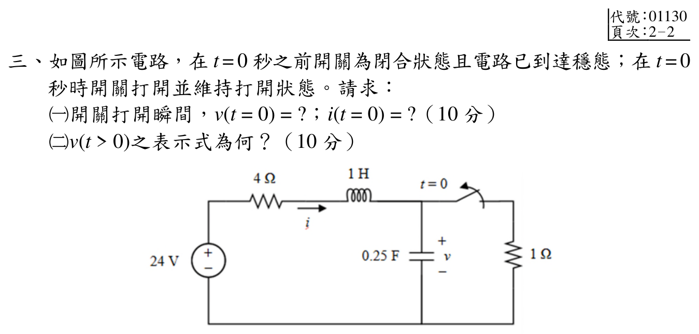
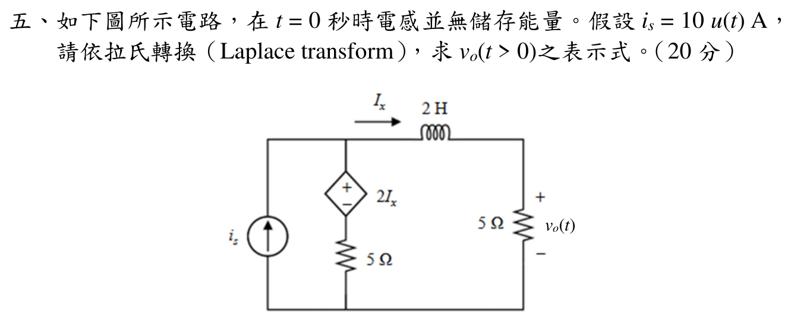

# 📝 114 年電機工程技師｜電路學逐題詳解

> 本頁由題級 canonical 筆記組合；每題保留 QID、官方裁切、校驗狀態與完整得分型解答。

## 題目導覽
- [[#一、114 年電路學第 1 題｜節點電壓法與超節點|第 1 題：節點電壓法與超節點]]
- [[#二、114 年電路學第 2 題｜諾頓等效|第 2 題：諾頓等效]]
- [[#三、114 年電路學第 3 題｜二階 RLC 暫態|第 3 題：二階 RLC 暫態]]
- [[#四、114 年電路學第 4 題｜不同頻率的重疊定理|第 4 題：不同頻率的重疊定理]]
- [[#五、114 年電路學第 5 題｜拉氏轉換與含相依源電路|第 5 題：拉氏轉換與含相依源電路]]

---

## 一、114 年電路學第 1 題｜節點電壓法與超節點

> 題級識別：`EE-114-01-1`
> canonical 來源：`canonical/EE-114-01-1.md`
> 題級校驗狀態：`verified`

![[依考科分類/01_電路學/images/questions/PE_114年_電路學_Q01.png]]

> 官方裁切來源：`依考科分類/01_電路學/images/questions/PE_114年_電路學_Q01.png`

### 考場標準作答

以底線為參考地。由左側 2 Ω 電阻的電流定義，
> 6 Ω 連接 \(v_1\) 與 \(v_3\)，屬超節點內部支路。
\[
I=\frac{v_1}{2}.
\]
25 V 電壓源與相依電壓源把 (v_1,v_2,v_3) 連成同一超節點，故
\[
v_1-v_2=25,
\qquad
v_3-v_2=5I=\frac52v_1.
\]
超節點邊界 KCL（6 Ω 是超節點內部支路，不列入）為
\[
\frac{v_1}{2}+\frac{v_2}{4}+\frac{v_3}{3}=0.
\]
聯立得
\[
\boxed{v_1=\frac{175}{23}=7.6087\text{ V}},
\quad
\boxed{v_2=-\frac{400}{23}=-17.3913\text{ V}},
\]
\[
\boxed{v_3=\frac{75}{46}=1.6304\text{ V}},
\qquad
\boxed{I=\frac{175}{46}=3.8043\text{ A}}.
\]

### 得分點拆解

- 以接地線為參考，正確讀出 (I=v_1/2)。
- 兩個電壓源相連的三個節點必須視為一個超節點。
- 正確寫出 (v_1-v_2=25) 與 (v_3-v_2=5I)，並保留相依源極性。
- 超節點 KCL 只列流向地的 2 Ω、4 Ω、3 Ω 支路；6 Ω 不能列入。
- 三個節點電壓與電流均標示單位，且代回兩個源約束。

### 完整教學推導

由 25 V 源左正右負，
\[
v_2=v_1-25.
\]
相依源右端為正，故
\[
v_3-v_2=5I=5\left(\frac{v_1}{2}\right)=\frac52v_1,
\qquad
v_3=\frac72v_1-25.
\]
把 (v_2,v_3) 代入超節點 KCL：
\[
\frac{v_1}{2}+\frac{v_1-25}{4}+\frac{\frac72v_1-25}{3}=0.
\]
乘以 12：
\[
6v_1+3v_1-75+14v_1-100=0,
\qquad 23v_1=175.
\]
因此
\[
v_1=\frac{175}{23}\ \mathrm V,
\quad
v_2=-\frac{400}{23}\ \mathrm V,
\quad
v_3=\frac{75}{46}\ \mathrm V,
\quad
I=\frac{175}{46}\ \mathrm A.
\]

### 獨立驗算

源約束殘差為
\[
v_1-v_2-25=0,
\qquad
v_3-v_2-5I=0.
\]
超節點 KCL 代回為
\[
\frac{175/23}{2}+\frac{-400/23}{4}+\frac{75/46}{3}
=\frac{175-200+25}{46}=0.
\]
三式皆成立；6 Ω 支路只在超節點內部交換電流，不影響邊界 KCL。

### 常見失分

- 將 6 Ω 內部支路列入超節點 KCL，造成重複計算。
- 把相依源的 (5I) 極性寫成 (v_2-v_3)。
- 忘記 (I) 的箭頭向下，直接寫成 (-v_1/2)。
- 只列一個電壓源約束，導致三個節點未知數無法閉合。

---

## 二、114 年電路學第 2 題｜諾頓等效

> 題級識別：`EE-114-01-2`
> canonical 來源：`canonical/EE-114-01-2.md`
> 題級校驗狀態：`verified`

![[依考科分類/01_電路學/images/questions/PE_114年_電路學_Q02.png]]

> 官方裁切來源：`依考科分類/01_電路學/images/questions/PE_114年_電路學_Q02.png`

### 考場標準作答

令 (b) 為參考地，且圖示 2 Ω 電阻兩端 (v_x=v_a)。相依電壓源給出
\[
v_n-v_a=2v_x=2v_a,
\qquad v_n=3v_a.
\]
端口開路時，含相依源的超節點 KCL 為
\[
\frac{v_n}{6}+\frac{v_a}{2}=10.
\]
代入 (v_n=3v_a)：
\[
v_a=10\ \mathrm V,\qquad V_{th}=10\ \mathrm V.
\]

關閉獨立 10 A 電流源（開路），接上測試電壓 (V_t=v_a)。仍有 (v_n=3V_t)，測試電流為
\[
i_t=\frac{v_n}{6}+\frac{v_a}{2}=V_t.
\]
所以
\[
R_N=R_{th}=1\ \Omega,\qquad I_N=\frac{V_{th}}{R_N}=10\ \mathrm A.
\]
\[
\boxed{I_N=10\ \mathrm A\ \text{（由 }a\text{ 流向 }b\text{）}},
\qquad \boxed{R_N=1\ \Omega}.
\]

### 得分點拆解

- 正確指定 (b) 為地，並辨認 (v_x=v_a)。
- 保留相依電壓源，寫出 (v_n-v_a=2v_x)。
- 求開路電壓時，2 Ω 電阻仍是原網路的一部分。
- 求 (R_N) 時只關閉獨立電流源；相依源必須保留並使用測試源。
- 由 (V_{th}/R_N) 或端口短路電流得到 Norton 電流並標明方向。

### 完整教學推導

因 (b=0)，
\[
v_x=v_a,\qquad v_n=3v_a.
\]
開路端口不代表內部 2 Ω 電阻消失；它仍跨接 (a-b)。10 A 電流源向超節點注入電流，因此
\[
\frac{v_n}{6}+\frac{v_a}{2}=10
\Longrightarrow
\frac{3v_a}{6}+\frac{v_a}{2}=10
\Longrightarrow v_a=10\ \mathrm V.
\]

求等效電阻時，10 A 理想電流源關閉為開路。令測試端電壓為 (V_t)，則
\[
v_a=V_t,\qquad v_n=3V_t,\qquad
i_t=\frac{3V_t}{6}+\frac{V_t}{2}=V_t.
\]
\[
R_N=\frac{V_t}{i_t}=1\ \Omega,\qquad
I_N=\frac{10}{1}=10\ \mathrm A.
\]

### 獨立驗算

把端口短路，(v_a=v_x=0)，相依源約束使 (v_n=0)。6 Ω 與 2 Ω 電阻均無電流，10 A 電流源的電流全部經端口短路由 (a) 流向 (b)，所以
\[
i_{sc}=10\ \mathrm A=I_N.
\]
並且 (V_{th}=I_NR_N=(10)(1)=10\ \mathrm V)，與開路法一致。

### 常見失分

- 將相依源誤當成獨立源關閉。
- 求 (R_N) 時只看 2 Ω 電阻，忽略相依源造成的 6 Ω 支路電流。
- 把 (v_x) 的極性看反，誤寫成 (v_x=-v_a)。
- 把 10 A Norton 電流方向寫成由 (b) 流向 (a)。

---

## 三、114 年電路學第 3 題｜二階 RLC 暫態

> 題級識別：`EE-114-01-3`
> canonical 來源：`canonical/EE-114-01-3.md`
> 題級校驗狀態：`verified`

![[依考科分類/01_電路學/images/questions/PE_114年_電路學_Q03.png]]

> 官方裁切來源：`依考科分類/01_電路學/images/questions/PE_114年_電路學_Q03.png`

### 考場標準作答

#### （一）\(t=0\) 的初值（10 分）

\(t<0\) 已達直流穩態，故電感視為短路、電容視為開路：

\[
i(0^-)=\frac{24}{4+1}=4.8\,\mathrm{A},\qquad
v(0^-)=1\cdot i(0^-)=4.8\,\mathrm{V}.
\]

由電感電流與電容電壓連續性，

\[
\boxed{i(0^+)=4.8\,\mathrm{A}},\qquad
\boxed{v(0^+)=4.8\,\mathrm{V}}.
\]

#### （二）\(v(t>0)\)（10 分）

開關打開後 \(i=C\dot v=0.25\dot v\)，由 KVL：

\[
24=4i+\dot i+v
\quad\Longrightarrow\quad
\ddot v+4\dot v+4v=96.
\]

又

\[
v(0^+)=4.8,\qquad
\dot v(0^+)=\frac{i(0^+)}{C}=19.2.
\]

因此

\[
\boxed{v(t)=24-19.2(1+t)e^{-2t}\ \mathrm{V},\quad t>0}.
\]

### 得分點拆解

- （一）先畫出或寫明「電感短路、電容開路」的穩態等效，再算出 \(i(0^-)\)、\(v(0^-)\)。
- （一）必須明寫電感電流與電容電壓的連續性，不能只跳到 \(t=0^+\) 的答案。
- （二）列出 \(i=C\dot v\) 與 KVL，形成二階微分方程。
- （二）同時使用 \(v(0^+)\) 與 \(\dot v(0^+)\) 決定兩個常數，最後標示單位與 \(t>0\)。

### 完整教學推導

特徵方程為

\[
s^2+4s+4=(s+2)^2=0,
\]

故

\[
v(t)=24+(A+Bt)e^{-2t}.
\]

由 \(v(0)=4.8\) 得 \(A=-19.2\)。又

\[
\dot v(0)=B-2A=19.2,
\]

所以 \(B=-19.2\)，得到標準作答中的結果。若順便求電流，

\[
i(t)=C\dot v(t)=\boxed{4.8(1+2t)e^{-2t}\ \mathrm{A}}.
\]

### 獨立驗算

- 初值：\(v(0)=4.8\,\mathrm V\)，且 \(i(0)=0.25\dot v(0)=4.8\,\mathrm A\)。
- 終值：\(v(\infty)=24\,\mathrm V\)、\(i(\infty)=0\)，符合直流穩態時電容開路。
- 令 \(f(t)=e^{-2t}\)，則 \(i(t)=4.8(1+2t)f(t)\)、\(\dot i(t)=-19.2t f(t)\)。逐項代回開關後的 KVL：

\[
4i+\dot i+v
=19.2(1+2t)f-19.2tf+24-19.2(1+t)f
=24\ \mathrm V.
\]

- 再用能量收支檢查開關瞬間。電源輸入 \(24i(0^+)=115.2\,\mathrm W\)，\(4\,\Omega\) 電阻耗損 \(4i(0^+)^2=92.16\,\mathrm W\)；電感在此瞬間有 \(\dot i(0^+)=0\)，電容儲能變化率為 \(Cv(0^+)\dot v(0^+)=0.25(4.8)(19.2)=23.04\,\mathrm W\)。因此 \(115.2=92.16+23.04\)，與 KVL/KCL 得出的狀態一致。

### 常見失分

- 把開關打開後仍存在的 \(4\,\Omega\) 電阻漏掉，或把已被切離的 \(1\,\Omega\) 電阻留在方程式中。
- 只用 \(v(0^+)\) 而漏用 \(i(0^+)=C\dot v(0^+)\)，導致重根解少一個條件。
- 把電容電流寫成 \(i=\dot v/C\)，或忘記初、終值的單位。

---

## 四、114 年電路學第 4 題｜不同頻率的重疊定理

> 題級識別：`EE-114-01-4`
> canonical 來源：`canonical/EE-114-01-4.md`
> 題級校驗狀態：`verified`

![[依考科分類/01_電路學/images/questions/PE_114年_電路學_Q04.png]]

> 官方裁切來源：`依考科分類/01_電路學/images/questions/PE_114年_電路學_Q04.png`

### 考場標準作答

輸出節點的並聯電容與電感導納為
\[
Y(j\omega)=j\omega C+\frac1{j\omega L}
=j\left(0.2\omega-\frac1\omega\right).
\]
對 (75\sin(5t)) V 電壓源，將 6 cos(10t) A 電流源開路：
\[
Y_5=j0.8,\qquad H_5=\frac1{1+8Y_5}=\frac1{1+j6.4}.
\]
所以
\[
v_{o,5}(t)=\frac{75}{\sqrt{41.96}}\sin(5t-\tan^{-1}6.4)
=11.579\sin(5t-81.123^\circ)\ \mathrm V.
\]
對 (6\cos(10t)) A 電流源，將電壓源短路：
\[
Y_{10}=j1.9,\qquad
\widetilde V_{o,10}=\frac6{j1.9}=3.1579\angle(-90^\circ)\ \mathrm V,
\]
故 (v_{o,10}(t)=3.1579\sin(10t)\ \mathrm V)。
\[
\boxed{v_o(t)=11.579\sin(5t-81.123^\circ)+3.1579\sin(10t)\ \mathrm V}.
\]

### 得分點拆解

- 不同頻率必須分開建立各自的相量電路。
- 求 5 rad/s 分量時電流源開路；求 10 rad/s 分量時電壓源短路。
- 正確使用 (Y_C=j\omega C) 與 (Y_L=1/(j\omega L))。
- 8 Ω 串聯電阻的電壓分壓因子為 (1/(1+8Y))。
- 把兩個不同頻率的輸出回到時域後相加，保留峰值與相位。

### 完整教學推導

令輸出節點對地電壓為 (V_o)。任一頻率下的節點 KCL 為
\[
\frac{V_o-V_s}{8}+YV_o=I_s.
\]
在 5 rad/s，只保留電壓源：
\[
Y_5=j5(0.2)+\frac1{j5(1)}=j0.8,
\]
\[
\frac{V_{o,5}-75}{8}+j0.8V_{o,5}=0
\Longrightarrow
V_{o,5}=\frac{75}{1+j6.4}.
\]
其大小與相位為
\[
|V_{o,5}|=\frac{75}{\sqrt{1+6.4^2}}=11.579\ \mathrm V,
\quad \angle V_{o,5}=-81.123^\circ.
\]

在 10 rad/s，只保留電流源：
\[
Y_{10}=j10(0.2)+\frac1{j10(1)}=j1.9.
\]
電壓源短路後，
\[
Y_{10}V_{o,10}=6,
\qquad V_{o,10}=\frac6{j1.9}=-j3.1579\ \mathrm V.
\]
以餘弦表示為 (3.1579\cos(10t-90^\circ))，等價於 (3.1579\sin(10t))。

### 獨立驗算

5 rad/s 分量代回
\[
\frac{V_{o,5}-75}{8}+j0.8V_{o,5}=0
\]
成立；10 rad/s 分量代回
\[
j1.9(-j3.1579)=6\ \mathrm A
\]
也成立。兩分量各自在自己的頻率通過 KCL，故總輸出符合重疊定理。

### 常見失分

- 把電容或電感的 (j) 號寫反。
- 直接將 5 與 10 rad/s 當成同一相量問題。
- 忘記電壓源分量要開路電流源，或電流源分量要短路電壓源。
- 把 (1/(1+j6.4)) 的相位寫成正 (81.123^\circ)。

---

## 五、114 年電路學第 5 題｜拉氏轉換與含相依源電路

> 題級識別：`EE-114-01-5`
> canonical 來源：`canonical/EE-114-01-5.md`
> 題級校驗狀態：`verified`

![[依考科分類/01_電路學/images/questions/PE_114年_電路學_Q05.png]]

> 官方裁切來源：`依考科分類/01_電路學/images/questions/PE_114年_電路學_Q05.png`

### 考場標準作答

電感 (L=2) H 且初始無能量，因此 (Z_L=2s)。依圖示 (I_x) 向右：
\[
I_x=\frac{V_a-V_o}{2s}.
\]
相依電壓源上正下負，故
\[
V_a-V_c=2I_x,
\qquad V_c=V_a-2I_x.
\]
輸出節點 KCL 與 (V_a,V_c) 超節點 KCL 為
\[
\frac{V_o-V_a}{2s}+\frac{V_o}{5}=0,
\]
\[
\frac{V_a-V_o}{2s}+\frac{V_c}{5}=\frac{10}{s}.
\]
輸出端 5 Ω 電阻不屬於 (V_a,V_c) 超節點。

由輸出 KCL，
\[
V_a-V_o=\frac{2s}{5}V_o,\qquad I_x=\frac{V_o}{5},\qquad
V_c=\frac{3+2s}{5}V_o.
\]
代入超節點式：
\[
\frac{V_o}{5}+\frac{(3+2s)V_o}{25}=\frac{10}{s},
\]
\[
V_o(s)=\frac{125}{s(s+4)}
=\frac{125}{4}\left(\frac1s-\frac1{s+4}\right).
\]
\[
\boxed{v_o(t)=31.25(1-e^{-4t})\ \mathrm V},\qquad t>0.
\]

### 得分點拆解

- 由零初始能量使用 (Z_L=sL=2s)，不加入初始條件項。
- 依 (I_x) 箭頭寫成 ((V_a-V_o)/(2s))。
- 保留 (V_a-V_c=2I_x) 的相依源極性。
- 輸出節點 KCL 與相依源超節點 KCL 必須分開；輸出 5 Ω 電阻不列入前者超節點。
- 做部分分式並檢查 (v_o(0^+)=0) 與終值。

### 完整教學推導

電流源 (i_s=10u(t)) 的拉氏變換為 (I_s(s)=10/s)，電感零初始條件使
\[
I_x=\frac{V_a-V_o}{2s}.
\]
輸出節點只有電感支路與右側 5 Ω 電阻：
\[
\frac{V_o-V_a}{2s}+\frac{V_o}{5}=0.
\tag{1}
\]
令 (d=V_a-V_o)，由 (1) 得
\[
d=\frac{2s}{5}V_o,\qquad I_x=\frac{d}{2s}=\frac{V_o}{5}.
\]
相依電壓源關係為 (V_a-V_c=2I_x)，故
\[
V_c=V_o+d-\frac{2V_o}{5}=\frac{3+2s}{5}V_o.
\tag{2}
\]
對 (V_a,V_c) 超節點列 KCL；超節點向外只有電感支路與中間 5 Ω 電阻：
\[
\frac{V_a-V_o}{2s}+\frac{V_c}{5}=\frac{10}{s}.
\tag{3}
\]
將 (2) 及 (d/(2s)=V_o/5) 代入 (3)：
\[
\frac{V_o}{5}+\frac{(3+2s)V_o}{25}=\frac{10}{s}
\Longrightarrow
V_o(s)=\frac{125}{s(s+4)}.
\]
部分分式為
\[
V_o(s)=\frac{125}{4}\left(\frac1s-\frac1{s+4}\right),
\]
得到題首答案。

### 獨立驗算

初值定理給出
\[
v_o(0^+)=\lim_{s\to\infty}sV_o(s)=0.
\]
終值定理給出
\[
v_o(\infty)=\lim_{s\to0}sV_o(s)=\frac{125}{4}=31.25\ \mathrm V.
\]
直流等效時 (I_x=v_o/5)、(V_c=3v_o/5)，電流源分流為
\[
\frac{v_o}{5}+\frac{3v_o/5}{5}=0.2v_o+0.12v_o=10,
\]
同樣得到 \(v_o=31.25\) V，確認超節點 KCL 不應再加輸出 5 Ω 支路。

### 常見失分

- 把零初始電感誤當成短路直接做時域直流分析，漏掉暫態項。
- 將輸出 5 Ω 電阻誤列入 (V_a,V_c) 超節點 KCL。
- 把 (V_a-V_c=2I_x) 寫成相反極性。
- 漏寫 (I_s(s)=10/s)，或把時間常數誤寫成 (e^{-2t}) 而非 (e^{-4t})。
