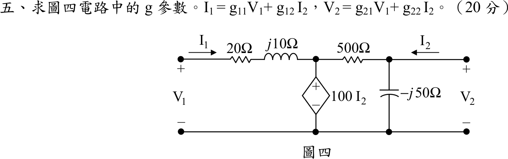

# 104 年電路學第 5 題｜雙埠網路 g 參數

## 已知與所求

埠 1：$V_1$、$I_1$（向右流入），串聯 $20\ \Omega$ 與 $j10\ \Omega$ 到中間節點 $P$；$P$ 對地為相依電壓源 $100I_2$（上正）；$P$ 與輸出節點 $Q$ 間 $500\ \Omega$；$Q$ 對地並聯 $-j50\ \Omega$；埠 2：$V_2$ 在 $Q$、$I_2$ 向左流入 $Q$。求 $I_1=g_{11}V_1+g_{12}I_2$、$V_2=g_{21}V_1+g_{22}I_2$ 的 $g$ 參數（20 分）。

## 考場標準作答

相依源固定 $V_P=100I_2$。

輸入迴路：$V_1=(20+j10)I_1+100I_2$，即

$$
I_1=\frac{1}{20+j10}V_1-\frac{100}{20+j10}I_2
$$

$$
\boxed{g_{11}=\frac{1}{20+j10}=0.04 - j0.02\ \mathrm S},\qquad
\boxed{g_{12}=\frac{-100}{20+j10}=-4+j2}
$$

輸出節點 $Q$ KCL（$I_2$ 流入）：

$$
I_2=\frac{V_2}{-j50}+\frac{V_2-100I_2}{500}\ \Rightarrow\ 1.2I_2=(0.002+j0.02)V_2
$$

$V_2$ 與 $V_1$ 無關，故

$$
\boxed{g_{21}=0},\qquad
\boxed{g_{22}=\frac{1.2}{0.002+j0.02}=\frac{600}{1+j10}=\frac{600}{101}-j\frac{6000}{101}\approx5.94-j59.41\ \Omega}
$$

## 驗算

依定義測試：$I_2=0$（埠 2 開路）時 $V_P=0$，$I_1=V_1/(20+j10)$，$g_{11}$ 成立，且輸出端無激勵故 $V_2=0$，$g_{21}=0$；$V_1=0$、注入 $I_2=1\ \mathrm A$ 時 $V_P=100$，$I_1=-100/(20+j10)$ 即 $g_{12}$，並由 $V_2=g_{22}$ 得 $5.94-j59.41\ \Omega$。單位：$g_{11}$ 為 S、$g_{22}$ 為 $\Omega$、$g_{12}$、$g_{21}$ 無單位。

## 失分點

- $g$ 參數的混合單位：$g_{12}$、$g_{21}$ 無單位，$g_{11}$ 單位 S，$g_{22}$ 單位 $\Omega$。
- 相依源 $100I_2$ 使 $V_P$ 與 $I_1$ 無關，$g_{21}$ 為 $0$；不要以為 $V_1$ 會影響埠 2。
- $g_{22}$ 的輸出節點 KCL 要包含相依源造成的 $-0.2I_2$ 項，漏掉會得 $1/(0.002+j0.02)$ 而非乘 $1.2$。
