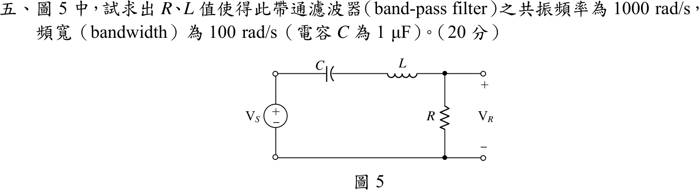

# 105 年電路學第 5 題｜串聯 RLC 帶通濾波器設計

## 已知與所求

$V_S$ 串聯 $C$、$L$，輸出 $V_R$ 取自 $R$ 兩端；$C=1\ \mu\mathrm F$，要求共振頻率 $\omega_0=1000\ \mathrm{rad/s}$、頻寬 $B=100\ \mathrm{rad/s}$。求 $R$、$L$（20 分）。

## 考場標準作答

串聯 RLC，$\omega_0=\dfrac{1}{\sqrt{LC}}$、$B=\dfrac{R}{L}$：

$$
L=\frac{1}{\omega_0^2C}=\frac{1}{(10^3)^2(10^{-6})}=\boxed{1\text{ H}}
$$

$$
R=BL=100(1)=\boxed{100\ \Omega}
$$

## 驗算

轉移函數 $\left|\dfrac{V_R}{V_S}\right|=\dfrac{R}{\sqrt{R^2+(\omega L-1/\omega C)^2}}$。$\omega=1000$ 時電抗 $1000-1000=0$，增益 $1$；半功率點需 $|\omega L-1/\omega C|=R=100$，解 $\omega^2-100\omega-10^6=0$ 與 $\omega^2+100\omega-10^6=0$ 得 $\omega_2=1051.2$、$\omega_1=951.2\ \mathrm{rad/s}$，$\omega_2-\omega_1=100\ \mathrm{rad/s}$。

## 失分點

- 頻寬是 $R/L$（rad/s），不是 $R/(2L)$（那是暫態衰減係數 $\alpha$）。
- $C=1\ \mu\mathrm F$ 須換成 $10^{-6}\ \mathrm F$；漏掉會讓 $L$ 差 $10^6$ 倍。
