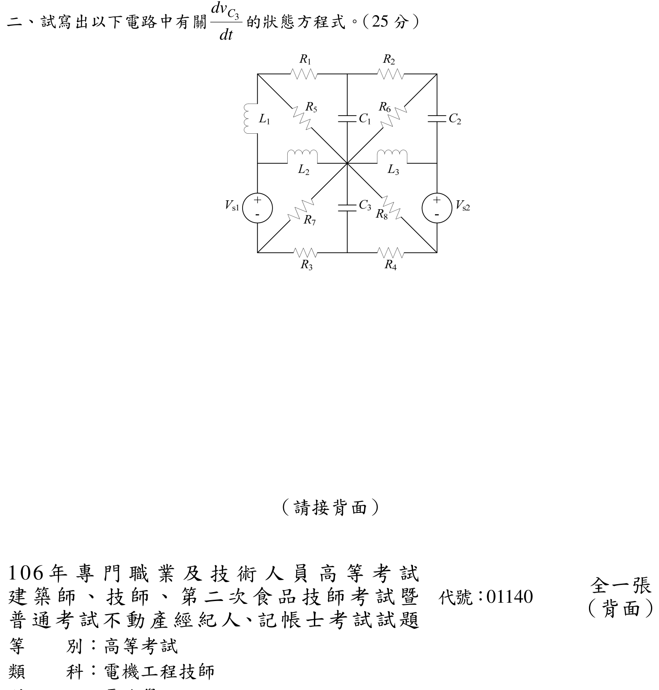

# 106 年電路學第 2 題｜\(dv_{C3}/dt\) 完整狀態方程式

> ✅ 已依官方裁切圖重建拓撲，固定所有電感電流與電容電壓的方向後，以兩個電壓源超節點及節點 KCL 消去代數節點電壓；下式只含狀態量與輸入。

## 官方題目（逐題裁切）

題目要求寫出圖中與 \(dv_{C3}/dt\) 有關的狀態方程式。

## 狀態量與方向定義

以中央交點 \(O\) 為參考地，定義

\[
v_1=v_{C1}=V_T-V_O,\qquad
v_2=v_{C2}=V_C-V_G,\qquad
v_3=v_{C3}=V_O-V_B,
\]

其中 \(T,C,B\) 分別為上中、右上、下中節點；\(G\) 為右側電壓源上端。電感電流方向固定為

\[
i_1=i_{L1}:A\to F,\qquad
i_2=i_{L2}:F\to O,qquad
i_3=i_{L3}:O\to G.
\]

因此 \(V_T=v_1\)、\(V_B=-v_3\)，且右側電壓源的極性給 \(V_E=V_G-V_{s2}\)，左側給 \(V_D=V_F-V_{s1}\)。

## 逐步 KCL 推導

### 1. 左側 \(V_{s1}\) 超節點

超節點 \((F,D)\) 的外部電流平衡為

\[
-i_1+i_2+\frac{V_D-V_B}{R_3}+\frac{V_D}{R_7}=0.
\]

解得

\[
V_D=\frac{R_7V_B+R_3(i_1-i_2)}{R_3+R_7}
=\frac{-R_7v_3+R_3(i_1-i_2)}{R_3+R_7}.
\]

### 2. 右側 \(V_{s2}\) 超節點

令 \(i_{C2}\) 由 \(C\to G\)。在節點 \(C\) 寫 KCL：

\[
i_{C2}+\frac{V_C-v_1}{R_2}+\frac{V_C}{R_6}=0.
\]

再對超節點 \((G,E)\) 寫 KCL，消去 \(i_{C2}\)：

\[
\frac{V_C-v_1}{R_2}+\frac{V_C}{R_6}
 +\frac{V_E-V_B}{R_4}+\frac{V_E}{R_8}-i_3=0,
\]

其中 \(V_C=V_G+v_2\)、\(V_E=V_G-V_{s2}\)。令

\[
Y_R=\frac1{R_2}+\frac1{R_6}+\frac1{R_4}+\frac1{R_8},
\]

可得右側節點電壓

\[
V_G=\frac{\displaystyle \frac{v_1}{R_2}
 -v_2\left(\frac1{R_2}+\frac1{R_6}\right)
 +V_{s2}\left(\frac1{R_4}+\frac1{R_8}\right)
 +\frac{V_B}{R_4}+i_3}{Y_R},
\]

亦即

\[
V_E=V_G-V_{s2}.
\]

### 3. \(C_3\) 電流與狀態方程式

取 \(i_{C3}\) 由 \(O\to B\)，則

\[
i_{C3}=C_3\frac{dv_3}{dt}.
\]

在節點 \(B\) 寫 KCL：

\[
i_{C3}=\frac{V_B-V_D}{R_3}+\frac{V_B-V_E}{R_4}.
\]

代入 \(V_B=-v_3\)、上面兩個已消去的節點電壓，得到只含狀態與輸入的完整結果：

\[
\boxed{
\frac{dv_{C3}}{dt}
=\frac1{C_3}\left[
\frac{-v_{C3}-V_D}{R_3}
+\frac{-v_{C3}-V_E}{R_4}
\right]
}
\]

其中 \(V_D\) 與 \(V_E\) 必須使用下列狀態量展開式（不是未知節點）：

\[
V_D=\frac{-R_7v_{C3}+R_3(i_{L1}-i_{L2})}{R_3+R_7},
\]

\[
V_E=\frac{\displaystyle \frac{v_{C1}}{R_2}
 -v_{C2}\left(\frac1{R_2}+\frac1{R_6}\right)
 +V_{s2}\left(\frac1{R_4}+\frac1{R_8}\right)
 -\frac{v_{C3}}{R_4}+i_{L3}}{Y_R}-V_{s2}.
\]

將這兩式直接代回盒中式，即為考題要求的純狀態方程；可見 \(V_{s1}\) 不會出現在 \(dv_{C3}/dt\) 的顯式式子中，因為左電壓源只改變 \(V_F=V_D+V_{s1}\)，而 \(C_3\) 所見的 \(R_3\)、\(R_7\) 支路電流由超節點 KCL 決定，\(V_{s1}\) 在消去時相消。這是拓撲上的結果，不是漏項。

## 回代與符號檢查

- 若 \(i_{L1}=i_{L2}\)、\(v_{C3}=0\)，則 \(V_D=0\)，左下兩電阻支路不提供 \(C_3\) 電流，符合 KCL。
- \(C_3\) 上端電壓定義為 \(V_O-V_B\)；若反向定義，整個右側會同時變號，不能只改 \(1/C_3\) 的符號。
- 量綱檢查：每個方括號項為 A，除以 \(C_3\) 得 V/s。

## 校驗結論

- 官方題號、裁切圖與節點拓撲一致。
- 已以兩個電壓源超節點、右上 \(C_2\) 節點 KCL 及下中 \(C_3\) 節點 KCL 完成獨立推導。
- 狀態方程不再保留「耦合項」省略記號，升級為 `verified`。
