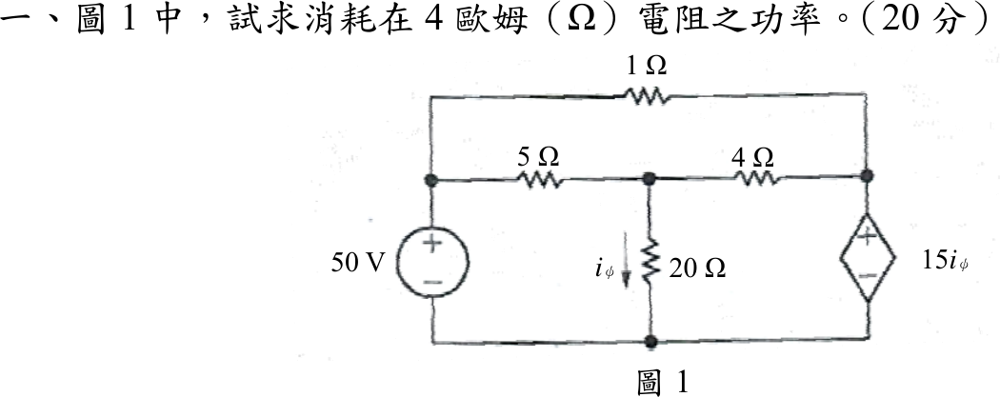

# 107 年電路學第 1 題｜4 Ω 電阻功率

## 已知與所求

左側 50 V 獨立電壓源（上正）接左節點；左節點經 \(1\ \Omega\)（上方導線）通右節點，經 \(5\ \Omega\) 通中節點；中節點經 \(4\ \Omega\) 通右節點，經 \(20\ \Omega\) 接地，\(i_\phi\) 向下流過 \(20\ \Omega\)；右節點與地之間為 CCVS \(15i_\phi\)（上正）。求 \(4\ \Omega\) 消耗功率（20 分）。

## 考場標準作答

下方導線為參考地。左節點 \(=50\ \mathrm V\)；中節點 \(V_1\)，右節點 \(V_2\)：
\[
i_\phi=\frac{V_1}{20},\qquad V_2=15i_\phi=0.75V_1
\]
中節點 KCL（\(1\ \Omega\) 只連兩個定壓節點，不影響此式）：
\[
\frac{50-V_1}{5}=\frac{V_1}{20}+\frac{V_1-V_2}{4}
\Rightarrow 10-0.2V_1=0.3125V_1\Rightarrow V_1=32\ \mathrm V,\ V_2=24\ \mathrm V
\]
\[
I_4=\frac{V_1-V_2}{4}=2\ \mathrm A,\qquad
\boxed{P_{4\Omega}=I_4^2(4)=2^2(4)=16\ \mathrm W}
\]

## 驗算

全電路功率守恆。\(I_{1\Omega}=\dfrac{50-24}{1}=26\ \mathrm A\)，\(I_{5\Omega}=\dfrac{50-32}{5}=3.6\ \mathrm A\)：

- 50 V 源供給 \(50(26+3.6)=1480\ \mathrm W\)；CCVS 流入電流 \(26+2=28\ \mathrm A\)，吸收 \(24(28)=672\ \mathrm W\)。
- 電阻吸收：\(26^2(1)+3.6^2(5)+2^2(4)+1.6^2(20)=676+64.8+16+51.2=808\ \mathrm W\)；\(808+672=1480\ \mathrm W\)。

## 失分點

- CCVS 的電壓為 \(V_2=15i_\phi\)；把極性看反（\(V_2=-15i_\phi\)）會得 \(V_1=160/11\ \mathrm V\)、\(P\approx162\ \mathrm W\)。
- \(i_\phi\) 是 \(20\ \Omega\) 的電流 \(V_1/20\)，不是 \(4\ \Omega\) 的電流。
