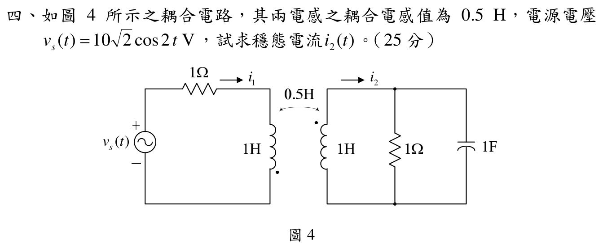

# 108 年電路學第 4 題：互感耦合電路

## 題目與符號約定

由官方裁切圖讀得：$M=0.5\,\mathrm{H}$、$L_1=L_2=1\,\mathrm{H}$、$R_1=R_2=1\,\Omega$、$C=1\,\mathrm{F}$，以及

\[
v_s(t)=10\sqrt{2}\cos(2t)\ \mathrm{V},\qquad \omega=2\ \mathrm{rad/s}.
\]

兩個箭頭均採圖示網目方向：$i_1$ 通過左線圈由上往下，$i_2$ 通過右線圈由下往上。左線圈同名端在下方，右線圈同名端在上方，所以兩個網目電流皆由非同名端進入線圈；互感項在兩個網目方程中同號。

電源以 RMS 相量表示為 $\tilde{V}_s=10\,\mathrm{V}$。右側並聯負載的導納及等效阻抗為

\[
Y_L=\frac{1}{1\,\Omega}+j\omega C=1+j2\ \mathrm{S},
\qquad
Z_L=Y_L^{-1}=\frac{1}{1+j2}=0.2-j0.4\ \Omega.
\]

## 相量網目方程

左側線圈的自感阻抗為 $j\omega L_1=j2\,\Omega$，互感阻抗為 $j\omega M=j1\,\Omega$。由 KVL 得

\[
(1+j2)\tilde I_1+j\tilde I_2=10.
\]

右側網目包含線圈與 $Z_L$，因此

\[
j\tilde I_1+(Z_L+j\omega L_2)\tilde I_2=0,
\]

亦即

\[
j\tilde I_1+(0.2+j1.6)\tilde I_2=0.
\]

合併為

\[
\begin{bmatrix}
1+j2 & j\\
j & 0.2+j1.6
\end{bmatrix}
\begin{bmatrix}\tilde I_1\\\tilde I_2\end{bmatrix}
=
\begin{bmatrix}10\\0\end{bmatrix}.
\]

## 解相量與回代

由第二式

\[
\tilde I_1=\frac{j(0.2+j1.6)}{1}\tilde I_2=(-1.6+j0.2)\tilde I_2.
\]

代入第一式：

\[
\left[(1+j2)(-1.6+j0.2)+j\right]\tilde I_2=10,
\]

\[
(-2-j2.9)\tilde I_2=10,
\qquad
\tilde I_2=\frac{10}{-2-j2.9}=-2.5+j2.5\ \mathrm{A}.
\]

因此

\[
\tilde I_2=3.535534\angle135^\circ\ \mathrm{A}_{\mathrm{rms}}.
\]

回代可得

\[
\tilde I_1=3.5-j4.5\ \mathrm{A},
\]

且

\[
(1+j2)\tilde I_1+j\tilde I_2=10,
\qquad
j\tilde I_1+(0.2+j1.6)\tilde I_2=0,
\]

兩式殘差皆小於 $5\times10^{-15}\,\mathrm{V}$，方程與同名端號誌一致。

## 時域答案

題目原電壓使用峰值 $10\sqrt{2}$，而相量採 RMS，因此將 $\tilde{I}_2$ 乘以 $\sqrt{2}$ 還原為峰值：

\[
\boxed{i_2(t)=5\cos(2t+135^\circ)\ \mathrm{A}}.
\]

等價地，$i_2(t)=5\cos(2t-225^\circ)\,\mathrm{A}$。原草稿的 $1.414\angle-45^\circ$ 未符合官方圖的電阻、電感、電容與互感號誌，已更正。

## 校驗結論

- `qid`、題號與官方 `source_crop` 已核對。
- 拓撲、同名端、RMS/峰值換算、互感號誌與兩個 KVL 方程均已獨立重建。
- 回代兩個網目方程成立，故本題標記為 `verified`。
