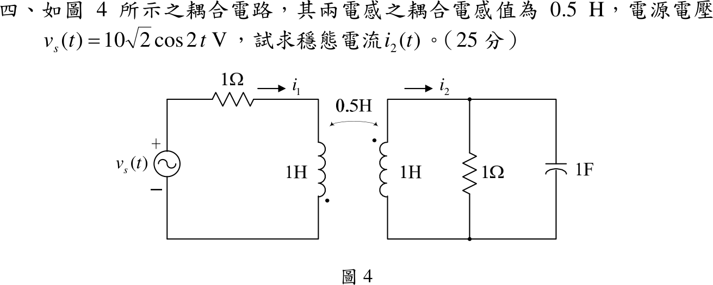

# 108 年電路學第 4 題｜互感耦合電路

## 已知與所求

\(v_s(t)=10\sqrt2\cos2t\ \mathrm V\) 串 \(1\ \Omega\) 接一次側 \(L_1=1\ \mathrm H\)；二次側 \(L_2=1\ \mathrm H\) 接 \(1\ \Omega\) 並聯 \(1\ \mathrm F\)；互感 \(M=0.5\ \mathrm H\)。一次側點在下端、二次側點在上端；\(i_1\) 由上端（非點端）流入一次側，\(i_2\) 由二次側上端（點端）流出，等於由下端（非點端）流入。求穩態 \(i_2(t)\)（25 分）。

## 考場標準作答

\(\omega=2\ \mathrm{rad/s}\)，用峰值相量 \(\mathbf V_s=10\sqrt2\angle0^\circ\)。兩個參考電流都由非點端流入，互感項同號（\(+j\omega M\)）。

\[
j\omega L_1=j\omega L_2=j2,\quad j\omega M=j1,\quad
Z_L=\frac{1}{1+j2}=0.2-j0.4\ \Omega
\]
\[
\begin{cases}
(1+j2)\mathbf I_1+j\,\mathbf I_2=10\sqrt2\\
j\,\mathbf I_1+(0.2+j1.6)\mathbf I_2=0
\end{cases}
\]
行列式 \(\Delta=(1+j2)(0.2+j1.6)-(j)^2=-2+j2\)，
\[
\mathbf I_2=\frac{-j\,(10\sqrt2)}{-2+j2}=\frac{10\sqrt2(-1+j)}{4}=5\angle135^\circ\ \mathrm A
\]
\[
\boxed{i_2(t)=5\cos(2t+135^\circ)\ \mathrm A}
\]

## 驗算

以有效值相量（\(\mathbf V_s=10\)）做功率守恆：\(\mathbf I_2=-2.5+j2.5\)，\(\mathbf I_1=j(0.2+j1.6)\mathbf I_2=3.5-j4.5\ \mathrm A\)。

- 電源送出 \(\mathrm{Re}(\mathbf V_s\mathbf I_1^*)=10(3.5)=35\ \mathrm W\)。
- 吸收：串聯 \(1\ \Omega\) 為 \(|\mathbf I_1|^2=32.5\ \mathrm W\)；負載 \(1\ \Omega\) 電壓 \(|Z_L\mathbf I_2|=\sqrt{0.2\times12.5}\)，功率 \(0.2\times12.5=2.5\ \mathrm W\)；合計 35 W。

## 失分點

- 同名端：兩電流皆由非點端流入故 \(+j\omega M\)；誤用 \(-j\omega M\) 會得 \(5\cos(2t-45^\circ)\ \mathrm A\)，整個反相。
- 右側 \(1\ \Omega\) 與 \(1\ \mathrm F\) 為並聯，\(Z_L=0.2-j0.4\ \Omega\)，不是 \(1-j0.5\ \Omega\) 的串聯。
- 峰值相量源取 \(10\sqrt2\)；若取 10 當峰值，最後振幅只剩 \(5/\sqrt2\approx3.54\ \mathrm A\)。
