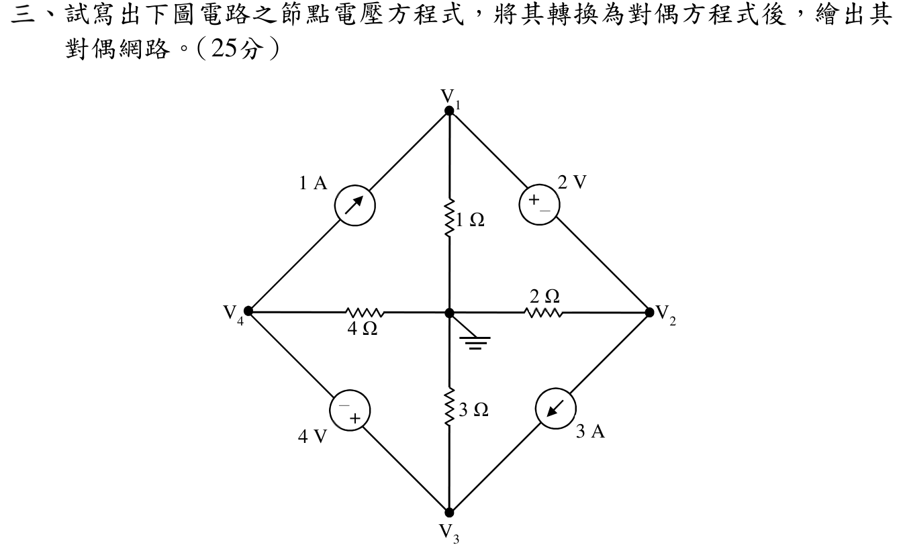

# 109 年電路學第 3 題：節點電壓方程式與對偶網路

## 1. 由官方圖重建拓撲與極性

中心節點為參考地，外部節點依圖標為 $V_1,V_2,V_3,V_4$。四個接地支路分別為 $1\,\Omega$、$2\,\Omega$、$3\,\Omega$、$4\,\Omega$。斜向支路為：$V_4\to V_1$ 的 $1\,\mathrm{A}$ 電流源、$V_2\to V_3$ 的 $3\,\mathrm{A}$ 電流源、$V_1$ 正對 $V_2$ 負的 $2\,\mathrm{V}$ 電壓源，以及 $V_3$ 正對 $V_4$ 負的 $4\,\mathrm{V}$ 電壓源。

## 2. 原電路節點方程式

兩個理想電壓源跨接節點，分別形成超節點 $\{1,2\}$ 與 $\{3,4\}$。電壓約束為

\[
V_1-V_2=2\,\mathrm{V},
\qquad
V_3-V_4=4\,\mathrm{V}.
\]

對超節點 $\{1,2\}$，取離開超節點為正：$1\,\mathrm{A}$ 源由 $V_4$ 流入 $V_1$，故為 $-1$；$3\,\mathrm{A}$ 源由 $V_2$ 流向 $V_3$，故為 $+3$。因此

\[
\frac{V_1}{1}+\frac{V_2}{2}-1+3=0
\quad\Longrightarrow\quad
(1\,\mathrm{S})V_1+(0.5\,\mathrm{S})V_2=-2\,\mathrm{A}.
\]

對超節點 $\{3,4\}$，$3\,\mathrm{A}$ 源流入、$1\,\mathrm{A}$ 源流出，故

\[
\frac{V_3}{3}+\frac{V_4}{4}-3+1=0
\quad\Longrightarrow\quad
(0.333333\,\mathrm{S})V_3+(0.25\,\mathrm{S})V_4=2\,\mathrm{A}.
\]

完整方程組為

\[
\begin{cases}
V_1-V_2=2\\
V_3-V_4=4\\
V_1+\frac{1}{2}V_2=-2\\
\frac{1}{3}V_3+\frac{1}{4}V_4=2
\end{cases}
\]

解得

\[
\boxed{V_1=-\frac{2}{3}\,\mathrm{V}},\qquad
\boxed{V_2=-\frac{8}{3}\,\mathrm{V}},\qquad
\boxed{V_3=\frac{36}{7}\,\mathrm{V}},\qquad
\boxed{V_4=\frac{8}{7}\,\mathrm{V}}.
\]

回代檢查：$V_1-V_2=2\,\mathrm{V}$、$V_3-V_4=4\,\mathrm{V}$；超節點方程分別為 $-2/3+(1/2)(-8/3)=-2$ 與 $(1/3)(36/7)+(1/4)(8/7)=2$，四式皆成立。

## 3. 對偶方程式與網路對應

依節點–網目對偶映射，以 $V_k\leftrightarrow i'_k$，並將原電阻的導納 $1/R$ 對應為對偶電阻值；原獨立電壓源對應對偶獨立電流源，原獨立電流源對應對偶獨立電壓源。於相同方向約定下，對偶方程式為

\[
\begin{cases}
i'_1-i'_2=2\,\mathrm{A}\\
i'_3-i'_4=4\,\mathrm{A}\\
1\,i'_1+0.5\,i'_2=-2\,\mathrm{V}\\
\frac{1}{3}i'_3+\frac{1}{4}i'_4=2\,\mathrm{V}
\end{cases}
\]

解為 $i'_1=-2/3$、$i'_2=-8/3$、$i'_3=36/7$、$i'_4=8/7$（對偶量的單位依題目採用的歸一化對偶慣例表示）。

對偶網路的支路清單如下，可據此繪圖：

- 原 $1\,\Omega$、$2\,\Omega$、$3\,\Omega$、$4\,\Omega$ 接地支路，分別轉為對偶參考面與網目 $1,2,3,4$ 間的 $1$、$0.5$、$1/3$、$1/4$ 電阻。
- 原 $2\,\mathrm{V}$（$V_1$ 端為正）與 $4\,\mathrm{V}$（$V_3$ 端為正）電壓源，分別轉為網目 $1$–$2$ 間的 $2\,\mathrm{A}$ 電流源與網目 $3$–$4$ 間的 $4\,\mathrm{A}$ 電流源；方向由 $i'_1-i'_2=2$、$i'_3-i'_4=4$ 固定。
- 原 $1\,\mathrm{A}$（$4\to1$）與 $3\,\mathrm{A}$（$2\to3$）電流源，轉為對偶網路中跨越相鄰網目的 $1\,\mathrm{V}$ 與 $3\,\mathrm{V}$ 電壓源；其極性依兩個超網目 KVL 的右端號誌，分別產生 $-2$ 與 $+2$ 的常數項。

## 校驗結論

- `qid` 與官方 `source_crop` 已核對，節點標示、電阻值、兩個電流源方向及兩個電壓源極性均已按圖讀取。
- 原節點方程式的四個符號與數值正確；已補上節點電壓解與逐式回代。
- 對偶方程式、元件映射及對偶網路支路方向已明確列出，故本題標記為 `verified`。

<!-- LEGACY_EXPLANATION_HIDDEN: replaced after independent verification

> ⚠️ 以下為歷史草稿內容，已由上方獨立校驗解答取代，僅供追溯。

## 三、節點電壓方程式轉換與對偶網路建構（25 分）

### 📌 題目與已知條件
試寫出下圖電路之節點電壓方程式，將其轉換為對偶方程式後，繪出其對偶網路（Dual Network）。（25 分）
* 原電路拓撲：包含 4 個外部節點 $V_1, V_2, V_3, V_4$ 及中心參考接地點（第 0 節點）。
* 支路元件連接：
  - 節點 1 與接地：$1\ \Omega$ 電阻；節點 4 至 1：$1\text{ A}$ 電流源；節點 1 至 2：$2\text{ V}$ 電壓源（$+ \ -$）。
  - 節點 2 與接地：$2\ \Omega$ 電阻；節點 2 至 3：$3\text{ A}$ 電流源。
  - 節點 3 與接地：$3\ \Omega$ 電阻；節點 4 至 3：$4\text{ V}$ 電壓源（$- \ +$）。
  - 節點 4 與接地：$4\ \Omega$ 電阻。

---

### 💡 核心考點與破題關鍵
1. **超節點（Supernode）列寫 KCL**：
   - 節點 1 與 2 間跨接 $2\text{ V}$ 電壓源 $\implies V_1 - V_2 = 2\text{ V}$（組成超節點 A）。
   - 節點 3 與 4 間跨接 $4\text{ V}$ 電壓源 $\implies V_3 - V_4 = 4\text{ V}$（組成超節點 B）。
2. **對偶轉換映射法則（Dual Mapping）**：
   - 節點電壓 $V_k \longleftrightarrow$ 網目電流 $I_k'$
   - 電阻/電導 $G = \frac{1}{R} \longleftrightarrow$ 電阻 $R' = G$
   - 獨立電流源 $I_s \longleftrightarrow$ 獨立電壓源 $V_s' = I_s$
   - 獨立電壓源 $V_s \longleftrightarrow$ 獨立電流源 $I_s' = V_s$
   - 節點 KCL $\longleftrightarrow$ 網目 KVL

---

### ✏️ 步驟式詳細數學推導

#### 🔹 (1) 列寫原電路節點電壓方程式
1. **電壓源約束方程式**：
   $$V_1 - V_2 = 2$$
   $$V_3 - V_4 = 4$$
2. **超節點 1-2（Supernode 1-2）之 KCL 方程式**：
   $$\frac{V_1}{1} + \frac{V_2}{2} - 1\text{ A} + 3\text{ A} = 0 \implies \mathbf{V_1 + 0.5 V_2 = -2}$$
3. **超節點 3-4（Supernode 3-4）之 KCL 方程式**：
   $$\frac{V_3}{3} + \frac{V_4}{4} - 3\text{ A} + 1\text{ A} = 0 \implies \mathbf{\frac{1}{3} V_3 + \frac{1}{4} V_4 = 2}$$

#### 🔹 (2) 建立對偶網目電流方程式（Dual Mesh Equations）
依對偶映射法則，將節點電壓 $V_k$ 替換為網目電流 $i_k'$，電壓約束轉為電流約束，KCL 轉為 KVL：
1. **網目電流約束方程式（對偶於電壓源）**：
   $$\mathbf{i_1' - i_2' = 2\text{ A}}$$
   $$\mathbf{i_3' - i_4' = 4\text{ A}}$$
2. **超網目 1-2（Supermesh 1-2）之 KVL 方程式**：
   $$\mathbf{1 \cdot i_1' + 0.5 \cdot i_2' = -2\text{ V} \implies 1 i_1' + 0.5 i_2' + 2 = 0}$$
3. **超網目 3-4（Supermesh 3-4）之 KVL 方程式**：
   $$\mathbf{\frac{1}{3} i_3' + \frac{1}{4} i_4' = 2\text{ V}}$$

#### 🔹 (3) 對偶網路拓撲架構繪製說明
* **網目與元件對應**：
  - 網目 1 與 2 之間串接 $2\text{ A}$ 獨立電流源。
  - 網目 3 與 4 之間串接 $4\text{ A}$ 獨立電流源。
  - 網目 1 包含 $1\ \Omega$ 電阻與 $-2\text{ V}$ 電壓源。
  - 網目 2 包含 $0.5\ \Omega$ 電阻。
  - 網目 3 包含 $\frac{1}{3}\ \Omega$ 電阻與 $2\text{ V}$ 電壓源。
  - 網目 4 包含 $\frac{1}{4}\ \Omega$ 電阻。

---

### 🎯 第三題 滿分關鍵與結論
* **節點電壓方程式**：
  $$\begin{cases} V_1 - V_2 = 2 \\ V_3 - V_4 = 4 \\ V_1 + 0.5 V_2 = -2 \\ \frac{1}{3} V_3 + \frac{1}{4} V_4 = 2 \end{cases}$$
* **對偶網目方程式**：
  $$\begin{cases} i_1' - i_2' = 2 \\ i_3' - i_4' = 4 \\ 1 i_1' + 0.5 i_2' = -2 \\ \frac{1}{3} i_3' + \frac{1}{4} i_4' = 2 \end{cases}$$

---
-->
