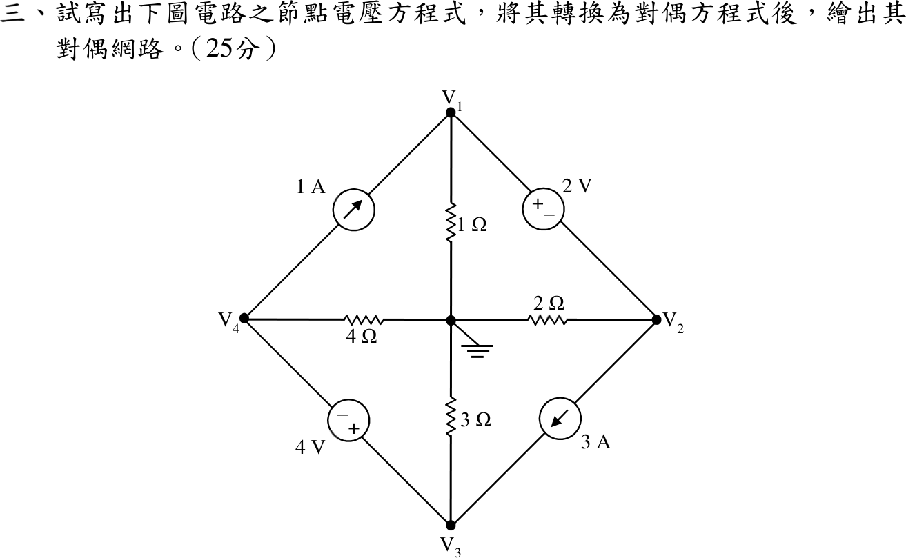

# 109 年電路學第 3 題｜節點電壓方程式與對偶網路



## 已知與所求

中心節點接地；\(V_1,V_2,V_3,V_4\) 分別經 \(1,2,3,4\ \Omega\) 接地。外框支路：\(1\ \mathrm A\) 電流源由 \(V_4\) 流向 \(V_1\)；\(2\ \mathrm V\) 電壓源 \(V_1\) 端為正、\(V_2\) 端為負；\(3\ \mathrm A\) 電流源由 \(V_2\) 流向 \(V_3\)；\(4\ \mathrm V\) 電壓源 \(V_3\) 端為正、\(V_4\) 端為負。寫出節點電壓方程式，轉為對偶方程式並繪出對偶網路（25 分）。

## 考場標準作答

### 節點電壓方程式

兩個電壓源各成一個超節點，約束為
\[
V_1-V_2=2,\qquad V_3-V_4=4
\]
超節點 \(\{1,2\}\)：注入 \(1\ \mathrm A\)（流進 \(V_1\)）、流出 \(3\ \mathrm A\)（離開 \(V_2\)）：
\[
1\,V_1+\tfrac12V_2=1-3=-2
\]
超節點 \(\{3,4\}\)：注入 \(3\ \mathrm A\)、流出 \(1\ \mathrm A\)：
\[
\tfrac13V_3+\tfrac14V_4=3-1=2
\]
解得
\[
\boxed{V_1=-\tfrac23\ \mathrm V},\quad \boxed{V_2=-\tfrac83\ \mathrm V},\quad \boxed{V_3=\tfrac{36}{7}\ \mathrm V},\quad \boxed{V_4=\tfrac87\ \mathrm V}
\]

### 對偶方程式

對偶對應：節點電壓 \(V_k\leftrightarrow\) 網目電流 \(i'_k\)、電導 \(G\ (\mathrm S)\leftrightarrow\) 電阻 \(R'=G\ (\Omega)\)、電壓源 \(\leftrightarrow\) 電流源、電流源 \(\leftrightarrow\) 電壓源、接地節點 \(\leftrightarrow\) 外圍網目。四個網目電流皆取順時針：
\[
i'_1-i'_2=2\ \mathrm A,\qquad i'_3-i'_4=4\ \mathrm A
\]
\[
1\,i'_1+0.5\,i'_2=-2\ \mathrm V,\qquad \tfrac13i'_3+\tfrac14i'_4=2\ \mathrm V
\]
解與原電路數值相同：\(i'_1=-\frac23,\ i'_2=-\frac83,\ i'_3=\frac{36}{7},\ i'_4=\frac87\ \mathrm A\)。

### 對偶網路

原電路四個節點兩兩相鄰成環、且都接地，對偶網路為「田」字形：中心節點 \(O\)，網目 1（左上）、2（右上）、3（右下）、4（左下）。

```
  ┌─────[ 1 Ω ]─────┬─────[ 0.5 Ω ]────┐
  │                 │                  │
  │     i'1 ↻    2 A ↓      i'2 ↻      │
  │                 │                  │
  ├──(+ 1 V −)───── O ─────(− 3 V +)───┤
  │                 │                  │
  │     i'4 ↻    4 A ↑      i'3 ↻      │
  │                 │                  │
  └────[ 1/4 Ω ]────┴────[ 1/3 Ω ]─────┘
```

- 原接地電阻 \(1,2,3,4\ \Omega\)（\(1,\frac12,\frac13,\frac14\ \mathrm S\)）→ 外框電阻 \(1,\ 0.5,\ \frac13,\ \frac14\ \Omega\)，分別只屬網目 1、2、3、4。
- 原 \(2\ \mathrm V\)（節點 1–2 間）→ 網目 1–2 共用支路（上豎線）的 \(2\ \mathrm A\) 電流源，向下流向 \(O\)。
- 原 \(4\ \mathrm V\)（節點 3–4 間）→ 網目 3–4 共用支路（下豎線）的 \(4\ \mathrm A\) 電流源，向上流向 \(O\)。
- 原 \(1\ \mathrm A\)（節點 4–1 間）→ 網目 4–1 共用支路（左橫線）的 \(1\ \mathrm V\) 電壓源，外端為正。
- 原 \(3\ \mathrm A\)（節點 2–3 間）→ 網目 2–3 共用支路（右橫線）的 \(3\ \mathrm V\) 電壓源，外端為正。

## 驗算

- 原電路以 MNA（兩電壓源電流為未知數）完整求解，得同一組 \(V_1\sim V_4\)；回代 \(-\frac23+\frac12(-\frac83)=-2\)、\(\frac13\cdot\frac{36}{7}+\frac14\cdot\frac87=2\)。
- 對偶網路改以節點法求解（\(O\) 接地，左端 \(1\ \mathrm V\)、右端 \(3\ \mathrm V\)）：上節點 \(T\)：\((1-T)-2(T-3)-2=0\Rightarrow T=\frac53\)；下節點 \(B\)：\(3(3-B)-4(B-1)-4=0\Rightarrow B=\frac97\)。網目電流 \(i'_1=1-\frac53=-\frac23\)、\(i'_2=2(\frac53-3)=-\frac83\)、\(i'_3=3(3-\frac97)=\frac{36}{7}\)、\(i'_4=4(\frac97-1)=\frac87\)，與 \(V_1\sim V_4\) 逐一相等，證實圖中元件值與極性正確。

## 失分點

- 對偶時把電阻值直接照抄（\(2\ \Omega\to2\ \Omega\)）；應取電導值 \(0.5\ \Omega\)。
- \(4\ \mathrm V\) 源的正端在 \(V_3\)，寫成 \(V_4-V_3=4\) 會使超節點 \(\{3,4\}\) 的解全錯。
- 對偶電源方向未與順時針網目約定配合，造成網目方程常數項變號。
