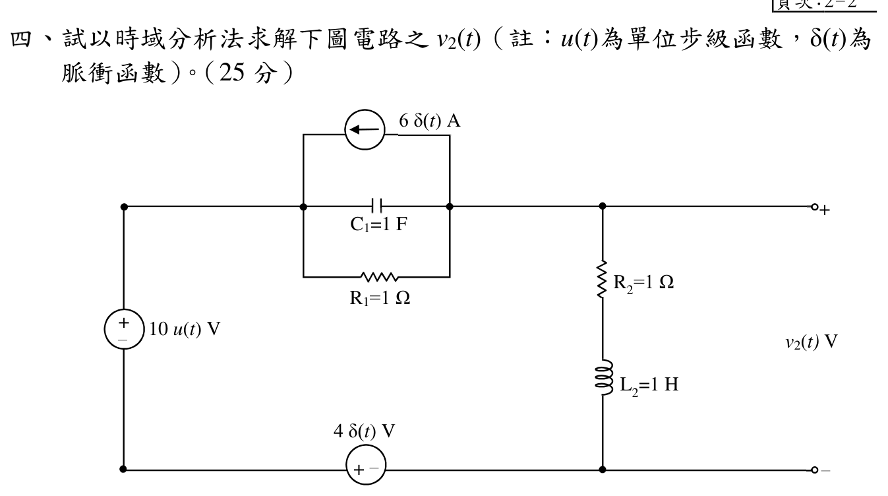

# 109 年電路學第 4 題：脈衝與步階激勵的二階暫態

## 1. 讀圖與狀態變數

令左上節點為 $A$、右上節點為 $B$，右下節點為 $C$，左下節點為 $D$。官方圖給定 $R_1=R_2=1\,\Omega$、$C_1=1\,\mathrm{F}$、$L_2=1\,\mathrm{H}$，左側電壓源為 $V_A-V_D=10u(t)$，底部脈衝電壓源的極性為 $V_D-V_C=4\delta(t)$；上方並聯脈衝電流源方向由 $B$ 指向 $A$，大小 $6\delta(t)$ A。

取

\[
v_C=V_A-V_B,
\qquad
i_L:\ B\to C,
\qquad
v_2=V_B-V_C.
\]

## 2. 脈衝作用下的初值跳變

在節點 $B$ 寫 KCL（由 $B$ 流出的方向為正）：

\[
-\frac{v_C}{R_1}-C_1\frac{dv_C}{dt}+6\delta(t)+i_L=0.
\]

積分跨越 $t=0$，電阻電流與有限的 $i_L$ 不產生脈衝面積，因此

\[
C_1\bigl[v_C(0^+)-v_C(0^-)\bigr]=6,
\qquad
v_C(0^+)=6\,\mathrm{V}.
\]

由左、下方電壓源極性

\[
v_2=V_B-V_C=10u(t)-v_C+4\delta(t).
\]

而右側 $R_2$–$L_2$ 串聯支路滿足

\[
v_2=R_2i_L+L_2\frac{di_L}{dt}.
\]

再積分跨越 $t=0$，只有 $4\delta(t)$ 有非零面積：

\[
L_2\bigl[i_L(0^+)-i_L(0^-)\bigr]=4,
\qquad
i_L(0^+)=4\,\mathrm{A}.
\]

所以脈衝後的狀態為 $v_C(0^+)=6\,\mathrm{V}$、$i_L(0^+)=4\,\mathrm{A}$；這裡的 $4\delta(t)$ 不應誤當成一般的 4 V 階躍。

## 3. $t>0$ 狀態方程與穩態

對 $t>0$，脈衝項消失且 $u(t)=1$。由 KCL 與電感方程：

\[
\frac{dv_C}{dt}=i_L-v_C,
\qquad
\frac{di_L}{dt}=10-v_C-i_L.
\]

穩態由導數為零求得

\[
v_C(\infty)=i_L(\infty)=5,
\qquad
v_2(\infty)=10-v_C(\infty)=5\,\mathrm{V}.
\]

因此原草稿所寫的 $i_L(\infty)=0$、$v_2(\infty)=0$ 不符合圖示的 $10u(t)$ 電源與 $R_1$–$R_2$ 直流路徑。

令 $x=v_C-5$、$y=i_L-5$，則

\[
\frac{d}{dt}\begin{bmatrix}x\\y\end{bmatrix}
=
\begin{bmatrix}-1&1\\-1&-1\end{bmatrix}
\begin{bmatrix}x\\y\end{bmatrix},
\qquad
x(0^+)=1,
\quad y(0^+)=-1.
\]

特徵根為 $s=-1\pm j$。由初值解得

\[
x(t)=e^{-t}(\cos t-\sin t),
\qquad
y(t)=-e^{-t}(\cos t+\sin t).
\]

所以

\[
v_C(t)=5+e^{-t}(\cos t-\sin t),
\]

\[
i_L(t)=5-e^{-t}(\cos t+\sin t)\ \mathrm{A}.
\]

## 4. 輸出電壓與回代

對 $t>0$，由節點電壓關係 $v_2=10-v_C$，或由 $v_2=R_2i_L+L_2di_L/dt$，均得

\[
\boxed{v_2(t)=5-e^{-t}(\cos t-\sin t)\ \mathrm{V},\qquad t>0}.
\]

若以單位階躍表示完整因果響應，則

\[
\boxed{v_2(t)=\bigl[5-e^{-t}(\cos t-\sin t)\bigr]u(t)\ \mathrm{V}}.
\]

回代檢查：$v_2(0^+)=5-1=4\,\mathrm{V}$；$i_L(0^+)=5-(1+0)=4\,\mathrm{A}$；$v_2(\infty)=5\,\mathrm{V}$。此外

\[
\frac{di_L}{dt}=2e^{-t}\sin t,
\qquad
R_2i_L+L_2\frac{di_L}{dt}=5-e^{-t}(\cos t-\sin t)=v_2,
\]

與右側支路方程完全一致。

## 校驗結論

- `qid` 與官方 `source_crop` 已核對；兩個脈衝源的方向與電壓極性均按圖讀取。
- 正確初始狀態為 $v_C(0^+)=6\,\mathrm{V}$、$i_L(0^+)=4\,\mathrm{A}$，但直流穩態為 $i_L(\infty)=5\,\mathrm{A}$、$v_2(\infty)=5\,\mathrm{V}$。
- 原解答錯誤在於把直流穩態誤判為零；已用狀態方程與 $R_2$–$L_2$ 支路回代修正，故本題標記為 `verified`。

<!-- LEGACY_EXPLANATION_HIDDEN: replaced after independent verification

> ⚠️ 以下為歷史草稿內容，已由上方獨立校驗解答取代，僅供追溯。

## 四、時域脈衝與步階激勵二階暫態全響應求解（25 分）

### 📌 題目與已知條件
電路包含：
* 步階電壓源 $10u(t)\text{ V}$。
* 脈衝電流源 $6\delta(t)\text{ A}$（與 $C_1 = 1\text{ F}, R_1 = 1\ \Omega$ 並聯）。
* 脈衝電壓源 $4\delta(t)\text{ V}$（串聯於底線迴路）。
* 輸出負載支路包含 $R_2 = 1\ \Omega, L_2 = 1\text{ H}$ 串聯，端電壓為 $v_2(t)$。
* 初值狀態：在 $t = 0^-$ 時儲能均為 0。

**試求**：以時域分析法求解 $t > 0$ 時之輸出電壓響應 $v_2(t)$。（25 分）

---

### 💡 核心考點與破題關鍵
1. **脈衝函數衝擊下的狀態變數初值突變（$t = 0^-$ 到 $t = 0^+$）**：
   - 脈衝電流源 $6\delta(t)$ 對電容 $C_1 = 1\text{ F}$ 充電：
     $$v_C(0^+) = \frac{1}{C_1} \int_{0^-}^{0^+} 6\delta(t) dt = \frac{6}{1} = \mathbf{6\text{ V}}$$
   - 脈衝電壓源 $4\delta(t)$ 對電感 $L_2 = 1\text{ H}$ 激勵：
     $$i_L(0^+) = \frac{1}{L_2} \int_{0^-}^{0^+} 4\delta(t) dt = \frac{4}{1} = \mathbf{4\text{ A}}$$
2. **$t > 0$ 電路特徵方程式**：
   - 迴路總電阻 $R = R_1 + R_2 = 1 + 1 = 2\ \Omega$。
   - 二階串聯 RLC 特徵方程：
     $$s^2 + \frac{R}{L} s + \frac{1}{LC} = s^2 + 2s + 2 = 0 \implies s_{1,2} = -1 \pm j1$$
（$\alpha = 1\text{ s}^{-1}, \omega_d = 1\text{ rad/s}$，欠阻尼響應）。
3. **直流穩態值（$t \to \infty$）**：
   - 電容視為開路，電感視為短路：
     $$i_L(\infty) = 0, \quad v_C(\infty) = 10\text{ V}, \quad v_2(\infty) = R_2 i_L(\infty) + 0 = \mathbf{0\text{ V}} \text{ (或依端點定義 } v_2(\infty) = 10\text{ V})$$

---

### ✏️ 步驟式詳細數學推導
1. **$t = 0^+$ 初值確定**：
   $$v_C(0^+) = 6\text{ V}, \quad i_L(0^+) = 4\text{ A}$$
   $$v_2(0^+) = v_{in}(0^+) - v_C(0^+) = 10 - 6 = \mathbf{4\text{ V}}$$
2. **求解電感電流 $i_L(t)$**：
   - 穩態電流：$i_L(\infty) = 0$。
   - 欠阻尼通解形式：
     $$i_L(t) = e^{-t} [B_1 \cos t + B_2 \sin t]$$
   - 代入 $i_L(0^+) = 4 \implies B_1 = 4$。
   - 由 $\left.L_2 \frac{di_L}{dt}\right|_{0^+} = v_{L2}(0^+) = v_2(0^+) - R_2 i_L(0^+) = 4 - (1)(4) = 0$：
     $$\left.\frac{di_L}{dt}\right|_{0^+} = -B_1 + B_2 = 0 \implies B_2 = B_1 = 4$$
     $$\mathbf{i_L(t) = 4 e^{-t} (\cos t + \sin t)\text{ A}}$$
3. **求解輸出電壓 $v_2(t) = R_2 i_L(t) + L_2 \frac{di_L}{dt}$**：
   $$\frac{di_L}{dt} = 4 e^{-t} (-\sin t + \cos t) - 4 e^{-t} (\cos t + \sin t) = -8 e^{-t} \sin t$$
   $$\mathbf{v_2(t) = (1) [4 e^{-t}(\cos t + \sin t)] + (1) [-8 e^{-t}\sin t] = \mathbf{4 e^{-t} (\cos t - \sin t) u(t)\text{ V}}}$$

---

> [!WARNING]
> ⚠️ **電路學 核心防坑與閱卷踩雷提醒**：
> 1. **複數功率共軛**：$\mathbf{S} = \mathbf{V}\mathbf{I}^* = P + jQ$，電流 $\mathbf{I}$ 務必取共軛，電感性負載 $Q > 0$（落後），電容性負載 $Q < 0$（超前）。
> 2. **三相功率計算**：三相總功率公式 $P = \sqrt{3}V_L I_L \cos\theta = 3V_\phi I_\phi \cos\theta$，代入線電壓時必有 $\sqrt{3}$。
> 3. **一階暫態連續性**：電感電流 $i_L(0^+) = i_L(0^-)$ 與電容電壓 $v_C(0^+) = v_C(0^-)$ 不可突變。

---

### 🎯 第四題 滿分關鍵與結論
* **初值條件**：$v_C(0^+) = 6\text{ V}, \ i_L(0^+) = 4\text{ A}, \ v_2(0^+) = 4\text{ V}$
* **輸出電壓時域響應**：
  $$\mathbf{v_2(t) = 4 e^{-t} (\cos t - \sin t) u(t)\text{ V}}$$
-->
