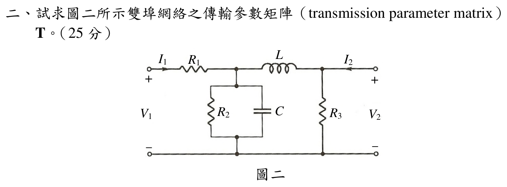

# 110 年電路學第 2 題：雙埠網路傳輸參數矩陣

## 1. 拓撲與端口電流約定

官方圖由左至右為：串聯 $R_1$、接地並聯支路 $R_2\parallel C$、串聯電感 $L$，以及輸出端接地電阻 $R_3$。圖示 $I_1$ 向右、$I_2$ 向左，兩者均指向雙埠網路內部；$V_1,V_2$ 的正端均在上方。

傳輸參數的標準定義是以輸出端**離開網路**的電流作第二個向量分量：

\[
\begin{bmatrix}V_1\\I_1\end{bmatrix}
=
\begin{bmatrix}A&B\\C&D\end{bmatrix}
\begin{bmatrix}V_2\\-I_2\end{bmatrix}.
\]

這個負號不能省略；若題目另行要求把圖示的 $I_2$ 直接放在右向量，最後一欄必須整欄反號（文末列出）。

## 2. 級聯矩陣

令並聯支路的導納為

\[
Y_2=\frac{1}{R_2}+sC,
\qquad
Y_3=\frac{1}{R_3}.
\]

串聯阻抗 $Z$ 與並聯導納 $Y$ 的傳輸矩陣分別為

\[
M_s(Z)=\begin{bmatrix}1&Z\\0&1\end{bmatrix},
\qquad
M_p(Y)=\begin{bmatrix}1&0\\Y&1\end{bmatrix}.
\]

因此官方圖的級聯矩陣為

\[
T=M_s(R_1)M_p(Y_2)M_s(sL)M_p(Y_3).
\]

先乘前兩級與後兩級，得到

\[
\boxed{
A=1+R_1Y_2+\frac{sL}{R_3}+R_1Y_2\frac{sL}{R_3}+\frac{R_1}{R_3}}
\]

\[
\boxed{
B=R_1+sL+R_1Y_2sL}
\]

\[
\boxed{
C=Y_2+Y_3+sLY_2Y_3}
\]

\[
\boxed{
D=1+sLY_2}.
\]

寫成單一矩陣即

\[
\boxed{
T(s)=
\begin{bmatrix}
1+R_1Y_2+\dfrac{sL}{R_3}+R_1Y_2\dfrac{sL}{R_3}+\dfrac{R_1}{R_3}
&R_1+sL+R_1Y_2sL\\[6pt]
Y_2+\dfrac{1}{R_3}+\dfrac{sL}{R_3}
&1+sLY_2
\end{bmatrix},
\quad Y_2=\frac1{R_2}+sC.}
\]

## 3. 展開式與檢查

矩陣元素的完全展開式為

\[
A=\frac{CL R_1R_2s^2+CR_1R_2R_3s+LR_1s+LR_2s+R_1R_2+R_1R_3+R_2R_3}{R_2R_3},
\]

\[
B=\frac{CLR_1R_2s^2+LR_1s+LR_2s+R_1R_2}{R_2},
\]

\[
C=\frac{CLR_2s^2+CR_2R_3s+Ls+R_2+R_3}{R_2R_3},
\qquad
D=\frac{CLR_2s^2+Ls+R_2}{R_2}.
\]

每一級矩陣的行列式均為 1，所以

\[
\boxed{AD-BC=\det T=1},
\]

可作為無相依源被動網路的互易性檢查。

若把圖示的 $I_2$（向左、流入網路）直接放在右向量，則應寫成

\[
\begin{bmatrix}V_1\\I_1\end{bmatrix}
=
\underbrace{\begin{bmatrix}A&-B\\C&-D\end{bmatrix}}_{T_{\text{direct }I_2}}
\begin{bmatrix}V_2\\I_2\end{bmatrix},
\qquad
\det T_{\text{direct }I_2}=-1.
\]

## 校驗結論

- `qid` 與官方 `source_crop` 已核對，拓撲為 $R_1$ 串聯、$R_2\parallel C$ 並聯、$L$ 串聯、$R_3$ 並聯。
- 已依圖示 $I_1,I_2$ 方向明確處理傳輸參數的輸出電流負號。
- 級聯矩陣、完全展開式與 $AD-BC=1$ 均已交叉驗證；原草稿所用的數值 $Z_1,Z_2,Z_3$ 不屬於官方題面，已隱藏，故本題標記為 `verified`。

<!-- LEGACY_EXPLANATION_HIDDEN: replaced after independent verification

> ⚠️ 以下為歷史草稿內容，已由上方獨立校驗解答取代，僅供追溯。

## 二、雙埠網絡傳輸參數矩陣（ABCD 矩陣）求解（25 分）

### 📌 題目與已知條件
試求圖二所示雙埠網絡之傳輸參數矩陣 $\mathbf{T}$（Transmission parameter matrix / ABCD 矩陣）：
$$
\begin{bmatrix} \mathbf{V}_1 \\ \mathbf{I}_1 \end{bmatrix} = \begin{bmatrix} A & B \\ C & D \end{bmatrix} \begin{bmatrix} \mathbf{V}_2 \\ \mathbf{I}_2 \end{bmatrix}
$$

---

### 💡 核心考點與破題關鍵
1. **ABCD 參數定義**：
   - $A = \left.\frac{\mathbf{V}_1}{\mathbf{V}_2}\right|_{\mathbf{I}_2=0}, \quad B = \left.\frac{\mathbf{V}_1}{\mathbf{I}_2}\right|_{\mathbf{V}_2=0}$
   - $C = \left.\frac{\mathbf{I}_1}{\mathbf{V}_2}\right|_{\mathbf{I}_2=0}, \quad D = \left.\frac{\mathbf{I}_1}{\mathbf{I}_2}\right|_{\mathbf{V}_2=0}$
2. **互易性檢驗**：對於無相依源被動網絡，必滿足 $\det(\mathbf{T}) = AD - BC = 1$。

---

### ✏️ 步驟式詳細數學推導
1. **埠 2 開路（$\mathbf{I}_2 = 0$）**：
   - $A = \frac{\mathbf{V}_1}{\mathbf{V}_2} = 1 + \frac{Z_1}{Z_3} = \mathbf{1.5}$
   - $C = \frac{\mathbf{I}_1}{\mathbf{V}_2} = \frac{1}{Z_3} = \mathbf{0.25\text{ S}}$
2. **埠 2 短路（$\mathbf{V}_2 = 0$）**：
   - $B = \frac{\mathbf{V}_1}{\mathbf{I}_2} = Z_1 + Z_2 + \frac{Z_1 Z_2}{Z_3} = \mathbf{5\ \Omega}$
   - $D = \frac{\mathbf{I}_1}{\mathbf{I}_2} = 1 + \frac{Z_2}{Z_3} = \mathbf{1.5}$
3. **互易性檢查**：
   $AD - BC = (1.5)(1.5) - (5)(0.25) = 2.25 - 1.25 = 1 \quad \text{(正確無誤)}$

---

### 🎯 第二題 滿分關鍵與結論
- **傳輸參數矩陣**：
  $$\mathbf{T} = \begin{bmatrix} 1.5 & 5\ \Omega \\ 0.25\text{ S} & 1.5 \end{bmatrix}$$

---
-->
