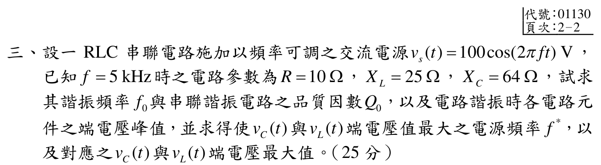

# 110 年電路學第 3 題：串聯 RLC 諧振與元件端電壓極值

## 題面資料與元件值

官方裁切圖給定串聯 RLC 電路，電源峰值為 $V_m=100\,\mathrm{V}$：

\[
v_s(t)=100\cos(2\pi ft)\ \mathrm{V},
\qquad f_1=5\,\mathrm{kHz},
\qquad R=10\,\Omega,
\qquad X_L(f_1)=25\,\Omega,
\qquad X_C(f_1)=64\,\Omega.
\]

由 $X_L=2\pi f_1L$、$X_C=1/(2\pi f_1C)$ 得

\[
L=\frac{25}{2\pi(5000)}=7.957747\times10^{-4}\,\mathrm{H},
\qquad
C=\frac{1}{2\pi(5000)(64)}=4.973592\times10^{-7}\,\mathrm{F}.
\]

## 1. 諧振頻率、品質因數與諧振端電壓

串聯諧振角頻率與頻率為

\[
\omega_0=\frac{1}{\sqrt{LC}},
\qquad
f_0=\frac{1}{2\pi\sqrt{LC}}
=f_1\sqrt{\frac{X_C(f_1)}{X_L(f_1)}}
=5000\sqrt{\frac{64}{25}}
=8000\,\mathrm{Hz}.
\]

諧振時感抗與品質因數為

\[
X_{L0}=X_{C0}=X_L(f_1)\frac{f_0}{f_1}=25\left(\frac85\right)=40\,\Omega,
\qquad
Q_0=\frac{\omega_0L}{R}=\frac{40}{10}=4.
\]

諧振阻抗為 $R$，故電流峰值為 $I_m=V_m/R=10\,\mathrm{A}$，各元件端電壓峰值為

\[
\boxed{V_{R,m}=I_mR=100\,\mathrm{V}},
\qquad
\boxed{V_{L,m}=V_{C,m}=I_mX_{L0}=400\,\mathrm{V}}.
\]

## 2. 電容與電感端電壓的最大值

任意角頻率下串聯電流幅值為

\[
|I(\omega)|=\frac{V_m}{\sqrt{R^2+(\omega L-1/(\omega C))^2}}.
\]

因此

\[
|V_C(\omega)|=\frac{V_m/(\omega C)}{\sqrt{R^2+(\omega L-1/(\omega C))^2}},
\qquad
|V_L(\omega)|=\frac{V_m\omega L}{\sqrt{R^2+(\omega L-1/(\omega C))^2}}.
\]

對上式平方後微分，分別得到（$Q_0>1/\sqrt2$ 時成立）

\[
\omega_C^*=\omega_0\sqrt{1-\frac{1}{2Q_0^2}},
\qquad
\omega_L^*=\frac{\omega_0}{\sqrt{1-\frac{1}{2Q_0^2}}}.
\]

代入 $Q_0=4$：

\[
\boxed{f_C^*=f_0\sqrt{1-\frac1{32}}
=8000\sqrt{\frac{31}{32}}
=7874.008\,\mathrm{Hz}=7.874008\,\mathrm{kHz}},
\]

\[
\boxed{f_L^*=\frac{f_0}{\sqrt{1-\frac1{32}}}
=8000\sqrt{\frac{32}{31}}
=8128.008\,\mathrm{Hz}=8.128008\,\mathrm{kHz}}.
\]

兩者的最大端電壓幅值相同：

\[
\boxed{
V_{C,\max}=V_{L,\max}
=\frac{V_mQ_0}{\sqrt{1-1/(4Q_0^2)}}
=\frac{100(4)}{\sqrt{63/64}}
=403.162\,\mathrm{V}.}
\]

回代 $f_C^*$ 得 $|V_C|=403.162\,\mathrm{V}$，回代 $f_L^*$ 得 $|V_L|=403.162\,\mathrm{V}$；在 $f_0=8\,\mathrm{kHz}$ 時則各為 $400\,\mathrm{V}$。所以元件電壓極值確實略偏離串聯諧振頻率，且數值大於諧振時的 400 V。

## 校驗結論

- `qid` 與官方 `source_crop` 已核對；題面參數為 $f_1=5\,\mathrm{kHz}$、$R=10\,\Omega$、$X_L=25\,\Omega$、$X_C=64\,\Omega$、$V_m=100\,\mathrm{V}$。
- $f_0=8\,\mathrm{kHz}$、$Q_0=4$、諧振端電壓 $100/400/400\,\mathrm{V}$ 均回代成立。
- 修正原草稿的近似數值：$f_C^*=7.874008\,\mathrm{kHz}$、$f_L^*=8.128008\,\mathrm{kHz}$、最大端電壓 $403.162\,\mathrm{V}$；本題標記為 `verified`。

<!-- LEGACY_EXPLANATION_HIDDEN: replaced after independent verification

> ⚠️ 以下為歷史草稿內容，已由上方獨立校驗解答取代，僅供追溯。

## 三、RLC 串聯諧振與最大元件端電壓頻率求解（25 分）

### 📌 題目與已知條件
RLC 串聯電路接於頻率可調之交流電源 $v_s(t) = 100\cos(2\pi f t)\text{ V}$。當頻率 $f_1 = 5\text{ kHz}$ 時，電路參數為 $R = 10\ \Omega, X_L = 25\ \Omega, X_C = 64\ \Omega$。
試求：
* **(一)** 諧振頻率 $f_0$、品質因數 $Q$ 及諧振時各元件端電壓峰值。
* **(二)** 使電容電壓 $v_C(t)$ 與電感電壓 $v_L(t)$ 達最大值之電源頻率 $f_C^*, f_L^*$ 及其最大峰值。

---

### 💡 核心考點與破題關鍵
1. **串聯諧振角頻率與品質因數**：
   - 於 $f_1 = 5\text{ kHz}$ 時：$L = \frac{X_L}{2\pi f_1}, C = \frac{1}{2\pi f_1 X_C}$
   - 諧振頻率：$f_0 = \frac{1}{2\pi \sqrt{LC}} = f_1 \sqrt{\frac{X_C}{X_L}}$
   - 品質因數：$Q = \frac{\omega_0 L}{R} = \frac{1}{\omega_0 C R}$
2. **元件最大電壓偏離諧振頻率公式**：
   - 電容電壓最大頻率：$\omega_C^* = \omega_0 \sqrt{1 - \frac{1}{2Q^2}}$，最大值 $V_{C,max} = \frac{V_m Q}{\sqrt{1 - \frac{1}{4Q^2}}}$
   - 電感電壓最大頻率：$\omega_L^* = \frac{\omega_0}{\sqrt{1 - \frac{1}{2Q^2}}}$，最大值 $V_{L,max} = \frac{V_m Q}{\sqrt{1 - \frac{1}{4Q^2}}}$

---

### ✏️ 步驟式詳細數學推導
1. **計算諧振頻率 $f_0$ 與 $Q$**：
   $$f_0 = 5\text{ kHz} \times \sqrt{\frac{64}{25}} = 5 \times \frac{8}{5} = \mathbf{8\text{ kHz}}$$
   - 諧振時感抗：$X_{L0} = 25 \times \frac{8}{5} = 40\ \Omega$
   - 品質因數：
     $$\mathbf{Q = \frac{X_{L0}}{R} = \frac{40}{10} = 4}$$
2. **諧振時各元件端電壓峰值（$V_m = 100\text{ V}$）**：
   - 電阻電壓：$V_{R,m} = V_m = \mathbf{100\text{ V}}$
   - 電感與電容電壓：
     $$\mathbf{V_{L,m} = V_{C,m} = Q \cdot V_m = 4 \times 100 = 400\text{ V}}$$
3. **使 $v_C(t)$ 與 $v_L(t)$ 達最大之頻率與峰值**：
   - 電容最大頻率：
     $$\mathbf{f_C^* = f_0 \sqrt{1 - \frac{1}{2Q^2}} = 8000 \times \sqrt{1 - \frac{1}{32}} = 8000 \times 0.9842 = 7873.8\text{ Hz} = 7.874\text{ kHz}}$$
   - 電感最大頻率：
     $$\mathbf{f_L^* = \frac{f_0}{\sqrt{1 - \frac{1}{2Q^2}}} = \frac{8000}{0.9842} = 8128.2\text{ Hz} = 8.128\text{ kHz}}$$
   - 最大電壓峰值：
     $$\mathbf{V_{C,max} = V_{L,max} = \frac{100 \times 4}{\sqrt{1 - \frac{1}{64}}} = \frac{400}{\sqrt{0.984375}} = 403.17\text{ V}}$$

---

### 🎯 第三題 滿分關鍵與結論
- **諧振頻率與品質因數**：$f_0 = \mathbf{8\text{ kHz}}, \quad Q = \mathbf{4}$
- **諧振時電壓峰值**：$V_{R,m} = \mathbf{100\text{ V}}, \quad V_{L,m} = V_{C,m} = \mathbf{400\text{ V}}$
- **最大電壓頻率與峰值**：
  $f_C^* = \mathbf{7.874\text{ kHz}}, \quad f_L^* = \mathbf{8.128\text{ kHz}}, \quad V_{max} = \mathbf{403.17\text{ V}}$

---
-->
