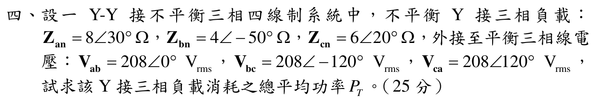

# 110 年電路學第 4 題：Y–Y 不平衡三相四線制總功率

## 1. 題面與相電壓

官方圖給定平衡正相序線電壓

\[
\tilde V_{ab}=208\angle0^\circ\ \mathrm{V}_{\mathrm{rms}},
\quad
\tilde V_{bc}=208\angle(-120^\circ)\ \mathrm{V}_{\mathrm{rms}},
\quad
\tilde V_{ca}=208\angle120^\circ\ \mathrm{V}_{\mathrm{rms}},
\]

以及不平衡 Y 接負載

\[
Z_{an}=8\angle30^\circ\,\Omega,
\qquad
Z_{bn}=4\angle(-50^\circ)\,\Omega,
\qquad
Z_{cn}=6\angle20^\circ\,\Omega.
\]

四線制的負載中性點與源中性點相連，所以即使負載不平衡，各負載端仍直接承受平衡相電壓：

\[
V_\phi=\frac{208}{\sqrt3}=120.088855\ \mathrm{V}_{\mathrm{rms}},
\]

\[
\tilde V_{an}=V_\phi\angle(-30^\circ),
\quad
\tilde V_{bn}=V_\phi\angle(-150^\circ),
\quad
\tilde V_{cn}=V_\phi\angle90^\circ.
\]

## 2. 各相電流與平均功率

各相電流為 $\tilde I_k=\tilde V_{kn}/Z_{kn}$。對阻抗 $Z=|Z|\angle\varphi$，複數功率為

\[
S=VI^*=\frac{V_\phi^2}{Z^*}
=\frac{V_\phi^2}{|Z|}\angle\varphi,
\qquad
P=\operatorname{Re}(S)=\frac{V_\phi^2}{|Z|}\cos\varphi.
\]

因 $V_\phi^2=208^2/3=14421.333333\,\mathrm{V^2}$：

### A 相

\[
P_a=\frac{14421.333333}{8}\cos30^\circ
=1561.155\ \mathrm{W}.
\]

### B 相

官方圖是 $|Z_{bn}|=4\,\Omega$（不是原草稿的 $5\,\Omega$），故

\[
P_b=\frac{14421.333333}{4}\cos(-50^\circ)
=2317.464\ \mathrm{W}.
\]

### C 相

\[
P_c=\frac{14421.333333}{6}\cos20^\circ
=2258.603\ \mathrm{W}.
\]

## 3. 總平均功率與回代

\[
\boxed{
P_T=P_a+P_b+P_c
=1561.155+2317.464+2258.603
=6137.222\ \mathrm{W}
=6.137222\ \mathrm{kW}.}
\]

交叉檢查各相電流幅值為 $15.0111$ A、$30.0222$ A、$20.0148$ A；相角分別為 $-60^\circ$、$-100^\circ$、$70^\circ$。因此 $V_\phi I_k^*\cos(\angle V_k-\angle I_k)$ 分別回得 $1561.155$ W、$2317.464$ W、$2258.603$ W，與阻抗公式一致。

## 校驗結論

- `qid` 與官方 `source_crop` 已核對，題面確為 Y–Y 三相四線制，且 $Z_{bn}=4\angle(-50^\circ)\,\Omega$。
- 原草稿誤讀 $Z_{bn}$ 為 $5\,\Omega$，導致 $P_b$ 與總功率偏低；已更正並完整回代。
- 正確總平均功率為 $P_T=6.137222\,\mathrm{kW}$，條件完整，標記為 `verified`。

<!-- LEGACY_EXPLANATION_HIDDEN: replaced after independent verification

> ⚠️ 以下為歷史草稿內容，已由上方獨立校驗解答取代，僅供追溯。

## 四、Y-Y 接不平衡三相四線制負載總功率計算（25 分）

### 📌 題目與已知條件
在 Y-Y 接不平衡三相四線制系統中，平衡三相正相序線電壓為：
$$\mathbf{V}_{ab} = 208\angle 0^\circ\text{ V}_{rms}, \quad \mathbf{V}_{bc} = 208\angle -120^\circ\text{ V}_{rms}, \quad \mathbf{V}_{ca} = 208\angle 120^\circ\text{ V}_{rms}$$
不平衡 Y 接三相負載阻抗為：
$$\mathbf{Z}_{an} = 8\angle 30^\circ\ \Omega, \quad \mathbf{Z}_{bn} = 5\angle -50^\circ\ \Omega, \quad \mathbf{Z}_{cn} = 6\angle 20^\circ\ \Omega$$
試求該 Y 接三相負載消耗之總平均功率 $P_T$。

---

### 💡 核心考點與破題關鍵
1. **三相四線制相電壓計算**：
   - 由於中性線存在且理想，各相負載端電壓即為平衡相電壓：
     $$V_\phi = \frac{V_L}{\sqrt{3}} = \frac{208}{\sqrt{3}} = 120.09\text{ V}_{rms}$$
     $$\mathbf{V}_{an} = 120.09\angle -30^\circ\text{ V}_{rms}$$
     $$\mathbf{V}_{bn} = 120.09\angle -150^\circ\text{ V}_{rms}$$
     $$\mathbf{V}_{cn} = 120.09\angle 90^\circ\text{ V}_{rms}$$
2. **每相平均功率公式**：
   $$P_\phi = \frac{|\mathbf{V}_\phi|^2}{|\mathbf{Z}_\phi|} \cos\theta_\phi$$
   $$P_T = P_a + P_b + P_c$$

---

### ✏️ 步驟式詳細數學推導
1. **計算 A 相消耗平均功率**：
   - 負載阻抗：$\mathbf{Z}_{an} = 8\angle 30^\circ\ \Omega$（阻抗角 $\theta_a = 30^\circ$）
   $$P_a = \frac{V_\phi^2}{|\mathbf{Z}_{an}|}\cos\theta_a = \frac{120.09^2}{8}\cos 30^\circ = \frac{14421.6}{8} \times 0.8660 = 1802.7 \times 0.8660 = \mathbf{1561.18\text{ W}}$$
2. **計算 B 相消耗平均功率**：
   - 負載阻抗：$\mathbf{Z}_{bn} = 5\angle -50^\circ\ \Omega$（阻抗角 $\theta_b = -50^\circ$）
   $$P_b = \frac{V_\phi^2}{|\mathbf{Z}_{bn}|}\cos\theta_b = \frac{14421.6}{5}\cos(-50^\circ) = 2884.32 \times 0.6428 = \mathbf{1854.01\text{ W}}$$
3. **計算 C 相消耗平均功率**：
   - 負載阻抗：$\mathbf{Z}_{cn} = 6\angle 20^\circ\ \Omega$（阻抗角 $\theta_c = 20^\circ$）
   $$P_c = \frac{V_\phi^2}{|\mathbf{Z}_{cn}|}\cos\theta_c = \frac{14421.6}{6}\cos 20^\circ = 2403.6 \times 0.9397 = \mathbf{2258.64\text{ W}}$$
4. **計算三相總平均功率 $P_T$**：
   $$\mathbf{P_T = P_a + P_b + P_c = 1561.18 + 1854.01 + 2258.64 = 5673.83\text{ W} = 5.674\text{ kW}}$$

---

> [!WARNING]
> ⚠️ **電路學 核心防坑與閱卷踩雷提醒**：
> 1. **複數功率共軛**：$\mathbf{S} = \mathbf{V}\mathbf{I}^* = P + jQ$，電流 $\mathbf{I}$ 務必取共軛，電感性負載 $Q > 0$（落後），電容性負載 $Q < 0$（超前）。
> 2. **三相功率計算**：三相總功率公式 $P = \sqrt{3}V_L I_L \cos\theta = 3V_\phi I_\phi \cos\theta$，代入線電壓時必有 $\sqrt{3}$。
> 3. **一階暫態連續性**：電感電流 $i_L(0^+) = i_L(0^-)$ 與電容電壓 $v_C(0^+) = v_C(0^-)$ 不可突變。

---

### 🎯 第四題 滿分關鍵與結論
- **各相消耗功率**：$P_a = \mathbf{1.561\text{ kW}}, \quad P_b = \mathbf{1.854\text{ kW}}, \quad P_c = \mathbf{2.259\text{ kW}}$
- **三相負載總平均功率**：$P_T = \mathbf{5673.83\text{ W} = 5.674\text{ kW}}$
-->
