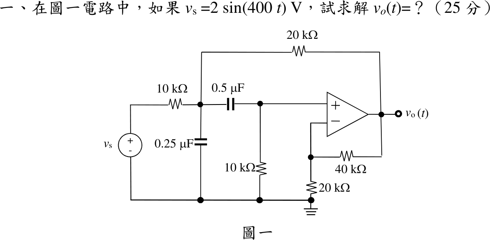

# 111 年電路學第 1 題｜含運算放大器交流穩態

## 已知與所求

\(v_s=2\sin(400t)\ \mathrm V\) 經 \(10\ \mathrm{k\Omega}\) 接節點 \(a\)；節點 \(a\) 另接 \(0.25\ \mu\mathrm F\) 對地、\(20\ \mathrm{k\Omega}\) 至 \(v_o\)、\(0.5\ \mu\mathrm F\) 至節點 \(b\)；節點 \(b\) 接 \(10\ \mathrm{k\Omega}\) 對地並接運算放大器同相端；反相端由 \(40\ \mathrm{k\Omega}\)（回授）與 \(20\ \mathrm{k\Omega}\)（接地）分壓。求 \(v_o(t)\)（25 分）。

## 考場標準作答

理想運放虛短、虛斷，構成非反相放大器：
\[
v_o=\left(1+\frac{40}{20}\right)v_b=3v_b
\]
\(\omega=400\)：\(\frac{1}{j\omega(0.25\,\mu\mathrm F)}=-j10\ \mathrm{k\Omega}\)、\(\frac{1}{j\omega(0.5\,\mu\mathrm F)}=-j5\ \mathrm{k\Omega}\)。以 \(\mathrm{k\Omega}\) 計，正弦基準峰值相量 \(V_s=2\angle0^\circ\)。

節點 \(b\)：
\[
\frac{V_b-V_a}{-j5}+\frac{V_b}{10}=0\Rightarrow V_b=\frac{j4}{2+j4}V_a
\]
節點 \(a\)（代入 \(V_o=3V_b\)，全式乘 20）：
\[
\frac{V_a-V_s}{10}+\frac{V_a}{-j10}+\frac{V_a-V_b}{-j5}+\frac{V_a-3V_b}{20}=0
\Rightarrow (3+j6)V_a-(3+j4)V_b=2V_s
\]
聯立得
\[
\frac{V_o}{V_s}=\frac{72-j12}{37},\qquad
V_o=\frac{144-j24}{37}=\frac{24}{\sqrt{37}}\angle\left(-\tan^{-1}\frac16\right)\ \mathrm V
\]
\[
\boxed{v_o(t)=\frac{24}{\sqrt{37}}\sin\left(400t-\tan^{-1}\frac16\right)=3.946\sin(400t-9.46^\circ)\ \mathrm V}
\]

## 驗算

改求轉移函數再代頻率。以 \(s\) 表示兩個節點方程並消去 \(V_a\)，得
\[
H(s)=\frac{V_o}{V_s}=\frac{1200s}{s^2+600s+120000}
\]
\(s=j400\)：\(H=\frac{j480000}{-40000+j240000}=\frac{j12}{-1+j6}=\frac{72-j12}{37}\)，\(|H|=\frac{12}{\sqrt{37}}=1.973\)，乘以 2 V 得 \(3.946\ \mathrm V\)，與節點相量解一致。

## 失分點

- 忽略 \(20\ \mathrm{k\Omega}\) 由 \(v_o\) 回授至節點 \(a\) 的支路，把電路拆成兩級獨立放大器，會得 \(5.657\sin(400t+45^\circ)\) 之類的錯解。
- 非反相增益寫成 \(40/20=2\)，漏了「\(1+\)」。
- 題目以 \(\sin\) 為基準，回時域時誤寫成 \(\cos\)。
