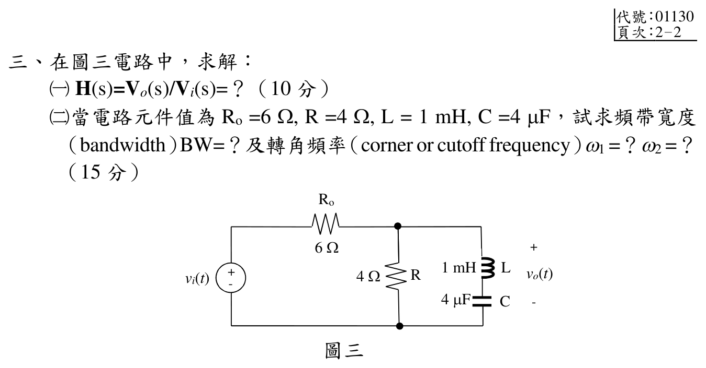

# 111 年第 3 題｜RLC 轉移函數與截止頻率

## 考場標準作答

令串聯 LC 支路阻抗

\[
Z_{LC}=sL+\frac1{sC}=\frac{s^2LC+1}{sC},
\qquad Z_p=R\parallel Z_{LC}.
\]

由分壓得

\[
\boxed{H(s)=\frac{R}{R_o+R}
\frac{s^2+\omega_0^2}{s^2+\alpha s+\omega_0^2}},
\]

其中

\[
\omega_0=\frac1{\sqrt{LC}},
\qquad
\alpha=\frac{R_oR}{(R_o+R)L}.
\]

代入 \(R_o=6\,\Omega\)、\(R=4\,\Omega\)、\(L=1\,\mathrm{mH}\)、\(C=4\,\mu\mathrm F\)：

\[
H(s)=0.4\frac{s^2+2.5\times10^8}{s^2+2400s+2.5\times10^8}.
\]

通帶增益為 \(0.4\)，故截止點滿足 \(|H(j\omega)|=0.4/\sqrt2\)，即
\[
|\omega_0^2-\omega^2|=\alpha\omega.
\]
取兩個正根
\[
\omega_{1,2}=\frac{\sqrt{\alpha^2+4\omega_0^2}\mp\alpha}{2},
\]
得到

\[
\boxed{\omega_1=14656.86\,\mathrm{rad/s}},\qquad
\boxed{\omega_2=17056.86\,\mathrm{rad/s}},
\]

\[
\boxed{\mathrm{BW}=\omega_2-\omega_1=2400\,\mathrm{rad/s}}.
\]

兩根另滿足 \(\omega_1\omega_2=\omega_0^2=2.5\times10^8\,\mathrm{rad^2/s^2}\)，與 \(\omega_2-\omega_1=\alpha\) 同時核對頻率與頻寬。

## 得分點拆解

- 由官方拓樸辨認 \(R\) 與串聯 LC 是並聯負載，輸出是整個並聯節點電壓。
- 先寫 \(Z_{LC}\)、\(Z_p\)，再用 \(R_o\) 與 \(Z_p\) 分壓；不能套用串聯 RLC 帶通公式。
- 將轉移函數整理成標準二階帶拒形式，指出 \(\omega_0\) 為零點頻率。
- 截止頻率以通帶增益 \(0.4\) 的半功率為基準，並列出兩根與頻寬。

## 完整教學推導

### 官方題目（逐題裁切）

圖三電路要求：

1. 求 \(H(s)=V_o(s)/V_i(s)\)。
2. 當 \(R_o=6\,\Omega\)、\(R=4\,\Omega\)、\(L=1\,\mathrm{mH}\)、\(C=4\,\mu\mathrm{F}\) 時，求頻帶寬度 \(\mathrm{BW}\) 與轉角（截止）角頻率 \(\omega_1,\omega_2\)。

上方已附官方逐題裁切圖；下列分壓與輸出端位置均依圖三判讀。

### 拓樸判讀與阻抗

由官方裁切圖確認：電壓源先串聯 \(R_o\)，其後節點對下方參考點有兩個並聯支路：

- 中間支路為 \(R\)；
- 右支路為串聯 \(L\)-\(C\)。

輸出 \(v_o\) 的正端在該節點、負端在下方參考點，因此 \(v_o\) 是並聯網路兩端的節點電壓，不是單獨某一元件電壓。

令
\[
Z_{LC}(s)=sL+\frac{1}{sC}
=\frac{s^2LC+1}{sC}.
\]
並聯負載阻抗為
\[
Z_p(s)=R\parallel Z_{LC}(s)
=\frac{RZ_{LC}(s)}{R+Z_{LC}(s)}.
\]

### （一）轉移函數

由 \(R_o\) 與 \(Z_p\) 的分壓：
\[
H(s)=\frac{V_o(s)}{V_i(s)}
=\frac{Z_p(s)}{R_o+Z_p(s)}.
\]
代入 \(Z_p\) 並化簡：
\[
H(s)
=\frac{RZ_{LC}(s)}
 {R_o\bigl(R+Z_{LC}(s)\bigr)+RZ_{LC}(s)}
=\frac{R\bigl(s^2LC+1\bigr)}
 {(R_o+R)\bigl(s^2LC+1\bigr)+R_oRCs}.
\]

因此標準二階形式為
\[
\boxed{
H(s)=\frac{R}{R_o+R}\,
\frac{s^2+\omega_0^2}
{s^2+\alpha s+\omega_0^2}
}
\]
其中
\[
\omega_0=\frac{1}{\sqrt{LC}},
\qquad
\alpha=\frac{R_oR}{(R_o+R)L}.
\]
這是帶拒（notch/band-stop）響應：在 \(s=\pm j\omega_0\) 有零點，且低頻與高頻通帶增益均為 \(R/(R_o+R)\)。

### （二）數值代入

\[
L=10^{-3}\,\mathrm{H},\qquad
C=4\times10^{-6}\,\mathrm{F},
\]
\[
LC=4\times10^{-9}\,\mathrm{s^2},
\qquad
\omega_0^2=\frac{1}{LC}=2.5\times10^8\,\mathrm{rad^2/s^2},
\]
\[
\omega_0=15811.388301\,\mathrm{rad/s}.
\]

阻尼係數為
\[
\alpha=\frac{(6)(4)}{(6+4)(10^{-3})}
=2400\,\mathrm{rad/s}.
\]

故
\[
\boxed{
H(s)=0.4\,
\frac{s^2+2.5\times10^8}
{s^2+2400s+2.5\times10^8}
}.
\]

### 半功率截止頻率與頻寬

通帶極限增益為
\[
\lvert H\rvert_{\mathrm{pass}}=\frac{R}{R_o+R}=0.4.
\]
對 \(s=j\omega\)，
\[
\lvert H(j\omega)\rvert^2
=0.4^2\,
\frac{(\omega_0^2-\omega^2)^2}
{(\omega_0^2-\omega^2)^2+\alpha^2\omega^2}.
\]

以通帶功率的一半定義兩個截止點：
\[
\lvert H(j\omega_{1,2})\rvert^2
=\frac{0.4^2}{2}.
\]
所以
\[
(\omega_0^2-\omega^2)^2=\alpha^2\omega^2,
\]
亦即
\[
\lvert\omega_0^2-\omega^2\rvert=\alpha\omega.
\]

兩個正根為
\[
\omega_1=\frac{\sqrt{\alpha^2+4\omega_0^2}-\alpha}{2},
\qquad
\omega_2=\frac{\sqrt{\alpha^2+4\omega_0^2}+\alpha}{2}.
\]

數值上
\[
\sqrt{\alpha^2+4\omega_0^2}
=\sqrt{(2400)^2+4(2.5\times10^8)}
=31713.719429\,\mathrm{rad/s},
\]
\[
\boxed{\omega_1=14656.859714\,\mathrm{rad/s}},
\qquad
\boxed{\omega_2=17056.859714\,\mathrm{rad/s}}.
\]

頻帶寬度為
\[
\boxed{\mathrm{BW}=\omega_2-\omega_1=\alpha
=2400\,\mathrm{rad/s}}.
\]

驗算兩截止點：
\[
\lvert H(j\omega_1)\rvert
=\lvert H(j\omega_2)\rvert
=\frac{0.4}{\sqrt2}=0.2828427,
\]
且
\[
\lvert H(j\omega_0)\rvert=0,
\]
符合帶拒濾波器的零點與半功率定義。

## 獨立驗算

將
\[
Z_{LC}(j\omega)=j\omega L+\frac{1}{j\omega C}
\]
代回
\[
H(j\omega)
=\frac{RZ_{LC}(j\omega)}
{R_o\bigl(R+Z_{LC}(j\omega)\bigr)+RZ_{LC}(j\omega)}
\]
可直接得到上方的二階式；在 \(\omega=\omega_0\) 時 \(Z_{LC}=0\)，故 \(H=0\)，在 \(\omega\to0,\infty\) 時 \(Z_{LC}\to\infty\)，故 \(H\to R/(R_o+R)=0.4\)。這同時驗證了分壓推導的端點行為。

常見的舊誤式把本題當成 \(R_o,R,L,C\) 全串聯的帶通分壓，寫成
\[
H(s)=\frac{R}{R_o+R+sL+\frac{1}{sC}},
\]
並使用 \((R_o+R)/L=10000\,\mathrm{rad/s}\)。但官方裁切圖顯示 \(R_o\) 串聯後，\(R\) 與串聯 \(LC\) 是並聯，且 \(v_o\) 是該並聯節點對下方節點的電壓；因此此誤式並非圖示拓樸的 \(V_o/V_i\)，其頻寬與截止頻率不通過本題官方拓樸的頻率響應回代。現行單題與年度題解均採上方的並聯負載分壓式。

## 常見失分

- 把圖誤看成 \(R_o,R,L,C\) 全部串聯，得到錯誤的帶通響應。
- 以 \(|H|=1/\sqrt2\) 當截止條件；本題通帶增益是 0.4，應使用 \(0.4/\sqrt2\)。
- 將 \(L=1\,\mathrm{mH}\)、\(C=4\,\mu\mathrm F\) 的倍率換錯。
- 回答 Hz 而題目要求角頻率時，漏掉 \(2\pi\) 的換算說明。
