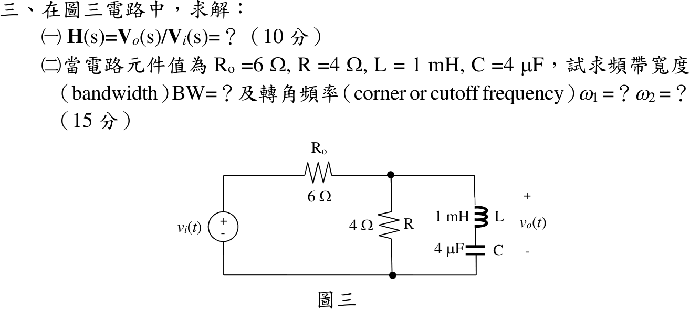

# 111 年電路學第 3 題｜RLC 轉移函數與截止頻率

## 已知與所求

\(v_i\) 串 \(R_o\) 後接一節點；該節點對地並聯兩支路：\(R\)，以及串聯的 \(L\)、\(C\)；\(v_o\) 取該節點對地電壓。求（一）\(H(s)=V_o/V_i\)（10 分）；（二）\(R_o=6\ \Omega\)、\(R=4\ \Omega\)、\(L=1\ \mathrm{mH}\)、\(C=4\ \mu\mathrm F\) 時的 \(\mathrm{BW}\) 與 \(\omega_1,\omega_2\)（15 分）。

## 考場標準作答

### （一）轉移函數

\[
Z_{LC}=sL+\frac1{sC}=\frac{s^2LC+1}{sC},\qquad Z_p=R\parallel Z_{LC},\qquad H(s)=\frac{Z_p}{R_o+Z_p}
\]
\[
H(s)=\frac{R(s^2LC+1)}{(R_o+R)(s^2LC+1)+R_oRCs}
\]
\[
\boxed{H(s)=\frac{R}{R_o+R}\cdot\frac{s^2+\omega_0^2}{s^2+\alpha s+\omega_0^2},\quad \omega_0^2=\frac1{LC},\ \alpha=\frac{R_oR}{(R_o+R)L}}
\]
零點在 \(\pm j\omega_0\)，為帶拒（notch）響應，通帶增益 \(R/(R_o+R)\)。

### （二）頻寬與截止頻率

\[
\omega_0^2=\frac{1}{(10^{-3})(4\times10^{-6})}=2.5\times10^8,\qquad
\alpha=\frac{(6)(4)}{(10)(10^{-3})}=2400\ \mathrm{rad/s}
\]
\[
H(s)=0.4\,\frac{s^2+2.5\times10^8}{s^2+2400s+2.5\times10^8}
\]
通帶增益 \(0.4\)，截止點 \(|H(j\omega)|=0.4/\sqrt2\)，即
\[
(\omega_0^2-\omega^2)^2=\alpha^2\omega^2\Rightarrow|\omega_0^2-\omega^2|=\alpha\omega
\]
\[
\omega_{1,2}=\frac{\sqrt{\alpha^2+4\omega_0^2}\mp\alpha}{2}=\frac{31713.72\mp2400}{2}
\]
\[
\boxed{\omega_1=14656.86\ \mathrm{rad/s}},\qquad \boxed{\omega_2=17056.86\ \mathrm{rad/s}}
\]
\[
\boxed{\mathrm{BW}=\omega_2-\omega_1=\alpha=2400\ \mathrm{rad/s}}
\]
兩根滿足 \(\omega_1\omega_2=\omega_0^2=2.5\times10^8\)，中心 \(\omega_0=15811.39\ \mathrm{rad/s}\) 為兩者幾何平均。

## 驗算

- 端點：\(\omega\to0\) 或 \(\infty\) 時 \(Z_{LC}\to\infty\)，\(H\to\frac{4}{10}=0.4\)；\(\omega=\omega_0\) 時 \(Z_{LC}=0\)，\(H=0\)，與帶拒形式一致。
- 直接代回：\(\omega_1=14656.86\) 時 \(\omega_0^2-\omega_1^2=2.5\times10^8-2.1482\times10^8=3.518\times10^7=\alpha\omega_1\)，故 \(|H(j\omega_1)|=0.4/\sqrt2=0.2828\)；以數值搜尋 \(|H(j\omega)|\) 的半功率點亦得同一組根。

## 失分點

- 把圖看成 \(R_o,R,L,C\) 全串聯並取 \(R\) 上電壓，寫成 \(H=\frac{R}{R_o+R+sL+1/(sC)}\)、\(\mathrm{BW}=(R_o+R)/L=10000\ \mathrm{rad/s}\)；官方圖中 \(R\) 與串聯 \(LC\) 並聯，應用上方的並聯負載分壓式。
- 以 \(|H|=1/\sqrt2\) 為截止條件；本題通帶增益是 \(0.4\)，應以 \(0.4/\sqrt2\) 為準。
- \(\alpha\) 誤用 \(R/L\) 或 \(R_o/L\)；有效電阻是 \(R_o\parallel R=2.4\ \Omega\)。
