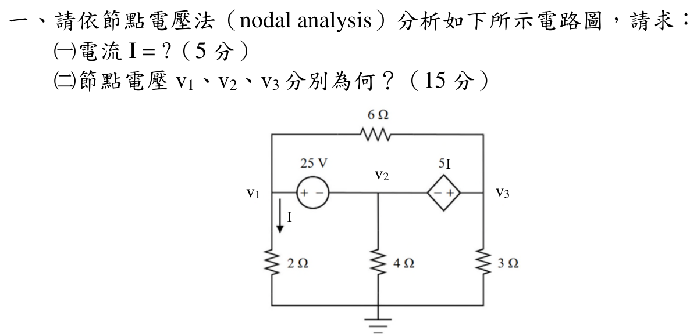

# 114 年電路學第 1 題｜節點電壓法與超節點

## 考場標準作答

以底線為參考地。由左側 2 Ω 電阻的電流定義，
> 6 Ω 連接 \(v_1\) 與 \(v_3\)，屬超節點內部支路。
\[
I=\frac{v_1}{2}.
\]
25 V 電壓源與相依電壓源把 (v_1,v_2,v_3) 連成同一超節點，故
\[
v_1-v_2=25,
\qquad
v_3-v_2=5I=\frac52v_1.
\]
超節點邊界 KCL（6 Ω 是超節點內部支路，不列入）為
\[
\frac{v_1}{2}+\frac{v_2}{4}+\frac{v_3}{3}=0.
\]
聯立得
\[
\boxed{v_1=\frac{175}{23}=7.6087\text{ V}},
\quad
\boxed{v_2=-\frac{400}{23}=-17.3913\text{ V}},
\]
\[
\boxed{v_3=\frac{75}{46}=1.6304\text{ V}},
\qquad
\boxed{I=\frac{175}{46}=3.8043\text{ A}}.
\]

## 得分點拆解

- 以接地線為參考，正確讀出 (I=v_1/2)。
- 兩個電壓源相連的三個節點必須視為一個超節點。
- 正確寫出 (v_1-v_2=25) 與 (v_3-v_2=5I)，並保留相依源極性。
- 超節點 KCL 只列流向地的 2 Ω、4 Ω、3 Ω 支路；6 Ω 不能列入。
- 三個節點電壓與電流均標示單位，且代回兩個源約束。

## 完整教學推導

由 25 V 源左正右負，
\[
v_2=v_1-25.
\]
相依源右端為正，故
\[
v_3-v_2=5I=5\left(\frac{v_1}{2}\right)=\frac52v_1,
\qquad
v_3=\frac72v_1-25.
\]
把 (v_2,v_3) 代入超節點 KCL：
\[
\frac{v_1}{2}+\frac{v_1-25}{4}+\frac{\frac72v_1-25}{3}=0.
\]
乘以 12：
\[
6v_1+3v_1-75+14v_1-100=0,
\qquad 23v_1=175.
\]
因此
\[
v_1=\frac{175}{23}\ \mathrm V,
\quad
v_2=-\frac{400}{23}\ \mathrm V,
\quad
v_3=\frac{75}{46}\ \mathrm V,
\quad
I=\frac{175}{46}\ \mathrm A.
\]

## 獨立驗算

源約束殘差為
\[
v_1-v_2-25=0,
\qquad
v_3-v_2-5I=0.
\]
超節點 KCL 代回為
\[
\frac{175/23}{2}+\frac{-400/23}{4}+\frac{75/46}{3}
=\frac{175-200+25}{46}=0.
\]
三式皆成立；6 Ω 支路只在超節點內部交換電流，不影響邊界 KCL。

## 常見失分

- 將 6 Ω 內部支路列入超節點 KCL，造成重複計算。
- 把相依源的 (5I) 極性寫成 (v_2-v_3)。
- 忘記 (I) 的箭頭向下，直接寫成 (-v_1/2)。
- 只列一個電壓源約束，導致三個節點未知數無法閉合。
