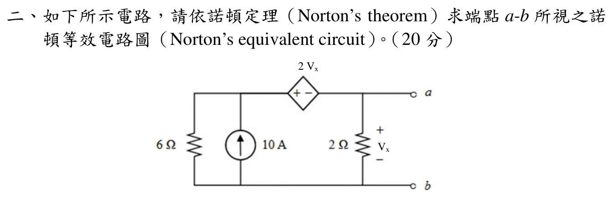

# 114 年電路學第 2 題｜諾頓等效

## 考場標準作答

令 (b) 為參考地，且圖示 2 Ω 電阻兩端 (v_x=v_a)。相依電壓源給出
\[
v_n-v_a=2v_x=2v_a,
\qquad v_n=3v_a.
\]
端口開路時，含相依源的超節點 KCL 為
\[
\frac{v_n}{6}+\frac{v_a}{2}=10.
\]
代入 (v_n=3v_a)：
\[
v_a=10\ \mathrm V,\qquad V_{th}=10\ \mathrm V.
\]

關閉獨立 10 A 電流源（開路），接上測試電壓 (V_t=v_a)。仍有 (v_n=3V_t)，測試電流為
\[
i_t=\frac{v_n}{6}+\frac{v_a}{2}=V_t.
\]
所以
\[
R_N=R_{th}=1\ \Omega,\qquad I_N=\frac{V_{th}}{R_N}=10\ \mathrm A.
\]
\[
\boxed{I_N=10\ \mathrm A\ \text{（由 }a\text{ 流向 }b\text{）}},
\qquad \boxed{R_N=1\ \Omega}.
\]

## 得分點拆解

- 正確指定 (b) 為地，並辨認 (v_x=v_a)。
- 保留相依電壓源，寫出 (v_n-v_a=2v_x)。
- 求開路電壓時，2 Ω 電阻仍是原網路的一部分。
- 求 (R_N) 時只關閉獨立電流源；相依源必須保留並使用測試源。
- 由 (V_{th}/R_N) 或端口短路電流得到 Norton 電流並標明方向。

## 完整教學推導

因 (b=0)，
\[
v_x=v_a,\qquad v_n=3v_a.
\]
開路端口不代表內部 2 Ω 電阻消失；它仍跨接 (a-b)。10 A 電流源向超節點注入電流，因此
\[
\frac{v_n}{6}+\frac{v_a}{2}=10
\Longrightarrow
\frac{3v_a}{6}+\frac{v_a}{2}=10
\Longrightarrow v_a=10\ \mathrm V.
\]

求等效電阻時，10 A 理想電流源關閉為開路。令測試端電壓為 (V_t)，則
\[
v_a=V_t,\qquad v_n=3V_t,\qquad
i_t=\frac{3V_t}{6}+\frac{V_t}{2}=V_t.
\]
\[
R_N=\frac{V_t}{i_t}=1\ \Omega,\qquad
I_N=\frac{10}{1}=10\ \mathrm A.
\]

## 獨立驗算

把端口短路，(v_a=v_x=0)，相依源約束使 (v_n=0)。6 Ω 與 2 Ω 電阻均無電流，10 A 電流源的電流全部經端口短路由 (a) 流向 (b)，所以
\[
i_{sc}=10\ \mathrm A=I_N.
\]
並且 (V_{th}=I_NR_N=(10)(1)=10\ \mathrm V)，與開路法一致。

## 常見失分

- 將相依源誤當成獨立源關閉。
- 求 (R_N) 時只看 2 Ω 電阻，忽略相依源造成的 6 Ω 支路電流。
- 把 (v_x) 的極性看反，誤寫成 (v_x=-v_a)。
- 把 10 A Norton 電流方向寫成由 (b) 流向 (a)。
