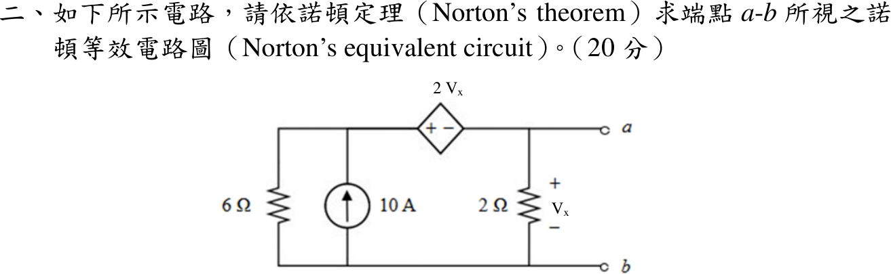

# 114 年電路學第 2 題｜諾頓等效

## 已知與所求

取 \(b\) 為參考點。左上節點 \(n\) 接 6 Ω 至 \(b\) 及 10 A 電流源（箭頭向上流入 \(n\)）；相依電壓源 \(2V_x\) 正端接 \(n\)、負端接 \(a\)；2 Ω 跨接 \(a\)–\(b\)，\(V_x=v_a\)（上正）。求 \(a\)–\(b\) 的諾頓等效電路。

## 考場標準作答

### 開路電壓

相依源給出 \(v_n-v_a=2v_a\Rightarrow v_n=3v_a\)。開路時相依源支路電流即 2 Ω 電流 \(v_a/2\)，節點 \(n\) 的 KCL：
\[
\frac{v_n}{6}+\frac{v_a}{2}=10\Rightarrow\frac{3v_a}{6}+\frac{v_a}{2}=10\Rightarrow V_{oc}=v_a=10\ \mathrm V
\]

### 短路電流

\(a\)–\(b\) 短路使 \(V_x=0\)，故 \(v_n=0\)，6 Ω 與 2 Ω 皆無電流，10 A 全部經短路線：\(I_{sc}=10\ \mathrm A\)，外部短路電流 \(a\to b\)。

### 諾頓等效

\[
\boxed{I_N=10\ \mathrm A},\qquad \boxed{R_N=\frac{V_{oc}}{I_{sc}}=1\ \Omega}
\]
\(a\)、\(b\) 兩端**並聯** 10 A 理想電流源與 1 Ω 電阻；電流源箭頭由 \(b\to a\)，使開路時 \(V_{ab}=+10\,\mathrm V\)。

## 驗算

測試源法：關閉 10 A（開路）、保留相依源，在 \(a\) 加 \(V_t\)，則 \(v_n=3V_t\)，\(i_t=\frac{V_t}{2}+\frac{3V_t}{6}=V_t\Rightarrow R_N=1\ \Omega\)，與 \(V_{oc}/I_{sc}\) 一致。

## 失分點

- 求 \(R_N\) 時把相依源歸零會得 \(6\parallel2=1.5\ \Omega\)；相依源必須保留。
- \(V_x\) 極性看反（\(V_x=-v_a\)）會得 \(v_n=-v_a\)、\(V_{oc}=30\ \mathrm V\)。
- 把外部短路電流 \(a\to b\) 當成電流源本體箭頭；源內箭頭應為 \(b\to a\)。
