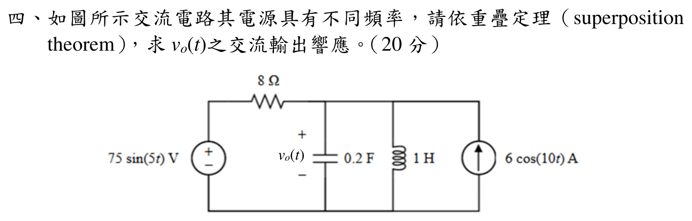

# 114 年電路學第 4 題｜不同頻率的重疊定理

## 考場標準作答

輸出節點的並聯電容與電感導納為
\[
Y(j\omega)=j\omega C+\frac1{j\omega L}
=j\left(0.2\omega-\frac1\omega\right).
\]
對 (75\sin(5t)) V 電壓源，將 6 cos(10t) A 電流源開路：
\[
Y_5=j0.8,\qquad H_5=\frac1{1+8Y_5}=\frac1{1+j6.4}.
\]
所以
\[
v_{o,5}(t)=\frac{75}{\sqrt{41.96}}\sin(5t-\tan^{-1}6.4)
=11.579\sin(5t-81.123^\circ)\ \mathrm V.
\]
對 (6\cos(10t)) A 電流源，將電壓源短路：
\[
Y_{10}=j1.9,\qquad
\widetilde V_{o,10}=\frac6{j1.9}=3.1579\angle(-90^\circ)\ \mathrm V,
\]
故 (v_{o,10}(t)=3.1579\sin(10t)\ \mathrm V)。
\[
\boxed{v_o(t)=11.579\sin(5t-81.123^\circ)+3.1579\sin(10t)\ \mathrm V}.
\]

## 得分點拆解

- 不同頻率必須分開建立各自的相量電路。
- 求 5 rad/s 分量時電流源開路；求 10 rad/s 分量時電壓源短路。
- 正確使用 (Y_C=j\omega C) 與 (Y_L=1/(j\omega L))。
- 8 Ω 串聯電阻的電壓分壓因子為 (1/(1+8Y))。
- 把兩個不同頻率的輸出回到時域後相加，保留峰值與相位。

## 完整教學推導

令輸出節點對地電壓為 (V_o)。任一頻率下的節點 KCL 為
\[
\frac{V_o-V_s}{8}+YV_o=I_s.
\]
在 5 rad/s，只保留電壓源：
\[
Y_5=j5(0.2)+\frac1{j5(1)}=j0.8,
\]
\[
\frac{V_{o,5}-75}{8}+j0.8V_{o,5}=0
\Longrightarrow
V_{o,5}=\frac{75}{1+j6.4}.
\]
其大小與相位為
\[
|V_{o,5}|=\frac{75}{\sqrt{1+6.4^2}}=11.579\ \mathrm V,
\quad \angle V_{o,5}=-81.123^\circ.
\]

在 10 rad/s，只保留電流源：
\[
Y_{10}=j10(0.2)+\frac1{j10(1)}=j1.9.
\]
電壓源短路後，
\[
Y_{10}V_{o,10}=6,
\qquad V_{o,10}=\frac6{j1.9}=-j3.1579\ \mathrm V.
\]
以餘弦表示為 (3.1579\cos(10t-90^\circ))，等價於 (3.1579\sin(10t))。

## 獨立驗算

5 rad/s 分量代回
\[
\frac{V_{o,5}-75}{8}+j0.8V_{o,5}=0
\]
成立；10 rad/s 分量代回
\[
j1.9(-j3.1579)=6\ \mathrm A
\]
也成立。兩分量各自在自己的頻率通過 KCL，故總輸出符合重疊定理。

## 常見失分

- 把電容或電感的 (j) 號寫反。
- 直接將 5 與 10 rad/s 當成同一相量問題。
- 忘記電壓源分量要開路電流源，或電流源分量要短路電壓源。
- 把 (1/(1+j6.4)) 的相位寫成正 (81.123^\circ)。
