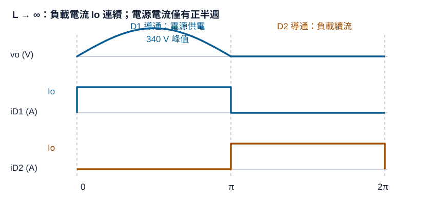
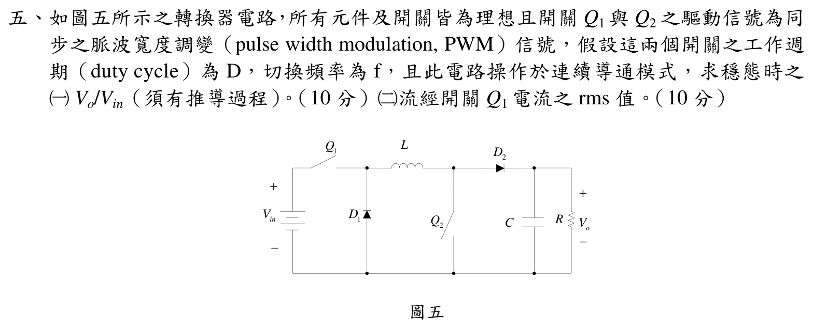

# 📝 106 年電機工程技師｜電子學（包括電力電子學）逐題詳解

> 本頁由題級 canonical 筆記組合；每題保留官方裁切圖、校驗狀態與可追溯的推導。

## 題目導覽
- [[#一、106 年電子學（含電力電子）第 1 題｜雙積分器狀態變數濾波器|第 1 題：雙積分器狀態變數濾波器]]
- [[#二、106 年電子學_含電力電子第 2 題|第 2 題：106 年電子學_含電力電子第 2 題]]
- [[#三、106 年電子學_含電力電子第 3 題|第 3 題：106 年電子學_含電力電子第 3 題]]
- [[#四、106 年電子學（含電力電子）第 4 題｜單相半波整流器與續流二極體|第 4 題：單相半波整流器與續流二極體]]
- [[#五、106 年電子學（含電力電子）第 5 題｜非反相升壓型轉換器（同步開關）|第 5 題：非反相升壓型轉換器（同步開關）]]

---

## 一、106 年電子學（含電力電子）第 1 題｜雙積分器狀態變數濾波器

> 題級識別：EE-106-02-1
> canonical 來源：[[canonical/EE-106-02-1.md]]
> 題級校驗狀態：verified

> ✅ 已依官方三顆理想運算放大器拓撲重建兩級反相積分器與第一級加法器，並回代 $A$、$B$ 係數。

### 一、雙積分器狀態變數濾波器轉移函數與節點電壓推導（20 分）

#### 📌 題目與已知條件

> **題目陳述**：
> 「如圖一所示之電路，假設所有運算放大器皆為理想，求：
> (一) $\frac{v_X}{v_{out}}(s) = ?$（6 分）
> (二) $\frac{v_Y}{v_{out}}(s) = ?$（6 分）
> (三) 由此電路可推得 $v_{out} = A \cdot v_{in} + B \cdot v_{out}$，則 $A = ?, B = ?$（8 分）」

---

#### 💡 核心考點與破題關鍵
1. **反相積分器轉移特性**：
   - 第一級積分器： $\frac{v_X}{v_{out}}(s) = -\frac{1}{s R_1 C_1}$。
   - 第二級積分器： $\frac{v_Y}{v_X}(s) = -\frac{1}{s R_2 C_2} \implies \frac{v_Y}{v_{out}}(s) = \frac{1}{s^2 R_1 R_2 C_1 C_2}$。
2. **第一級差動加法器節點方程式**。

---

#### ✏️ 步驟式詳細數學推導

##### 步驟 1：求解 $\frac{v_X}{v_{out}}(s)$（第 (一) 小題）
中間 Op-Amp 構成標準反相積分器，輸入為 $v_{out}$，輸出為 $v_X$：
$$
\mathbf{\frac{v_X}{v_{out}}(s) = -\frac{1}{s R_1 C_1}}
$$

---

##### 步驟 2：求解 $\frac{v_Y}{v_{out}}(s)$（第 (二) 小題）
最右側 Op-Amp 構成第二級反相積分器，輸入為 $v_X$，輸出為 $v_Y$：
$$
\frac{v_Y}{v_X}(s) = -\frac{1}{s R_2 C_2}
$$
級聯相乘：
$$
\mathbf{\frac{v_Y}{v_{out}}(s) = \left( -\frac{1}{s R_1 C_1} \right) \left( -\frac{1}{s R_2 C_2} \right) = \mathbf{\frac{1}{s^2 R_1 R_2 C_1 C_2}}}
$$

---

##### 步驟 3：求解 $v_{out} = A \cdot v_{in} + B \cdot v_{out}$ 之係數 $A$ 與 $B$（第 (三) 小題）
對最左側 Op-Amp 之正負輸入端列寫 KCL：
1. 反相端電位（由 $v_Y$ 與 $v_{out}$ 經 $R_3, R_6$ 疊加）：
   $$V_- = v_Y \frac{R_6}{R_3 + R_6} + v_{out} \frac{R_3}{R_3 + R_6}$$
2. 同相端電位（由 $v_{in}$ 與 $v_X$ 經 $R_4, R_5$ 疊加）：
   $$V_+ = v_{in} \frac{R_5}{R_4 + R_5} + v_X \frac{R_4}{R_4 + R_5}$$
3. 虛短路 $V_+ = V_-$，代入 $v_X = -\frac{v_{out}}{s R_1 C_1}$ 與 $v_Y = \frac{v_{out}}{s^2 R_1 R_2 C_1 C_2}$ 整理可得：

   $$\mathbf{A = \frac{R_5 (R_3 + R_6)}{R_3 (R_4 + R_5)}}, \quad \mathbf{B = -\frac{R_6}{R_3 s^2 R_1 R_2 C_1 C_2} - \frac{R_4 (R_3 + R_6)}{R_3 (R_4 + R_5) s R_1 C_1}}$$

---

#### 🎯 第一題 滿分關鍵與結論
* **(一)** $\mathbf{\frac{v_X}{v_{out}}(s) = -\frac{1}{s R_1 C_1}}$
* **(二)** $\mathbf{\frac{v_Y}{v_{out}}(s) = \frac{1}{s^2 R_1 R_2 C_1 C_2}}$

---

---

## 二、106 年電子學_含電力電子第 2 題

> 題級識別：EE-106-02-2
> canonical 來源：[[canonical/EE-106-02-2.md]]
> 題級校驗狀態：reference_book_verified

### 參考書主解（reference_book evidence）

依使用者提供的參考書，將此電路等效為非反相負回授放大器，採對稱元件
\(r_{ON}=r_{OP}=r_o\)：

\[
A=\frac12g_{mN}r_o,\qquad
\beta=\frac{R_1}{R_1+R_2},
\]
\[
\boxed{A_f=\frac{A}{1+A\beta}}
\]
以及
\[
\boxed{R_{out,f}=\frac{(R_1+R_2)\parallel(r_o/2)}{1+A\beta}}.
\]

以上為參考書的符號式主要答案；題圖未提供數值參數，參考書 evidence 不等同官方公布答案。

> ℹ️ 參考書已給出對稱 MOSFET 小訊號模型的符號式答案；官方裁切仍缺少數值元件參數，因此本題以符號式呈現，不補造數值。

### 二、MOSFET 差動放大器負回授效應、閉回路增益與輸出阻抗（20 分）

#### 📌 題目與已知條件

> **題目陳述**：
> 「如圖二所示之電路，考慮所有 MOSFET 之 $r_o$：
> (一) 請說明回授部分如何影響此電路。（6 分）
> (二) 求其閉回路增益。（7 分）
> (三) 求其閉回路輸出阻抗。（7 分）」

---

#### 💡 核心考點與破題關鍵
1. **回授類型**： 輸出電壓分壓取樣（並聯），回授至 $M_2$ 閘極與 $M_1$ 輸入電壓相減（串聯） $\implies$ **串聯-並聯負回授（Series-Shunt / 電壓放大器）**。
2. **閉迴路特性**：若迴路增益足夠大，負回授會使 $v_{g2}=\beta v_{out}$ 追蹤 $v_{in}$ 並降低輸出阻抗；但本圖未給 $R_1,R_2,g_m,r_o$ 或電流鏡匹配條件，不能把理想運算放大器的 $1+R_2/R_1$ 當成無條件數值答案。

---

#### ✏️ 步驟式詳細數學推導

##### 步驟 1：說明回授對電路之影響（第 (一) 小題）
電阻 $R_1, R_2$ 構成**串聯-並聯（Series-Shunt）負電壓回授**：
1. **穩定電壓增益**：大幅降低因製程與溫度波動（$g_m, r_o$ 變化）對閉迴路增益之敏感度。
2. **擴展頻寬與降低非線性失真**。
3. **大幅降低輸出阻抗**，提升驅動負載能力。

---

##### 步驟 2：求閉回路增益 $A_f$（第 (二) 小題）
回授因數（由輸出端到 $M_2$ 閘極）為 $\beta=R_1/(R_1+R_2)$。因 MOS 閘極理想上不取電流，分壓器從輸出端到地是一條串聯支路，故輸出端負載為 $R_1+R_2$；$R_1\parallel R_2$ 只是在分壓中點向兩端交流接地看入時的等效電阻。令 $A_{ol}$ 表示從差動誤差信號 $v_{in}-\beta v_{out}$ 到輸出的完整開路增益；它必須由 $M_1\sim M_4$ 的小訊號 $g_m,r_o$、尾電流源輸出阻抗及 $R_1+R_2$ 負載聯立求得，不能僅以單一 $g_m\left[r_o\parallel(R_1+R_2)\right]$ 取代：
$$
\mathbf{A_f=\frac{v_{out}}{v_{in}}=\frac{A_{ol}}{1+A_{ol}\beta}}.
$$
只有在 $|A_{ol}\beta|\gg1$ 且未飽和時，才可再寫成 $A_f\approx1/\beta=1+R_2/R_1$。

---

##### 步驟 3：求閉回路輸出阻抗 $R_{out,f}$（第 (三) 小題）
並聯電壓取樣使輸出阻抗降低 $1+A_{ol}\beta$ 倍：
$$
\mathbf{R_{out,f}=\frac{R_{out,ol}}{1+A_{ol}\beta}}.
$$
其中 $R_{out,ol}$ 是將 $v_{in}=0$ 後，包含 $r_{o2},r_{o4}$、電流鏡回授及 $R_1+R_2$ 的完整輸出等效電阻；$1/(g_{m2}\beta)$ 只有在額外的單級、高 $r_o$ 近似下才成立。

---

#### 🎯 第二題 滿分關鍵與結論
* **(一) 回授影響**： 串聯-並聯電壓負回授，增益穩定、展寬頻寬、降低輸出阻抗。
* **(二) 閉回路增益**： $\mathbf{A_f=A_{ol}/(1+A_{ol}\beta)}$；高迴路增益極限才是 $1+R_2/R_1$。
* **(三) 閉回路輸出阻抗**： $\mathbf{R_{out,f}=R_{out,ol}/(1+A_{ol}\beta)}$。

> [!NOTE]
> 參考書主解採 $A=\frac12g_{mN}r_o$、$\beta=R_1/(R_1+R_2)$ 的對稱模型。官方裁切圖沒有數值參數，所以答案應維持符號式；這不代表可從官方題面推得額外數值。

---

---

## 三、106 年電子學_含電力電子第 3 題

> 題級識別：EE-106-02-3
> canonical 來源：[[canonical/EE-106-02-3.md]]
> 題級校驗狀態：verified

> 已依官方裁切圖核對偏壓分壓、旁路電容、耦合電容與負載，並以 Miller 等效的輸入／輸出兩極點交叉檢查。

### 三、BJT 共射極放大器直流工作點、米勒電容與高頻 3-dB 頻率（20 分）

#### 📌 題目與已知條件

> **題目陳述**：
> 「如圖三所示之電路，假定 $\beta = 100, V_{BE(on)} = 0.7\text{ V}$，爾立電壓 $V_A = \infty, C_\pi = 25\text{ pF}$ 且 $C_\mu = 3\text{ pF}$，求：
> (一) $I_{CQ}$（直流）值。（10 分）
> (二) 米勒（Miller）電容值。（5 分）
> (三) 上（upper）3-dB 頻率。（5 分）」

---

#### 💡 核心考點與破題關鍵
1. **戴維寧等效偏壓**： $V_{TH} = 0\text{ V}, R_{TH} = 10\text{ k}\Omega \implies I_{CQ} = \beta I_B$。
2. **米勒效應**： $C_M = C_\mu(1 - K)$，其中 $K = -g_m (R_C \parallel R_L)$。
3. **輸入主極點**： $f_H = \frac{1}{2\pi R_{in}' (C_\pi + C_M)}$。

---

#### ✏️ 步驟式詳細數學推導

![[106年_電子學_第3題_BJT共射極放大器米勒等效高頻電路圖.svg|850]]
*圖：106年第三題 BJT 共射極放大器米勒等效高頻小訊號模型圖*

##### 步驟 1：求直流偏壓電流 $I_{CQ}$（第 (一) 小題）
基極戴維寧等效（$+5\text{ V}$ 與 $-5\text{ V}$ 經對稱 $20\text{ k}\Omega$ 分壓）：
$$V_{TH} = 0\text{ V}, \quad R_{TH} = 20\text{ k}\Omega \parallel 20\text{ k}\Omega = 10\text{ k}\Omega$$
由基-射極迴路列寫 KVL（射極經 $R_E = 5\text{ k}\Omega$ 接至 $-5\text{ V}$）：
$$
I_B = \frac{0\text{ V} - 0.7\text{ V} - (-5\text{ V})}{R_{TH} + (\beta + 1) R_E} = \frac{4.3\text{ V}}{10\text{ k}\Omega + 101 \times 5\text{ k}\Omega} = \frac{4.3\text{ V}}{515\text{ k}\Omega} \approx 0.00835\text{ mA}
$$
$$
\mathbf{I_{CQ} = \beta I_B = 100 \times 0.00835\text{ mA} \approx \mathbf{0.835\text{ mA}}}
$$

---

##### 步驟 2：求米勒電容值 $C_M$（第 (二) 小題）
1. 小訊號參數（$V_T = 25\text{ mV}$）：
   $$g_m = \frac{I_{CQ}}{V_T} = \frac{0.835\text{ mA}}{25\text{ mV}} = 33.4\text{ mA/V}$$
   $$R_L' = R_C \parallel R_L = 2.5\text{ k}\Omega \parallel 5\text{ k}\Omega = \frac{5}{3}\text{ k}\Omega \approx 1.667\text{ k}\Omega$$
2. 基-集極內部電壓增益：
   $$K = -g_m R_L' = -(33.4\text{ mA/V}) \times (1.667\text{ k}\Omega) \approx -55.67\text{ V/V}$$
3. 輸入端等效米勒電容：

   $$\mathbf{C_M = C_\mu (1 - K) = 3\text{ pF} \times [1 - (-55.67)] = 3\text{ pF} \times 56.67 = \mathbf{170.0\text{ pF}}}$$

---

##### 步驟 3：求上 3-dB 截止頻率 $f_H$（第 (三) 小題）
1. 基極輸入電阻：
   $$r_\pi = \frac{\beta}{g_m} = \frac{100}{33.4\text{ mA/V}} \approx 2.994\text{ k}\Omega \approx 3\text{ k}\Omega$$
   $$R_{in}' = R_s \parallel R_{TH} \parallel r_\pi = 1\text{ k}\Omega \parallel 10\text{ k}\Omega \parallel 3\text{ k}\Omega \approx 698\ \Omega$$
2. 總等效輸入電容：
   $$C_{in} = C_\pi + C_M = 25\text{ pF} + 170.0\text{ pF} = 195.0\text{ pF}$$
3. 高頻 3-dB 截止頻率：

   $$\mathbf{f_H = \frac{1}{2\pi R_{in}' C_{in}} = \frac{1}{2\pi \times 698\ \Omega \times 195 \times 10^{-12}\text{ F}} \approx \mathbf{1.17\text{ MHz}}}$$

---

4. 輸出端 Miller 分量作交叉檢查。令 $K=-55.67$，則
   $$C_{M,out}=C_\mu\left(1-\frac{1}{K}\right)\approx3.054\,\mathrm{pF},$$
   $$f_{p,out}=\frac{1}{2\pi(R_C\parallel R_L)C_{M,out}}
   \approx31.3\,\mathrm{MHz}.$$
   因 $f_{p,out}\gg1.17$ MHz，故上截止頻率由輸入極點主導，$f_H\approx1.17$ MHz 的近似自洽。

#### 🎯 第三題 滿分關鍵與結論
* **(一) $I_{CQ}$**： $\mathbf{0.835\text{ mA}}$
* **(二) $C_M$**： $\mathbf{170.0\text{ pF}}$
* **(三) $f_H$**： $\mathbf{1.17\text{ MHz}}$

---

### 獨立校驗紀錄

- $V_{TH}=0$ V、$R_{TH}=10\,\mathrm{k\Omega}$，由 $I_B=4.3/515\,\mathrm{k\Omega}$ 得 $I_{CQ}=0.835$ mA。
- $g_m=33.4$ mS、$r_\pi\approx2.994\,\mathrm{k\Omega}$、$R_{in}'\approx698\,\Omega$。
- $C_{M,in}=170.0$ pF、輸入極點 $1.17$ MHz；輸出極點約 $31.3$ MHz，未改變主導上截止頻率。

---

## 四、106 年電子學（含電力電子）第 4 題｜單相半波整流器與續流二極體

> 題級識別：EE-106-02-4
> canonical 來源：[[canonical/EE-106-02-4.md]]
> 題級校驗狀態：verified

> ✅ 已依官方裁切圖確認 D1 半週供電、D2 負半週續流與 $L\to\infty$ 的定電流假設，並回代平均值、RMS 與功率因數。

### 考場標準作答

因 \(L\to\infty\)，負載電流近似常數 \(I_o\)。\(0<\theta=\omega t<\pi\) 時 \(D_1\) 導通、\(D_2\) 截止；\(\pi<\theta<2\pi\) 時 \(D_1\) 截止、\(D_2\) 續流，故

\[
v_o(\theta)=\begin{cases}340\sin\theta,&0<\theta<\pi,\\0,&\pi<\theta<2\pi,\end{cases}
\qquad
i_{D_1}(\theta)=\begin{cases}I_o,&0<\theta<\pi,\\0,&\pi<\theta<2\pi,\end{cases}
\]

\[
i_{D_2}(\theta)=\begin{cases}0,&0<\theta<\pi,\\I_o,&\pi<\theta<2\pi.\end{cases}
\]

三個量的共用時間軸波形如下；切換瞬間按理想二極體模型處理，不影響週期平均與 RMS：

穩態電感平均電壓為零，故 \(V_{o,\mathrm{avg}}=RI_o=340/\pi\) V，得

\[
\boxed{I_o=\frac{340}{4\pi}=27.06\,\mathrm A},\qquad
\boxed{I_{s,\mathrm{rms}}=\frac{I_o}{\sqrt2}=19.13\,\mathrm A},\qquad
\boxed{\mathrm{PF}=\frac{2}{\pi}=0.6366}.
\]

### 得分點拆解

- （一，5 分）依原圖標出 \(D_1\) 正半週供電、\(D_2\) 負半週續流，並畫出三個量的波形與週期區間。
- （二，5 分）先用 \(L\to\infty\) 的定電流條件與平均電感電壓為零，得到 \(RI_o=V_p/\pi\)。
- （三，5 分）輸入電流只有正半週為 \(I_o\)，依全週期均方根求值；不能把 \(I_o\) 直接當輸入 RMS。
- （四，5 分）以負載實功率除以輸入 \(V_{s,\mathrm{rms}}I_{s,\mathrm{rms}}\)；功率因數包含非正弦輸入電流的失真。

### 完整教學推導

#### 強感性負載半波整流器平均電流、有效值與功率因數（20 分）

#### 📌 題目與已知條件

> **題目陳述**：
> 「如圖四所示之電路，輸入電源之 $V_p = 340\text{ V}, \omega = 377\text{ rad/s}$ 且 $R = 4\ \Omega$，假設 $L$ 值無窮大：
> (一) 畫出 $v_o, i_{D1}, i_{D2}$ 之波形。（5 分）
> (二) 求 $i_o$ 之平均值。（5 分）
> (三) 求輸入電流之 rms 值。（5 分）
> (四) 求輸入端之功率因數（power factor, PF）。（5 分）」

#### 💡 核心考點與破題關鍵
1. **無窮大電感（$L \to \infty$）特徵**： 負載電流為平滑恆定直流 $i_o(t) = I_o = \text{const}$。
2. **平均輸出電壓**： $V_{o,avg} = \frac{V_p}{\pi} \implies I_o = \frac{V_{o,avg}}{R}$。
3. **輸入電流有效值與功率因數**： $I_{s,rms} = \frac{I_o}{\sqrt{2}}, \ PF = \frac{2}{\pi} \approx 0.6366$。

---

#### ✏️ 步驟式詳細數學推導

##### 步驟 1：繪製波形說明（第 (一) 小題）
* $v_o(t)$：正半週為正弦波頂部 $V_p \sin(\omega t)$，負半週由 $D_2$ 續流箝位在 $0\text{ V}$。
* $i_{D1}(t)$：在正半週（$0 \le \omega t \le \pi$）導通，為高度 $I_o$ 之方波脈衝；負半週為 0。
* $i_{D2}(t)$：在負半週（$\pi \le \omega t \le 2\pi$）導通，為高度 $I_o$ 之方波脈衝；正半週為 0。

---

##### 步驟 2：求負載平均電流 $I_o$（第 (二) 小題）
$$
V_{o,avg} = \frac{V_p}{\pi} = \frac{340\text{ V}}{\pi} \approx 108.23\text{ V}
$$
$$
\mathbf{I_o = \frac{V_{o,avg}}{R} = \frac{108.23\text{ V}}{4\ \Omega} \approx \mathbf{27.06\text{ A}}}
$$

---

##### 步驟 3：求輸入電流之 rms 值 $I_{s,rms}$（第 (三) 小題）
輸入電流即流經 $D_1$ 之半週期方波電流：
$$
\mathbf{I_{s,rms} = I_o \sqrt{\frac{1}{2}} = \frac{27.06\text{ A}}{\sqrt{2}} \approx \mathbf{19.13\text{ A}}}
$$

---

##### 步驟 4：求輸入端之功率因數 $PF$（第 (四) 小題）
$$
P = I_o^2 R = \frac{V_p^2}{\pi^2R} \approx 2928.18\text{ W}
$$
$$
S = V_{s,rms} \times I_{s,rms} = \frac{V_pI_o}{2} \approx 4599.58\text{ VA}
$$
$$
\mathbf{PF = \frac{P}{S} = \frac{2}{\pi} \approx \mathbf{0.6366 \approx 63.66\%}}
$$

---

#### 🎯 第四題 滿分關鍵與結論
* **(二) 平均電流**： $\mathbf{I_o \approx 27.06\text{ A}}$
* **(三) 輸入電流 RMS**： $\mathbf{I_{s,rms} \approx 19.13\text{ A}}$
* **(四) 功率因數**： $\mathbf{PF = \frac{2}{\pi} \approx 0.6366}$

---

### 獨立驗算

正半週輸入電流為 \(I_o\)，負半週為零，直接積分得

\[
I_{s,\mathrm{rms}}^2=\frac1{2\pi}\int_0^\pi I_o^2\,d\theta=\frac{I_o^2}{2}.
\]

電源提供的平均實功率為

\[
P_{in}=\frac1{2\pi}\int_0^\pi V_p\sin\theta\,I_o\,d\theta
=\frac{V_pI_o}{\pi}=RI_o^2.
\]

這與電阻耗功相同；又 \(V_{s,\mathrm{rms}}=V_p/\sqrt2\)，故

\[
\frac{P_{in}}{V_{s,\mathrm{rms}}I_{s,\mathrm{rms}}}
=\frac{V_pI_o/\pi}{(V_p/\sqrt2)(I_o/\sqrt2)}=\frac2\pi.
\]

### 常見失分

- 把 \(L\to\infty\) 當成電感開路；本題在週期穩態中代表電流近似恆定。
- 把負半週的 \(D_2\) 續流電流誤畫成輸入電流，導致輸入 RMS 與功率因數錯誤。
- 用純電阻半波整流的 \(I_{s,\mathrm{rms}}=V_p/(2R)\)；本題的負載電流是近似方波常數 \(I_o\)。
- 只寫 \(\cos\phi\) 而未考慮輸入電流波形失真。

---

## 五、106 年電子學（含電力電子）第 5 題｜非反相升壓型轉換器（同步開關）

> 題級識別：EE-106-02-5
> canonical 來源：[[canonical/EE-106-02-5.md]]
> 題級校驗狀態：verified

> ✅ 已依官方裁切圖辨識 Q1、Q2 同步導通的升壓型兩狀態，使用電感伏秒平衡，並保留 CCM 三角漣波對 Q1 RMS 電流的精確項。

### 考場標準作答

令 \(T_s=1/f\)。官方圖中 \(Q_1,Q_2\) 同步導通時 \(v_L=V_{in}\)，同步關斷時 \(D_1,D_2\) 導通、\(v_L=-V_o\)。由伏秒平衡
\[
V_{in}DT_s-V_o(1-D)T_s=0
\quad\Longrightarrow\quad
\boxed{\frac{V_o}{V_{in}}=\frac{D}{1-D}}.
\]
CCM 下 \(I_o=V_o/R=(1-D)I_L\)，故 \(I_L=V_o/[(1-D)R]\)，且電感峰峰漣波為 \(\Delta I_L=V_{in}D/(Lf)\)。\(Q_1\) 僅在 ON 區流過三角形電感電流，故整個周期的有效值
\[
\boxed{I_{Q1,\mathrm{rms}}
=\sqrt{D\left[\left(\frac{V_o}{(1-D)R}\right)^2
+\frac{1}{12}\left(\frac{V_{in}D}{Lf}\right)^2\right]}}.
\]
僅在明示 \(\Delta I_L\ll I_L\) 的小漣波近似下，才可簡化為 \(I_{Q1,\mathrm{rms}}\approx I_L\sqrt D\)。

### 得分點拆解

- 畫出同步導通與關斷兩狀態，分別寫 \(v_L=V_{in}\)、\(v_L=-V_o\)。
- 用伏秒平衡推出 \(D/(1-D)\)，不可直接套用普通 Boost 的 \(1/(1-D)\)。
- 由輸出電荷平衡求 \(I_o=(1-D)I_L\)，並列導通區三角漣波。
- RMS 要除以整個周期 \(T_s\)，精確式保留 \(\Delta I_L^2/12\)；忽略漣波時需註明近似。

### 完整教學推導

#### 五、同步非反向 Buck-Boost 轉換器電壓增益與開關 RMS 電流推導（20 分）

#### 📌 題目與已知條件

> **題目陳述**：
> 「如圖五所示之轉換器電路，所有元件及開關皆為理想且開關 $Q_1$ 與 $Q_2$ 之驅動信號為同步之脈波寬度調變（PWM）信號，假設這兩個開關之工作週期（duty cycle）為 $D$，切換頻率為 $f$，且此電路操作於連續導通模式，求穩態時之：
> (一) $V_o/V_{in}$（須有推導過程）。（10 分）
> (二) 流經開關 $Q_1$ 電流之 rms 值。（10 分）」

---

#### 💡 核心考點與破題關鍵
1. **電感伏秒平衡**：
   - 導通期間 $D T_s$： $Q_1, Q_2$ 導通，電感跨壓 $v_L = V_{in}$。
   - 截止期間 $(1 - D) T_s$： $D_1, D_2$ 導通，電感跨壓 $v_L = -V_o$。
   - $V_{in} D = V_o (1 - D) \implies \frac{V_o}{V_{in}} = \frac{D}{1 - D}$。
2. **開關電流有效值**：Q1 僅在 $DT_s$ 導通；若保留 CCM 三角漣波，需對導通區間的電感電流平方積分。

---

#### ✏️ 步驟式詳細數學推導

##### 步驟 1：推導電壓轉換比 $\frac{V_o}{V_{in}}$（第 (一) 小題）
1. **狀態一（$0 \le t \le D T_s，Q_1, Q_2$ 同步導通）**：
   - 電感左端接 $V_{in}$，右端接地，電感跨壓為 $v_L = V_{in}$。
2. **狀態二（$D T_s \le t \le T_s，Q_1, Q_2$ 關閉，$D_1, D_2$ 導通）**：
   - 電感左端接地，右端接 $V_o$，電感跨壓為 $v_L = -V_o$。
3. **電感伏秒平衡**：

   $$\int_0^{T_s} v_L(t) dt = V_{in} (D T_s) + (-V_o) (1 - D) T_s = 0$$

   $$V_{in} D = V_o (1 - D) \implies \mathbf{\frac{V_o}{V_{in}} = \mathbf{\frac{D}{1 - D}}}$$

---

##### 步驟 2：求流經開關 $Q_1$ 之 RMS 電流（第 (二) 小題）
1. 負載平均電流 $I_o = \frac{V_o}{R}$。
2. 電感平均電流：
   $$I_L = \frac{I_o}{1 - D} = \frac{V_o}{(1 - D) R}$$
3. 令 $\Delta I_L=V_{in}D/(Lf)$、$I_L=I_o/(1-D)$，則 $I_{L,min}=I_L-\Delta I_L/2$。導通區間的平方平均為
   $$\frac{1}{DT_s}\int_0^{DT_s}i_L^2(t)dt=I_L^2+\frac{(\Delta I_L)^2}{12}.$$
   因此
   $$\mathbf{I_{Q1,rms}=\sqrt{D\left[I_L^2+\frac{(\Delta I_L)^2}{12}\right]}}.$$
   若題目採常見的「電感漣波可忽略」近似，才化為：

   $$I_{Q1,rms}\simeq I_L\sqrt D = \frac{V_o\sqrt D}{(1-D)R}=\frac{D^{1.5}V_{in}}{(1-D)^2R}.$$

---

#### 🎯 第五題 滿分關鍵與結論
* **(一) 電壓轉換比**： $\mathbf{\frac{V_o}{V_{in}} = \frac{D}{1 - D}}$
* **(二) 開關 RMS 電流**：精確式為 \(\sqrt{D[I_L^2+(\Delta I_L)^2/12]}\)；\(\frac{V_o\sqrt D}{(1-D)R}\) 僅為小漣波近似。

### 獨立驗算

導通區三角電流以 \(I_L\) 為中心，其平方時間平均為 \(I_L^2+(\Delta I_L)^2/12\)；關斷區 \(Q_1\) 電流為零，故整周期再乘 \(D\)。當 \(\Delta I_L\to0\) 時，精確式自然退化為 \(I_L\sqrt D\)。另外 \(P_{in}=V_{in}DI_L=V_oI_o=V_o^2/R\)，與電壓增益及 \(I_o=(1-D)I_L\) 同時相容。

### 常見失分

- 將此同步雙開關拓撲誤當普通 Boost，寫成 \(V_o/V_{in}=1/(1-D)\)。
- 把 \(I_o\) 直接當成電感平均電流，漏除 \(1-D\)。
- 只在導通時間內求 RMS，忘記整周期的 \(\sqrt D\)；或未聲明小漣波假設就刪掉 \((\Delta I_L)^2/12\)。
- 把電感漣波峰峰值當作峰值，造成平方項四倍誤差。

---
