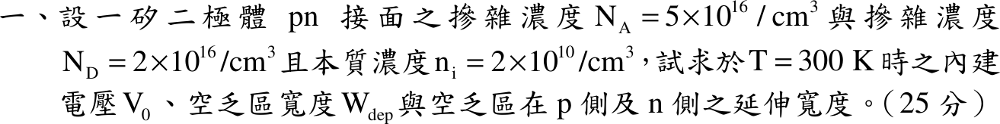
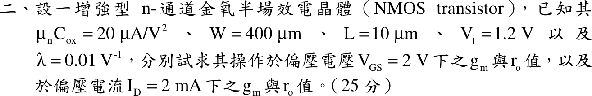
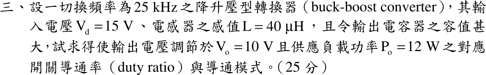
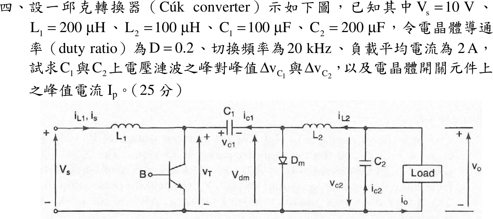

# 📝 107 年電機工程技師｜電子學（包括電力電子學）逐題詳解

> 本頁由題級 canonical 筆記組合；每題保留官方裁切圖、校驗狀態與可追溯的推導。

## 題目導覽
- [[#一、107 年電子學（含電力電子）第 1 題｜PN 接面|第 1 題：PN 接面]]
- [[#二、107 年電子學（含電力電子）第 2 題｜NMOS 小訊號參數|第 2 題：NMOS 小訊號參數]]
- [[#三、107 年電子學（含電力電子）第 3 題｜降升壓型轉換器|第 3 題：降升壓型轉換器]]
- [[#四、107 年電子學（含電力電子）第 4 題｜Ćuk 轉換器|第 4 題：Ćuk 轉換器]]

---

## 一、107 年電子學（含電力電子）第 1 題｜PN 接面

> 題級識別：EE-107-02-1
> canonical 來源：[[canonical/EE-107-02-1.md]]
> 題級校驗狀態：verified

### 已知與所求

矽 pn 接面（平衡、無外加偏壓）：$N_A=5\times10^{16}\ \mathrm{cm^{-3}}$、$N_D=2\times10^{16}\ \mathrm{cm^{-3}}$、$n_i=2\times10^{10}\ \mathrm{cm^{-3}}$、$T=300\,\mathrm K$。求 $V_0$、$W_{dep}$、$x_p$、$x_n$。

題目未給、本解採用的常數（假設）：$kT/q=25.85\,\mathrm{mV}$（$k=1.381\times10^{-23}$、$q=1.602\times10^{-19}$），$\varepsilon_{Si}=11.7\varepsilon_0=1.036\times10^{-12}\ \mathrm{F/cm}$。

### 考場標準作答

#### 內建電壓

\[
V_0=\frac{kT}{q}\ln\frac{N_AN_D}{n_i^2}=0.02585\ln\frac{10^{33}}{4\times10^{20}}=0.02585\ln(2.5\times10^{12})=0.02585\times28.547
\]
\[
\boxed{V_0=0.738\ \mathrm V}
\]

#### 空乏區寬度

電荷中性 $N_Ax_p=N_Dx_n$，Poisson 積分得
\[
W_{dep}=\sqrt{\frac{2\varepsilon_{Si}V_0}{q}\left(\frac1{N_A}+\frac1{N_D}\right)}
=\sqrt{(1.293\times10^7)(7\times10^{-17})(0.738)}=2.585\times10^{-5}\ \mathrm{cm}
\]
\[
\boxed{W_{dep}=0.259\ \mu\text{m}}
\]

#### 兩側延伸

\[
\boxed{x_p=W_{dep}\frac{N_D}{N_A+N_D}=0.259\times\frac27=0.074\ \mu\mathrm m},\qquad
\boxed{x_n=W_{dep}\frac{N_A}{N_A+N_D}=0.259\times\frac57=0.185\ \mu\mathrm m}
\]
空乏區向濃度較低的 n 側延伸較多。

### 驗算

以峰值電場檢查：$E_{max}=qN_Dx_n/\varepsilon_{Si}=(1.602\times10^{-19})(2\times10^{16})(1.846\times10^{-5})/(1.036\times10^{-12})=5.71\times10^{4}\ \mathrm{V/cm}$，與由 p 側算得的 $qN_Ax_p/\varepsilon_{Si}$ 相同；三角形電場面積 $V_0=\tfrac12E_{max}W_{dep}=\tfrac12(5.71\times10^4)(2.585\times10^{-5})=0.738\ \mathrm V$。

### 失分點

- $x_n$ 與 $x_p$ 對調：$x_p=W\,N_D/(N_A+N_D)$（輕摻雜的 n 側 $x_n$ 較大）。
- $W_{dep}$ 公式漏掉 2（寫成 $\varepsilon V_0/q$）會得約 $0.183\ \mu\mathrm m$；濃度以 $\mathrm{cm^{-3}}$、$\varepsilon$ 以 $\mathrm{F/cm}$ 時結果單位是 cm，需換成 $\mu\mathrm m$（$1\ \mathrm{cm}=10^4\ \mu\mathrm m$）。
- $V_0$ 的對數是自然對數 $\ln$，不是 $\log_{10}$。

---

## 二、107 年電子學（含電力電子）第 2 題｜NMOS 小訊號參數

> 題級識別：EE-107-02-2
> canonical 來源：[[canonical/EE-107-02-2.md]]
> 題級校驗狀態：verified

### 已知與所求

增強型 NMOS：$\mu_nC_{ox}=20\ \mu\mathrm A/\mathrm V^2$、$W=400\ \mu\mathrm m$、$L=10\ \mu\mathrm m$、$V_t=1.2\ \mathrm V$、$\lambda=0.01\ \mathrm V^{-1}$。求（一）$V_{GS}=2\ \mathrm V$、（二）$I_D=2\ \mathrm{mA}$ 兩種偏壓下的 $g_m$ 與 $r_o$。

$V_{DS}$ 未給，故取 $r_o=1/(\lambda I_D)$（略去 $1+\lambda V_{DS}$）。

### 考場標準作答

$k_n=\mu_nC_{ox}\dfrac WL=20\ \mu\mathrm A/\mathrm V^2\times40=0.8\ \mathrm{mA/V^2}$。

#### （一）$V_{GS}=2\ \mathrm V$

$V_{OV}=2-1.2=0.8\ \mathrm V$，$I_D=\tfrac12k_nV_{OV}^2=0.256\ \mathrm{mA}$：
\[
\boxed{g_m=k_nV_{OV}=0.64\text{ mA/V}},\qquad
\boxed{r_o=\frac1{\lambda I_D}=\frac1{0.01\times0.256\ \mathrm{mA}}=390.6\text{ k}\Omega}
\]

#### （二）$I_D=2\ \mathrm{mA}$

\[
\boxed{g_m=\sqrt{2k_nI_D}=\sqrt{2(0.8)(2)}=1.789\ \mathrm{mA/V}},\qquad
\boxed{r_o=\frac1{0.01\times2\ \mathrm{mA}}=50\ \mathrm{k}\Omega}
\]

### 驗算

用 $g_m=2I_D/V_{OV}$：（一）$2(0.256)/0.8=0.64\ \mathrm{mA/V}$；（二）由 $g_m=1.789\ \mathrm{mA/V}$ 反推 $V_{OV}=2I_D/g_m=2.236\ \mathrm V$，$V_{GS}=3.44\ \mathrm V$。內在增益 $g_mr_o=2/(\lambda V_{OV})$：（一）$250$，（二）$89.4$，與兩組乘積 $0.64\times390.6=250$、$1.789\times50=89.4$ 相符。

### 失分點

- $W/L=400/10=40$，$\mu_nC_{ox}$ 單位是 $\mu\mathrm A/\mathrm V^2$：$k_n=0.8\ \mathrm{mA/V^2}$ 而不是 $0.8\ \mu\mathrm A/\mathrm V^2$。
- （二）給的是 $I_D$ 不是 $V_{GS}$，不可再用 $V_{GS}=2\ \mathrm V$，須用 $g_m=\sqrt{2k_nI_D}$。
- $r_o$ 隨 $I_D$ 變：（一）$I_D=0.256\ \mathrm{mA}$ 與（二）$2\ \mathrm{mA}$ 的 $r_o$ 不同，不要沿用同一個值。

---

## 三、107 年電子學（含電力電子）第 3 題｜降升壓型轉換器

> 題級識別：EE-107-02-3
> canonical 來源：[[canonical/EE-107-02-3.md]]
> 題級校驗狀態：verified

### 已知與所求

降升壓轉換器（buck-boost），$f_s=25\ \mathrm{kHz}$、$V_d=15\ \mathrm V$、$L=40\ \mu\mathrm H$，輸出電容極大，$V_o=10\ \mathrm V$、$P_o=12\ \mathrm W$。求開關導通率 $D$ 與導通模式。

### 考場標準作答

#### 判別導通模式

\(R=V_o^2/P_o=10^2/12=8.333\,\Omega\)。若為 CCM，\(D_{\rm CCM}=V_o/(V_d+V_o)=10/25=0.4\)，邊界電感
\[
L_B=\frac{(1-D_{\rm CCM})^2R}{2f_s}=\frac{(0.6)^2(8.333)}{2(25\,000)}=60\,\mu\mathrm H
\]
實際 \(L=40\,\mu\mathrm H<L_B\)，電感電流在每週期內降到零，故為不連續導通模式：\(\boxed{\mathrm{DCM}}\)，不能使用 CCM 的 \(D=0.4\)。

#### DCM 導通率

\(I_{\rm pk}=V_dD/(Lf_s)\)，每週期傳能 \(LI_{\rm pk}^2/2\)，無損失時
\[
P_o=\frac{V_d^2D^2}{2Lf_s}\ \Longrightarrow\
\boxed{D=\sqrt{\frac{2Lf_sP_o}{V_d^2}}=\sqrt{\frac{24}{225}}=0.3266=32.66\%}
\]
放能比例 \(D_2=V_dD/V_o=0.4899\)，且 \(D+D_2=0.8165<1\)，與 DCM 一致。

### 驗算

由電荷平衡：\(I_{\rm pk}=15(0.3266)/(40\,\mu\mathrm H\times25\,\mathrm{kHz})=4.899\,\mathrm A\)；放能期間電感電流自 \(I_{\rm pk}\) 線性降到 0，輸出平均電流 \(I_o=I_{\rm pk}D_2/2=4.899(0.4899)/2=1.200\,\mathrm A\)，\(V_oI_o=12\,\mathrm W=P_o\)，且 \(V_o/R=10/8.333=1.2\,\mathrm A\)。

### 失分點

- 只解 CCM 增益 \(V_o/V_d=D/(1-D)\) 就答 \(D=0.4\)，未先比較 \(L\) 與 \(L_B\)；以 0.4 代入 DCM 功率式會得 18 W 而非 12 W。
- 導通時電感跨壓是 \(V_d=15\ \mathrm V\)，不是 \(V_o\)。
- \(25\ \mathrm{kHz}\)、\(40\ \mu\mathrm H\) 的單位換算（\(10^3\)、\(10^{-6}\)）漏算。

---

## 四、107 年電子學（含電力電子）第 4 題｜Ćuk 轉換器

> 題級識別：EE-107-02-4
> canonical 來源：[[canonical/EE-107-02-4.md]]
> 題級校驗狀態：verified

### 已知與所求

Ćuk 轉換器：$V_s=10\ \mathrm V$、$L_1=200\ \mu\mathrm H$、$L_2=100\ \mu\mathrm H$、$C_1=100\ \mu\mathrm F$、$C_2=200\ \mu\mathrm F$，$D=0.2$、$f_s=20\ \mathrm{kHz}$、負載平均電流 $I_o=2\ \mathrm A$。求 $\Delta v_{C1}$、$\Delta v_{C2}$（峰對峰）與電晶體峰值電流 $I_p$。

### 考場標準作答

$T=50\ \mu\mathrm s$。穩態 $V_o=V_sD/(1-D)=2.5\ \mathrm V$，$I_{L2}=I_o=2\ \mathrm A$；無損失 $V_sI_{L1}=V_oI_o$，$I_{L1}=0.5\ \mathrm A$。$V_{C1}=V_s+V_o=12.5\ \mathrm V$，導通期間 $L_1$ 跨壓 $V_s=10\ \mathrm V$，$L_2$ 跨壓 $V_{C1}-V_o=10\ \mathrm V$。

#### $\Delta v_{C1}$

電晶體導通（$DT$）時 $C_1$ 以 $I_{L2}$ 放電：
\[
\boxed{\Delta v_{C1}=\frac{I_{L2}DT}{C_1}=\frac{2(0.2)(50\ \mu\mathrm s)}{100\ \mu\mathrm F}=0.2\text{ V}}
\]

#### $\Delta v_{C2}$

負載電流為直流，$C_2$ 吸收 $L_2$ 電流的三角漣波：
\[
\Delta i_{L2}=\frac{10(0.2)(50\ \mu\mathrm s)}{100\ \mu\mathrm H}=1\ \mathrm A,\qquad
\boxed{\Delta v_{C2}=\frac{\Delta i_{L2}}{8f_sC_2}=\frac{1}{8(20\,000)(200\ \mu\mathrm F)}=0.03125\text{ V}}
\]

#### 峰值電流 $I_p$

\[
\Delta i_{L1}=\frac{10(0.2)(50\ \mu\mathrm s)}{200\ \mu\mathrm H}=0.5\ \mathrm A
\]
導通期末電晶體電流為兩電感電流峰值之和：
\[
\boxed{I_p=\left(I_{L1}+\frac{\Delta i_{L1}}2\right)+\left(I_{L2}+\frac{\Delta i_{L2}}2\right)=0.75+2.5=3.25\text{ A}}
\]

### 驗算

以關斷期間（$(1-D)T$）檢查 $C_1$：此時 $C_1$ 由 $I_{L1}$ 充電，$\Delta v_{C1}=I_{L1}(1-D)T/C_1=0.5(0.8)(50\ \mu\mathrm s)/100\ \mu\mathrm F=0.2\ \mathrm V$，與導通期間放電量相同。$\Delta i_{L2}$ 亦可由關斷期間 $L_2$ 跨壓 $V_o$ 檢查：$V_o(1-D)T/L_2=2.5(0.8)(50\ \mu\mathrm s)/100\ \mu\mathrm H=1\ \mathrm A$。

### 失分點

- $C_1$ 在導通期間放電電流是 $I_{L2}$（$2\ \mathrm A$），不是 $I_{L1}$；關斷期間才是 $I_{L1}=0.5\ \mathrm A$、時間 $(1-D)T$。
- $\Delta v_{C2}$ 是三角波電荷面積，分母為 $8f_sC_2$，不是 $f_sC_2$。
- $I_p$ 需把兩電感的平均值與半個漣波相加，只加平均值會得 $2.5\ \mathrm A$。

---
