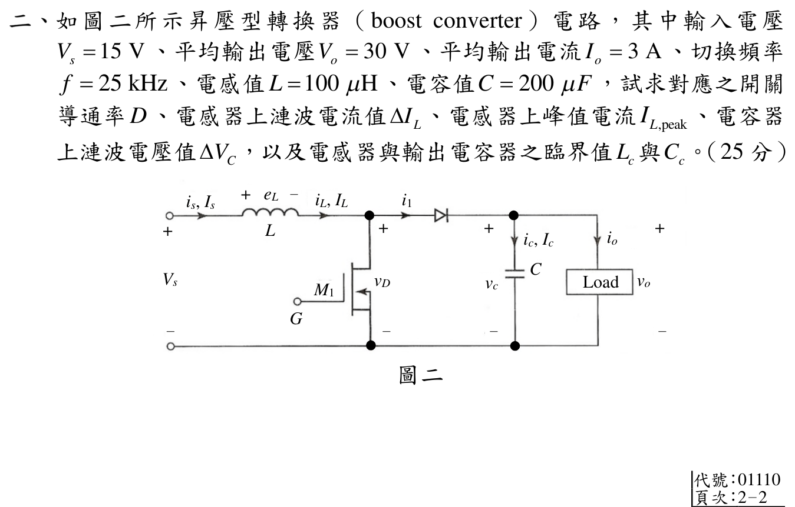

# 📝 109 年電機工程技師｜電子學（包括電力電子學）逐題詳解

> 本頁由題級 canonical 筆記組合；每題保留官方裁切圖、校驗狀態與可追溯的推導。

## 題目導覽
- [[#一、109 年電子學_含電力電子第 1 題|第 1 題：109 年電子學_含電力電子第 1 題]]
- [[#二、109 年電子學_含電力電子第 2 題|第 2 題：109 年電子學_含電力電子第 2 題]]
- [[#三、109 年電子學（含電力電子）第 3 題｜返馳式轉換器|第 3 題：返馳式轉換器]]
- [[#四、109 年電子學_含電力電子第 4 題|第 4 題：109 年電子學_含電力電子第 4 題]]

---

## 一、109 年電子學_含電力電子第 1 題

> 題級識別：EE-109-02-1
> canonical 來源：[[canonical/EE-109-02-1.md]]
> 題級校驗狀態：verified

### 獨立校驗紀錄

由官方 crop 讀得 \(R_C=11\,\Omega,V_{CC}=200\,\mathrm V,V_B=10\,\mathrm V,V_{CE(sat)}=1.0\,\mathrm V,V_{BE(sat)}=1.5\,\mathrm V,\beta_{F,min}=8\)。

\[
I_{C(sat)}=\frac{200-1}{11}=18.0909\,\mathrm A,
\quad I_B=6\frac{18.0909}{8}=13.5682\,\mathrm A,
\]
\[
R_B=\frac{10-1.5}{13.5682}=0.6265\,\Omega,
\quad P_T=1(18.0909)+1.5(13.5682)=38.4432\,\mathrm W.
\]

兩個飽和電流與 ODF 方程代回殘差小於 \(10^{-10}\)；結果與官方 crop 題意一致。

### 一、BJT 開關電路過載係數（ODF）、基極電阻與總功率損耗（25 分）

#### 📌 題目與已知條件

> **題目陳述**：
> 「如圖一所示雙極性接面電晶體（BJT）電路，其中 $R_C = 11\ \Omega, V_{CC} = 200\text{ V}, V_B = 10\text{ V}, V_{CE(sat)} = 1.0\text{ V}, V_{BE(sat)} = 1.5\text{ V}$，其順向電流增益（forward current gain, $\beta_F$）介於 $8$ 至 $40$ 之間，試求使電晶體進入飽和時具過載係數（overdrive factor, $\text{ODF}$）為 $6$ 之 $R_B$ 值，以及電晶體上之總功率損耗 $P_T$ 值。（25 分）」

---

#### 💡 核心考點與破題關鍵
1. **飽和集極電流**： $I_{C(sat)} = \frac{V_{CC} - V_{CE(sat)}}{R_C}$。
2. **過載係數定義與最劣條件（Worst-case Saturation）**：
   - 為保證在任何 $\beta_F \in [8, 40]$ 下皆飽和，取最小增益 $\beta_{F(min)} = 8$。
   - $I_{B(min)} = \frac{I_{C(sat)}}{\beta_{F(min)}} \implies I_B = \text{ODF} \times I_{B(min)} = 6 \times I_{B(min)}$。
3. **電晶體總功耗**： $P_T = V_{CE(sat)} I_{C(sat)} + V_{BE(sat)} I_B$。

---

#### ✏️ 步驟式詳細數學推導

##### 步驟 1：求飽和集極電流 $I_{C(sat)}$ 與基極電流 $I_B$
1. **飽和集極電流**：

   $$I_{C(sat)} = \frac{V_{CC} - V_{CE(sat)}}{R_C} = \frac{200\text{ V} - 1.0\text{ V}}{11\ \Omega} = \frac{199\text{ V}}{11\ \Omega} \approx \mathbf{18.091\text{ A}}$$

2. **臨界基極電流（取 $\beta_{F(min)} = 8$）**：
   $$I_{B(min)} = \frac{I_{C(sat)}}{\beta_{F(min)}} = \frac{18.091\text{ A}}{8} \approx 2.2614\text{ A}$$
3. **過載係數 $\text{ODF} = 6$ 下之基極驅動電流**：

   $$I_B = \text{ODF} \times I_{B(min)} = 6 \times 2.2614\text{ A} \approx \mathbf{13.568\text{ A}}$$

---

##### 步驟 2：求基極電阻 $R_B$
由基極迴路列寫 KVL：
$$
V_B = I_B R_B + V_{BE(sat)} \implies R_B = \frac{V_B - V_{BE(sat)}}{I_B}
$$
代入數值（$V_B = 10\text{ V}, V_{BE(sat)} = 1.5\text{ V}$）：
$$
\mathbf{R_B = \frac{10\text{ V} - 1.5\text{ V}}{13.568\text{ A}} = \frac{8.5\text{ V}}{13.568\text{ A}} \approx \mathbf{0.6265\ \Omega}}
$$

---

##### 步驟 3：求電晶體上之總功率損耗 $P_T$
電晶體總功耗為集極損耗與基極損耗之和：
$$
P_T = V_{CE(sat)} I_{C(sat)} + V_{BE(sat)} I_B
$$
$$
P_T = (1.0\text{ V} \times 18.091\text{ A}) + (1.5\text{ V} \times 13.568\text{ A}) = 18.091\text{ W} + 20.352\text{ W} = \mathbf{38.443\text{ W} \approx 38.44\text{ W}}
$$

---

#### 🎯 第一題 滿分關鍵與結論
* **基極電阻**： $\mathbf{R_B \approx 0.6265\ \Omega}$
* **總功率損耗**： $\mathbf{P_T \approx 38.44\text{ W}}$

---

---

## 二、109 年電子學_含電力電子第 2 題

> 題級識別：EE-109-02-2
> canonical 來源：[[canonical/EE-109-02-2.md]]
> 題級校驗狀態：needs_manual_review
> [!WARNING] 本題仍有官方資料缺口或事件定義歧義；請以 canonical 條件式解答為準。

> 本題的 \(D\)、\(\Delta I_L\)、\(I_{L,\mathrm{peak}}\)、\(\Delta V_C\) 與 \(L_c\) 可由題面唯一計算；\(C_c\) 須先定義「臨界」所對應的容許輸出電壓漣波，題面未提供該判準，故不能把已給的 \(C=200\,\mu\mathrm F\) 原封不動倒推成唯一臨界值。

### 考場標準作答

理想 Boost 轉換器：
\[
\boxed{D=1-\frac{V_s}{V_o}=1-\frac{15}{30}=0.5}.
\]
電感漣波、平均值與峰值為
\[
\boxed{\Delta I_L=\frac{V_sD}{Lf}=3\,\mathrm A},
\qquad
I_L=\frac{I_o}{1-D}=6\,\mathrm A,
\]
\[
\boxed{I_{L,\mathrm{peak}}=I_L+\frac{\Delta I_L}{2}=7.5\,\mathrm A}.
\]
電容漣波為
\[
\boxed{\Delta V_C=\frac{I_oD}{Cf}=0.3\,\mathrm V}.
\]
令 \(R=V_o/I_o=10\,\Omega\)，電感 CCM／DCM 邊界為
\[
\boxed{L_c=\frac{D(1-D)^2R}{2f}=25\,\mu\mathrm H}.
\]
若另指定容許峰對峰漣波比 \(\varepsilon=\Delta V_{C,\mathrm{允許}}/V_o\)，小漣波近似下才有
\[
\boxed{C_c(\varepsilon)=\frac{D}{Rf\varepsilon}
=\frac{2\,\mu\mathrm F}{\varepsilon}}.
\]
題面沒有 \(\varepsilon\)，因此 \(C_c\) 無唯一數值；代入實際漣波比 \(0.3/30=0.01\) 只會循環得到已知的 \(C=200\,\mu\mathrm F\)，不可當作獨立答案。

### 得分點拆解

- 由理想 Boost 增益求導通率 \(D=0.5\)。
- 使用導通區間的電感電壓 \(V_s\) 求峰峰漣波 \(\Delta I_L\)。
- 由輸入輸出功率平衡得平均電感電流 \(I_L=I_o/(1-D)\)，再加半個漣波求峰值。
- 導通時輸出電容供應負載，利用電荷平衡求 \(\Delta V_C\)。
- 臨界電感需先求負載 \(R=10\,\Omega\)；臨界電容需另有判準，題目沒有給「容許漣波」規格，不可拿自己剛算出的 \(\Delta V_C\) 倒推已知 \(C\)。

### 完整教學推導

#### 二、昇壓型（Boost）轉換器漣波與臨界電感/電容設計（25 分）

#### 📌 題目與已知條件

> **題目陳述**：
> 「如圖二所示昇壓型轉換器（boost converter）電路，其中輸入電壓 $V_s = 15\text{ V}$、平均輸出電壓 $V_o = 30\text{ V}$、平均輸出電流 $I_o = 3\text{ A}$、切換頻率 $f = 25\text{ kHz}$、電感值 $L = 100\ \mu\text{H}$、電容值 $C = 200\ \mu\text{F}$，試求對應之開關導通率 $D$、電感器上漣波電流值 \(\Delta I_L\)、電感器上峰值電流 $I_{L,peak}$、電容器上漣波電壓值 \(\Delta V_c\)，以及電感器與輸出電容器之臨界值 $L_c$ 與 $C_c$。（25 分）」

---

#### 💡 核心考點與破題關鍵
1. **Boost 增益與責任週期**： $\frac{V_o}{V_s} = \frac{1}{1 - D} \implies D = 1 - \frac{V_s}{V_o} = 0.5$。
2. **電感平均電流與峰值電流**： $I_L = \frac{I_o}{1 - D} = 6\text{ A} \implies I_{L,peak} = I_L + \frac{\Delta I_L}{2}$。
3. **連續導通臨界電感**： $L_c = \frac{D(1 - D)^2 R}{2 f}$。

---

#### ✏️ 步驟式詳細數學推導

![[109年_電子學_第2題_昇壓型Boost轉換器二操作狀態等效電路圖.svg|850]]
*圖：109年第二題 昇壓型 (Boost) 轉換器二操作狀態等效電路分析圖*

##### 步驟 1：求導通率 $D$、電感漣波電流 $\Delta I_L$ 與峰值電流 $I_{L,peak}$
1. **導通率（Duty Cycle）$D$**：
   $$\frac{V_o}{V_s} = \frac{30}{15} = 2 = \frac{1}{1 - D} \implies \mathbf{D = 0.5}$$
2. **電感漣波電流 \(\Delta I_L\)**（$f = 25\text{ kHz}, L = 100\ \mu\text{H}$）：

   $$\mathbf{\Delta I_L = \frac{V_s D}{L f} = \frac{15 \times 0.5}{100 \times 10^{-6} \times 25 \times 10^3} = \frac{7.5}{2.5} = \mathbf{3\text{ A}}}$$

3. **電感峰值電流 $I_{L,peak}$**：
   $$I_L = \frac{I_o}{1 - D} = \frac{3\text{ A}}{1 - 0.5} = 6\text{ A}$$

   $$\mathbf{I_{L,peak} = I_L + \frac{\Delta I_L}{2} = 6\text{ A} + \frac{3\text{ A}}{2} = \mathbf{7.5\text{ A}}}$$

---

##### 步驟 2：求電容器漣波電壓值 $\Delta V_c$
在開關導通期間，輸出電容完全承擔負載供電：
$$
\mathbf{\Delta V_c = \frac{I_o D}{C f} = \frac{3\text{ A} \times 0.5}{200 \times 10^{-6}\text{ F} \times 25 \times 10^3\text{ Hz}} = \frac{1.5}{5} = \mathbf{0.3\text{ V}}}
$$

---

##### 步驟 3：求臨界電感 $L_c$ 與臨界電容 $C_c$
等效負載電阻 $R = \frac{V_o}{I_o} = \frac{30\text{ V}}{3\text{ A}} = 10\ \Omega$。
1. **連續導通模式（CCM）臨界電感 $L_c$**：

   $$\mathbf{L_c = \frac{D (1 - D)^2 R}{2 f} = \frac{0.5 \times (0.5)^2 \times 10\ \Omega}{2 \times 25 \times 10^3\text{ Hz}} = \frac{1.25}{50000} = \mathbf{2.5 \times 10^{-5}\text{ H} = 25\ \mu\text{H}}}$$

2. **臨界濾波電容 $C_c$**：輸出電壓漣波與電容的關係為

   $$\Delta V_C=\frac{I_oD}{Cf},\qquad
   C_c=\frac{I_oD}{f\,\Delta V_{C,\mathrm{允許}}}
   =\frac{D}{Rf\varepsilon}.$$

   官方題面沒有給 \(\Delta V_{C,\mathrm{允許}}\) 或等效的 \(\varepsilon\)。以先前由已知 \(C=200\,\mu\mathrm F\) 算得的 \(0.3\,\mathrm V\) 回填，只是 \(C\) 的代數恒等式，不是獨立的臨界設計判準。

---

#### 🎯 第二題 滿分關鍵與結論
* **導通率**： $\mathbf{D = 0.5}$
* **電感漣波與峰值**： $\mathbf{\Delta I_L = 3\text{ A}}, \quad \mathbf{I_{L,peak} = 7.5\text{ A}}$
* **電容漣波**： $\mathbf{\Delta V_c = 0.3\text{ V}}$
* **臨界參數**：\(\boxed{L_c=25\,\mu\mathrm H}\)；\(\boxed{C_c=D/(Rf\varepsilon)}\)，待命題口徑指定 \(\varepsilon\) 後才能給數值。

---

### 獨立驗算

官方 crop 參數代入理想 Boost CCM 方程：
\[
D=0.5,\quad
\Delta I_L=3\,\mathrm A,\quad I_L=6\,\mathrm A,\quad
I_{L,\min}=4.5\,\mathrm A>0,
\]
故給定 \(L=100\,\mu\mathrm H\) 確實高於 \(L_c=25\,\mu\mathrm H\)，操作在 CCM。電感伏秒平衡為
\[
15(0.5)+[15-30](0.5)=0.
\]
電容電荷平衡回代
\[
(3\,\mathrm A)(0.5)(40\,\mu\mathrm s)
=(0.3\,\mathrm V)(200\,\mu\mathrm F),
\]
兩側皆為 \(60\,\mu\mathrm C\)。

反向將 \(\Delta V_C=0.3\,\mathrm V\) 代入 \(I_oD/(f\Delta V_C)\) 會恰得原始 \(C=200\,\mu\mathrm F\)；這僅驗證漣波式代數一致，不驗證「臨界」定義。

### 常見失分

- Boost 增益寫成 \(D/(1-D)\)，與反相 buck-boost 混淆。
- 用輸出電流 \(3\,\mathrm A\) 當平均電感電流，低估峰值電流。
- 漣波 \(\Delta I_L\) 當成由平均到峰值的幅度，而不是峰峰值。
- 臨界電感公式漏掉 \(1/2\) 或 \((1-D)^2\)。
- 將給定電容產生的漣波當作題目指定的容許漣波，再倒推同一個 200 μF，冒稱 \(C_c\) 的唯一數值。
- 將 \(25\,\mathrm{kHz}\)、\(\mu\mathrm H\)、\(\mu\mathrm F\) 的前綴直接代入而未換算。

---

## 三、109 年電子學（含電力電子）第 3 題｜返馳式轉換器

> 題級識別：EE-109-02-3
> canonical 來源：[[canonical/EE-109-02-3.md]]
> 題級校驗狀態：reference_book_verified

### 參考書主解（reference_book evidence）

依使用者提供的參考書，採磁化電流由零開始的 DCM／臨界導通邊界，並將
\(I_{p(avg)}\) 定義為整個切換週期的平均開關電流：

\[
\boxed{I_{p(max)}=60\,\mathrm{A}},\qquad
\boxed{I_{p(avg)}=22.5\,\mathrm{A}},
\]
\[
\boxed{L_p=274.4\,\mu\mathrm{H}},\qquad
\boxed{\eta=93.75\%}.
\]

導通區間平均電流另為 \(I_{p(avg\mid on)}=30\,\mathrm{A}\)。以上為參考書慣例下的主要答案；參考書 evidence 不等同官方公布答案。

> ℹ️ 已依官方電路圖確認為返馳式轉換器；參考書主解採「磁化電流由零開始的 DCM 三角波」並落在臨界導通邊界。CCM 分支保留於下方作模型界線對照。

### 三、返馳式（Flyback）轉換器電流、初級激磁電感與效率分析（25 分）

### 條件式模型界線（非官方額外指定）

官方題面只給元件值、占空比與「忽略變壓器損耗及負載電流漣波」等敘述，**題圖未明示 CCM/DCM，也未定義 $I_{p(avg)}$ 是導通區間平均或整個週期平均**。以下以參考書的 DCM／臨界導通慣例為主要回代，並將平均電流定義寫清楚；由回算出的 $t_{demag}=t_{off}$，此分支實際落在 DCM／臨界導通模式（CrCM）邊界。

若改採 CCM，初級電流有未給定的谷值 $I_{p,valley}>0$，峰值、$L_p$、導通區間平均與週期平均均須以該谷值重算；官方題面沒有足夠資料選定谷值或波形，不能把本節的數字移植成 CCM 答案。另須區分

\[
I_{p,avg\mid on}=I_{p(max)}/2,
\qquad I_{p,avg}=D\,I_{p,avg\mid on}
\]

兩種平均定義。

#### 📌 題目與已知條件

> **題目陳述**：
> 「如圖三所示返馳式轉換器（flyback converter）電路，其中變壓器匝數比 $N_p / N_s = 4$、電阻性負載 $R_L = 0.8\ \Omega$、平均輸出電壓 $V_o = 24\text{ V}$、二極體 $D_1$ 之導通壓降為 $V_d = 0.7\text{ V}$、電晶體 $Q_1$ 之導通壓降、切換頻率與導通率（duty ratio）分別為 $V_t = 1.2\text{ V}, f = 1.5\text{ kHz}$ 與 $D = 0.75$，設變壓器損耗及負載電流漣波均可忽略，試求電晶體 $Q_1$ 上之平均電流 $I_{p(avg)}$ 與峰值電流 $I_{p(max)}$，以及初級側激磁電感 $L_p$ 與電路轉換效率 $\eta$。（25 分）」

---

#### 💡 核心考點與破題關鍵
1. **負載功率與電流**： $I_o = \frac{V_o}{R_L} = \frac{24}{0.8} = 30\text{ A}, \ P_o = 24 \times 30 = 720\text{ W}$。
2. **峰值電流安匝守恆**： $N_p I_{p(max)} = N_s I_{s(max)} \implies I_{p(max)} = I_{s(max)} \left(\frac{N_s}{N_p}\right)$。
3. **初級激磁電感**： $P_{trans} = \frac{1}{2} L_p I_{p(max)}^2 f = (V_o + V_d) I_o$。

---

#### ✏️ 步驟式詳細數學推導

##### 步驟 1：求電晶體 $Q_1$ 峰值電流 $I_{p(max)}$ 與平均電流 $I_{p(avg)}$
1. 二次側二極體在 $(1 - D) = 0.25$ 期間導通，二次側平均電流等於負載電流：
   $$\langle i_s \rangle = I_o = \frac{V_o}{R_L} = \frac{24\text{ V}}{0.8\ \Omega} = 30\text{ A}$$
2. 二次側電流峰值（三角波平均值 $\langle i_s \rangle = \frac{1}{2} I_{s(max)} (1 - D)$）：
   $$30\text{ A} = \frac{1}{2} I_{s(max)} (0.25) \implies I_{s(max)} = \frac{60}{0.25} = 240\text{ A}$$
3. 一次側電晶體峰值電流：

   $$\mathbf{I_{p(max)} = I_{s(max)} \times \left( \frac{N_s}{N_p} \right) = 240\text{ A} \times \frac{1}{4} = \mathbf{60\text{ A}}}$$

4. **平均區間必須先定義**：開關導通區間內，初級電流是由 0 線性上升至
   $I_{p(max)}$，所以導通區間平均為

   $$\boxed{I_{p,\,avg\mid on}=\frac{I_{p(max)}}2=30\,\mathrm A}.$$

   若題目所稱 $I_{p(avg)}$ 是整個切換週期的平均開關電流，關斷期間電流為零，
   才有

   $$\boxed{I_{p,\,avg}=D\,I_{p,\,avg\mid on}
   =\frac{D I_{p(max)}}2=22.5\,\mathrm A}.$$

   後續輸入功率與效率採用的是**週期平均值 22.5 A**；若採導通區間平均值 30 A
   直接乘 $V_s$，會把導通率重複漏算而得到錯誤效率。

---

##### 步驟 2：求初級側激磁電感 $L_p$
變壓器每週期傳輸之總功率（包含負載實功與二極體損耗）：
$$
P_{trans} = (V_o + V_d) I_o = (24\text{ V} + 0.7\text{ V}) \times 30\text{ A} = 24.7\text{ V} \times 30\text{ A} = 741\text{ W}
$$
由能量守恆 $P_{trans} = \frac{1}{2} L_p I_{p(max)}^2 f$：
$$
\mathbf{L_p = \frac{2 P_{trans}}{I_{p(max)}^2 f} = \frac{2 \times 741\text{ W}}{(60\text{ A})^2 \times 1500\text{ Hz}} = \frac{1482}{5.4 \times 10^6} \approx \mathbf{2.744 \times 10^{-4}\text{ H} = 274.4\ \mu\text{H}}}
$$

##### 導通模式邊界檢查

由 (f=1.5\,\mathrm{kHz}) 得週期 (T=666.667\,\mu\mathrm{s})，故

$$t_{on}=DT=0.75T=500.000\,\mu\mathrm{s},\qquad
t_{off}=(1-D)T=166.667\,\mu\mathrm{s}.$$

一次側導通斜率為

$$\frac{di_p}{dt}=\frac{V_s-V_t}{L_p}
 =\frac{32.9333}{274.4\,\mu\mathrm H}
 \approx120.0\,\mathrm{kA/s},$$

所以 (i_p(t_{on})\approx60\,\mathrm A)。關斷期間一次側反射電壓大小為

$$V_{p,off}=\frac{N_p}{N_s}(V_o+V_d)=4(24.7)=98.8\,\mathrm V,$$

退磁至零所需時間為

$$t_{demag}=\frac{L_p I_{p(max)}}{V_{p,off}}
 =\frac{274.4\,\mu\mathrm H\times60}{98.8}
 \approx166.67\,\mu\mathrm s=t_{off}.$$

因此這組數值不是具有零電流閒置區的 DCM 內部點，而是 **DCM／臨界導通模式（CrCM）邊界**；三角波平均值公式在邊界仍可回代，但若實際為 CCM，初始磁化電流不為零，(I_{p(avg)})、(L_p) 與效率都會改變，必須另給導通模式或電流波形。

---

##### 步驟 3：求電路轉換效率 $\eta$
1. 輸入電源電壓 $V_s$：
   $$V_s - V_t = \frac{N_p}{N_s}(V_o + V_d) \frac{1 - D}{D} = 4 \times (24.7) \times \frac{0.25}{0.75} = \frac{98.8}{3} \approx 32.93\text{ V}$$
   $$V_s = 32.93\text{ V} + 1.2\text{ V} = 34.13\text{ V}$$
2. 輸入總功率：
   $$P_{in} = V_s I_{p(avg)} = 34.13\text{ V} \times 22.5\text{ A} = 768.0\text{ W}$$
3. 轉換效率：

   $$\mathbf{\eta = \frac{P_o}{P_{in}} \times 100\% = \frac{720\text{ W}}{768.0\text{ W}} \times 100\% \approx \mathbf{93.75\%}}$$

---

#### 🎯 第三題 滿分關鍵與結論
* **電晶體電流**：導通區間平均 $\mathbf{I_{p,avg\mid on}=30\text{ A}}$；整個週期平均
  $\mathbf{I_{p(avg)} = 22.5\text{ A}}$；峰值 $\mathbf{I_{p(max)} = 60\text{ A}}$。
* **激磁電感**： $\mathbf{L_p \approx 274.4\ \mu\text{H}}$
* **轉換效率**： $\mathbf{\eta \approx 93.75\%}$

---

---

## 四、109 年電子學_含電力電子第 4 題

> 題級識別：EE-109-02-4
> canonical 來源：[[canonical/EE-109-02-4.md]]
> 題級校驗狀態：verified

### 獨立校驗紀錄

官方 crop 兩個飽和區量測點給出

\[
6\,\mathrm{mA}=\tfrac12\beta(12-V_t)^2,
\qquad 1.5\,\mathrm{mA}=\tfrac12\beta(8-V_t)^2.
\]

相除並取物理可行根：
\[
\frac{12-V_t}{8-V_t}=2\Rightarrow V_t=4\,\mathrm V,
\qquad \beta=\frac{1.5\,\mathrm{mA}}{\tfrac12(4)^2}=0.1875\,\mathrm{mA/V^2}.
\]

兩個量測點回代電流皆分別為 \(6.000\,\mathrm{mA}\) 與 \(1.500\,\mathrm{mA}\)，數值殘差小於 \(10^{-12}\,\mathrm A\)。

### 四、增強型 NMOS 臨界電壓 $V_t$ 與製程參數 $\beta$ 求解（25 分）

#### 📌 題目與已知條件

> **題目陳述**：
> 「一增強型 $n$-通道金氧半場效電晶體（NMOS transistor），於 $V_{GS} = V_{DS} = 12\text{ V}$ 時，測得其汲極電流 $I_D = 6\text{ mA}$，並於 $V_{GS} = V_{DS} = 8\text{ V}$ 時測得 $I_D = 1.5\text{ mA}$，試求其臨界電壓（threshold voltage）$V_t$ 值與製程參數（process parameter）\(\beta\) 值，其中 $\beta = \mu_n C_{ox} (W/L)$、$\mu_n C_{ox}$ 為製程互導參數、$(W/L)$ 為寬長比。（25 分）」

---

#### 💡 核心考點與破題關鍵
1. **飽和區條件判別**： 當 $V_{GS} = V_{DS}$ 時，必滿足 $V_{DS} \ge V_{GS} - V_t$，元件恆處於飽和區。
2. **飽和區電流方程**：
   $$I_D = \frac{1}{2} \beta (V_{GS} - V_t)^2$$
3. **兩組聯立方程消元求解**。

---

#### ✏️ 步驟式詳細數學推導

##### 步驟 1：建立兩工作點之飽和區方程
1. **測試點一（$V_{GS1} = 12\text{ V}, I_{D1} = 6\text{ mA} = 6 \times 10^{-3}\text{ A}$）**：
   $$6 \times 10^{-3} = \frac{1}{2} \beta (12 - V_t)^2 \implies \beta (12 - V_t)^2 = 12 \times 10^{-3} \quad \text{--- (式 1)}$$
2. **測試點二（$V_{GS2} = 8\text{ V}, I_{D2} = 1.5\text{ mA} = 1.5 \times 10^{-3}\text{ A}$）**：
   1. $5 \times 10^{-3} = \frac{1}{2} \beta (8 - V_t)^2 \implies \beta (8 - V_t)^2 = 3 \times 10^{-3} \quad \text{--- (式 2)}$

---

##### 步驟 2：相除求解臨界電壓 $V_t$
將 (式 1) 除以 (式 2)：
$$
\frac{\beta (12 - V_t)^2}{\beta (8 - V_t)^2} = \frac{12 \times 10^{-3}}{3 \times 10^{-3}} = 4
$$
$$
\left( \frac{12 - V_t}{8 - V_t} \right)^2 = 4
$$
兩邊開平方根（取正值因 $V_{GS} > V_t$）：
$$
\frac{12 - V_t}{8 - V_t} = 2 \implies 12 - V_t = 2(8 - V_t) = 16 - 2V_t
$$
$$
2V_t - V_t = 16 - 12 \implies \mathbf{V_t = 4\text{ V}}
$$

---

##### 步驟 3：回代求解製程參數 $\beta$
將 $V_t = 4\text{ V}$ 代回 (式 2)：
$$
1.5 \times 10^{-3} = \frac{1}{2} \beta (8 - 4)^2 = \frac{1}{2} \beta (16) = 8 \beta
$$
$$
\mathbf{\beta = \frac{1.5 \times 10^{-3}\text{ A}}{8\text{ V}^2} = \mathbf{0.1875 \times 10^{-3}\text{ A/V}^2 = 0.1875\text{ mA/V}^2 = 187.5\ \mu\text{A/V}^2}}
$$

---

#### 🎯 第四題 滿分關鍵與結論
* **臨界電壓**： $\mathbf{V_t = 4\text{ V}}$
* **製程參數**： $\mathbf{\beta = 0.1875\text{ mA/V}^2 = 187.5\ \mu\text{A/V}^2}$

---
