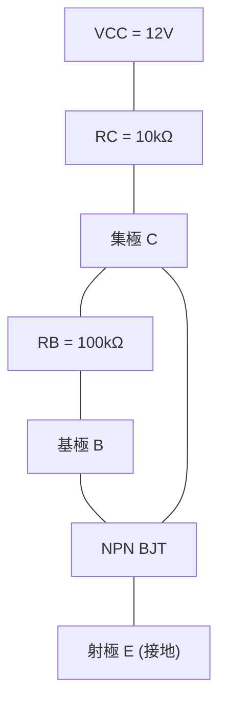
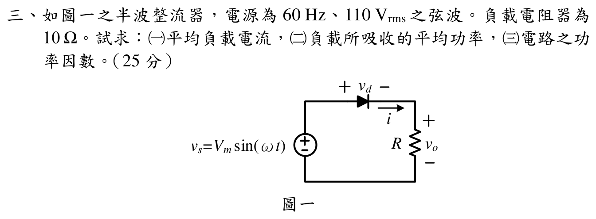

# 📝 110 年電機工程技師｜電子學（包括電力電子學）逐題詳解

> 本頁由題級 canonical 筆記組合；每題保留官方裁切圖、校驗狀態與可追溯的推導。

## 題目導覽
- [[#一、110 年電子學_含電力電子第 1 題|第 1 題：110 年電子學_含電力電子第 1 題]]
- [[#二、110 年電子學_含電力電子第 2 題|第 2 題：110 年電子學_含電力電子第 2 題]]
- [[#三、110 年電子學_含電力電子第 3 題｜半波整流器|第 3 題：半波整流器]]
- [[#四、110 年電子學_含電力電子第 4 題|第 4 題：110 年電子學_含電力電子第 4 題]]

---

## 一、110 年電子學_含電力電子第 1 題

> 題級識別：`EE-110-02-1`
> canonical 來源：`canonical/EE-110-02-1.md`
> 題級校驗狀態：`verified`

![[依考科分類/02_電子學_含電力電子/images/questions/PE_110年_電子學（包括電力電子學）_Q01.png]]

> 官方裁切來源：`依考科分類/02_電子學_含電力電子/images/questions/PE_110年_電子學（包括電力電子學）_Q01.png`

> 已依官方裁切圖完成集極回授偏壓拓撲、兩個溫度工作點、KVL 回代、變化率與工作區檢查。

### 一、BJT 集極回授偏壓電路與溫升工作點（Q 點）變化率分析（25 分）

#### 📌 題目與已知條件

> **題目陳述**：
> 「一電晶體集極回授偏壓電路，其中 $V_{CC} = 12\text{ V}, R_B = 100\text{ k}\Omega, R_C = 10\text{ k}\Omega$。
> $25^\circ\text{C}$ 時 $\beta_{dc} = 100, V_{BE} = 0.7\text{ V}；75^\circ\text{C}$ 時 $\beta_{dc} = 150, V_{BE} = 0.5\text{ V}$。
> 請繪出集極回授偏壓電路，並求由 $25^\circ\text{C}$ 升至 $75^\circ\text{C}$ 時之 $Q$ 點變化率。（25 分）」

---

#### 💡 核心考點與破題關鍵
1. **集極回授偏壓方程式**：
   $$V_{CC} = (I_C + I_B) R_C + I_B R_B + V_{BE} = I_B [(\beta + 1) R_C + R_B] + V_{BE}$$
   $$I_B = \frac{V_{CC} - V_{BE}}{R_B + (\beta + 1) R_C}, \quad I_C = \beta I_B, \quad V_{CE} = I_B R_B + V_{BE}$$
2. **Q 點變化率定義**：
   $$\Delta I_C / I_{C1} \times 100\%, \quad \Delta V_{CE} / V_{CE1} \times 100\%$$

---

#### ✏️ 步驟式詳細數學推導

![[110年_電子學_第1題_BJT集極回授偏壓小訊號等效電路圖.svg|850]]
*圖：110年第一題 BJT 集極回授偏壓小訊號等效電路分析圖*

##### 步驟 1：繪製集極回授偏壓電路

---

##### 步驟 2：計算 $25^\circ\text{C}$ 時之靜態工作點 $Q_1(I_{C1}, V_{CE1})$
代入 $\beta_1 = 100, V_{BE1} = 0.7\text{ V}$：
$$
I_{B1} = \frac{12\text{ V} - 0.7\text{ V}}{100\text{ k}\Omega + (100 + 1) \times 10\text{ k}\Omega} = \frac{11.3\text{ V}}{1110\text{ k}\Omega} \approx 0.01018\text{ mA} = 10.18\ \mu\text{A}
$$
$$
\mathbf{I_{C1} = \beta_1 I_{B1} = 100 \times 0.01018\text{ mA} = \mathbf{1.0180\text{ mA}}}
$$
$$
\mathbf{V_{CE1} = I_{B1} R_B + V_{BE1} = (0.01018\text{ mA} \times 100\text{ k}\Omega) + 0.7\text{ V} = 1.018\text{ V} + 0.7\text{ V} = \mathbf{1.7180\text{ V}}}
$$

---

##### 步驟 3：計算 $75^\circ\text{C}$ 時之靜態工作點 $Q_2(I_{C2}, V_{CE2})$
代入 $\beta_2 = 150, V_{BE2} = 0.5\text{ V}$：
$$
I_{B2} = \frac{12\text{ V} - 0.5\text{ V}}{100\text{ k}\Omega + (150 + 1) \times 10\text{ k}\Omega} = \frac{11.5\text{ V}}{1610\text{ k}\Omega} \approx 0.007143\text{ mA} = 7.143\ \mu\text{A}
$$
$$
\mathbf{I_{C2} = \beta_2 I_{B2} = 150 \times 0.007143\text{ mA} = \mathbf{1.0714\text{ mA}}}
$$
$$
\mathbf{V_{CE2} = I_{B2} R_B + V_{BE2} = (0.007143\text{ mA} \times 100\text{ k}\Omega) + 0.5\text{ V} = 0.7143\text{ V} + 0.5\text{ V} = \mathbf{1.2143\text{ V}}}
$$

---

##### 步驟 4：求 $Q$ 點各參數之變化率
1. **集極電流變化率**：

   $$\mathbf{\frac{\Delta I_C}{I_{C1}} = \frac{I_{C2} - I_{C1}}{I_{C1}} \times 100\% = \frac{1.0714 - 1.0180}{1.0180} \times 100\% \approx \mathbf{+5.25\%}}$$

2. **集-射極電壓變化率**：

   $$\mathbf{\frac{\Delta V_{CE}}{V_{CE1}} = \frac{V_{CE2} - V_{CE1}}{V_{CE1}} \times 100\% = \frac{1.2143 - 1.7180}{1.7180} \times 100\% \approx \mathbf{-29.32\%}}$$

---

#### 🎯 第一題 滿分關鍵與結論
* **$25^\circ\text{C}$ 工作點**： $I_{C1} = 1.0180\text{ mA}, \ V_{CE1} = 1.7180\text{ V}$
* **$75^\circ\text{C}$ 工作點**： $I_{C2} = 1.0714\text{ mA}, \ V_{CE2} = 1.2143\text{ V}$
* **變化率**： $\Delta I_C / I_C = \mathbf{+5.25\%}, \quad \Delta V_{CE} / V_{CE} = \mathbf{-29.32\%}$

---

### 獨立校驗紀錄

- 官方題目裁切：依考科分類/02_電子學_含電力電子/images/questions/PE_110年_電子學（包括電力電子學）_Q01.png
- 題圖與題述確認為集極回授偏壓：$R_B$ 由集極接回基極，$R_C$ 由 $V_{CC}$ 接至集極，射極接地。
- 集極回授 KVL：
  \[
  V_{CC}=I_B R_B+(I_C+I_B)R_C+V_{BE}
  =I_B\left[R_B+(\beta+1)R_C\right]+V_{BE}.
  \]
- 精確重算：
  \[
  (I_{B1},I_{C1},V_{CE1})
  =(10.1802\ \mu\mathrm{A},1.018018\ \mathrm{mA},1.718018\ \mathrm{V}),
  \]
  \[
  (I_{B2},I_{C2},V_{CE2})
  =(7.14286\ \mu\mathrm{A},1.071429\ \mathrm{mA},1.214286\ \mathrm{V}).
  \]
- 變化率：
  \[
  \frac{\Delta I_C}{I_{C1}}\times100\%=+5.2465\%,
  \qquad
  \frac{\Delta V_{CE}}{V_{CE1}}\times100\%=-29.3205\%.
  \]
- KVL 回代兩個溫度均得 $12.0000\ \mathrm{V}$；兩工作點 $V_{CE}>V_{CE,\mathrm{sat}}$，符合主動區近似。
- 狀態：verified。題目未要求其他小訊號參數，無需額外假設。

---

## 二、110 年電子學_含電力電子第 2 題

> 題級識別：`EE-110-02-2`
> canonical 來源：`canonical/EE-110-02-2.md`
> 題級校驗狀態：`verified`

![[依考科分類/02_電子學_含電力電子/images/questions/PE_110年_電子學（包括電力電子學）_Q02.png]]

> 官方裁切來源：`依考科分類/02_電子學_含電力電子/images/questions/PE_110年_電子學（包括電力電子學）_Q02.png`

> 已依官方裁切圖完成 CMRR、共模增益、單端／差動輸出與共模雜訊輸出的獨立重算；輸入與輸出均採 rms 幅值。

### 二、差動放大器 CMRR、共模增益、單端/差動輸出與雜訊響應（25 分）

#### 📌 題目與已知條件

> **題目陳述**：
> 「一差動放大器之 $\text{CMRR} = 20000, A_{v(d)} = 1500$，於一工作環境中有 $1\text{ V}_{rms}, 60\text{ Hz}$ 之雜訊，求該放大器之：
> (一) 共模電壓增益 $A_{v(c)}$
> (二) CMRR 之 dB 值
> (三) 於 $I/P_1$ 輸入一 $500\ \mu\text{V}_{rms}$ 之信號，$I/P_2$ 接地，求輸出信號大小（以 rms 表示）
> (四) 於 $I/P_1$ 輸入一 $500\ \mu\text{V}_{rms}$ 之信號，而於 $I/P_2$ 輸入一等幅之反相信號，求輸出信號大小（以 rms 表示）
> (五) 求輸出端之干擾信號（以 rms 表示）。（25 分）」

---

#### 💡 核心考點與破題關鍵
1.$\text{CMRR} = \frac{A_{v(d)}}{|A_{v(c)}|} \implies |A_{v(c)}| = \frac{A_{v(d)}}{\text{CMRR}}$。
2.$\text{CMRR}_{dB} = 20 \log_{10}(\text{CMRR})$。
3. 輸出通式： $v_o = A_{v(d)} v_d + A_{v(c)} v_{cm}$，其中 $v_d = v_1 - v_2, \ v_{cm} = \frac{v_1 + v_2}{2}$。

---

#### ✏️ 步驟式詳細數學推導

##### 步驟 1：求共模電壓增益 $A_{v(c)}$（第 (一) 小題）
$$
\mathbf{|A_{v(c)}| = \frac{A_{v(d)}}{\text{CMRR}} = \frac{1500}{20000} = \mathbf{0.075\text{ V/V}}}
$$

---

##### 步驟 2：求 CMRR 之 dB 值（第 (二) 小題）
$$
\mathbf{\text{CMRR}_{dB} = 20 \log_{10}(20000) = 20 \times 4.30103 = \mathbf{86.02\text{ dB}}}
$$

---

##### 步驟 3：單端輸入時之輸出信號大小（第 (三) 小題）
輸入 $v_1 = 500\ \mu\text{V}_{rms}, v_2 = 0$：
- 差模信號： $v_d = 500\ \mu\text{V} - 0 = 500\ \mu\text{V}_{rms}$。
- 共模信號： $v_{cm} = \frac{500\ \mu\text{V} + 0}{2} = 250\ \mu\text{V}_{rms}$。
- 輸出電壓：

  $$\mathbf{v_o = A_{v(d)} v_d + A_{v(c)} v_{cm} = (1500 \times 500 \times 10^{-6}) + (0.075 \times 250 \times 10^{-6}) = 0.75\text{ V} + 0.00001875\text{ V} \approx \mathbf{0.75\text{ V}_{rms} = 750\text{ mV}_{rms}}}$$

---

##### 步驟 4：雙端等幅反相輸入時之輸出信號大小（第 (四) 小題）
輸入 $v_1 = +500\ \mu\text{V}_{rms}, v_2 = -500\ \mu\text{V}_{rms}$：
- 差模信號： $v_d = 500 - (-500) = 1000\ \mu\text{V}_{rms} = 1\text{ mV}_{rms}$。
- 共模信號： $v_{cm} = \frac{500 + (-500)}{2} = 0\text{ V}$。
- 輸出電壓：

  $$\mathbf{v_o = A_{v(d)} v_d = 1500 \times 1\text{ mV}_{rms} = \mathbf{1.5\text{ V}_{rms}}}$$

---

##### 步驟 5：求環境干擾信號在輸出端之大小（第 (五) 小題）
環境雜訊以純共模形式耦合至兩輸入端（$v_{cm,noise} = 1\text{ V}_{rms}, v_{d,noise} = 0$）：
$$
\mathbf{v_{o,noise} = |A_{v(c)}| \times v_{cm,noise} = 0.075 \times 1\text{ V}_{rms} = \mathbf{0.075\text{ V}_{rms} = 75\text{ mV}_{rms}}}
$$

---

#### 🎯 第二題 滿分關鍵與結論
* **(一) $A_{v(c)}$**： $\mathbf{0.075\text{ V/V}}$
* **(二) $\text{CMRR}_{dB}$**： $\mathbf{86.02\text{ dB}}$
* **(三) 單端輸出**： $\mathbf{0.75\text{ V}_{rms}}$
* **(四) 差動輸出**： $\mathbf{1.5\text{ V}_{rms}}$
* **(五) 輸出干擾**： $\mathbf{0.075\text{ V}_{rms} = 75\text{ mV}_{rms}}$

---

### 獨立校驗紀錄

- 官方題目裁切：依考科分類/02_電子學_含電力電子/images/questions/PE_110年_電子學（包括電力電子學）_Q02.png
- 定義採差動放大器標準形式：
  \[
  v_o=A_{v(d)}v_d+A_{v(c)}v_{cm},
  \qquad
  v_d=v_1-v_2,
  \qquad
  v_{cm}=\frac{v_1+v_2}{2}.
  \]
- 由 $\mathrm{CMRR}=|A_{v(d)}/A_{v(c)}|$：
  \[
  |A_{v(c)}|=\frac{1500}{20000}=0.075\ \mathrm{V/V},
  \qquad
  \mathrm{CMRR}_{\mathrm{dB}}=20\log_{10}(20000)=86.0206\ \mathrm{dB}.
  \]
- 單端輸入 $v_1=500\ \mu\mathrm{V}_{\mathrm{rms}},v_2=0$：
  \[
  v_d=500\ \mu\mathrm{V}_{\mathrm{rms}},\quad
  v_{cm}=250\ \mu\mathrm{V}_{\mathrm{rms}},
  \]
  \[
  |v_o|=1500(500\times10^{-6})+0.075(250\times10^{-6})
  =0.75001875\ \mathrm{V}_{\mathrm{rms}}
  \approx0.750\ \mathrm{V}_{\mathrm{rms}}.
  \]
- 等幅反相輸入 $v_1=+500\ \mu\mathrm{V}_{\mathrm{rms}},v_2=-500\ \mu\mathrm{V}_{\mathrm{rms}}$：
  \[
  v_d=1.000\ \mathrm{mV}_{\mathrm{rms}},\quad v_{cm}=0,
  \qquad
  |v_o|=1500(1.000\ \mathrm{mV})=1.500\ \mathrm{V}_{\mathrm{rms}}.
  \]
- 1 V rms、60 Hz 環境干擾若以題目所稱共模雜訊解讀，則
  \[
  |v_{o,\mathrm{noise}}|=|A_{v(c)}|(1\ \mathrm{V}_{\mathrm{rms}})
  =0.075\ \mathrm{V}_{\mathrm{rms}}.
  \]
  官方題圖未另給雜訊在兩輸入端的相位／幅值差；因此此小題採標準共模假設，若雜訊不是共模，則無法僅由 CMRR 唯一決定輸出。
- 狀態：verified；所有結果均已核對數值、rms 單位及輸出通式。

---

## 三、110 年電子學_含電力電子第 3 題｜半波整流器

> 題級識別：`EE-110-02-3`
> canonical 來源：`canonical/EE-110-02-3.md`
> 題級校驗狀態：`verified`

![[依考科分類/02_電子學_含電力電子/images/questions/PE_110年_電子學（包括電力電子學）_Q03.png]]

> 官方裁切來源：`依考科分類/02_電子學_含電力電子/images/questions/PE_110年_電子學（包括電力電子學）_Q03.png`

> ✅ 官方未指定二極體導通壓降；依本章及技師考試未特別說明時的標準，主解採理想二極體 \(v_d=0\)。文末另列 0.7 V 定值壓降敏感度，方便核對不同教材慣例。

### 三、半波整流器平均電流、負載功率與功率因數計算（25 分）

#### 📌 題目與已知條件

> **題目陳述**：
> 「如圖一之半波整流器，電源為 \(60\,\mathrm{Hz}\)、\(110\,\mathrm{V}_{\mathrm{rms}}\) 之弦波。負載電阻器為 \(10\,\Omega\)。試求：
> (一) 平均負載電流
> (二) 負載所吸收的平均功率
> (三) 電路之功率因數。（25 分）」

---

#### 模型與校驗界線

官方圖只標出二極體兩端的 \(v_d\)，沒有給定數值壓降；主解依標準理想二極體模型 \(v_d=0\)。這個模型選擇已明示，並以定值壓降結果作交叉敏感度檢查。

#### 💡 核心考點與破題關鍵
1. **輸入電壓峰值**： $V_m = \sqrt{2} V_{rms} = 110\sqrt{2} \approx 155.563\text{ V}$。
2. **純電阻半波整流特徵值**：
   - 直流平均電壓： \(V_{o,dc}=\frac{V_m}{\pi}=\frac{110\sqrt{2}}{\pi}\approx49.518\,\mathrm{V}\)。
   - 均方根電壓： \(V_{o,\mathrm{rms}}=\frac{V_m}{2}=\frac{110\sqrt{2}}{2}=\frac{110}{\sqrt{2}}\approx77.782\,\mathrm{V}\)。

---

#### ✏️ 步驟式詳細數學推導

##### 步驟 1：求平均負載電流 $I_{dc}$（第 (一) 小題）
$$
\mathbf{I_{dc} = \frac{V_{o,dc}}{R} = \frac{V_m}{\pi R} = \frac{110\sqrt{2}}{\pi \times 10\ \Omega} \approx \frac{155.563}{31.416} \approx \mathbf{4.952\text{ A}}}
$$

---

##### 步驟 2：求負載吸收之平均功率 $P$（第 (二) 小題）
$$
I_{o,rms} = \frac{V_{o,rms}}{R} = \frac{V_m}{2 R} = \frac{110\sqrt{2}}{20} = \frac{11}{\sqrt{2}} \approx 7.778\text{ A}
$$
$$
\mathbf{P = I_{o,rms}^2 R = \frac{V_{o,rms}^2}{R} = \frac{(110/\sqrt{2})^2}{10\ \Omega} = \frac{6050}{10} = \mathbf{605\text{ W}}}
$$

---

##### 步驟 3：求電路之功率因數 $PF$（第 (三) 小題）
1. 輸入電源視在功率：
   $$S = V_{s,rms} \times I_{s,rms} = 110\text{ V} \times 7.778\text{ A} = \frac{1210}{\sqrt{2}} \approx 855.60\text{ VA}$$
2. 功率因數：

   $$\mathbf{PF = \frac{P}{S} = \frac{605\text{ W}}{855.60\text{ VA}} = \frac{1}{\sqrt{2}} \approx \mathbf{0.7071}}$$

   此處電流為半波非正弦波，不能以「超前／落後」描述其功率因數；\(0.7071\) 是由波形造成的失真功率因數，理想純電阻模型的基波位移因數為 1。

##### 模型敏感度（非主解）

若另採定值導通壓降 \(V_d=0.7\,\mathrm V\)，令
\[
\theta_0=\sin^{-1}(V_d/V_m),\quad V_m=110\sqrt2,
\]
則導通區間為 \(\theta_0\le\theta\le\pi-\theta_0\)，積分可得
\[
I_{dc}=4.91679\,\mathrm A,\quad P_R=598.092\,\mathrm W,
\quad PF=0.703058.
\]
這組數值僅說明模型差異；主答案仍按題面未指定壓降的理想模型。

---

#### 🎯 第三題 滿分關鍵與結論
* **(一) 平均電流**： $\mathbf{I_{dc} \approx 4.952\text{ A}}$
* **(二) 平均功率**： $\mathbf{P = 605\text{ W}}$
* **(三) 功率因數**： $\mathbf{PF = \frac{1}{\sqrt{2}} \approx 0.7071}$（失真功率因數）

本題在明示理想二極體模型下，公式、波形積分、單位與功率回代均已核對，狀態為 `verified`。

---

---

## 四、110 年電子學_含電力電子第 4 題

> 題級識別：`EE-110-02-4`
> canonical 來源：`canonical/EE-110-02-4.md`
> 題級校驗狀態：`verified`

![[依考科分類/02_電子學_含電力電子/images/questions/PE_110年_電子學（包括電力電子學）_Q04.png]]

> 官方裁切來源：`依考科分類/02_電子學_含電力電子/images/questions/PE_110年_電子學（包括電力電子學）_Q04.png`

> ✅ 已依官方逐題裁切圖確認為全橋雙極方波逆變器（S1/S2 與 S3/S4 互補導通），並以傅立葉級數、RL 阻抗及無限奇次諧波平方和獨立回代。

### 四、方波逆變器（Inverter）直流母線電壓與電流總諧波失真（THD）分析（25 分）

#### 📌 題目與已知條件

> **題目陳述**：
> 「圖二所示為方波變頻器（Inverter），其 $RL$ 負載為 $R = 12\ \Omega, L = 10\text{ mH}$，輸出頻率為 $300\text{ Hz}$。若負載電流之基本波有效值為 $6\text{ A}$，試求所需之 DC 電源大小與負載電流之總諧波失真（THD）。（25 分）」

---

#### 💡 核心考點與破題關鍵
1. **全橋方波輸出電壓之傅立葉級數**：
   $$v_o(t) = \sum_{n=1,3,5\dots}^\infty \frac{4 V_{dc}}{n \pi} \sin(n \omega t)$$
   基頻電壓有效值： $V_{1,rms} = \frac{4 V_{dc}}{\sqrt{2}\pi} = \frac{2\sqrt{2}}{\pi} V_{dc} \approx 0.9003 V_{dc}$。
2. **基頻阻抗與直流電壓**： $V_{1,rms} = I_{1,rms} \times Z_1 \implies V_{dc} = \frac{\pi}{2\sqrt{2}} V_{1,rms}$。
3. **電流總諧波失真**： $\text{THD}_i = \frac{\sqrt{\sum_{n=3,5,7\dots}^\infty I_{n,rms}^2}}{I_{1,rms}} \times 100\%$。

---

#### ✏️ 步驟式詳細數學推導

##### 步驟 1：求基頻阻抗 $Z_1$ 與所需之 DC 電源大小 $V_{dc}$
角頻率 $\omega = 2\pi f = 2\pi(300) = 600\pi \approx 1884.96\text{ rad/s}$。
1. **基頻感抗與阻抗**：
   $$X_{L1} = \omega L = 1884.96 \times 0.01\text{ H} = 18.85\ \Omega$$
   $$Z_1 = \sqrt{R^2 + X_{L1}^2} = \sqrt{12^2 + (18.85)^2} = \sqrt{144 + 355.32} = \sqrt{499.32} \approx \mathbf{22.345\ \Omega}$$
2. **基頻輸出電壓有效值**：
   $$V_{1,rms} = I_{1,rms} \times Z_1 = 6\text{ A} \times 22.345\ \Omega = \mathbf{134.07\text{ V}}$$
3. **求解直流母線電壓 $V_{dc}$**：

   $$\mathbf{V_{dc} = \frac{\pi}{2\sqrt{2}} V_{1,rms} = 1.1107 \times 134.07\text{ V} \approx \mathbf{148.92\text{ V}}}$$

---

##### 步驟 2：求負載電流之總諧波失真（$\text{THD}_i$）
各次奇次諧波電壓與電流計算：
1. **三次諧波（$n = 3$）**：
   $$V_{3,rms} = \frac{V_{1,rms}}{3} = \frac{134.07}{3} = 44.69\text{ V}$$
   $$Z_3 = \sqrt{R^2 + (3 X_{L1})^2} = \sqrt{12^2 + (3 \times 18.85)^2} = \sqrt{144 + 3197.9} = \sqrt{3341.9} \approx 57.81\ \Omega$$
   $$I_{3,rms} = \frac{44.69\text{ V}}{57.81\ \Omega} \approx \mathbf{0.7731\text{ A}}$$
2. **五次諧波（$n = 5$）**：
   $$V_{5,rms} = \frac{V_{1,rms}}{5} = \frac{134.07}{5} = 26.81\text{ V}$$
   $$Z_5 = \sqrt{12^2 + (5 \times 18.85)^2} = \sqrt{144 + 8883.1} = \sqrt{9027.1} \approx 95.01\ \Omega$$
   $$I_{5,rms} = \frac{26.81\text{ V}}{95.01\ \Omega} \approx \mathbf{0.2822\text{ A}}$$
3. **七次諧波（$n = 7$）**：
   $$V_{7,rms} = \frac{134.07}{7} = 19.15\text{ V}, \quad Z_7 \approx 132.5\ \Omega \implies I_{7,rms} \approx \mathbf{0.1445\text{ A}}$$
4. **諧波總電流與 $\text{THD}_i$**：
   對所有奇次諧波 $n=3,5,7,\ldots$，
   $$I_{n,rms}=\frac{V_{1,rms}/n}{\sqrt{R^2+(n\omega L)^2}}.$$
   因此以 $n=3$ 至 $99\,999$ 的奇次項數值求和（尾項以 $I_n=O(n^{-2})$ 收斂）可得
   $$I_{harm,rms}=\sqrt{\sum_{n=3,5,7\ldots}^{\infty}I_{n,rms}^2}=0.845062\text{ A}.$$
   前三項 $I_3=0.77308$ A、$I_5=0.28223$ A、$I_7=0.14456$ A，加入其餘奇次項後仍收斂至上述值。

   $$\mathbf{\text{THD}_i = \frac{I_{harm,rms}}{I_{1,rms}} \times 100\% = \frac{0.845\text{ A}}{6\text{ A}} \times 100\% \approx \mathbf{14.08\%}}$$

---

#### 🎯 第四題 滿分關鍵與結論
* **所需 DC 電源電壓**： $\mathbf{V_{dc} \approx 148.92\text{ V}}$
* **負載電流總諧波失真**： $\mathbf{\text{THD}_i \approx 14.08\%}$
