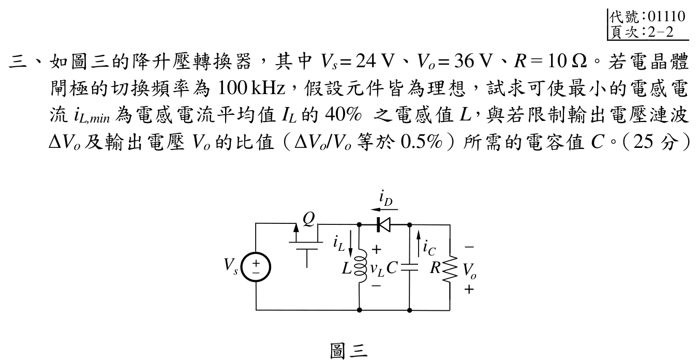

# 📝 112 年電機工程技師｜電子學（包括電力電子學）逐題詳解

> 本頁由題級 canonical 筆記組合；每題保留官方裁切圖、校驗狀態與可追溯的推導。

## 題目導覽
- [[#一、EE-112-02-1|第 1 題：EE-112-02-1]]
- [[#二、112 年電子學第 2 題：Schmitt 觸發鬆弛振盪器|第 2 題：112 年電子學第 2 題：Schmitt 觸發鬆弛振盪器]]
- [[#三、112 年電子學（含電力電子）第 3 題｜反相降升壓轉換器 CCM 漣波設計|第 3 題：反相降升壓轉換器 CCM 漣波設計]]
- [[#四、112 年電子學（含電力電子）第 4 題｜半波整流器傅立葉級數與平滑電感|第 4 題：半波整流器傅立葉級數與平滑電感]]

---

## 一、EE-112-02-1

> 題級識別：EE-112-02-1
> canonical 來源：[[canonical/EE-112-02-1.md]]
> 題級校驗狀態：reference_book_verified

### 1. 題面與交流模型

### 參考書主解（reference_book evidence）

依使用者提供的參考書，採 \(V_T=25\,\mathrm{mV}\)、\(r_e=50\,\Omega\) 的共基極近似：

\[
\boxed{f_{H\pi}=6.69\times10^8\,\mathrm{Hz}},
\qquad
\boxed{f_{H\mu}=1.6\times10^8\,\mathrm{Hz}}.
\]

參考書的中頻帶增益約為 \(A_v\approx9.47\,\mathrm{V/V}\)（依書中省略部分負載／有限 \(\beta\) 影響的近似）。以上為參考書慣例下的主要答案；參考書 evidence 不等同官方公布答案。

#### 模型界線與升級判定

官方裁切圖沒有明示熱電壓 $V_T$；本節保留 $25.85/26\,\mathrm{mV}$ 分支，作為參考書主解的參數對照。圖中的 $R_B=100\,\mathrm{k}\Omega$ 已納入集極負載與 $C_\mu$ 極點計算。

官方裁切圖給定 $\beta=100$、$V_{BE}=0.7\,\mathrm{V}$、$V_A=\infty$、$C_\pi=10\,\mathrm{pF}$、$C_\mu=1\,\mathrm{pF}$、$I_Q=0.5\,\mathrm{mA}$，並有 $R_s=50\,\Omega$、$R_E=0.5\,\mathrm{k}\Omega$、$R_B=100\,\mathrm{k}\Omega$、$R_L=1\,\mathrm{k}\Omega$。圖中三個標示 $\infty$ 的外接耦合／旁路電容在交流分析時視為短路；它們不可與晶體內部的 $C_\pi,C_\mu$ 混淆。

題圖沒有明示熱電壓 $V_T$；以下採教材最常用的 $V_T=25\,\mathrm{mV}$，並保留此假設，因此不能宣稱數值頻率對所有模型唯一成立。

有限 $\beta$ 下，理想電流源供應集極電流與基極電流之和，因此

\[
I_E=I_Q=0.5\,\mathrm{mA},\qquad
I_C=\frac{\beta}{\beta+1}I_E=0.4950495\,\mathrm{mA}.
\]

在 $V_T=25\,\mathrm{mV}$ 主分支：

\[
g_m=\frac{I_C}{V_T}=19.80198\,\mathrm{mS},
\qquad
r_\pi=\frac{\beta}{g_m}=5.050\,\mathrm{k}\Omega.
\]

基極為交流接地，故 $C_\pi$ 直接跨接射極–地，$C_\mu$ 直接跨接集極–地，沒有共射極的 Miller 乘積放大。

### 2. $C_\pi$ 個別造成的高頻極點

令其他高頻電容開路、將理想信號源歸零。由基極交流接地，BJT 從射極看入的電阻為

\[
r_e=\frac{r_\pi}{\beta+1}=50.000\,\Omega.
\]

因此 $C_\pi$ 兩端所見電阻為

\[
R_{C_\pi}=R_s\parallel R_E\parallel r_e
=50\parallel500\parallel50
=23.809524\,\Omega.
\]

\[
\boxed{
f_{H\pi}=\frac{1}{2\pi R_{C_\pi}C_\pi}
=\frac{1}{2\pi(23.809524)(10\,\mathrm{pF})}
=668.451\,\mathrm{MHz}}
\]

### 3. $C_\mu$ 個別造成的高頻極點

令 $C_\pi$ 開路，$V_A=\infty$ 使 $r_o=\infty$，且集極端的理想偏流源在交流下開路。由於基極旁路為交流地，$R_B$ 也從集極接到地，因此

\[
R_{C_\mu}=R_L\parallel R_B\parallel r_o
=1000\parallel100000
=990.099010\,\Omega.
\]

\[
\boxed{
f_{H\mu}=\frac{1}{2\pi R_{C_\mu}C_\mu}
=\frac{1}{2\pi(990.099010)(1\,\mathrm{pF})}
=160.746\,\mathrm{MHz}}
\]

原年度解答忽略了圖中的 $R_B$，得到 $159.155\,\mathrm{MHz}$；只有在另行假設 $R_B\to\infty$ 時才可得到該近似值。

### 4. 中頻帶電壓增益

中頻時 $C_\pi,C_\mu$ 視為開路，只有圖中三個標示 $\infty$ 的外接電容視為短路。輸入端射極等效電阻為

\[
R_{in,e}=R_E\parallel r_e
=500\parallel50
=45.454545\,\Omega.
\]

因此射極電壓相對於題目輸入端 $v_i$ 的分壓為

\[
\frac{v_e}{v_i}=\frac{R_{in,e}}{R_s+R_{in,e}}
=\frac{45.454545}{50+45.454545}=0.47619048.
\]

集極的交流負載包含 $R_L\parallel R_B=990.099010\,\Omega$。共基極級不反相，故

\[
\frac{v_o}{v_e}=g_m(R_L\parallel R_B)=0.01980198(990.099010)=19.605921.
\]

合併得

\[
\boxed{
A_v=\frac{v_o}{v_i}
=g_m(R_L\parallel R_B)
\frac{R_E\parallel r_e}{R_s+R_E\parallel r_e}
=9.336153\ \mathrm{V/V}}
\]

若忽略 $R_B$ 對集極負載、並以 $r_e=1/g_m=50\,\Omega$ 近似，才得到年度解答的 $A_v=200/21=9.523810\,\mathrm{V/V}$。

### 校驗結論

- `qid` 與官方 `source_crop`、拓撲及元件參數已核對。
- 已補入官方圖中容易漏掉的 $R_B=100\,\mathrm{k}\Omega$ 對 $C_\mu$ 極點與中頻增益的影響。
- 參考書採 $V_T=25\,\mathrm{mV}$，主要答案為 $f_{H\pi}=6.69\times10^8\,\mathrm{Hz}$、$f_{H\mu}=1.6\times10^8\,\mathrm{Hz}$；官方題面未標示 $V_T$ 的影響已列在敏感度表，並保留較完整有限 $\beta$ 模型作對照。

#### 熱電壓敏感度

| $V_T$ | $f_{H\pi}$ | $f_{H\mu}$ | $A_v$ |
|---:|---:|---:|---:|
| $25\,\mathrm{mV}$ | $668.4508\,\mathrm{MHz}$ | $160.7465\,\mathrm{MHz}$ | $9.336153$ |
| $25.85\,\mathrm{mV}$ | $657.9841\,\mathrm{MHz}$ | $160.7465\,\mathrm{MHz}$ | $9.172790$ |
| $26\,\mathrm{mV}$ | $656.2081\,\mathrm{MHz}$ | $160.7465\,\mathrm{MHz}$ | $9.144553$ |

這證明題圖未給 $V_T$ 時，$f_{H\pi}$ 與中頻增益不是唯一數值；$f_{H\mu}$ 則由集極端電阻與 $C_\mu$ 決定，不受 $V_T$ 影響。

---

## 二、112 年電子學第 2 題：Schmitt 觸發鬆弛振盪器

> 題級識別：EE-112-02-2
> canonical 來源：[[canonical/EE-112-02-2.md]]
> 題級校驗狀態：verified

### 1. 閾值與時間常數

官方圖為理想運算放大器正回授 Schmitt 觸發器，輸出飽和為 $v_o=\pm5\,\mathrm{V}$，且 $R_1=10\,\mathrm{k}\Omega$ 接地、$R_2=20\,\mathrm{k}\Omega$ 接輸出、$R_X=40\,\mathrm{k}\Omega$、$C_X=0.02\,\mu\mathrm{F}$。

非反相端分壓電壓為

\[
v_+=\frac{R_1}{R_1+R_2}v_o=\frac{1}{3}v_o,
\qquad
V_T=\pm\frac{5}{3}\,\mathrm{V}.
\]

反相端 $v_X$ 經 $R_X$ 由輸出充電，故

\[
\tau=R_XC_X=(40\,\mathrm{k}\Omega)(0.02\,\mu\mathrm{F})=0.8\,\mathrm{ms}.
\]

題目指定 $t=0$ 時輸出剛切換至高電位。切換瞬間電容電壓連續，因此切換前的低輸出狀態使

\[
v_X(0)= -\frac{5}{3}\,\mathrm{V},
\qquad
v_o(0^+)=+5\,\mathrm{V}.
\]

### 2. 高、低輸出狀態的 $v_X(t)$

固定輸出為 $V_o$ 時，$v_X$ 滿足

\[
\frac{dv_X}{dt}=\frac{V_o-v_X}{\tau},
\qquad
v_X(t)=V_o+[v_X(t_0)-V_o]e^{-(t-t_0)/\tau}.
\]

#### 高電位半週期

當 $v_o=+5\,\mathrm{V}$，$v_X$ 從 $-5/3$ 上升至正閾值 $+5/3$：

\[
v_X(t)=5-\frac{20}{3}e^{-t/\tau},
\qquad 0\le t<t_H.
\]

令 $v_X(t_H)=5/3$：

\[
\frac{5}{3}=5-\frac{20}{3}e^{-t_H/\tau}
\quad\Longrightarrow\quad
e^{-t_H/\tau}=\frac12,
\qquad
t_H=\tau\ln2=0.554518\,\mathrm{ms}.
\]

此刻運算放大器切換至 $v_o=-5\,\mathrm{V}$。

#### 低電位半週期

當 $v_o=-5\,\mathrm{V}$，$v_X$ 從 $+5/3$ 下降至 $-5/3$：

\[
v_X(t)=-5+\frac{20}{3}e^{-(t-t_H)/\tau},
\qquad t_H\le t<t_H+t_L.
\]

令 $v_X(t_H+t_L)=-5/3$：

\[
-\frac{5}{3}=-5+\frac{20}{3}e^{-t_L/\tau}
\quad\Longrightarrow\quad
e^{-t_L/\tau}=\frac12,
\qquad
t_L=\tau\ln2=0.554518\,\mathrm{ms}.
\]

因此 $t=0$ 起始的一個週期可寫為

\[
v_X(t)=
\begin{cases}
5-\dfrac{20}{3}e^{-t/\tau},&0\le t<t_H,\\[6pt]
-5+\dfrac{20}{3}e^{-(t-t_H)/\tau},&t_H\le t<T,
\end{cases}
\qquad v_X(t+T)=v_X(t).
\]

### 3. 頻率與責任週期

\[
T=t_H+t_L=2\tau\ln2
=1.109035\,\mathrm{ms},
\]

\[
\boxed{f=\frac1T=901.684\,\mathrm{Hz}},
\qquad
\boxed{D=\frac{t_H}{T}=\frac12=50\%}.
\]

### 校驗結論

- `qid` 與官方 `source_crop` 已核對，正回授分壓閾值為 $\pm5/3\,\mathrm{V}$。
- $\tau=0.8\,\mathrm{ms}$、$t_H=t_L=0.554518\,\mathrm{ms}$、$T=1.109035\,\mathrm{ms}$ 均由圖示元件回代。
- 正確振盪頻率為 $901.684\,\mathrm{Hz}$，責任週期為 $50\%$；條件完整，標記為 `verified`。

---

## 三、112 年電子學（含電力電子）第 3 題｜反相降升壓轉換器 CCM 漣波設計

> 題級識別：EE-112-02-3
> canonical 來源：[[canonical/EE-112-02-3.md]]
> 題級校驗狀態：verified

### 考場標準作答

理想反相 buck-boost 轉換器滿足
\[
\frac{|V_o|}{V_s}=\frac D{1-D},
\]
故 \(36/24=D/(1-D)\)，得
\[
D=0.6,\qquad T_s=\frac1{100\,\mathrm{kHz}}=10\,\mu\mathrm s.
\]
負載與平均電感電流為
\[
|I_o|=\frac{36}{10}=3.6\,\mathrm A,\qquad
I_L=\frac{|I_o|}{1-D}=9\,\mathrm A.
\]
由 \(i_{L,\min}=0.4I_L\)，
\[
\Delta i_L=2(I_L-i_{L,\min})=10.8\,\mathrm A.
\]
因此
\[
\boxed{L=\frac{V_sDT_s}{\Delta i_L}=13.33\,\mu\mathrm H}.
\]
又
\[
\frac{\Delta V_o}{|V_o|}=\frac D{RCf_s}=0.005,
\]
故
\[
\boxed{C=\frac D{Rf_s(0.005)}=120\,\mu\mathrm F}.
\]

### 得分點拆解

- 先用伏秒平衡求 \(D=0.6\)，並寫出 \(T_s=10\,\mu\mathrm s\)。
- 反相 buck-boost 的輸出電流只在關斷區間流動，因此 \(I_L=|I_o|/(1-D)\)。
- 指定的是谷值為平均值的 40%，三角漣波須用 \(\Delta i_L=2(I_L-i_{L,\min})\)。
- 導通時 \(v_L=V_s\)，由斜率求電感值。
- 導通時電容獨自供應負載，由電荷平衡求 \(C\)，並保留輸出反相的符號說明。

### 完整教學推導

#### 官方題目（逐題裁切）

如圖三的降升壓轉換器，其中Vs= 24 V、Vo= 36 V、R = $10\ \Omega$。若電晶體
閘極的切換頻率為100 kHz，假設元件皆為理想，試求可使最小的電感電
流iL,min 為電感電流平均值IL 的40\%之電感值L，與若限制輸出電壓漣波
ΔVo 及輸出電壓Vo 的比值（ΔVo/Vo 等於0.5\%）所需的電容值C。（25 分）
圖三

#### 計算與校核

官方圖的輸出端標示為下正上負，因此採反相 buck-boost 符號 $V_o=-36$ V；以下以理想元件、連續導通模式（CCM）、電感與電容漣波為三角波且忽略 ESR。

#### 1. 占空比與週期

反相降升壓的伏秒平衡給出
$$
\frac{|V_o|}{V_s}=\frac{D}{1-D}
\quad\Longrightarrow\quad
\frac{36}{24}=\frac{D}{1-D}
\quad\Longrightarrow\quad
\boxed{D=0.6}.
$$
切換頻率 $f_s=100$ kHz，故 $T_s=10\,\mu\text{s}$。

#### 2. 平均電感電流與指定谷值

負載電流幅值為
$$
|I_o|=\frac{|V_o|}{R}=\frac{36}{10}=3.6\text{ A}.
$$
在反相 buck-boost CCM 中，二極體僅於 $(1-D)T_s$ 導通，故
$$
I_L=\frac{|I_o|}{1-D}=\frac{3.6}{0.4}=9.0\text{ A}.
$$
題目指定 $i_{L,\min}=0.4I_L$，因此三角漣波峰峰值為
$$
\Delta i_L=2(I_L-i_{L,\min})=2(1-0.4)I_L=1.2(9)=10.8\text{ A}.
$$
這也給出 $i_{L,\max}=14.4$ A、$i_{L,\min}=3.6$ A，谷值大於零，與 CCM 假設一致。

#### 3. 電感值

開關導通期間 $v_L=V_s$，故
$$
\Delta i_L=\frac{V_sDT_s}{L}
\quad\Longrightarrow\quad
L=\frac{V_sDT_s}{\Delta i_L}
 =\frac{24(0.6)(10\,\mu\text{s})}{10.8}
 =\boxed{13.33\,\mu\text{H}}.
$$

#### 4. 輸出電容值

導通期間二極體截止，電容獨自供應負載；一個導通區間的電荷變化量為
$$
\Delta Q=|I_o|DT_s.
$$
忽略 ESR 時，輸出漣波幅值滿足
$$
\frac{\Delta V_o}{|V_o|}
 =\frac{|I_o|DT_s}{C|V_o|}
 =\frac{D}{RCf_s}.
$$
代入 $\Delta V_o/|V_o|=0.005$ 得
$$
C=\frac{D}{R f_s(0.005)}
 =\frac{0.6}{10(100\,000)(0.005)}
 =\boxed{120\,\mu\text{F}}.
$$

#### 結論

$$
\boxed{D=0.6,\qquad L_{\min}=13.33\,\mu\text{H},\qquad C_{\min}=120\,\mu\text{F},\qquad V_o=-36\text{ V}.}
$$

上述 $L$ 與 $C$ 分別由指定的 $i_{L,\min}=0.4I_L$ 及 $\Delta V_o/|V_o|=0.5\%$ 求得；若考慮 ESR 或非理想壓降，需再依元件模型修正。

### 獨立驗算

由 \(I_L=9\,\mathrm A\) 與 \(\Delta i_L=10.8\,\mathrm A\) 回代：
\[
i_{L,\max}=9+5.4=14.4\,\mathrm A,\qquad
i_{L,\min}=9-5.4=3.6\,\mathrm A=0.4I_L,
\]
符合題設且谷值大於零，CCM 假設成立。

電容值回代得
\[
\frac{\Delta V_o}{|V_o|}
=\frac{0.6}{(10)(120\times10^{-6})(100\times10^3)}
=0.005=0.5\%,
\]
與規格一致。

### 常見失分

- 套用 buck 或 boost 的增益式，未使用反相 buck-boost 的 \(D/(1-D)\)。
- 把平均電感電流誤當輸出電流 \(3.6\,\mathrm A\)。
- 將「最小值為平均值 40%」直接當成 \(\Delta i_L=0.4I_L\)。
- 漏掉三角漣波從平均值到谷值只占峰峰值的一半。
- 電容式漏乘占空比 \(D\)，或把 0.5% 代成 0.5。

---

## 四、112 年電子學（含電力電子）第 4 題｜半波整流器傅立葉級數與平滑電感

> 題級識別：EE-112-02-4
> canonical 來源：[[canonical/EE-112-02-4.md]]
> 題級校驗狀態：verified

### 官方題目（逐題裁切）

如圖四的飛輪二極體之半波整流器，其中vs(t) = 170 sin(377t) V、R = $10\ \Omega$、
Vdc= 24 V。假設元件皆為理想，藉由傅立葉級數，試求可使負載電流峰
對峰值Δio 不超過1A 之L 值、dc 電源Vdc 所吸收的功率及電阻R 所吸收
的功率。（25 分）
圖四
+_
Vs
_
Vo
_vL
iD
iC
iL
Q
C
L
R
+_
$v_s(t)$
_
Vdc
iO
D1
L
R
D2

### 獨立校驗與完整推導

官方圖為 D1 半週供電、D2 負半週續流的連續電流 R–L 負載；$v_s(t)=170\sin(377t)$ V、$R=10\,\Omega$、$V_{dc}=24$ V，元件理想。令 $\theta=\omega t$、$\omega=377$ rad/s，並以負載電流向右為正。

#### 1. 半波電壓的傅立葉級數

二極體網路施加在 R–L–$V_{dc}$ 支路的整流電壓可寫成
$$
v_r(\theta)=
\begin{cases}
V_m\sin\theta,&0<\theta<\pi,\\
0,&\pi<\theta<2\pi,
\end{cases}
\qquad V_m=170\text{ V}.
$$
其級數為
$$
v_r(\theta)=\frac{V_m}{\pi}+\frac{V_m}{2}\sin\theta
-\sum_{k=1}^{\infty}\frac{2V_m}{\pi(4k^2-1)}\cos(2k\theta).
$$
電感支路的驅動電壓是 $v_r-V_{dc}$，所以直流分量與平均電流為
$$
I_0=\frac{V_m/\pi-V_{dc}}{R}
=\frac{170/\pi-24}{10}=3.011268\text{ A}.
$$

#### 2. 各次諧波的電流係數

對 $a_n\cos n\theta+b_n\sin n\theta$，由
$L\,di/dt+Ri=v_r-V_{dc}$ 得
$$
A_n=\frac{Ra_n+n\omega Lb_n}{R^2+(n\omega L)^2},\qquad
B_n=\frac{Rb_n-n\omega La_n}{R^2+(n\omega L)^2},
$$
其中 $b_1=V_m/2$、$a_{2k}=-2V_m/[\pi(4k^2-1)]$，其餘係數為零。故
$$
i_o(\theta)=I_0+\sum_{n=1}^{\infty}\bigl(A_n\cos n\theta+B_n\sin n\theta\bigr).
$$

#### 3. 由峰對峰漣波求 $L$

以 $N=200$ 項截斷上式並對一週期求最大、最小值，再以獨立的週期 R–L 微分方程回代；令 $\max i_o-\min i_o=1$ A，數值根為
$$
\boxed{L_{\min}=0.4962\text{ H}\;(\approx496\text{ mH})}.
$$
在此 $L$ 下，傅立葉級數得到
$$
i_{o,\min}=2.51692\text{ A},\qquad i_{o,\max}=3.51692\text{ A},
$$
故 $\Delta i_o=1.00000$ A；直接積分週期方程得到 $0.9999998$ A，數值殘差小於 $2\times10^{-6}$ A。只保留基頻會得到約 $0.450$ H，會漏掉偶次諧波，不能作為本題「藉由傅立葉級數」的精確設計值。

#### 4. $V_{dc}$ 與 $R$ 的吸收功率

直流源電流等於電感電流平均值，因此
$$
P_{V_{dc}}=V_{dc}I_0=24(3.011268)=\boxed{72.2704\text{ W}}.
$$
由 Parseval 定理，$N=200$ 項（再增加至 2000 項變化低於 $10^{-6}$ W）得到
$$
I_{o,\mathrm{rms}}^2=I_0^2+\frac12\sum_{n=1}^{\infty}(A_n^2+B_n^2)
=9.175384\text{ A}^2,
$$
因此
$$
P_R=R I_{o,\mathrm{rms}}^2=10(9.175384)=\boxed{91.7538\text{ W}}.
$$

### 結論

$$
\boxed{L_{\min}\approx0.4962\text{ H},\qquad
P_{V_{dc}}\approx72.2704\text{ W},\qquad
P_R\approx91.7538\text{ W}.}
$$

上述結果採官方理想元件、連續導通及忽略電感電阻／二極體壓降；若採工程上只保留基頻的粗略估算，應明確標示為近似而不可取代完整級數結果。

---
