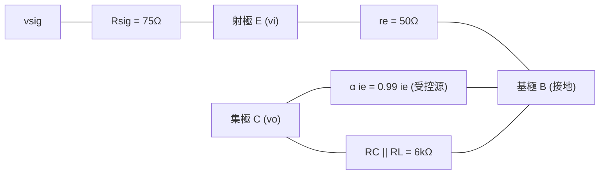

# ⚡ 113 年 電機工程技師 — 電子學（包括電力電子學）全卷完整詳細題解

> **等別**：高等考試  
> **類科**：電機工程技師  
> **科目**：電子學（包括電力電子學）（試題代號：`01110`）  
> **考試時間**：2 小時（120 分鐘）  
> **滿分標準**：共 4 題大題，每題 25 分，總分 100 分  
> **考場規範**：可以使用考選部核定之第二類電子計算器（如 E-MORE fx-127）  
> **官方原始試題 PDF**：[📄 113年_電機工程技師_電子學（包括電力電子學）.pdf](../../依考科分類/02_電子學_含電力電子/113年_電機工程技師_電子學（包括電力電子學）.pdf)

---

## 一、理想二極體電路操作狀態與輸出電壓分析（25 分）

### 📌 題目與已知條件
![[113年_電機工程技師_電子學（包括電力電子學）_p1.png|750]]
*圖：113年電子學第一題 理想二極體電路（圖一）*

> **題目陳述**：  
> 「如圖一所示之二極體電路，假設二極體皆為理想元件。  
> (一) 請分析 $D_1, D_2$ 之正確操作狀態（導通或截止？）；（15 分）  
> (二) $V_o = ?$（10 分）」

---

### 💡 核心考點與破題關鍵
1. **理想二極體假設法判別（Assumption & Verification）**：
   - 理想二極體特性：導通（ON）時跨壓 $V_D = 0\text{ V}$ 且電流 $I_D \ge 0$；截止（OFF）時電流 $I_D = 0$ 且逆向偏壓 $V_D \le 0$。
2. **狀態假設邏輯驗證**：
   - 先假設 $D_1, D_2$ 皆導通，若推導出 $I_{D1} < 0$ 則假設不成立，進而確認 $D_1$ 截止、$D_2$ 導通。

---

### ✏️ 步驟式詳細數學推導

![[113年_電子學_第1題_理想二極體電路狀態分析等效電路圖.svg|850]]
*圖：113年第一題 理想二極體電路操作狀態等效分析圖*

#### 步驟 1：分析二極體 $D_1, D_2$ 之操作狀態（第 (一) 小題）

##### 假設一：若 $D_1$ 導通（ON）、$D_2$ 導通（ON）
1. $D_1$ 導通接至地端 $\implies$ 中繼節點電壓 $V_x = 0\text{ V}$。
2. $D_2$ 導通 $\implies$ 輸出端電壓 $V_o = V_x = 0\text{ V}$。
3. 檢查各支路電流：
   - 頂部 $10\text{ k}\Omega$ 流入電流：
     $$I_{10k} = \frac{12\text{ V} - 0\text{ V}}{10\text{ k}\Omega} = 1.2\text{ mA}$$
   - 底部 $5\text{ k}\Omega$ 流入 $-12\text{ V}$ 之電流（即流經 $D_2$ 之電流）：
     $$I_{D2} = \frac{0\text{ V} - (-12\text{ V})}{5\text{ k}\Omega} = \frac{12\text{ V}}{5\text{ k}\Omega} = 2.4\text{ mA}$$
4. 對節點 $V_x$ 列寫 KCL：
   $$I_{10k} = I_{D1} + I_{D2} \implies 1.2\text{ mA} = I_{D1} + 2.4\text{ mA}$$
   $$I_{D1} = 1.2\text{ mA} - 2.4\text{ mA} = -1.2\text{ mA} < 0 \quad \mathbf{(矛盾！)}$$
   二極體無法逆向導通電流，故 **假設一不成立**，二極體 $D_1$ 必為**截止（OFF）**。

---

##### 假設二：若 $D_1$ 截止（OFF）、$D_2$ 導通（ON）
1. $D_1$ 截止 $\implies I_{D1} = 0$。
2. $D_2$ 導通 $\implies V_x = V_o$，電路簡化為由 $+12\text{ V}$ 經 $10\text{ k}\Omega$、導通之 $D_2$、再經 $5\text{ k}\Omega$ 接至 $-12\text{ V}$ 的單一迴路。
3. 迴路電流：
   $$I = \frac{12\text{ V} - (-12\text{ V})}{10\text{ k}\Omega + 5\text{ k}\Omega} = \frac{24\text{ V}}{15\text{ k}\Omega} = \mathbf{1.6\text{ mA}}$$
4. 驗證自洽性：
   - 流經 $D_2$ 電流 $I_{D2} = I = 1.6\text{ mA} > 0$ ✅（滿足正向導通）。
   - 中繼點電位：
     $$V_x = 12\text{ V} - (1.6\text{ mA} \times 10\text{ k}\Omega) = 12 - 16 = \mathbf{-4\text{ V}}$$
   - 二極體 $D_1$ 陽極電位為 $V_x = -4\text{ V}$，陰極接至地端（$0\text{ V}$）：
     $$V_{D1} = -4\text{ V} - 0\text{ V} = -4\text{ V} < 0 \quad \text{✅（處於逆向偏壓，確實截止）}$$

---

#### 步驟 2：求輸出電壓 $V_o$（第 (二) 小題）
因 $D_2$ 理想導通（跨壓為 0）：
$$
\mathbf{V_o = V_x = -4\text{ V}}
$$
（驗算： $V_o = -12\text{ V} + 1.6\text{ mA} \times 5\text{ k}\Omega = -12 + 8 = -4\text{ V}$，完全一致）

---

### 🎯 第一題 滿分關鍵與結論
* **(一) 操作狀態**： $\mathbf{D_1}$ **截止（OFF）**， $\mathbf{D_2}$ **導通（ON）**
* **(二) 輸出電壓**： $\mathbf{V_o = -4\text{ V}}$

---

## 二、共基極（CB）BJT 放大器小訊號 T 模型、輸入電阻與電壓增益（25 分）

### 📌 題目與已知條件
![[113年_電機工程技師_電子學（包括電力電子學）_p1.png|750]]
*圖：113年電子學第二題 共基極 BJT 放大器電路（圖二）*

> **題目陳述**：  
> 「如圖二所示之 BJT 放大器電路，假設 BJT 之 $\alpha = 0.99$，且可正常操作，請回答以下問題：  
> (一) 利用 BJT 小信號模型之 T 模型繪出圖二之小信號等效電路；（5 分）  
> (二) 輸入電阻 $R_{in}$；（10 分）  
> (三) 電壓增益 $A_v = \frac{v_o}{v_{sig}}$。（10 分）」

---

### 💡 核心考點與破題關鍵
1. **直流工作點與動態參數**：
   - 射極直流偏壓電流 $I_E = 0.5\text{ mA}$。
   - 動態射極電阻 $r_e = \frac{V_T}{I_E} = \frac{25\text{ mV}}{0.5\text{ mA}} = 50\ \Omega$（或取 $V_T = 26\text{ mV} \implies 52\ \Omega$）。
2. **共基極放大器特性**：
   - 基極交流接地，訊號由射極輸入、集極輸出。
   - 輸入電阻極低： $R_{in} = r_e$。
   - 電壓增益為正（同相輸出）： $A_v = \frac{v_i}{v_{sig}} \times \frac{v_o}{v_i} = \frac{r_e}{R_{sig} + r_e} \times \frac{\alpha (R_C \parallel R_L)}{r_e}$。

---

### ✏️ 步驟式詳細數學推導

#### 步驟 1：繪製小訊號 T 模型等效電路（第 (一) 小題）

![[113年_電子學_第2題_共基極BJT放大器小訊號T模型等效電路圖.svg|850]]
*圖：113年第二題 共基極 BJT 放大器小訊號 T 模型完整等效電路圖*

1. 直流電源 $+5\text{ V}$ 與電流源 $0.5\text{ mA}$ 交流接地/開路，耦合電容 $C_1, C_2$ 視為短路。
2. 基極端（B）直接接至交流地。
3. 射極端（E）與基極之間跨接動態電阻 $r_e = 50\ \Omega$，流經電阻向下之電流為 $i_e$。
4. 集極端（C）連接受控電流源 $\alpha i_e = 0.99 i_e$（方向向上流向集極端子）。
5. 集極端外接負載為 $R_C \parallel R_L = 12\text{ k}\Omega \parallel 12\text{ k}\Omega = 6\text{ k}\Omega$。

---

#### 步驟 2：求解輸入電阻 $R_{in}$（第 (二) 小題）
自射極看入放大器之輸入電阻（直流電流源交流開路）：
$$
\mathbf{R_{in} = r_e = \frac{V_T}{I_E} = \frac{25\text{ mV}}{0.5\text{ mA}} = \mathbf{50\ \Omega}}
$$

---

#### 步驟 3：求解總電壓增益 $A_v = \frac{v_o}{v_{sig}}$（第 (三) 小題）
1. **訊號源分壓比**：
   $$\frac{v_i}{v_{sig}} = \frac{R_{in}}{R_{sig} + R_{in}} = \frac{50\ \Omega}{75\ \Omega + 50\ \Omega} = \frac{50}{125} = \mathbf{0.4}$$
2. **射極至集極內部電壓增益 $\frac{v_o}{v_i}$**：
   - 射極電壓 $v_i = -i_e r_e \implies i_e = -\frac{v_i}{r_e}$。
   - 集極總並聯負載電阻： $R_L' = R_C \parallel R_L = 12\text{ k}\Omega \parallel 12\text{ k}\Omega = 6\text{ k}\Omega$。
   - 集極電壓：
     $$v_o = -\alpha i_e R_L' = -\alpha \left( -\frac{v_i}{r_e} \right) R_L' = \frac{\alpha R_L'}{r_e} v_i = g_m R_L' v_i$$
     $$\frac{v_o}{v_i} = \frac{0.99 \times 6000\ \Omega}{50\ \Omega} = 0.99 \times 120 = \mathbf{118.8\text{ V/V}}$$
3. **總電壓增益**：
   $$
   \mathbf{A_v = \frac{v_o}{v_{sig}} = \left( \frac{v_i}{v_{sig}} \right) \left( \frac{v_o}{v_i} \right) = 0.4 \times 118.8 = \mathbf{47.52\text{ V/V}}}
   $$

---

### 🎯 第二題 滿分關鍵與結論
* **(一) T 模型**： 射極阻抗 $r_e = 50\ \Omega$，受控源 $\alpha i_e = 0.99 i_e$
* **(二) 輸入電阻**： $\mathbf{R_{in} = 50\ \Omega}$
* **(三) 電壓增益**： $\mathbf{A_v = 47.52\text{ V/V}}$

---

## 三、電力電子降壓型（Buck）轉換器邊界導通模式（BCM）分析（25 分）

### 📌 題目與已知條件
![[113年_電機工程技師_電子學（包括電力電子學）_p2.png|750]]
*圖：113年電子學第三題 降壓型（Buck）轉換器（圖三）*

> **題目陳述**：  
> 「如圖三所示之電源轉換器，其開關之切換頻率 $f_s$，責任週期 $D$，假設所有元件皆為理想，且可正常操作於邊界導通模式（boundary conduction mode, BCM），請根據圖三標示之各元件符號，回答以下參數或關係式之數學表示式：  
> (一) 繪出此轉換器在二個操作狀態下之等效電路；  
> (二) 輸出電壓 $V_o$；  
> (三) 電感 $L$ 之電流最大值 $I_{Lmax}$；  
> (四) 電感 $L$ 之最小值 $L_{min}$；  
> (五) 漣波對輸出電壓之比值 $\frac{\Delta V_o}{V_o}$。（25 分）」

---

### 💡 核心考點與破題關鍵
1. **伏秒平衡與安秒平衡**： 電感穩態平均電壓為零，電容穩態平均電流為零。
2. **邊界導通模式（BCM）定義**： 電感電流剛好降至零即刻再次導通，$I_{Lmin} = 0$，平均電流 $I_o = \frac{I_{Lmax}}{2}$。

---

### ✏️ 步驟式詳細數學推導

#### 步驟 1：繪製二操作狀態等效電路（第 (一) 小題）

![[113年_電子學_第3題_降壓型Buck轉換器二操作狀態等效電路圖.svg|850]]
*圖：113年第三題 降壓型 (Buck) 轉換器 BCM 二操作狀態等效電路圖*

1. **狀態一（$0 \le t \le D T_s$，開關 $S$ 導通 ON，二極體 $D_1$ 逆偏截止 OFF）**：
   - 輸入電源 $V_s$、電感 $L$、輸出電容 $C$ 與負載 $R$ 串聯。
   - 電感跨壓 $v_L = V_s - V_o > 0$，電感電流自 0 線性上升至峰值 $I_{Lmax}$。
2. **狀態二（$D T_s \le t \le T_s$，開關 $S$ 截止 OFF，續流二極體 $D_1$ 順偏導通 ON）**：
   - 電感 $L$ 經續流二極體 $D_1$ 接地形成釋能迴路。
   - 電感跨壓 $v_L = -V_o < 0$，電感電流自 $I_{Lmax}$ 線性下降至 0。

---

#### 步驟 2：輸出電壓表示式（第 (二) 小題）
由電感伏秒平衡（Volt-Second Balance）：
$$
\int_0^{T_s} v_L(t) dt = (V_s - V_o) D T_s + (-V_o) (1 - D) T_s = 0
$$
$$
V_s D - V_o D - V_o + V_o D = 0 \implies \mathbf{V_o = D V_s}
$$

---

#### 步驟 3：電感電流最大值 $I_{Lmax}$（第 (三) 小題）
在 BCM 條件下，$I_{Lmin} = 0$ 且電感平均電流等於負載電流 $I_o = \frac{V_o}{R}$：
$$
I_L = I_o = \frac{I_{Lmax} + I_{Lmin}}{2} = \frac{I_{Lmax}}{2} = \frac{V_o}{R}
$$
$$
\mathbf{I_{Lmax} = 2 I_o = \frac{2 V_o}{R} = \frac{2 D V_s}{R}} \quad \left( = \frac{V_s(1 - D)D}{L f_s} \right)
$$

---

#### 步驟 4：電感最小值 $L_{min}$（第 (四) 小題）
由電感電流漣波公式：
$$
\Delta i_L = I_{Lmax} = \frac{V_s - V_o}{L_{min}} D T_s = \frac{V_s(1 - D)D}{L_{min} f_s}
$$
令 $\Delta i_L = 2 I_o = \frac{2 V_o}{R} = \frac{2 D V_s}{R}$：
$$
\frac{V_s(1 - D)D}{L_{min} f_s} = \frac{2 D V_s}{R} \implies \mathbf{L_{min} = \frac{(1 - D) R}{2 f_s}}
$$

---

#### 步驟 5：輸出電壓漣波比 $\frac{\Delta V_o}{V_o}$（第 (五) 小題）
電容充放電電荷變量 $\Delta Q$ 為電感漣波電流三角波高於平均值之面積：
$$
\Delta Q = \frac{1}{2} \left( \frac{T_s}{2} \right) \left( \frac{\Delta i_L}{2} \right) = \frac{\Delta i_L T_s}{8} = \frac{\Delta i_L}{8 f_s}
$$
輸出電壓漣波峰對峰值：
$$
\Delta V_o = \frac{\Delta Q}{C} = \frac{\Delta i_L}{8 f_s C} = \frac{V_o(1 - D)}{8 L C f_s^2}
$$
輸出漣波比：
$$
\mathbf{\frac{\Delta V_o}{V_o} = \frac{1 - D}{8 L C f_s^2}}
$$
（若代入 BCM 臨界電感 $L = L_{min}$，則 $\mathbf{\frac{\Delta V_o}{V_o} = \frac{1}{4 R C f_s}}$）

---

### 🎯 第三題 滿分關鍵與結論
* **(二) 輸出電壓**： $\mathbf{V_o = D V_s}$
* **(三) 電流最大值**： $\mathbf{I_{Lmax} = \frac{2 V_o}{R} = \frac{2 D V_s}{R}}$
* **(四) 臨界電感**： $\mathbf{L_{min} = \frac{(1 - D) R}{2 f_s}}$
* **(五) 輸出漣波比**： $\mathbf{\frac{\Delta V_o}{V_o} = \frac{1 - D}{8 L C f_s^2}}$

---

## 四、全橋隔離型轉換器開關耐壓、電壓轉換比與臨界電感分析（25 分）

### 📌 題目與已知條件
![[113年_電機工程技師_電子學（包括電力電子學）_p2.png|750]]
*圖：113年電子學第四題 全橋隔離型轉換器（圖四）*

> **題目陳述**：  
> 「如圖四所示之全橋轉換器，其開關之切換頻率 $f_s$，責任週期 $D$，假設所有元件皆為理想，且可正常操作於邊界導通模式（boundary conduction mode, BCM），請根據圖四中之符號，回答以下參數或關係式之數學表示式：  
> (一) 請說明功率開關 $S_1, S_2, S_3, S_4$ 各需承受之耐壓；（5 分）  
> (二) $\frac{V_o}{V_s}$；（10 分）  
> (三) 電感值 $L_x$。（10 分）」

---

### 💡 核心考點與破題關鍵
1. **全橋一次側拓撲耐壓**： 當對角臂開關導通時，關斷臂開關直接跨接於直流母線 $V_s$。
2. **中心抽頭全波整流伏秒平衡**： 半週期內導通時間為 $D T_s$（二次側電壓 $\frac{N_s}{N_p} V_s$），續流時間為 $(0.5 - D)T_s$。
3. **BCM 臨界電感條件**： 電感電流漣波 $\Delta i_L = 2 I_o$。

---

### ✏️ 步驟式詳細數學推導

#### 步驟 1：求功率開關耐壓（第 (一) 小題）
在全橋電路架構中，四個開關構成兩個對稱橋臂（$S_1-S_4$ 與 $S_3-S_2$）。
當開關 $S_1, S_2$ 同時導通時，開關 $S_3, S_4$ 承受直流輸入母線電壓 $V_s$；反之亦然。
因此，四只主動功率開關之最大阻斷耐壓皆為：
$$
\mathbf{V_{S1, max} = V_{S2, max} = V_{S3, max} = V_{S4, max} = \mathbf{V_s}}
$$

---

#### 步驟 2：求電壓轉換比 $\frac{V_o}{V_s}$（第 (二) 小題）
考慮對稱的半個切換週期 $T_{half} = \frac{T_s}{2}$：
1. **在 $0 \le t \le D T_s$ 期間（$S_1, S_2$ 導通）**：
   - 變壓器一次側施加 $+V_s$，二次側繞組感應電壓 $V_{s1} = \frac{N_s}{N_p} V_s$。
   - 二極體 $D_1$ 順向導通，電感 $L_x$ 充能，其跨壓為：
     $$v_{Lx} = \frac{N_s}{N_p} V_s - V_o$$
2. **在 $D T_s \le t \le \frac{T_s}{2}$ 期間（死區時間，四個開關皆關閉）**：
   - 二極體 $D_1, D_2$ 共同導通續流，二次側中心抽頭等效端電壓為 $0\text{ V}$。
   - 電感 $L_x$ 釋能續流，其跨壓為：
     $$v_{Lx} = -V_o$$
3. **應用半週期電感伏秒平衡**：
   $$
   \int_0^{T_s/2} v_{Lx}(t) dt = \left( \frac{N_s}{N_p} V_s - V_o \right) D T_s + (-V_o)(0.5 - D)T_s = 0
   $$
   $$
   \frac{N_s}{N_p} V_s D - V_o D - 0.5 V_o + V_o D = 0 \implies 0.5 V_o = D \left( \frac{N_s}{N_p} \right) V_s
   $$
   $$
   \mathbf{V_o = 2 D \left( \frac{N_s}{N_p} \right) V_s \implies \frac{V_o}{V_s} = 2 D \frac{N_s}{N_p}}
   $$

---

#### 步驟 3：求 BCM 條件下之電感值 $L_x$（第 (三) 小題）
在邊界導通模式（BCM）下，電感電流在半週期末（$t = \frac{T_s}{2}$）恰好歸零：
1. 電感電流漣波峰對峰值（由續流區間計算）：
   $$
   \Delta i_L = \frac{V_o}{L_x} (0.5 - D) T_s = \frac{V_o (1 - 2D)}{2 f_s L_x}
   $$
2. 負載平均電流：
   $$I_o = \frac{V_o}{R}$$
3. 根據 BCM 幾何關係（三角波平均值為峰值之一半）：
   $$I_o = \frac{\Delta i_L}{2} \implies \frac{V_o}{R} = \frac{V_o (1 - 2D)}{4 f_s L_x}$$
4. 解得電感值 $L_x$：
   $$
   \mathbf{L_x = \frac{(1 - 2D) R}{4 f_s}}
   $$

---

### 🎯 第四題 滿分關鍵與結論
* **(一) 開關耐壓**： $\mathbf{V_{S1} = V_{S2} = V_{S3} = V_{S4} = V_s}$
* **(二) 電壓轉換比**： $\mathbf{\frac{V_o}{V_s} = 2 D \frac{N_s}{N_p}}$
* **(三) 臨界電感值**： $\mathbf{L_x = \frac{(1 - 2D) R}{4 f_s}}$
