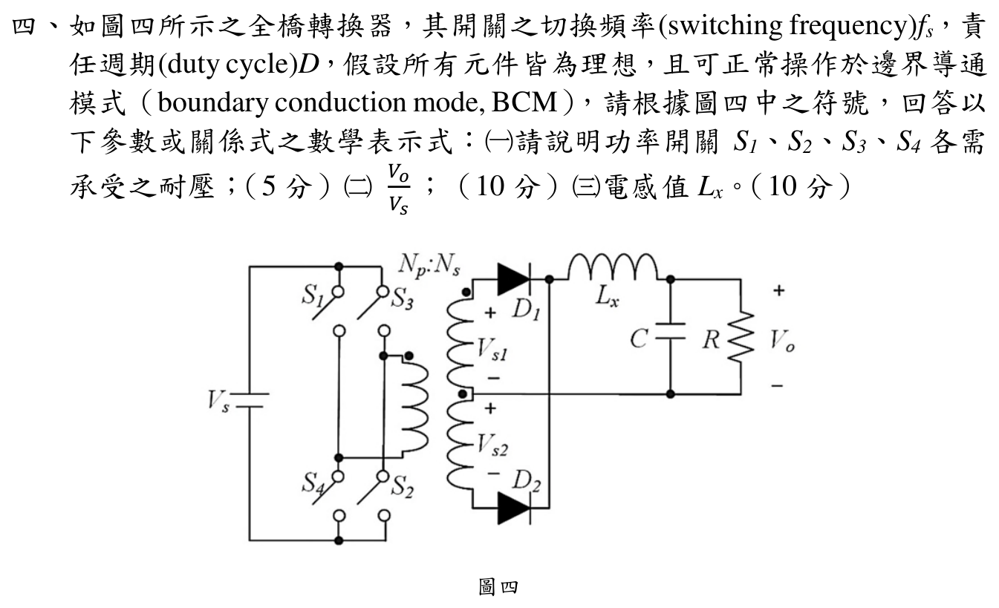

# 📝 113 年電機工程技師｜電子學（包括電力電子學）逐題詳解

> 本頁由題級 canonical 筆記組合；每題保留官方裁切圖、校驗狀態與可追溯的推導。

## 題目導覽
- [[#一、113 年電子學第 1 題：理想二極體操作狀態|第 1 題：113 年電子學第 1 題：理想二極體操作狀態]]
- [[#二、113 年電子學第 2 題：共基極 BJT T 模型與電壓增益|第 2 題：113 年電子學第 2 題：共基極 BJT T 模型與電壓增益]]
- [[#三、113 年電子學含電力電子第 3 題｜降壓型轉換器 BCM|第 3 題：降壓型轉換器 BCM]]
- [[#四、113 年電子學第 4 題：全橋隔離型轉換器|第 4 題：113 年電子學第 4 題：全橋隔離型轉換器]]

---

## 一、113 年電子學第 1 題：理想二極體操作狀態

> 題級識別：EE-113-02-1
> canonical 來源：[[canonical/EE-113-02-1.md]]
> 題級校驗狀態：verified

### 考場標準作答

先假設 \(D_2\) 導通，則共同節點與輸出端等電位。串聯電流為

\[
I=\frac{12-(-12)}{10\,\mathrm{k}\Omega+5\,\mathrm{k}\Omega}
=1.6\,\mathrm{mA},
\]

\[
V_o=V_x=-12+I(5\,\mathrm{k}\Omega)=-4\,\mathrm V.
\]

此時 \(V_{D_1}=V_x-0=-4\,\mathrm V<0\)，故 \(D_1\) 截止；\(D_2\) 的電流為正向 \(1.6\,\mathrm{mA}\)，與導通假設一致。因此

\[
\boxed{D_1\text{ 截止},\quad D_2\text{ 導通}},
\qquad
\boxed{V_o=-4.0\,\mathrm V}.
\]

### 得分點拆解

- （一，15 分）標出兩顆二極體的陽極、陰極與允許電流方向，提出候選狀態並做偏壓／電流一致性檢查。
- （一）只寫狀態沒有驗證不夠；至少要證明 \(D_1\) 反向偏壓且 \(D_2\) 電流方向正確。
- （二，10 分）導通支路化為短路後列出串聯電流，再由任一側電阻壓降求 \(V_o\)。

### 完整教學推導

#### 1. 讀圖與理想二極體模型

令兩個二極體上端共同節點為 $x$。由官方符號，$D_1$ 的陽極接 $x$、陰極接地，$D_2$ 的陽極接 $x$、陰極接輸出 $V_o$；兩者皆只允許電流由上往下。理想二極體導通時壓降為 0 V，截止時電流為 0。

上方 $10\,\mathrm{k}\Omega$ 接 $+12\,\mathrm{V}$，下方 $5\,\mathrm{k}\Omega$ 接 $-12\,\mathrm{V}$。

#### 2. 狀態假設與一致性檢查

##### 候選一：$D_1$ 導通、$D_2$ 截止

若 $D_1$ 導通，則 $V_x=0$。此時 $D_2$ 截止且輸出端無電流，故 $V_o=-12\,\mathrm{V}$。然而

\[
V_x-V_o=0-(-12)=12\,\mathrm{V}>0,
\]

這會使 $D_2$ 正向偏壓，與「$D_2$ 截止」矛盾。因此此候選狀態不成立。

##### 候選二：$D_1$ 截止、$D_2$ 導通

$D_2$ 導通時 $V_x=V_o$，電路成為 $+12$ V 與 $-12$ V 之間的串聯電阻：

\[
I=\frac{12-(-12)}{10\,\mathrm{k}\Omega+5\,\mathrm{k}\Omega}
=1.600\,\mathrm{mA}.
\]

由上方電阻壓降與下方電阻壓降分別求得

\[
V_x=12-I(10\,\mathrm{k}\Omega)=-4.000\,\mathrm{V},
\]

\[
V_o=-12+I(5\,\mathrm{k}\Omega)=-4.000\,\mathrm{V}.
\]

檢查二極體條件：

\[
V_{D_1}=V_x-0=-4.000\,\mathrm{V}<0,
\]

故 $D_1$ 確實截止；而 $D_2$ 兩端電壓為 $V_x-V_o=0$，且電流 $I=1.600\,\mathrm{mA}>0$ 由陽極流向陰極，故 $D_2$ 確實導通。

#### 3. 結論

\[
\boxed{D_1\ \text{截止}},
\qquad
\boxed{D_2\ \text{導通}},
\qquad
\boxed{V_o=-4.000\,\mathrm{V}}.
\]

### 獨立驗算

- `qid` 與官方 `source_crop` 已核對，$D_1,D_2$ 的方向均為由共同上端節點向下。
- 已用兩組導通／截止假設逐一檢查理想二極體的電壓與電流條件，只有 $D_1$ 截止、$D_2$ 導通一致。
- 串聯電流與兩端電壓回代成立，故本題標記為 `verified`。

### 常見失分

- 只看節點電壓高低猜導通狀態，沒有先確認題圖中的陽極與陰極方向。
- 假設導通後沒有再檢查電流是否由陽極流向陰極。
- 把下方電源當成 \(+12\,\mathrm V\)，漏掉它實際是 \(-12\,\mathrm V\)。

---

## 二、113 年電子學第 2 題：共基極 BJT T 模型與電壓增益

> 題級識別：EE-113-02-2
> canonical 來源：[[canonical/EE-113-02-2.md]]
> 題級校驗狀態：reference_book_verified

### 1. 題面與小訊號模型

### 參考書主解（reference_book evidence）

依使用者提供的參考書，採 \(V_T=25\,\mathrm{mV}\) 的 BJT T 模型：

\[
r_e=\frac{V_T}{I_E}=\frac{25\,\mathrm{mV}}{0.5\,\mathrm{mA}}=50\,\Omega,
\qquad
R_{in}=50\,\Omega.
\]

\[
A_v=\frac{50}{75+50}\times\frac{0.99(12\,\mathrm{k}\Omega\parallel12\,\mathrm{k}\Omega)}{50}
=\boxed{47.52\,\mathrm{V/V}}.
\]

以上為參考書慣例下的主要答案；參考書 evidence 不等同官方公布答案。

#### 條件式數值模型與升級判定

官方題面未明示接面溫度或 $V_T$；以下保留 $25.85$ 與 $26\,\mathrm{mV}$ 的敏感度，作為與參考書主解的輸入條件對照。輸入端的 $R_{sig}$ 分壓已納入 $v_e/v_{sig}$，所以不會把源端分壓遺漏。

官方圖給定 $\alpha=0.99$、射極偏壓電流 $I_E=0.5\,\mathrm{mA}$，$R_{sig}=75\,\Omega$、$R_C=12\,\mathrm{k}\Omega$、$R_L=12\,\mathrm{k}\Omega$；基極交流接地，輸入由射極端經耦合電容接入，輸出由集極經耦合電容取出。以下以參考書的 $V_T=25\,\mathrm{mV}$ 作主要回代。

因 $V_A=\infty$ 且理想偏流源在交流下開路，BJT T 模型包含射極–基極電阻

\[
r_e=\frac{V_T}{I_E},
\]

以及由射極電流控制的集極電流源 $\alpha i_e$；基極為交流地，集極負載為 $R_C\parallel R_L$。

### 2. 輸入電阻

在 $V_T=25\,\mathrm{mV}$ 假設下

\[
r_e=\frac{25\,\mathrm{mV}}{0.5\,\mathrm{mA}}=50\,\Omega.
\]

偏流源交流開路，故由射極看入的放大器輸入電阻為

\[
\boxed{R_{in}=r_e=50\,\Omega}.
\]

### 3. 電壓增益逐步計算

輸入源經 $R_{sig}$ 與 $R_{in}$ 分壓，故

\[
\frac{v_e}{v_{sig}}=\frac{R_{in}}{R_{sig}+R_{in}}
=\frac{50}{75+50}=0.4.
\]

集極的交流等效負載為

\[
R_C'=R_C\parallel R_L=12\,\mathrm{k}\Omega\parallel12\,\mathrm{k}\Omega=6\,\mathrm{k}\Omega.
\]

採 $i_e$ 定義為流入射極的 T 模型電流，$v_e=-i_er_e$；受控集極電流使輸出與射極電壓同相，因此

\[
v_o=-\alpha i_eR_C'
=\frac{\alpha R_C'}{r_e}v_e.
\]

所以

\[
\frac{v_o}{v_e}=\frac{0.99(6000)}{50}=118.8,
\]

\[
\boxed{
A_v=\frac{v_o}{v_{sig}}
=\frac{R_{in}}{R_{sig}+R_{in}}
\frac{\alpha(R_C\parallel R_L)}{r_e}
=0.4(118.8)=47.52\ \mathrm{V/V}}.
\]

此為正增益，符合共基極級的非反相特性。

### 4. 參數假設的影響與回代

若教材採 $V_T=26\,\mathrm{mV}$，則 $r_e=52\,\Omega$、$R_{in}=52\,\Omega$，且

\[
A_v=\frac{52}{75+52}\frac{0.99(6000)}{52}
=\frac{0.99(6000)}{127}=46.771654\ \mathrm{V/V}.
\]

因此題目未給 $V_T$ 時，$R_{in}$ 與 $A_v$ 不能在不同教材常數下宣稱唯一數值；在常用 $25\,\mathrm{mV}$ 約定下，回代為 $R_{in}=50\,\Omega$、$A_v=47.52\,\mathrm{V/V}$。

若以室溫物理常數近似 (V_T=25.85\,\mathrm{mV})，則

\[
r_e=51.70\,\Omega,
\qquad R_{in}=51.70\,\Omega,
\qquad A_v=\frac{0.99(6000)}{75+51.70}=46.882399\ \mathrm{V/V}.
\]

| 假設 | \(r_e=V_T/I_E\) | \(R_{in}\) | \(A_v\) |
|---|---:|---:|---:|
| \(V_T=25\,\mathrm{mV}\) | \(50.00\,\Omega\) | \(50.00\,\Omega\) | \(47.520000\) |
| \(V_T=25.85\,\mathrm{mV}\) | \(51.70\,\Omega\) | \(51.70\,\Omega\) | \(46.882399\) |
| \(V_T=26\,\mathrm{mV}\) | \(52.00\,\Omega\) | \(52.00\,\Omega\) | \(46.771654\) |

因此題目未給 $V_T$ 或接面溫度時，各分支不能視為官方唯一數值；本題主要答案仍依參考書的 $V_T=25\,\mathrm{mV}$ 慣例。

### 校驗結論

- `qid` 與官方 `source_crop` 已核對，拓撲為基極交流接地的共基極 BJT，且 $R_C=R_L=12\,\mathrm{k}\Omega$、$R_{sig}=75\,\Omega$、$I_E=0.5\,\mathrm{mA}$。
- T 模型、$R_C\parallel R_L$ 負載與正相位增益均已逐步回代。
- 參考書以 $V_T=25\,\mathrm{mV}$ 為主要慣例，關鍵結果為 $R_{in}=50\,\Omega$、$A_v=47.52\,\mathrm{V/V}$；官方題面未標示 $V_T$ 的影響已列在敏感度表。

---

## 三、113 年電子學含電力電子第 3 題｜降壓型轉換器 BCM

> 題級識別：EE-113-02-3
> canonical 來源：[[canonical/EE-113-02-3.md]]
> 題級校驗狀態：verified

> 題圖中開關 \(S\) 串在 \(V_s\) 與電感 \(L\) 之間，二極體 \(D_1\) 由下方共地節點指向開關／電感節點；因此是 Buck，並非 Boost。舊解把此圖判成 Boost，公式不可沿用。

### 考場標準作答

令 \(T_s=1/f_s\)，\(0<D<1\)，\(\Delta V_o\) 為峰對峰漣波，且依題意採理想元件、BCM 與小輸出電壓漣波近似。

（一）兩個操作狀態：

![[113年_電子學_第3題_降壓型Buck轉換器二操作狀態等效電路圖.svg|850]]

- \(0\le t<DT_s\)：\(S\) 導通、\(D_1\) 截止；輸入 \(V_s\) 經 \(S,L\) 向 \(C\parallel R\) 供能，\(v_L=V_s-V_o\)，\(i_L\) 從 0 線性升至 \(I_{L\max}\)。
- \(DT_s\le t<T_s\)：\(S\) 截止、\(D_1\) 導通；電感經 \(C\parallel R\) 與 \(D_1\) 續流，\(v_L=-V_o\)，\(i_L\) 降回 0。輸入源不在續流迴路。

（二）伏秒平衡：
\[
(V_s-V_o)D+(-V_o)(1-D)=0
\quad\Longrightarrow\quad\boxed{V_o=DV_s}.
\]

（三）BCM 的峰值等於 ON 區電流上升量，且一周期的三角波平均值等於負載電流：
\[
\boxed{I_{L\max}=\frac{(V_s-V_o)D}{Lf_s}
=\frac{V_sD(1-D)}{Lf_s}=2I_o=\frac{2V_o}{R}=\frac{2DV_s}{R}}.
\]

（四）把峰值式與 \(I_{L\max}=2DV_s/R\) 聯立，得到在給定 \(D,R,f_s\) 下維持 CCM 的臨界（最小）電感：
\[
\boxed{L_{\min}=\frac{(1-D)R}{2f_s}}.
\]
本題恰在 BCM，故 \(L=L_{\min}\)；若 \(L<L_{\min}\)，則會進入 DCM。

（五）忽略 ESR，電容電流 \(i_C=i_L-I_o\)；BCM 三角波的峰值為 \(2I_o\)，正向半週的電荷面積為 \(\Delta Q=I_oT_s/4=I_{L\max}T_s/8\)，所以
\[
\boxed{\frac{\Delta V_o}{V_o}
=\frac{I_o}{4Cf_sV_o}
=\frac{1}{4RCf_s}}
\quad\left(=\frac{1-D}{8LCf_s^2}\text{，於 }L=L_{\min}\right).
\]

### 得分點拆解

- 先按官方圖辨識串聯開關與接地續流二極體，畫出 ON、OFF 兩條電流路徑；不可套用 Boost 圖。
- 寫 \(v_L=V_s-V_o\) 與 \(-V_o\)，由伏秒平衡得 \(V_o=DV_s\)。
- 用 BCM 的 \(I_{L\min}=0\) 和三角波平均 \(I_o=I_{L\max}/2\)，同時寫出峰值兩種等價形式。
- 由峰值式解 \(L_{\min}\)，且說明 \(L<L_{\min}\) 進入 DCM。
- 電容電流取 \(i_L-I_o\) 而非直接取 \(i_L\)；積分正向半週電荷求峰對峰漣波。

### 完整教學推導

官方題圖的輸入正端先經 \(S\) 到切換節點，再經 \(L\) 到輸出；\(D_1\) 陽極接下方共地、陰極接切換節點；\(C\) 與 \(R\) 並聯跨接輸出與共地。ON 時二極體反偏，電感左端電位為 \(V_s\)，右端約為 \(V_o\)。OFF 時電感電流不能瞬斷，續流路徑為共地 \(\to D_1\to L\to C\parallel R\to\) 共地，電感左端約為 0。這兩種狀態直接給出上列電感電壓，與 Boost 的 ON/OFF 極性不同。

BCM 電流從 0 升至峰值，再在 OFF 區降回 0；兩段斜率分別是 \((V_s-V_o)/L\)、\(-V_o/L\)。設週期穩態，電感伏秒平衡立即給 \(V_o=DV_s\)。由輸出端電容一周期淨電荷為 0，電感平均電流等於 \(I_o=V_o/R\)。整個三角波的平均為峰值一半，因此 \(I_{L\max}=2V_o/R\)。代入 ON 段上升量可解出 \(L_{\min}=(1-D)R/(2f_s)\)。

輸出漣波不能只積分開關 ON 時電容放電，因為 OFF 時電感電流從峰值降至零，其中一段仍高於負載電流。令 \(i_C=i_L-I_o\)。由於 \(I_{L\max}=2I_o\)，電容電流在 \(i_L=I_o\) 處換號；正向區是一個底寬 \(T_s/2\)、高度 \(I_o\) 的三角形，故 \(\Delta Q=I_oT_s/4\)。以 \(\Delta V_o=\Delta Q/C\) 與 \(I_o=V_o/R\) 得最後一式。

### 獨立驗算

取一組僅供驗算的占空比 \(D=0.4\)，以及 \(V_s=12\,\mathrm V\)、\(R=10\,\Omega\)、\(f_s=25\,\mathrm{kHz}\)：\(V_o=4.8\,\mathrm V\)、\(L_{\min}=120\,\mu\mathrm H\)、\(I_o=0.48\,\mathrm A\)、\(I_{L\max}=0.96\,\mathrm A\)。ON 區上升量 \((12-4.8)\times0.4/(120\,\mu\mathrm H\times25\,\mathrm{kHz})=0.96\,\mathrm A\)；OFF 區下降量 \(4.8\times0.6/(120\,\mu\mathrm H\times25\,\mathrm{kHz})=0.96\,\mathrm A\)，吻合 BCM。若另取 \(C=100\,\mu\mathrm F\)，漣波比 \(1/(4RCf_s)=0.01\)，即 \(\Delta V_o=0.048\,\mathrm V\)。這組數字只作公式回代，並非題目給值。

### 常見失分

- 把串聯輸入開關誤認為 Boost 的對地開關，導致 \(V_o=V_s/(1-D)\) 與錯誤的臨界電感。
- 把 BCM 峰值誤寫成平均值，漏掉三角波的因子 2。
- 把 \(\Delta I_L\) 峰峰值與半幅值混用。
- 漣波只算 ON 區放電量 \(I_oDT_s/C\)；對 BCM 的實際峰對峰漣波，還要計入 OFF 區電容電流換號後的充放電。

---

## 四、113 年電子學第 4 題：全橋隔離型轉換器

> 題級識別：EE-113-02-4
> canonical 來源：[[canonical/EE-113-02-4.md]]
> 題級校驗狀態：needs_manual_review
> [!WARNING] 本題仍有官方資料缺口或事件定義歧義；請以 canonical 條件式解答為準。

### 題意與拓撲核對

官方裁切圖顯示：一次側為直流母線 \(V_s\) 與四只全橋開關 \(S_1\sim S_4\)，二次側為中心抽頭全波整流器 \(D_1,D_2\)，串聯輸出電感 \(L_x\) 與並聯 \(C,R\)。變壓器旁標 \(N_p:N_s\)，但未將 \(N_s\) 明確限定為整段次級或每個半繞組。以下先以「每個半繞組對一次側」的匝比 \(n_h=N_h/N_p\) 推導；採對角開關每半週導通 \(DT_s\)、\(0<D<0.5\) 的工作時序。若 \(N_s\) 的指涉或 \(D\) 的時序定義不同，最後的 \(N_s\) 係數不能照抄。

### (一) 主動開關耐壓

當 \(S_1,S_2\) 對角導通時，一次側施加 \(+V_s\)，未導通的 \(S_3,S_4\) 兩端承受母線電壓 \(V_s\)。另一半週由 \(S_3,S_4\) 導通時，結論對稱。因此
\[
\boxed{
V_{S1,\max}=V_{S2,\max}=V_{S3,\max}=V_{S4,\max}=V_s
}.
\]
此為理想元件的最大阻斷電壓，未加入寄生漏感尖峰或緩衝器設計裕度。

### (二) 電壓轉換比 \(V_o/V_s\)

設變壓器二次半繞組的整流電壓幅值為
\[
V_{s,\mathrm{rec}}=n_hV_s,\qquad n_h=\frac{N_h}{N_p}.
\]

在每一半週的導通區間 \(0\le t\le DT_s\)，一組對角開關導通，對應一只二極體導通，電感電壓為
\[
v_{L_x}=V_{s,\mathrm{rec}}-V_o.
\]

在 \(DT_s\le t\le T_s/2\)，兩只二極體提供續流，整流器輸出端電壓為零，故
\[
v_{L_x}=-V_o.
\]

對稱穩態下在任一半週套用電感伏秒平衡：
\[
(n_hV_s-V_o)DT_s
+(-V_o)\left(\frac{T_s}{2}-DT_s\right)=0.
\]
整理得
\[
n_hV_sD-\frac{V_o}{2}=0,
\]
因此
\[
\boxed{\frac{V_o}{V_s}=2Dn_h}.
\]

若題圖的 \(N_s\) 指每個半繞組，\(n_h=N_s/N_p\)，得 \(V_o/V_s=2DN_s/N_p\)；若指中心抽頭次級端對端的總匝數，兩半對稱且 \(n_h=N_s/(2N_p)\)，得 \(V_o/V_s=DN_s/N_p\)。題面未排除任一匝數口徑，故先寫共同的 \(2Dn_h\) 再附條件，不將前者冒稱唯一答案。回代檢查：一完整週期有兩個長度 \(DT_s\) 的整流脈波，平均整流電壓為 \(2Dn_hV_s\)。

### (三) BCM 臨界電感 \(L_x\)

在 BCM 下，電感電流每一半週的續流末端降至零。續流區間的電流下降量為
\[
\Delta i_L
=\frac{V_o}{L_x}\left(\frac{T_s}{2}-DT_s\right)
=\frac{V_o(1-2D)}{2f_sL_x}.
\]

因 BCM 三角波從零上升至峰值再回到零，且輸出電容平均電流為零，負載平均電流為三角波平均值：
\[
I_o=\frac{\Delta i_L}{2}
=\frac{V_o(1-2D)}{4f_sL_x}.
\]
又 \(I_o=V_o/R\)，故
\[
\frac{V_o}{R}
=\frac{V_o(1-2D)}{4f_sL_x}.
\]
在 \(V_o\ne0\) 時約去 \(V_o\)，得到
\[
\boxed{L_x=\frac{(1-2D)R}{4f_s}}.
\]

若 \(D=0.5\)，續流區間消失，BCM 臨界電感趨近 \(0\)；實際電路仍須依漏感、換流及最小電感限制設計。

### 獨立校驗結論

- qid 與官方裁切圖核對一致：EE-113-02-4，題號 4。
- 四只開關的理想阻斷耐壓均為 \(V_s\)。
- 依每組對角開關每半週導通 \(DT_s\) 的條件，\(V_o/V_s=2Dn_h\)；換成題圖的 \(N_s\) 前須確認指的是半繞組或整段次級。
- 在同一時序假設下，BCM 伏秒平衡與三角波平均值回代得到 \(L_x=\dfrac{(1-2D)R}{4f_s}\)；\(D=0.5\) 是邊界極限，非一般 BCM 工作點。匝比與時序口徑待查，狀態保留人工覆核。

---
