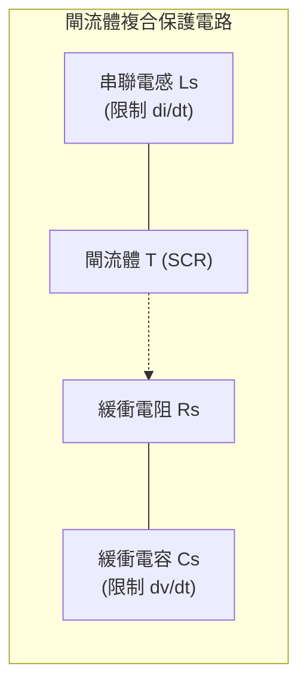

# ⚡ 114 年 電機工程技師 — 電子學（包括電力電子學）全卷完整詳細題解

> **等別**：高等考試
> **類科**：電機工程技師
> **科目**：電子學（包括電力電子學）（試題代號：`01110`）
> **考試時間**：2 小時（120 分鐘）
> **滿分標準**：共 4 題大題，每題 25 分，總分 100 分
> **考場規範**：可以使用考選部核定之第二類電子計算器（如 E-MORE fx-127）
> **官方原始試題 PDF**：[📄 114年_電機工程技師_電子學（包括電力電子學）.pdf](../../依考科分類/02_電子學_含電力電子/114年_電機工程技師_電子學（包括電力電子學）.pdf)

---

## 一、BJT 差動放大器三種輸入模式之輸入電阻與電壓增益分析（25 分）

### 📌 題目與已知條件
![[114年_電機工程技師_電子學（包括電力電子學）_p1.png|750]]
*圖：114年電子學第一題 BJT 差動放大器電路*

> **題目陳述**：
> 「如下圖差動放大器中，工作於主動區的 $Q_1 = Q_2, \beta = 40, r_o = \infty$，熱等效電壓（thermal voltage）$V_T = 25\text{ mV}, I_S = 2\text{ mA}, R_C = R_S = 2\text{ k}\Omega$。依照以下三種情況請算 $R_i = v_1/i_1$ 與 $A_v = v_o/v_1$。
> (1) $v_2 = -v_1$
> (2) $v_2 = v_1$
> (3) $v_2 = -3v_1$
> （25 分）」

---

### 💡 核心考點與破題關鍵
1. **直流工作點與小訊號參數**：
   - 射極偏壓電流： $I_{E1} = I_{E2} = \frac{I_S}{2} = \frac{2\text{ mA}}{2} = 1\text{ mA}$。
   - 動態射極電阻： $r_e = \frac{V_T}{I_E} = \frac{25\text{ mV}}{1\text{ mA}} = 25\ \Omega$。
   - 基極輸入電阻： $r_\pi = (\beta + 1) r_e = 41 \times 25\ \Omega = 1025\ \Omega = 1.025\text{ k}\Omega$。
   - 轉導： $g_m = \frac{\alpha}{r_e} = \frac{40/41}{25} = \frac{40}{1025}\text{ S} \approx 39.02\text{ mA/V}$（若取 $\alpha \approx 1$ 則 $g_m = \frac{1}{25} = 40\text{ mA/V}$）。
2. **共射極節點電位 $v_e$ 通式**：
   - 對射極節點列寫 KCL：
     $$\frac{v_1 - v_e}{r_e} + \frac{v_2 - v_e}{r_e} = \frac{v_e}{R_S} \implies v_e = \frac{R_S}{2R_S + r_e}(v_1 + v_2) = \frac{2000}{4025}(v_1 + v_2) = \frac{80}{161}(v_1 + v_2)$$
3. **輸入電流 $i_1$ 與差動輸出電壓 $v_o$**：
   - $i_1 = \frac{v_1 - v_e}{r_\pi} = \frac{v_1 - v_e}{1025}$
   - 觀察圖中輸出極性： $v_o = v_{c2} - v_{c1} = -\alpha \frac{v_2 - v_e}{r_e} R_C - \left( -\alpha \frac{v_1 - v_e}{r_e} R_C \right) = \alpha \frac{R_C}{r_e}(v_1 - v_2) = g_m R_C (v_1 - v_2)$。

---

### ✏️ 步驟式詳細數學推導

![[114年_電子學_第1題_BJT差動放大器三種輸入模式等效電路分析圖.svg|850]]
*圖：114年第一題 BJT 差動放大器差模與共模小訊號半電路等效拓撲圖*

#### 🔹 (1) 情況一：$v_2 = -v_1$（純差動輸入模式 Pure Differential Mode）
1. **共射極電位**：
   $$v_1 + v_2 = v_1 - v_1 = 0 \implies v_e = 0\text{ V} \quad (\text{虛接地 Virtual Ground})$$
2. **輸入電阻 $R_i$**：
   $$i_1 = \frac{v_1 - 0}{r_\pi} = \frac{v_1}{1025\ \Omega} \implies \mathbf{R_i = \frac{v_1}{i_1} = r_\pi = 1025\ \Omega = \mathbf{1.025\text{ k}\Omega}}$$
3. **電壓增益 $A_v$**：
   $$v_o = \alpha \frac{R_C}{r_e}[v_1 - (-v_1)] = 2 \alpha \frac{R_C}{r_e} v_1 = 2 \left(\frac{40}{41}\right)\left(\frac{2000}{25}\right) v_1 = \frac{6400}{41} v_1 \approx 156.10 v_1$$
   $$\mathbf{A_v = \frac{v_o}{v_1} = \frac{6400}{41} \approx \mathbf{156.10}} \quad (\text{若取 } \alpha \approx 1 \text{ 則 } A_v = 2g_m R_C = 160)$$

---

#### 🔹 (2) 情況二：$v_2 = v_1$（純共模輸入模式 Pure Common Mode）
1. **共射極電位**：
   $$v_e = \frac{80}{161}(v_1 + v_1) = \frac{160}{161} v_1$$
2. **輸入電流與輸入電阻 $R_i$**：
   $$v_1 - v_e = v_1 - \frac{160}{161}v_1 = \frac{1}{161}v_1$$
   $$i_1 = \frac{v_1 - v_e}{r_\pi} = \frac{v_1}{161 \times 1025} = \frac{v_1}{165025\ \Omega}$$
   $$\mathbf{R_i = \frac{v_1}{i_1} = 165025\ \Omega = \mathbf{165.025\text{ k}\Omega}} \quad [= (\beta + 1)(r_e + 2R_S)]$$
3. **電壓增益 $A_v$**：
   $$v_o = \alpha \frac{R_C}{r_e}(v_1 - v_1) = 0\text{ V}$$
   $$\mathbf{A_v = \frac{v_o}{v_1} = \mathbf{0}}$$

---

#### 🔹 (3) 情況三：$v_2 = -3v_1$（非對稱差動輸入模式 Asymmetric Input）
1. **共射極電位**：
   $$v_1 + v_2 = v_1 - 3v_1 = -2v_1 \implies v_e = \frac{80}{161}(-2v_1) = -\frac{160}{161}v_1$$
2. **輸入電流與輸入電阻 $R_i$**：
   $$v_1 - v_e = v_1 - \left(-\frac{160}{161}v_1\right) = \frac{321}{161}v_1$$
   $$i_1 = \frac{321}{161} \frac{v_1}{r_\pi} = \frac{321 v_1}{165025\ \Omega}$$
   $$\mathbf{R_i = \frac{v_1}{i_1} = \frac{165025}{321}\ \Omega \approx \mathbf{514.10\ \Omega = 0.514\text{ k}\Omega}}$$
3. **電壓增益 $A_v$**：
   $$v_o = \alpha \frac{R_C}{r_e}[v_1 - (-3v_1)] = 4 \alpha \frac{R_C}{r_e} v_1 = 4 \times \frac{3200}{41} v_1 = \frac{12800}{41} v_1 \approx 312.20 v_1$$
   $$\mathbf{A_v = \frac{v_o}{v_1} = \frac{12800}{41} \approx \mathbf{312.20}} \quad (\text{若取 } \alpha \approx 1 \text{ 則 } A_v = 4g_m R_C = 320)$$

---

### 🎯 第一題 滿分關鍵與結論
* **(1) $v_2 = -v_1$**： $\mathbf{R_i = 1.025\text{ k}\Omega}, \quad \mathbf{A_v = \frac{6400}{41} \approx 156.10}$（或 $160$）
* **(2) $v_2 = v_1$**： $\mathbf{R_i = 165.025\text{ k}\Omega}, \quad \mathbf{A_v = 0}$
* **(3) $v_2 = -3v_1$**： $\mathbf{R_i = 514.10\ \Omega}, \quad \mathbf{A_v = \frac{12800}{41} \approx 312.20}$（或 $320$）

---

## 二、高頻放大器直流增益、傳輸零點與開路時間常數法（25 分）

### 📌 題目與已知條件
![[114年_電機工程技師_電子學（包括電力電子學）_p1.png|750]]
*圖：114年電子學第二題 高頻響應放大器電路*

> **題目陳述**：
> 「如下圖(a)電路 $R_s = 15\text{ k}\Omega, R_a = 3\text{ k}\Omega, C_a = 3\text{ pF}, G_m = 15\text{ mA/V}, R_L = 1\text{ k}\Omega, C_L = 2\text{ pF}$，已知增益函數 $A_v(s) = v_o(s)/v_s(s)$ 可近似為下圖(b)的數學式：
> 
> $$
> A_v(s) = \frac{v_o}{v_s} \approx A_{vo} \frac{1 + \frac{s}{\omega_z}}{1 + \frac{s}{\omega_H}}
> $$
>

> 其中 $A_{vo}$ 為直流增益，$\omega_z$ 為 $A_v(s)$ 零點。已知 $\omega_z \gg \omega_H$，且 $\omega_H$ 為其近似的 3-dB 頻寬。求算 $A_{vo}$ 與 $\omega_z$ 之值，再利用開路時間常數法近似求算 $\omega_H$。（25 分）」

---

### 💡 核心考點與破題關鍵
1. **直流低頻增益 $A_{vo}$**： 電容開路時，由輸入分壓與輸出受控源乘載阻求得。
2. **高頻傳輸零點 $\omega_z$**： 輸出 $v_o = 0$ 時，跨接電容 $C_a$ 電流與受控源 $G_m v_a$ 電流相抵消。
3. **開路時間常數法（Open-Circuit Time-Constant, OCTC）**：
   $$\tau = R_{Ca0} C_a + R_{CL0} C_L \implies \omega_H \approx \frac{1}{\tau}$$

---

### ✏️ 步驟式詳細數學推導

![[114年_電子學_第2題_高頻放大器開路時間常數法等效電路圖.svg|850]]
*圖：114年第二題 高頻放大器小訊號等效電路與開路時間常數 (OCTC) 模型圖*

#### 步驟 1：求直流增益 $A_{vo}$
在直流穩態下（$s = 0$），電容 $C_a$ 與 $C_L$ 均視為開路：
1. 輸入分壓：
   $$v_a = v_s \frac{R_a}{R_s + R_a} = v_s \frac{3\text{ k}\Omega}{15\text{ k}\Omega + 3\text{ k}\Omega} = \frac{1}{6} v_s$$
2. 輸出電壓：
   $$v_o = -G_m v_a \times R_L = -(15\text{ mA/V})\left(\frac{1}{6} v_s\right)(1\text{ k}\Omega) = -2.5 v_s$$
3. 直流增益：
   $$\mathbf{A_{vo} = \frac{v_o}{v_s} = -2.5\text{ V/V}}$$

---

#### 步驟 2：求傳輸零點 $\omega_z$
令輸出電壓 $v_o = 0$：
對輸出節點列寫 KCL：
$$s C_a (v_a - 0) = G_m v_a \implies s C_a = G_m \implies s = \frac{G_m}{C_a}$$
故零點角頻率：
$$
\mathbf{\omega_z = \frac{G_m}{C_a} = \frac{15 \times 10^{-3}\text{ S}}{3 \times 10^{-12}\text{ F}} = \mathbf{5 \times 10^9\text{ rad/s} = 5\text{ Grad/s}}}
$$
（對應頻率 $f_z = \frac{\omega_z}{2\pi} \approx 795.77\text{ MHz}$）

---

#### 步驟 3：利用開路時間常數法求 $\omega_H$
令獨立源 $v_s = 0$（接地），輸入等效電阻：
$$R_{in}' = R_s \parallel R_a = 15\text{ k}\Omega \parallel 3\text{ k}\Omega = \frac{15 \times 3}{15 + 3} = 2.5\text{ k}\Omega$$

1. **計算電容 $C_L$ 看入之等效電阻 $R_{CL0}$（令 $C_a$ 開路）**：
   因 $v_s = 0$ 且 $C_a$ 開路，無電流流入 $R_{in}' \implies v_a = 0 \implies G_m v_a = 0$。
   $$R_{CL0} = R_L = 1\text{ k}\Omega = 1000\ \Omega$$
   $$\tau_L = R_{CL0} C_L = 1000\ \Omega \times 2\text{ pF} = 2\text{ ns} = 2 \times 10^{-9}\text{ s}$$

2. **計算電容 $C_a$ 看入之等效電阻 $R_{Ca0}$（令 $C_L$ 開路）**：
   在 $C_a$ 端子外加測試電壓 $v_t$，流入端子電流為 $i_t$：
   $$v_a = -i_t R_{in}'$$
   $$v_o = (i_t - G_m v_a) R_L = (i_t + G_m R_{in}' i_t) R_L = i_t (1 + G_m R_{in}') R_L$$
   $$v_t = v_a - v_o = -i_t R_{in}' - i_t (1 + G_m R_{in}') R_L = -i_t \left[ R_{in}' + R_L + G_m R_{in}' R_L \right]$$
   $$R_{Ca0} = \frac{v_t}{-i_t} = R_{in}' + R_L + G_m R_{in}' R_L$$
   代入數值：
   $$R_{Ca0} = 2.5\text{ k}\Omega + 1\text{ k}\Omega + (15\text{ mA/V})(2.5\text{ k}\Omega)(1\text{ k}\Omega) = 3.5\text{ k}\Omega + 37.5\text{ k}\Omega = \mathbf{41\text{ k}\Omega}$$
   $$\tau_a = R_{Ca0} C_a = 41\text{ k}\Omega \times 3\text{ pF} = 123\text{ ns} = 1.23 \times 10^{-7}\text{ s}$$

3. **總開路時間常數與 3-dB 頻寬**：
   $$\tau_{total} = \tau_a + \tau_L = 123\text{ ns} + 2\text{ ns} = 125\text{ ns} = 1.25 \times 10^{-7}\text{ s}$$
   $$\mathbf{\omega_H \approx \frac{1}{\tau_{total}} = \frac{1}{125 \times 10^{-9}\text{ s}} = \mathbf{8 \times 10^6\text{ rad/s} = 8\text{ Mrad/s}}}$$
（對應頻率 $f_H = \frac{8 \times 10^6}{2\pi} \approx 1.273\text{ MHz}$，滿足 $\omega_z = 5000\text{ Mrad/s} \gg \omega_H = 8\text{ Mrad/s}$）

---

### 🎯 第二題 滿分關鍵與結論
* **直流增益**： $\mathbf{A_{vo} = -2.5\text{ V/V}}$
* **傳輸零點**： $\mathbf{\omega_z = 5 \times 10^9\text{ rad/s} = 5\text{ Grad/s}}$
* **3-dB 頻寬**： $\mathbf{\omega_H \approx 8 \times 10^6\text{ rad/s} = 8\text{ Mrad/s}}$

---

## 三、開關切換電力電子電感電流週期時域響應（25 分）

### 📌 題目與已知條件
![[114年_電機工程技師_電子學（包括電力電子學）_p2.png|750]]
*圖：114年電子學第三題 電力電子開關電感電路*

> **題目陳述**：
> 「如下圖(a)電路 $Q$ 為理想開關，下圖(b)為控制 $Q$ 之週期電壓 $v_Q$。當 $v_Q = V_Q$ 時，$Q$ 短路；$v_Q = 0$ 時，$Q$ 開路，$v_a$ 為 $Q$ 兩端電壓。$L = 25\text{ mH}, R = 0.5\ \Omega, V_S = 5\text{ V}, E = 10\text{ V}$。定義時間常數 $\tau = L/R$，請算 $0 \le t \le 1\text{ ms}$ 之間電流時間函數 $i_L(t)$。計算時使用以下近似，若 $|x| \ll 1, e^{-x} \approx 1 - x, (1 - x)^2 \approx 1 - 2x$。（25 分）」

---

### 💡 核心考點與破題關鍵
1. **電路時間常數**：
   $$\tau = \frac{L}{R} = \frac{25\text{ mH}}{0.5\ \Omega} = 50\text{ ms} = 0.05\text{ s}$$
   週期 $T = 1\text{ ms}$，切換時間 $t_1 = 0.5\text{ ms} \implies \frac{t}{\tau} \le \frac{1}{50} = 0.02 \ll 1$，符合線性展開近似。
2. **兩階段電路狀態分析**：
   - **區間一（$0 \le t \le 0.5\text{ ms}$）**： $v_Q = 0 \implies Q$ 開路。二極體 $D$ 導通箝位 $v_a = V_S = 5\text{ V}$。
     $$L \frac{di_L}{dt} + R i_L + E = 5\text{ V} \implies i_L(\infty)_1 = \frac{5 - 10}{0.5} = -10\text{ A}$$
   - **區間二（$0.5\text{ ms} \le t \le 1\text{ ms}$）**： $v_Q = V_Q \implies Q$ 導通短路。$v_a = 0\text{ V}$，二極體截止。
     $$L \frac{di_L}{dt} + R i_L + E = 0\text{ V} \implies i_L(\infty)_2 = \frac{0 - 10}{0.5} = -20\text{ A}$$
3. **週期穩態條件（Periodic Steady State）**： $i_L(1\text{ ms}) = i_L(0) = I_0$。

---

### ✏️ 步驟式詳細數學推導

![[114年_電子學_第3題_開關切換電感充放電二狀態等效電路圖.svg|850]]
*圖：114年第三題 開關切換電感充放電二操作狀態等效電路圖*

#### 步驟 1：建立兩區間微分方程之一次近似解
令 $x = \frac{0.5\text{ ms}}{50\text{ ms}} = 0.01$。
1. **區間一（$0 \le t \le 0.5\text{ ms}$）**：
   $$i_L(t) = -10 + [I_0 - (-10)] e^{-t/\tau} \approx -10 + (I_0 + 10)\left(1 - \frac{t}{\tau}\right) = I_0 - (I_0 + 10)\frac{t}{\tau}$$
   在 $t = 0.5\text{ ms}$ 時：
   $$i_L(0.5\text{ ms}) = I_0(1 - x) - 10x = 0.99 I_0 - 0.1$$

2. **區間二（$0.5\text{ ms} \le t \le 1\text{ ms}$）**：
   令 $t' = t - 0.5\text{ ms}$：
   $$i_L(t) = -20 + [i_L(0.5\text{ ms}) + 20] e^{-t'/\tau} \approx i_L(0.5\text{ ms}) - [i_L(0.5\text{ ms}) + 20]\frac{t'}{\tau}$$
   在 $t = 1\text{ ms}$（$t' = 0.5\text{ ms}$）時：
   $$i_L(1\text{ ms}) = i_L(0.5\text{ ms})(1 - x) - 20x = (0.99 I_0 - 0.1)(1 - x) - 0.2$$

---

#### 步驟 2：利用題目提示 $(1 - x)^2 \approx 1 - 2x$ 求解穩態初值 $I_0$
由週期穩態條件 $i_L(1\text{ ms}) = I_0$：
$$I_0 = (1 - x)^2 I_0 - 0.1(1 - x) - 0.2 \approx (1 - 2x) I_0 - 0.1(1) - 0.2$$
$$I_0 = (1 - 0.02) I_0 - 0.3 = 0.98 I_0 - 0.3$$
0. $02 I_0 = -0.3 \implies \mathbf{I_0 = -\frac{0.3}{0.02} = \mathbf{-15\text{ A}}}$

代回計算中繼點電流：
$$i_L(0.5\text{ ms}) = 0.99(-15) - 0.1 = \mathbf{-14.95\text{ A}}$$

---

#### 步驟 3：寫出 $0 \le t \le 1\text{ ms}$ 之完整分段時域表示式
代入 $\frac{1}{\tau} = \frac{1}{0.05} = 20\text{ s}^{-1}$：
1. **當 $0 \le t \le 0.5\text{ ms}$**：
   $$i_L(t) = -10 + (-15 + 10)e^{-20t} = \mathbf{-10 - 5 e^{-20t}\text{ A}} \approx \mathbf{-15 + 100t\text{ A}}$$
2. **當 $0.5\text{ ms} \le t \le 1\text{ ms}$**：
   $$i_L(t) = -20 + (-14.95 + 20)e^{-20(t - 0.0005)} = \mathbf{-20 + 5.05 e^{-20(t - 0.0005)}\text{ A}} \approx \mathbf{-14.95 - 101(t - 0.0005)\text{ A}}$$

---

### 🎯 第三題 滿分關鍵與結論
* **穩態電流初值**： $i_L(0) = \mathbf{-15\text{ A}}$
* **電流時域表示式**：
  $$i_L(t) = \begin{cases} \mathbf{-10 - 5 e^{-20t}\text{ A} \approx -15 + 100t\text{ A}}, & 0 \le t \le 0.5\text{ ms} \\ \mathbf{-20 + 5.05 e^{-20(t - 0.0005)}\text{ A} \approx -14.95 - 101(t - 0.0005)\text{ A}}, & 0.5\text{ ms} \le t \le 1\text{ ms} \end{cases}$$

---

## 四、電力電子閘流體（SCR）保護電路設計與失效機制分析（25 分）

### 📌 題目與已知條件
![[114年_電機工程技師_電子學（包括電力電子學）_p2.png|750]]
*圖：114年電子學第四題 閘流體控制電路*

> **題目陳述**：
> 「如下圖電路中 $S$ 為理想開關，當 $S$ 導通時，直流電壓源 $V_S$ 分配到負載電壓 $V_L$ 由閘流體 $T$ 控制。（25 分）
> (1) 在 $S$ 由開路切換至短路（導通）瞬間，可能損毀閘流體 $T$，原因為何？
> (2) 接續(1)，請設計保護閘流體的電路，並解釋電路中各元件的功能。
> (3) 接續(2)，請另說明其他兩種保護閘流體的電路設計方法與其概念。」

---

### 💡 核心考點與破題關鍵
1. **失效機制（Failure Modes）**： $dv/dt$ 假導通（False Triggering）、$di/dt$ 局域熱崩潰（Local Hotspot）、過電壓突波。
2. **RC 緩衝電路（Snubber Circuit）與串聯限流電感**。
3. **過壓箝位（MOV / TVS）與閘極抗干擾濾波**。

---

### ✏️ 步驟式詳細論述與工程設計

#### 🔹 (1) 開關 $S$ 閉合瞬間可能損毀閘流體 $T$ 之原因
1. **過高之電壓上升率導致 $dv/dt$ 誤觸發（$dv/dt$ False Triggering）**：
   當開關 $S$ 瞬間閉合時，陽-陰極電壓產生極陡峭的階梯變化（$\frac{dv_T}{dt} \to \infty$）。閘流體內部逆向偏壓之 $J_2$ 接面存在寄生電容 $C_j$，極大之 $\frac{dv}{dt}$ 會誘發位移充電電流：
   $$i_{disp} = C_j \frac{dv_T}{dt}$$
   此位移電流如同閘極觸發信號，將造成閘流體在**無觸發信號下發生假導通**，喪失控制能力。
2. **初始電流上升率過大引發局域過熱燒毀（$di/dt$ Failure）**：
   當閘流體被觸發導通時，初始導通區域僅限於閘極周邊極小微區，隨後以約 $0.1\ \mathrm{mm}/\mu\mathrm{s}$ 之有限速度向全晶片擴散。若缺乏限流電感，初始 $\frac{di}{dt}$ 過大，瞬間大電流集中在極小面積，產生極高局域功率密度與溫度，造成**閘極周圍矽晶片熱擊穿燒毀**。
3. **開關電弧與線路雜散電感引起之過電壓（Overvoltage Surge）**：
   切換瞬間暫態過衝電壓可能超過閘流體之額定峰值耐壓 $V_{DRM}$，導致雪崩擊穿損壞。

---

#### 🔹 (2) 閘流體保護電路設計與元件功能說明

![[114年_電子學_第4題_閘流體完整防護電路拓撲圖.svg|850]]
*圖：114年第四題 閘流體 (SCR) 四重全方位保護電路拓撲等效圖*

1. **保護電路設計**：
   - 在閘流體 $T$ 陽極與陰極兩端**並聯一個電阻 $R_s$ 與電容 $C_s$ 串聯的 RC 緩衝電路（Snubber Circuit）**。
   - 在主電流迴路中**串聯一個微型限流電感 $L_s$**。
2. **各保護元件之具體功能**：
   - **緩衝電容 $C_s$**：
     利用電容電壓不能突變之特性，在開關 $S$ 閉合瞬間吸收突波能量，將陡峭的電壓跳變平滑化為指數上升曲線，**將 $\frac{dv}{dt}$ 限制在閘流體臨界耐受值（$(\frac{dv}{dt})_{crit}$）以內**，徹底防止假導通。
   - **緩衝電阻 $R_s$**：
     1. 當閘流體 $T$ 導通瞬間，電容 $C_s$ 會經由 $T$ 放電，電阻 $R_s$ 用於**限制電容放電之峰值電流**，防止放電電流過大損毀閘流體。
     2. 提供回路阻尼，抑制 $L_s-C_s$ 振盪與電壓過衝（Overshoot Ringing）。
   - **串聯電感 $L_s$**：
     利用電感電流不能突變之特性，**限制閘流體導通瞬間之電流上升率 $\frac{di}{dt} = \frac{V_S}{L_s}$**，確保電流增長速度慢於晶片導通擴散速度，防止局域熱點燒毀。

---

#### 🔹 (3) 其他兩種保護閘流體之電路設計方法與概念

##### 方法一：金屬氧化物壓敏電阻（MOV, Metal Oxide Varistor）過電壓箝位保護
* **設計概念**：**非線性非對稱過電壓箝位（Overvoltage Clamping）**。
* **電路連接與動作原理**：
  將 MOV 壓敏電阻（或 TVS 暫態電壓抑制二極體）跨接於閘流體兩端或電源輸入端。在正常工作電壓下，MOV 呈極高電阻（斷路狀態，漏電流極微）；當電路發生開關切換突波或雷擊過電壓時，MOV 阻抗瞬間驟降為極低值，將浪湧電流旁路並將兩端電壓**牢牢箝制在閘流體耐壓值以下**，突波消退後自動恢復高阻抗。

##### 方法二：閘極噪訊濾波與負偏壓保護電路（Gate Noise Suppression & Negative Bias）
* **設計概念**：**提高閘極抗干擾度與動態耐受門檻**。
* **電路連接與動作原理**：
  1. 在閘極（G）與陰極（K）之間**並聯電阻 $R_{GK}$（約 $1\text{ k}\Omega$）與小電容 $C_{GK}$（約 $0.01\ \mu\text{F}$）**，旁路掉高頻雜訊與接面電容位移電流，降低假觸發靈敏度。
  2. 在閘流體截止期間，由驅動電路對閘極施加微小**負偏壓（$-2\text{ V} \sim -5\text{ V}$）**，加速抽離 $J_2$ 接面載子，使閘流體臨界 $(\frac{dv}{dt})_{crit}$ 耐受度提升數倍，大幅增強抗誤開通能力。

*(備註：亦可採用快速熔斷器 Fast-acting Fuse 串聯於主迴路以提供 $I^2t$ 負載短路過電流保護)*。

---

### 🎯 第四題 滿分關鍵與結論
* **損毀原因**： $dv/dt$ 假導通、初始 $di/dt$ 局域熱過載、切換過電壓擊穿。
* **基本保護電路**： **並聯 RC Snubber（限制 $dv/dt$）＋ 串聯電感 $L_s$（限制 $di/dt$）**。
* **其他兩種保護**： **MOV 壓敏電阻過壓箝位**、**閘極並聯 $R_{GK}-C_{GK}$ 濾波與負偏壓保護**。
