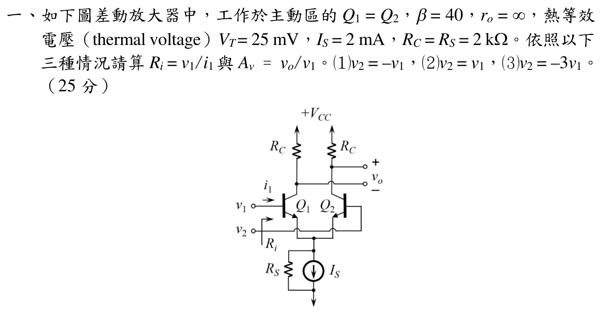
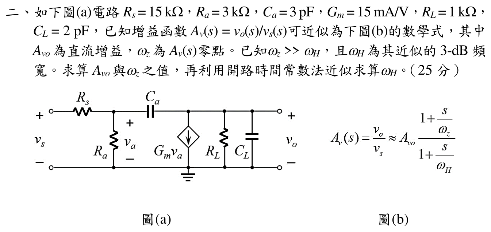
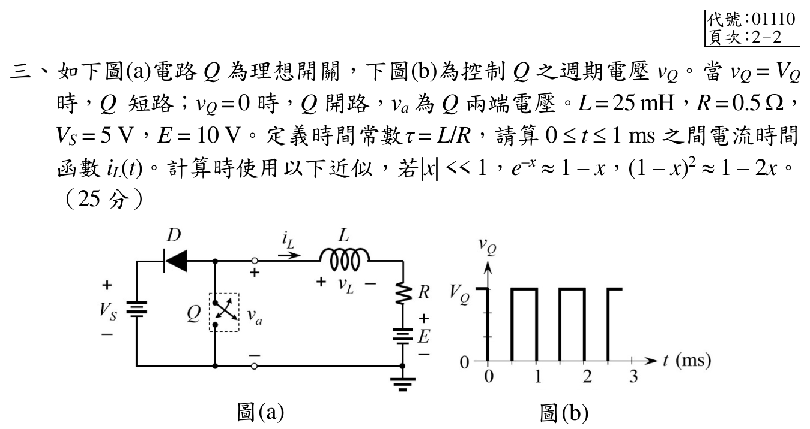
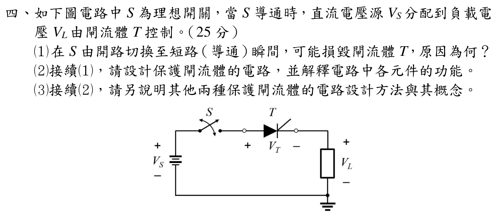

# 📝 114 年電機工程技師｜電子學（包括電力電子學）逐題詳解

> 本頁由題級 canonical 筆記組合；每題保留 QID、官方裁切、校驗狀態與完整得分型解答。

## 題目導覽
- [[#一、114 年電子學第 1 題：BJT 差動放大器|第 1 題：114 年電子學第 1 題：BJT 差動放大器]]
- [[#二、114 年電子學第 2 題：MOS 小訊號與頻率響應|第 2 題：114 年電子學第 2 題：MOS 小訊號與頻率響應]]
- [[#三、114 年電子學第 3 題|第 3 題：114 年電子學第 3 題]]
- [[#四、114 年電子學第 4 題：閘流體保護|第 4 題：114 年電子學第 4 題：閘流體保護]]

---

## 一、114 年電子學第 1 題：BJT 差動放大器

> 題級識別：`EE-114-02-1`
> canonical 來源：`canonical/EE-114-02-1.md`
> 題級校驗狀態：`verified`

![[依考科分類/02_電子學_含電力電子/images/questions/PE_114年_電子學（包括電力電子學）_Q01.png]]

> 官方裁切來源：`依考科分類/02_電子學_含電力電子/images/questions/PE_114年_電子學（包括電力電子學）_Q01.png`

### 考場標準作答

每支 BJT 的直流集極電流為 $I_C=I_S/2=1\,\mathrm{mA}$，所以

\[
g_m=\frac{I_C}{V_T}=\frac{1\,\mathrm{mA}}{25\,\mathrm{mV}}=0.04\,\mathrm S,
\qquad
r_\pi=\frac{\beta}{g_m}=1.00\,\mathrm{k}\Omega.
\]

令 $a=g_m+1/r_\pi=0.041\,\mathrm S$。射極節點 KCL 為

\[
\frac{v_e}{R_S}+a(2v_e-v_1-v_2)=0,
\qquad
v_e=\frac{a}{1/R_S+2a}(v_1+v_2)=\frac{82}{165}(v_1+v_2).
\]

又 $i_1=(v_1-v_e)/r_\pi$，且圖示輸出為

\[
v_o=R_Cg_m(v_1-v_2).
\]

故三種情況為

| 條件 | $R_i=v_1/i_1$ | $A_v=v_o/v_1$ |
|---|---:|---:|
| $v_2=-v_1$ | $1.000\,\mathrm{k}\Omega$ | $160$ |
| $v_2=v_1$ | $165.0\,\mathrm{k}\Omega$ | $0$ |
| $v_2=-3v_1$ | $501.52\,\Omega$ | $320$ |

### 得分點拆解

- 先由尾電流求每支 $I_C$，再求 $g_m$ 與 $r_\pi$；本題 $g_m=0.04\,\mathrm S$。
- 以 $R_S$ 為交流接地支路列共同射極節點 KCL。
- 每一組輸入條件都要重新代入 $v_e$，再由 $i_1=(v_1-v_e)/r_\pi$ 求 $R_i$。
- 由兩個集極的差動輸出寫 $v_o=R_Cg_m(v_1-v_2)$，保留圖示正負端。

### 完整教學推導

#### 1. 小訊號參數與射極節點

題面給 $I_S=2\,\mathrm{mA}$ 為尾電流，對稱偏壓時每支管承擔 $1\,\mathrm{mA}$。因此

\[
g_m=0.04\,\mathrm S,
\qquad
r_\pi=\frac{40}{0.04}=1000\,\Omega.
\]

對共同射極節點，兩個 $r_\pi$ 與受控電流源的總小訊號電流為 $a(2v_e-v_1-v_2)$，而 $R_S$ 電流為 $v_e/R_S$。所以

\[
\frac{v_e}{2000}+0.041(2v_e-v_1-v_2)=0,
\]
\[
v_e=\frac{0.041}{0.0005+0.082}(v_1+v_2)=\frac{82}{165}(v_1+v_2).
\]

#### 2. 輸入電阻

\[
R_i=\frac{v_1}{i_1}
=\frac{r_\pi v_1}{v_1-v_e}.
\]

- $v_2=-v_1$：$v_e=0$，故 $R_i=1000\,\Omega$。
- $v_2=v_1$：$v_e=164v_1/165$，故 $v_1-v_e=v_1/165$，$R_i=165000\,\Omega$。
- $v_2=-3v_1$：$v_e=-164v_1/165$，故 $v_1-v_e=329v_1/165$，
  $R_i=165000/329=501.52\,\Omega$。

#### 3. 差動輸出增益

每個集極的小訊號電壓為 $-g_mR_C(v_k-v_e)$。依圖示 $v_o$ 是右集極減左集極，射極項相消：

\[
v_o=-g_mR_C(v_2-v_e)+g_mR_C(v_1-v_e)
=g_mR_C(v_1-v_2).
\]

因 $g_mR_C=0.04\times2000=80$，若 $v_2=kv_1$，

\[
A_v=80(1-k).
\]

代入 $k=-1,1,-3$ 即得 $160,0,320$。

### 獨立驗算

- 差動輸入 $v_2=-v_1$ 時 $v_1+v_2=0$，共同射極確為交流虛地，$R_i=r_\pi=1\,\mathrm{k}\Omega$。
- 共模輸入 $v_2=v_1$ 時 $v_e$ 幾乎等於 $v_1$，故基極電流很小、$R_i$ 應遠大於 $r_\pi$；$165\,\mathrm{k}\Omega$ 符合此物理檢查。
- 三組結果代回射極 KCL 均為零；輸出式中 $R_C$ 與 $g_m$ 的量綱相乘為無因次增益。
- 依原題 $I_S=2\,\mathrm{mA}$、$V_T=25\,\mathrm{mV}$ 重算；若取 $g_m=0.08\,\mathrm S$ 會等同假設每支 $I_C=2\,\mathrm{mA}$，與題面不符。

### 常見失分

- 把尾電流 $2\,\mathrm{mA}$ 直接當成每支晶體管的 $I_C$。
- 忽略 $r_\pi=\beta/g_m$ 的有限基極電流，或將共模時 $v_e=v_1$ 當成精確等式而不求 $R_i$。
- 把圖示輸出的正負端反接，造成增益符號錯誤。
- 差動模式與共模模式混用，未依三個 $v_2/v_1$ 條件分別代入。

---

## 二、114 年電子學第 2 題：MOS 小訊號與頻率響應

> 題級識別：`EE-114-02-2`
> canonical 來源：`canonical/EE-114-02-2.md`
> 題級校驗狀態：`verified`

![[依考科分類/02_電子學_含電力電子/images/questions/PE_114年_電子學（包括電力電子學）_Q02.png]]

> 官方裁切來源：`依考科分類/02_電子學_含電力電子/images/questions/PE_114年_電子學（包括電力電子學）_Q02.png`

### 考場標準作答

令

\[
G_a=\frac1{R_s}+\frac1{R_a}=0.4\,\mathrm{mS},
\qquad
G_L=\frac1{R_L}=1\,\mathrm{mS}.
\]

直流時 $C_a$ 開路，故

\[
A_{vo}=-G_mR_L\frac{R_a}{R_s+R_a}
=-(0.015)(1000)\frac{3000}{18000}
=\boxed{-2.50}.
\]

兩節點 KCL 化簡得

\[
A_v(s)=\frac{2.5(2.0\times10^{-10}s-1)}{1.5\times10^{-17}s^2+1.25\times10^{-7}s+1}.
\]

零點為右半平面

\[
\boxed{\omega_z=\frac{G_m}{C_a}=5.00\times10^9\,\mathrm{rad/s}}.
\]

開路時間常數法：

\[
\tau_a=\frac{C_a(G_a+G_L+G_m)}{G_aG_L}=123\,\mathrm{ns},
\qquad
\tau_L=R_LC_L=2\,\mathrm{ns},
\]

\[
\boxed{\omega_H\simeq\frac1{\tau_a+\tau_L}=8.00\times10^6\,\mathrm{rad/s}}.
\]

### 得分點拆解

- 直流先將串聯耦合電容 $C_a$ 視為開路，求 $v_a/v_s=R_a/(R_s+R_a)$。
- 由受控電流源方向保留負號，得到 $A_{vo}=-2.50$。
- 以兩個節點 KCL 得二次分母與 $C_as-G_m$ 的 RHP 零點。
- 開路時間常數必須保留受控源對 $C_a$ 的 Miller-like 項 $G_mC_a$，不能只加 $R_sC_a$ 與 $R_LC_L$。

### 完整教學推導

#### 1. 直流增益

$C_a$ 在直流為開路，輸入端電壓分壓為

\[
v_a=v_s\frac{R_a}{R_s+R_a}.
\]

受控源向下拉動輸出，故 $v_o=-G_mv_aR_L$，因此

\[
A_{vo}=-G_mR_L\frac{R_a}{R_s+R_a}=-2.50.
\]

#### 2. 兩節點 KCL 與轉移函數

對 $v_a,v_o$ 寫 KCL：

\[
\left(G_a+sC_a\right)v_a-sC_av_o=\frac{v_s}{R_s},
\]
\[
\left(G_m-sC_a\right)v_a+\left(G_L+s(C_L+C_a)\right)v_o=0.
\]

消去 $v_a$，分母為

\[
D(s)=G_aG_L+s\left[G_a(C_a+C_L)+G_LC_a+G_mC_a\right]+s^2C_aC_L.
\]

代入 $R_s=15\,\mathrm{k}\Omega,R_a=3\,\mathrm{k}\Omega,C_a=3\,\mathrm{pF},G_m=15\,\mathrm{mA/V},R_L=1\,\mathrm{k}\Omega,C_L=2\,\mathrm{pF}$，正規化後

\[
A_v(s)=\frac{5.0\times10^{-10}s-2.5}{1.5\times10^{-17}s^2+1.25\times10^{-7}s+1}.
\]

分子為 $-2.5(1-s/5.0\times10^9)$，所以零點在 $s=+5.0\times10^9\,\mathrm{rad/s}$，是 RHP zero。

#### 3. 開路時間常數法

兩個電容的時間常數貢獻為

\[
\tau_a=\frac{C_a(G_a+G_L+G_m)}{G_aG_L}
=\frac{3\times10^{-12}(0.0004+0.001+0.015)}{(0.0004)(0.001)}
=123\,\mathrm{ns},
\]

\[
\tau_L=\frac{C_L}{G_L}=R_LC_L
=1000(2\,\mathrm{pF})=2\,\mathrm{ns}.
\]

故主導極點近似為

\[
\omega_H\simeq\frac1{\tau_a+\tau_L}=\frac1{125\,\mathrm{ns}}
=8.00\times10^6\,\mathrm{rad/s}.
\]

### 獨立驗算

- 由完整二次分母求根得 $\omega_{p1}=8.0077\times10^6$ 與 $\omega_{p2}=8.3253\times10^9\,\mathrm{rad/s}$；主導極點與時間常數近似 $8.00\times10^6$ 一致。
- $\omega_z/\omega_H\approx625\gg1$，符合題目給定 $\omega_z\gg\omega_H$。
- 令 $s=0$，轉移函數回到 $-2.5$；令 $s=+5.0\times10^9$，分子為零。
- 兩個 KCL 方程代回上述轉移函數後殘差為零，且所有 $sRC$ 項均為無因次。

### 常見失分

- 將 $C_a$ 在直流誤當短路，導致 $A_{vo}$ 分壓錯誤。
- 忘記受控源方向，將直流增益寫成正值。
- 把 RHP 零點誤畫在左半平面，或將 $\omega_z$ 誤算成 $1/(R_LC_a)$。
- 開路時間常數漏掉 $G_mC_a$ 的貢獻，會把頻寬高估一個數量級以上。

---

## 三、114 年電子學第 3 題

> 題級識別：`EE-114-02-3`
> canonical 來源：`canonical/EE-114-02-3.md`
> 題級校驗狀態：`verified`

![[依考科分類/02_電子學_含電力電子/images/questions/PE_114年_電子學（包括電力電子學）_Q03.png]]

> 官方裁切來源：`依考科分類/02_電子學_含電力電子/images/questions/PE_114年_電子學（包括電力電子學）_Q03.png`

> 官方控制波形在 \(0\le t<0.5\,\mathrm{ms}\) 為低準位、\(0.5\le t<1\,\mathrm{ms}\) 為高準位；所以先開路、後短路。題面未指定 \(i_L(0)\)，以下數值波形明示採周期穩態 \(i_L(1\,\mathrm{ms})=i_L(0)\)；若不採此條件，須保留初值參數，不能假設為零。

### 考場標準作答

\[
\tau=\frac LR=\frac{25\,\mathrm{mH}}{0.5\,\Omega}=50\,\mathrm{ms},
\qquad a=e^{-0.5/50}=e^{-0.01}.
\]

第一半週 \(v_Q=0\)，故 \(Q\) 開路；負向電感電流使二極體導通，開關節點箝位 \(V_S=5\,\mathrm V\)，因此 \(L\dot i_L+Ri_L=V_S-E=-5\)。第二半週 \(v_Q=V_Q\)，故 \(Q\) 短路、二極體截止，\(L\dot i_L+Ri_L=-E=-10\)。若令 \(i_0=i_L(0)\)，兩段的通解為
\[
i_L(t)=
\begin{cases}
-10+(i_0+10)e^{-t/\tau},&0\le t<0.5\,\mathrm{ms},\\[4pt]
-20+(i_m+20)e^{-(t-0.5\,\mathrm{ms})/\tau},&0.5\le t\le1\,\mathrm{ms},
\end{cases}
\quad
i_m=-10+(i_0+10)a.
\]

若採周期穩態 \(i_L(1\,\mathrm{ms})=i_0\)，則
\[
i_0=-10\frac{2+a}{1+a}=-15.025000\,\mathrm A,
\qquad i_m=-14.975000\,\mathrm A.
\]
\[
\boxed{
i_L(t)=
\begin{cases}
-10-5.0249998e^{-t/50\,\mathrm{ms}},&0\le t<0.5\,\mathrm{ms},\\[4pt]
-20+5.0249998e^{-(t-0.5\,\mathrm{ms})/50\,\mathrm{ms}},&0.5\le t\le1\,\mathrm{ms}.
\end{cases}\ \mathrm A
}
\]
非周期穩態時須另給 \(i_0\) 並重判二極體導通區間；前述含 \(i_0\) 的分段通解限於第一半週電流保持負向、二極體持續導通的分支。題面沒有 \(i_0=0\) 的依據。

### 得分點拆解

- 先從官方波形辨認前半週 \(Q\) 開路、後半週 \(Q\) 短路，並寫出 \(\tau=50\,\mathrm{ms}\)。
- 依題圖 \(i_L\) 向右的參考方向寫 KVL；負號代表實際電流向左，不是計算錯誤。
- 分別判斷二極體導通與截止，兩段的等效激勵依序為 \(-5\,\mathrm V\) 與 \(-10\,\mathrm V\)。
- 第二段初值必須使用 \(i_L(0.5\,\mathrm{ms}^-)=i_L(0.5\,\mathrm{ms}^+)\)；題目未給零初值，若求數值波形須明示採周期穩態。
- 最終答案要寫成 \(0\) 到 \(1\,\mathrm{ms}\) 的分段時間函數。

### 完整教學推導

#### 第一段：\(0\le t<0.5\,\mathrm{ms}\)

官方圖 (b) 在此區間是低準位，故 \(Q\) 開路。從周期穩態求得的 \(i_0<0\) 可驗證二極體以右端至左端方向導通；開關節點為 \(+5\,\mathrm V\)，所以
\[
25\times10^{-3}\frac{di_L}{dt}+0.5i_L=5-10=-5.
\]
該狀態的長時間極限為 \(-10\,\mathrm A\)，故
\[
i_L(t)=-10+(i_0+10)e^{-t/\tau}.
\]
若不預設周期穩態，這個公式仍成立，但只在電流保持負向、二極體導通的區間適用；題面並未給 \(i_0\)。

#### 第二段：\(0.5\le t\le1\,\mathrm{ms}\)

圖 (b) 的高準位令 \(Q\) 短路，二極體反偏。此時開關節點接地：
\[
25\times10^{-3}\frac{di_L}{dt}+0.5i_L=0-10=-10.
\]
令 \(i_m=i_L(0.5\,\mathrm{ms})\)，則
\[
i_L(t)=-20+(i_m+20)e^{-(t-0.5\,\mathrm{ms})/\tau}.
\]
以周期穩態 \(i_L(1\,\mathrm{ms})=i_0\) 聯立兩段，令 \(a=e^{-0.5\,\mathrm{ms}/\tau}\)，可解得
\[
i_0=-10\frac{2+a}{1+a},\qquad i_m=-10+(i_0+10)a.
\]
題目給的小量近似 \(a\approx0.99\)、\(a^2\approx0.98\) 可迅速檢查：電流在前半週由約 \(-15.025\) A 升至 \(-14.975\) A，再於後半週降回約 \(-15.025\) A。

### 獨立驗算

切換點左右兩段皆給 \(i_L(0.5\,\mathrm{ms})=-14.975000\,\mathrm A\)，符合電感電流連續性；一周期末 \(i_L(1\,\mathrm{ms})=-15.025000\,\mathrm A=i_L(0)\)。將兩段解代回，前半週滿足 \(L\dot i_L+Ri_L=-5\)，後半週滿足 \(-10\)。兩段時間各為 \(0.01\tau\)，故只在約 \(-15\) A 附近小幅擺動，與逐段斜率及周期邊界一致。

### 常見失分

- 看反官方圖 (b) 的高、低準位，把 \(0\) 至 \(0.5\) ms 當成短路，導致兩段方程順序顛倒。
- 題面未給初始電流卻自行設 \(i_L(0)=0\)，或採周期穩態但未檢查 \(i_L(1\,\mathrm{ms})=i_L(0)\)。
- 忽略題目所定義的 \(i_L\) 參考方向，看到負電流就擅自改正號。
- \(Q\) 開路期間仍令開關節點為 0 V，漏掉二極體將節點箝位在 \(V_S=5\,\mathrm V\)。
- 第二段重新令初值為 0，違反電感電流連續性。
- 把 \(\tau=50\,\mathrm{ms}\) 誤寫成 \(50\,\mu\mathrm s\)，造成指數與近似值差兩個數量級。

---

## 四、114 年電子學第 4 題：閘流體保護

> 題級識別：`EE-114-02-4`
> canonical 來源：`canonical/EE-114-02-4.md`
> 題級校驗狀態：`verified`

![[依考科分類/02_電子學_含電力電子/images/questions/PE_114年_電子學（包括電力電子學）_Q04.png]]

> 官方裁切來源：`依考科分類/02_電子學_含電力電子/images/questions/PE_114年_電子學（包括電力電子學）_Q04.png`

### 考場標準作答

#### （1）損壞原因

$S$ 由開路切成短路時，$V_S$ 突然加到閘流體 $T$ 與負載。負載或配線的寄生電感使電流突變產生

\[
v_L=L_{\mathrm{par}}\frac{di}{dt},
\]

而寄生電容、線路電感與開關邊緣又造成大的 $dv/dt$。過大的 $di/dt$ 會局部電流集中與過熱，過大的 $dv/dt$ 可能使閘流體誤觸發或產生過電壓，超過 $V_{DRM}$、$I_T$、$(di/dt)_T$ 或 $(dv/dt)_T$ 即可能損壞。

#### （2）RC snubber

在 $T$ 兩端並聯串聯 $R_s-C_s$ 支路：$C_s$ 吸收電壓尖峰並限制 $dv/dt$，$R_s$ 限制 $C_s$ 的充放電尖峰電流並阻尼寄生 LC 振盪。若負載為感性，可在主回路加入限流電感或電阻以限制 $di/dt$。設計時須使

\[
\frac{dv_T}{dt}<(dv/dt)_T,
\qquad
\frac{di_T}{dt}<(di/dt)_T,
\]

並校核 $C_s$ 的脈衝能量與 $R_s$ 的瞬時功率。

#### （3）其他兩種方法

1. **RCD 吸收器**：以二極體將單向過電壓能量導入電容，再由電阻放電耗能，適合尖峰方向固定的場合。
2. **MOV／TVS 箝位器**：正常電壓時近似開路，過電壓時快速導通，把 $T$ 兩端電壓箝在安全值；必須核對箝位電壓、脈衝電流與能量額定。

### 得分點拆解

- 同時說明開關瞬間的 $di/dt$ 與 $dv/dt$ 來源，並連結到寄生 $L$、$C$。
- RC snubber 必須畫／說明為跨接閘流體的串聯 $R_s-C_s$，不可只寫一顆並聯電容。
- 清楚交代 $C_s$ 限制電壓斜率、$R_s$ 限制尖峰電流與阻尼的功能。
- 另外提出兩種不同概念的保護：RCD 吸收與 MOV／TVS 箝位，並說明其能量路徑。

### 完整教學推導

#### 1. $di/dt$ 與 $dv/dt$ 的危險

理想電路會把 $S$ 的閉合看成零時間事件；實際上導線、負載與封裝都有寄生電感 $L_{\mathrm{par}}$，所以快速建立電流時出現 $L_{\mathrm{par}}di/dt$ 的感應電壓。閘流體晶片內部的電流也不是瞬間均勻展開，若 $di/dt$ 太大，局部區域先承受過高電流密度。

另一方面，$T$ 的接面電容與配線寄生電感形成暫態網路。$dv/dt$ 太大時，接面位移電流可能等效注入閘極，造成未下達觸發命令的誤導通；若尖峰超過阻斷額定，也會造成接面崩潰。

#### 2. RC snubber 的作用

令串聯 $R_s-C_s$ 支路跨接 $T$。在電壓快速上升初期，$C_s$ 的阻抗 $1/(sC_s)$ 很低，尖峰電流先流入電容，使 $T$ 的電壓上升變慢。若只放電容，切換回復時會產生很大的放電電流；串入 $R_s$ 可限制

\[
i_{C_s,\,peak}\approx\frac{\Delta V_T}{R_s}
\]

並消耗寄生 $L$ 與 $C_s$ 的振盪能量。$C_s$ 可依允許 $dv/dt$ 與尖峰電流估算，$R_s$ 再依寄生電感阻尼、脈衝電流與損耗校核；沒有題面寄生參數時，不能捏造唯一數值。

對感性負載，主回路的串聯限流元件處理的是電流斜率，與跨接的 snubber 處理電壓斜率是兩個不同設計目標。

#### 3. RCD 與 MOV／TVS

RCD 電路利用二極體的單向性，只在指定極性的尖峰出現時導通，將能量轉移到 $C$，再由 $R$ 在下一次切換前耗散。MOV／TVS 則用非線性箝位特性，在正常狀態不顯著導電，超過膝點後快速吸收能量，使閘流體端電壓不超過安全上限。

### 獨立驗算

- $C_s$ 增大時，同一尖峰電流下 $dv/dt=i/C_s$ 變小；$R_s$ 增大時，$\Delta V/R_s$ 的充放電尖峰變小，兩者功能方向正確。
- RC、RCD、MOV／TVS 都提供明確的尖峰能量路徑，但只有串聯主回路的限流元件直接限制 $di/dt$，沒有把 $dv/dt$ 與 $di/dt$ 混為同一元件功能。
- 設計檢核同時包含 $(dv/dt)_T$、$(di/dt)_T$、$V_{DRM}$、$I_T$ 及吸收器脈衝能量額定；題面未給數值，故答案以設計條件式表達。
- `qid` 與官方 Q04 的 $S$、$V_S$、$T$、$V_T$、$V_L$ 拓撲一致。

### 常見失分

- 只寫「有突波」而沒有指出寄生電感的 $Ldi/dt$ 與寄生電容造成的 $dv/dt$。
- 把 snubber 電容直接並接而未加串聯電阻，漏答限制放電尖峰與阻尼功能。
- 說 RC snubber 可直接限制主回路 $di/dt$；它主要處理跨閘流體的電壓斜率，電流斜率須靠串聯限流元件。
- 把 MOV／TVS 說成正常時短路，或漏寫其箝位電壓、脈衝電流與能量額定的校核。
